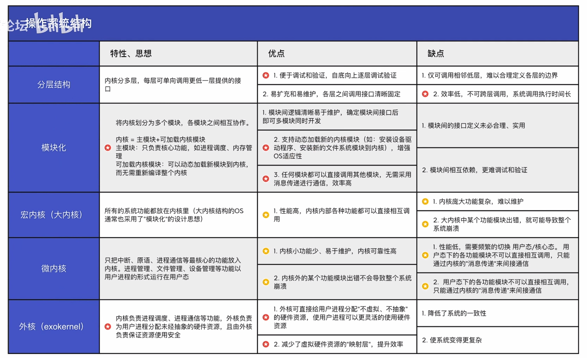
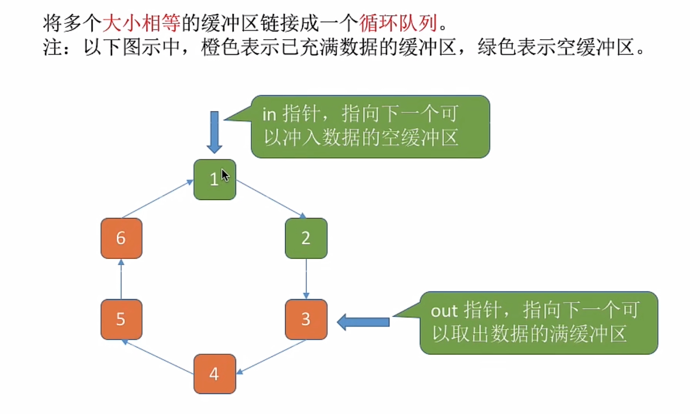

# 1. OS概述

## 1.1 OS的概念、功能

操作系统的定义：操作系统(Operating System，OS) 是指控制和管理整个计算机系统的**硬件和软件资源**，并合理地组织调度计算机的工作和资源的分配；以**提供给用户和其他软件方便的接口和环境**；它是计算机系统中最基本的**系统软件**。

- 操作系统是系统资源的管理者
- 操作系统向上层提供方便易用的服务
- 操作系统是最接近硬件的一层软件

操作系统命令：

- 脱机命令：批处理式命令
- 联机命令：交互式命令
- 内部命令：由系统定义的，常驻内存的处理程序集合

操作系统层次结构：用户可以与操作系统直接命令交互, 也可以通过操作系统提供的程序接口与操作系统进行交互


## 1.2 OS的特征

- 并发性: 指计算机系统中在在同一时间间隔内存在多个运行着的程序
  - 并发: 指两个或多个事件在**同一时间间隔**内发生。此事件宏观上是同时发生的，但微观上是交替发生的
  - 并行: 指两个或多个事件在**同一时刻**同时发生
- 共享性: 指系统中的资源可供内存中**多个并发执行的进程**共同使用
  - 资源共享的前提是存在程序并发运行
  - 若系统不能对资源共享进行有效的管理，则程序无法并发运行
- 虚拟性: 指把一个物理上的实体变为若干个逻辑上的对应物。物理实体(前者)是实际存在的，而逻辑上对应物(后者)是用户感受到的。
  - 空分复用(虚拟存储器)
  - 时分复用(虚拟处理器)
- 异步性: 在多道程序环境下，允许多个程序并发执行，但由于资源有限，进程的执行不是一贯到底的， 而是走走停停，以不可预知的速度向前推进，这就是进程的异步性。

注意事项：

- 单核CPU同一时刻只能执行一个程序，各个程序只能**并发**地执行。
- 多核CPU同一时刻可以同时执行多个程序，多个程序可以**并行**地执行。
- 只有系统拥有并发性才可能导致异步性。
- 并发与共享相辅相存, 前者缺一不可, 否则虚拟性与异步性显得毫无意义。


## 1.3 OS的发展与分类

### 手工操作阶段（无操作系统）

缺点:用户独占全机，人机速度矛盾致资源利用率低

### 单批道处理系统

以磁带作为载体，引入**脱机输入/输出**技术, 并由 **监督程序** 负责控制作业的输入输出

- 优点：缓解了一定程度的**人机速度矛盾**，资源利用率有所提升
- 缺点：
  - 内存中仅能 **有一道程序运行**，只有该程序运行结束之后才能调入下一道程序。
  - **CPU有大量的时间是在 空闲等待I/O完成**。
  - 资源利用率依然很低。


### 多道批处理系统

引入多道程序设计，允许多个作业同时驻留在内存中。操作系统能够在作业等待I/O操作时，切换到另一个作业，提高CPU利用率。

**主要优点**：多道程序**并发**执行，共享计算机资源。**资源利用率大幅提升**，系统吞吐量增大。

**主要缺点**：用户响应时间长，没有人机交互功能。


### 分时操作系统

计算机以**时间片为单位轮流为各个用户/作业服务**，各个用户可通过终端与计算机进行交互

- 优点:
  用户请求可以被即时响应，**解决了人机交互问题**。允许多个用户同时使用一台计算机，并且用户对计算机的操作相互独立，感受不到别人的存在
- 缺点:
  **不能优先处理一些紧急任务**。操作系统对各个用户/作业都是完全公平的，循环地为每个用户/ 作业服务一个时间片，不区分任务的紧急性
- 特征：
  - 多路性，独立性，交互性，及时性


### 实时操作系统

在实时操作系统的控制下，计算机系统接收到外部信号后及时进行处理，并且**要在严格的时限内处理完事件**。实时操作系统的主要特点是**及时性和可靠性**。

主要优点：**能够优先响应紧急事务**。

1、硬实时操作系统：必须在绝对严格的规定时间内完成处理。如飞机的飞控等。

2、软实时操作系统：可以偶尔违反时间规定。例如订票系统等。


### 其他操作系统

**网络操作系统**：是伴随着计算机网络的发展而诞生的，能把网络中各个计算机有机地结合起来，实现数据传送等功能，实现网络中各种资源的共享（如文件共享）和各台计算机之间的通信。( 如：Windows NT就是一种典型的网络操作系统，网站服务器就可以使用)

**分布式操作系统**：主要特点是**分布性和并行性**。系统中的各台计算机地位相同，任何工作都可以分布在这些计算机上，由它们并行、协同完成这个任务。

**个人计算机操作系统**：如Windows、MacOS， 方便个人使用


## 1.4 OS的运行机制

### 指令与操作系统状态

**指令**: 处理器能识别, 执行的最基本命令

- 特权指令: 不允许用户使用
- 非特权指令

两种处理器状态, 用程序状态寄存器 (PSW) 标记, 0 用户, 1 核心

- 用户态(目态): 此时运行的是**应用程序**，CPU 只能执行非特权指令
- 核心态(管态): 此时运行的是**内核程序**，特权指令, 非特权指令都可以执行

> CPU中存在一个**程序状态字寄存器**（PSW），其二进制位1表示“内核态”，0表示“用户态”。内核态也叫做“核心态”或“管态”，用户态也叫做“目态”。由用户态切换到内核态的操作称为“**访管**”，相应引发的中断称为“**访管中断**”

两种程序

- 内核程序: 系统的管理, 两种指令都可以执行, 在**核心态运行**
- 应用程序: 只能运行非特权指令, 在**用户态执行**


**内核态和用户态的转换**

- **内核态→用户态**：执行一条特权指令——修改PSW的标志位为“用户态”，这个动作意味着操作系统将主动让出CPU使用权 。
- **用户态→内核态**：由“中断”引发，**硬件自动完成变态过程**，触发中断信号意味着操作系统将强行夺回CPU的使用权。


### 操作系统内核

**内核**是计算机上配置的底层**软件**, 是操作系统最基本, 最核心的部分；实现操作系统内核功能的那些程序就是**内核程序**

**内核功能**

- 接近硬件
  - 时钟管理, 中断处理, 原语(设备驱动, CPU 切换)
    - 原语最接近硬件的部分, 这种程序的运行具有**原子性**, 运行短, 调用频繁
- 接近上层
  - 进程管理, 存储器管理, 设备管理等... (不同操作系统划分不同)


## 1.5 中断与异常

**本质:** **发生中断**就意味着**操作系统需要介入,展开管理工作**

1. 当中断发生时，CPU立即进入核心态
2. 当中断发生后，当前运行的进程暂停运行，并由操作系统内核对中断进行处理
3. 对于不同的中断信号，会进行不同的处理

问题: 用户态, 核心态之间是怎么切换的?

- 切换是通过**中断**实现的, 并且是**唯一**途径, 改变 **程序状态字(PSW)** 即可

中断分类

- 内中断 (异常, 例外, 陷入), 来自 CPU内部与当前执行指令有关

  - 陷阱, 陷入 (trap)

    > 系统调用时使用的访管指令

  - 故障 (fault)

    - 硬件故障 --- 缺页

  - 终止 (abort)

    - 软件故障 --- 除0, 不可恢复的致命错误

- 外中断 (中断), 来自 CPU外部, 与当前执行的指令无关

  - 外设请求 --- I/O操作完成发出信号
  - 人工干预 --- 用户强行终止进程, kill

外中断的处理

1. 每执行完指令, CPU要检查有无外部中断
2. 保存上下文
3. 根据中断类型转入相应的中断处理程序
4. 恢复原进程的CPU环境并退出中断返回原进程继续往下执行


## 1.6 系统调用

操作系统作为用户和计算机硬件之间的接口，需要向上提供一些简易的服务。主要包括命令接口和程序接口。其中，程序接口由一组系统调用程序组成。

“系统调用”是操作系统提供给应用程序（程序员/编程人员）使用的接口，可以理解为一种可供应用程序调用的特殊函数，应用程序可以通过**系统调用来请求获得操作系统内核的服务**。

由操作系统内核对共享资源进行统一的管理，并向上提供“系统调用”，用户进程想要使用共享资源，只能通过系统调用向操作系统内核发出请求。内核会对各个请求进行协调处理。

应用程序通过**系统调用请求操作系统的服务**。系统中的各种共享资源都由操作系统统一掌管，因此凡是与资源有关的操作（如存储分配、V/o操作、文件管理等），都必须通过系统调用的方式向操作系统提出服务请求，由操作系统代为完成。如此**可以保证系统的稳定性和安全性**，防止用户进行非法操作。

系统调用相关处理在 **核心态** 处理。应用程序既可以直接进行系统调用，也可以调用库函数进行系统调用。

**调用流程**

1. 传递系统调用参数
2. 执行陷入指令(用户态)
   - **陷入指令**在**用户态**执行，执行陷入指令后立即引发**内中断**，使 CPU 进入**核心态**
   - 发出系统调用请求是在**用户态**，而对系统调用相应处理在**核心态**下进行
   - 是唯一一个只能在用户态执行的指令, **核心态不可执行**
3. 执行系统调用相应服务程序(**核心态**)
4. 返回用户程序

> 注意别名：陷入指令 = trap指令 = 访管指令


## 1.7 OS体系结构

### 操作系统内核

**内核**是计算机上配置的底层**软件**，是操作系统最基本，最核心的部分；实现操作系统内核功能的那些程序就是**内核程序**。

**内核功能**

- 接近硬件
  - 时钟管理, 中断处理, 原语(设备驱动, CPU 切换)
    - 原语最接近硬件的部分, 这种程序的运行具有**原子性**，运行短，调用频繁
- 接近上层
  - 进程管理, 存储器管理, 设备管理等... (不同操作系统划分不同)


### 操作系统体系结构

分为大内核与微内核

- 大内核: 将操作系统的主要功能模块都作为系统内核，运行在内核态

  主要功能模块：进程管理、存储管理、设备管理、时钟管理、中断处理、原语...

  - 优点: 高性能
  - 缺点: 内核代码庞大, 结构混乱, 难维护

  Linux、UNIX...

- 微内核: 只把最基本的功能保留在内核

  最基本的功能：时钟管理、中断处理、原语...

  - 优点: 内核功能少, 结构清晰, 好维护
  - 缺点: 需要频繁在内核态和用户态间切换, 性能低

  Windows NT...


操作系统体系结构：大内核（宏内核/单内核）、微内核、分层结构、模块化、外核。




## 1.8 OS引导


操作系统引导（开机过程）

1. 开机通电后激活CPU；
2. 开始执行ROM引导程序（即自举程序），读取执行ROM中的指令；
3. 磁盘进行硬件自检；
4. ROM引导程序指示CPU把磁盘中的主引导记录（MBR）读入内存（RAM）；
5. 执行磁盘引导程序，扫描分区表；
6. 判断活动分区（主分区、系统盘、C盘、安装操作系统的分区）的位置，从中读入引导记录PBR，执行其中的程序；
7. 从根目录下找到完整的操作系统初始化程序（即启动管理器）并执行；
8. 完成“开机”的 一系列动作。


## 1.9 虚拟机

运用虚拟化技术，将一台物理机虚拟化为多台虚拟机（Virtual Machine，VM），每个虚拟机都可以独立运行一个操作系统。

### 第一类虚拟机


虚拟机直接运行在硬件上，虚拟机管理程序将计算机的硬件分配给多个虚拟机

- 只有虚拟机管理程序运行在内核态
- 虚拟机处于虚拟内核态，**实际上是用户态**
- **特点**
  - 直接运行在硬件上，直接控制和分配硬件资源
  - 性能更好
  - 可支持的虚拟机数量更多
  - 虚拟机的可迁移性差

### 第二类虚拟机


虚拟机运行在宿主操作系统上，例如常用的VMware

- **特点**
  - 分配到的内存是虚拟内存
  - 性能更差
  - 可以支持的虚拟机数量少，需要和宿主OS争夺资源
  - 虚拟机迁移性更好

### 两类VMM的对比


# 2. 进程与线程

## 2.1 进程的概念、组成、特征

### 进程的概念

进程是进程实体的**运行过程**，是系统进行**资源分配**和**调度**的一个独立单位。

> 程序：是静态的，是个存储在磁盘中的可执行文件，是一系列的指令合集。
>
> 进程：是动态的，是程序的一次执行过程。（同一个程序多次执行会对应多个进程）


### 进程的组成

一个进程实体（进程映像）由**PCB**、**程序段**、**数据段**组成。进程是**动态**的，进程实体是**静态**的。进程实体反映了进程在某一时刻的状态。

- PCB：进程存在的唯一标志，当进程被创建时，操作系统为其创建PCB，当进程结束时，会回收其PCB。

  - 进程描述信息：进程标识符PID、用户标识符UID

  - 进程控制的管理信息：CPU、磁盘、网络流量使用情况统计...；进程当前状态：就绪态/阻塞态/运行态...

  - 资源分配清单：正在使用哪些文件；正在使用哪些内存区域；正在使用哪些I/O设备

  - 处理机相关信息：如PSW、PC等等各种寄存器的值（用于实现进程切换）

    > **PCB是进程唯一的标识！**

- 程序段：程序的代码（指令序列）。

- 数据段：运行过程中产生的各种数据。


### 进程的特征

1. 动态性：进程是程序的一次执行过程，是动态地产生、变化和消亡的。
   - **动态性是进程最基本的特征。**
2. 并发性：内存中有多个进程实体，各进程可并发执行
3. 独立性：进程是能**独立运行**、**独立获得资源**、**独立接受调度**的基本单位。
4. 异步性：各进程按各自独立的、不可预知的速度向前推进， 操作系统要提供“**进程同步机制**”来解决异步问题。
5. 结构性：每个进程都会配置一个PCB。结构上看，进程由程序段、数据段、PCB组成。


## 2.2 进程的状态与转换、组织

### 进程状态

- **创建态** (*New*)：进程正在被创建，操作系统为进程分配资源、初始化PCB
- **运行态** (*Running*)：占有CPU并在CPU上执行
- **就绪态** (*Ready*)：已经具备运行条件, 没有空闲CPU 还没有运行
- **阻塞态** (*Wating/Blocking*)：因等待某一时间暂时不能运行
- **终止态** (*Terminated*)：进程正在从系统中撤销，操作系统会回收进程拥有的资源、撒销PCB

> 注意事项：
>
> - 如果是多核CPU，可以存在多个运行态的进程
> - 运行态、阻塞态和就绪态是进程的三种基本状态


### 进程状态的转换


- 两个不能
  - 不能直接由阻塞态到运行态
  - 不能直接由就绪态到阻塞态
- 转变模式
  - 运行态到阻塞态一般是**主动的**行为
  - 阻塞态到就绪态是**被动的**行为


### 进程的组织方式

- 链接方式
  - 按照进程状态将 PCB 分成多个队列
  - 操作系统有指向各队列的指针
- 索引方式
  - 根据进程状态的不同, 建立几张索引表
  - 操作系统持有指向各个索引表的指针


## 2.3 进程的控制


进程控制是使用**原语**来实现的。原语是指执行期间**不允许中断**的程序段，是一个不可分割的基本单位。通过“**关中断**指令”和“**开中断**指令”实现原语的**原子性**。

> 注：**CPU执行关中断指令之后，就不再例行检查中断信号，知道执行开中断指令之后才会恢复检查。**


### 进程的创建

#### 创建原语

1. 申请空白PCB
2. 为进程分配所需资源
3. 初始化PCB
4. 将PCB插入就绪队列（**创建态→就绪态**）

#### 引起进程创建的事件

- 用户登录
- 作业调度（*有新的作业将要运行*）
- 提供服务
- 应用请求（*用户进程主动请求创建子进程*）


### 进程的终止

#### 撤消原语

1. 从PCB集合中找到终止进程的PCB
2. 若进程正在运行，立刻剥夺CPU，将CPU分配给其他进程
3. 中止其所有子进程
4. 将该进程所有资源归还给父进程或是操作系统
5. 删除PCB

#### 引起进程中止的事件

- 正常结束
- 异常结束
- 外界干预


### 进程的阻塞和唤醒

> 注：**阻塞原语和唤醒原语必须成对使用**

#### 阻塞原语

1. 找到要阻塞进程对应的PCB
2. 保护进程运行现场，将进程设置为**阻塞态**，暂时停止进程运行
3. 将PCB插入对应事件的等待队列

#### 引发阻塞的事件

- 需要等待系统分配某种资源
- 需要等待合作的其他进程完成工作


#### 唤醒原语

1. 在事件队列中找到对应的PCB
2. 将PCB从等待队列移除，设置为**就绪态**
3. 将PCB插入就绪队列，等待被唤醒

#### 引发唤醒的事件

- 等待的事件发生


### 进程的切换

#### 切换原语

1. 将运行环境信息存入PCB
2. PCB移入相应队列
3. 选择另一个进程执行，并更新其PCB
4. 根据PCB回复进程所需的运行环境

*运行环境*：进程运行中的临时变量等

#### 引起切换的事件

- 当前进程时间片到
- 更高优先级的进程到达
- 当前进程主动阻塞
- 当前进程中止


## 2.4 进程通信

进程是分配系统资源的单位 (包括内存地址空间)，因此**各进程拥有的内存地址空间相互独立**。

为了保证安全，**一个进程不能直接访问另一个进程的地址空间**。

由于进程之间的信息交换又是必须实现的，因此为了保证进程间的安全通信，操作系统提供了一些方法。

### 2.4.1 共享存储

- 各个进程对共享空间的访问必须是**互斥**的。
- 操作系统只提供**共享空间**和**同步互斥工具**（如P，V操作）。

两种共享存储方式：基于数据结构的共享、基于存储区的共享

- 基于数据结构的共享：只能共享**固定的**数据结构；速度慢，是一种低级的共享方式。
- 基于存储区的共享：共享方式和大小由进程自己决定；速度快，是一种高级的共享方式。


### 2.4.2 信息传递

进程间的数据交换以格式化消息（message）为单位。进程通过**发送消息/接收消息**两个**原语**进行数据交换。

两种信息传递方式：直接通信方式、间接通信方式

- **直接通信方式：**发送进程直接将消息发送到接收进程的消息缓冲队列中
- **间接通信方式：**发送进程将消息发送到某个中间实体，一般称为_信箱_，接收端从中间实体接收消息


### 2.4.3 管道通信

> 注：管道实际上是一个固定大小的缓冲区

- 管道通信只能实现**半双工通信**，某段时间段内只能实现单向的传输。如果要实现双向通信，则需要两个管道。
- 各个进程对管道的访问也需要是互斥的。
- 管道中写满时，写进程阻塞；管道读空时，读进程阻塞。
- 从管道中读取数据是**一次性的**，数据一旦被读取就会从管道中彻底消失。
  - 一个管道允许多个写进程，一个读进程。


## 2.5 线程的概念

线程是一个**基本的CPU执行单元，也是程序执行流的最小单位**。

引入线程之后，不仅是进程之间可以并发，进程内的**各线程之间也可以并发**，从而进一步**提升了系统的并发度**，使得一个进程内也可以并发处理各种任务（如QQ视频、文字聊天、传文件）

引入线程后，**进程只作为除CPU之外的系统资源的分配单元**（如打印机、内存地址空间等都是分配给进程的）即，**进程是资源分配的基本单位, 线程是调度的基本单位**。

- 每个线程有一个线程ID, 线程控制块 (TCB)
- **同一线程的切换, 不需要切换进程环境**
- 线程几乎不拥有系统资源
- 同一线程内进程共享进程的资源, 并且通信无需系统干预


## 2.6 线程的实现与多线程模型

### 2.6.1 线程的实现

**用户级线程 (User-Level Thread, ULT)**

- 用户级线程由应用程序通过线程库实现。
- 所有的**线程管理工作都由应用程序负责（包括线程切换）**
- 用户级线程中，**线程切换**可以在**用户态下即可完成**，无需操作系统干预。
- 在用户看来，是有多个线程。但是在操作系统内核看来，并意识不到线程的存在。（用户级线程对用户不透明，对操作系统透明）

优点：线程的切换在用户态即可完成，**开销小、效率高**

缺点：当一个线程被阻塞后，其他线程都会被阻塞，**并发度不高**


**内核级线程 (Kernel-Level Thread, KLT, 内核支持的线程)**

- 内核级**线程的管理工作**由**操作系统内核**完成。
- 线程调度、切换等工作都由内核负责，因此**内核级线程的切换**必然需要在**核心态**下才能完成。
- 操作系统会为每个内核级线程建立相应的TCB，通过TCB对线程进行管理。

优点：一个线程被阻塞后，其他线程继续运行，**并发性强**

缺点：线程的切换需要内核态，**成本高、开销大**


🔔在同时支持 ULT 和 KLT 的 OS 中, 可以用 n 个 ULT 映射到 m 个 KLT 上, n≥m

**重点**: **只有内核级线程才是处理机分配的单位**


### 2.6.2 多线程模型

多对一模型：多个用户及线程映射到一个内核级线程。每个用户进程只对应一个内核级线程。

- 优点：用户级线程的切换在用户空间即可完成，不需要切换到核心态，线程管理的系统开销小，效率高
- 缺点：当一个用户级线程被阻塞后，整个进程都会被阻塞，并发度不高。多个线程不可在多核处理机上并行运行


一对一模型：一个用户及线程映射到一个内核级线程。每个用户进程有与用户级线程同数量的内核级线程。

- 优点：当一个线程被阻塞后，别的线程还可以继续执行，**并发能力强**。多线程可在多核处理机上并行执行。
- 缺点：一个用户进程会占用多个内核级线程，线程切换由操作系统内核完成，需要切换到核心态，因此**线程管理的成本高，开销大**。


多对多模型：n 个用户及线程映射到 m 个内核级线程 (n≥m)。每个用户进程对应 m 个内核级线程。

- 克服了多对一模型并发度不高的缺点，又克服了一对一模型中一个用户进程占用太多内核级线程，开销太大的缺点。


## 2.7 线程的状态与转换

### 线程的状态转换


### 线程的组织与控制


## 2.8 处理机调度的概念与层次

### 调度的概念

在处理机调度是对处理机进行分配，即从就绪队列中按照一定的算法选择一个进程并将处理机分配给它运行，以实现进程并发地执行。

**处理机调度是多道程序操作系统的基础，是操作系统设计的核心问题。**


### 调度的层次

- 作业调度（高级调度）
  - 按照一定原则从外村上处于后备队列的作业中选择一个（或多个）调入进程，并**建立相应的进程**，以使它获得**竞争处理机资源的权利**。
  - 作业调度是外存和内存之间的调度。每个作业只调入一次、调出一次。作业调度时建立相应的PCB；作业调出时撤销相应的PCB。
- 内存调度（中级调度）
  - 内存不够时，可将某些进程的数据调出内存。等待内存空闲或者进程需要运行时再重新调入内存。
  - 暂时调到外存等待的进程状态为“**挂起状态**”，其PCB仍然**常驻在内存**，被挂起的进程PCB会被组织到挂起队列中。其目的是**提高内存利用率和系统吞吐量**。
  - **通过中级调度来决定将哪个处于挂起状态的进程重新调入内存中**。
- 进程调度（低级调度）
  - 按照某种方法和策略从就绪队列中选择一个进程，将处理机分配给它。
  - 进程调度是操作系统中**最基本的一种调度**。其**频率很高**，一般几十毫秒一次。

|          |      调度发生在       |           进程状态变化           |
| :------: | :-------------------: | :------------------------------: |
| 高级调度 | 外存→内存（面向作业） |         无→创建态→就绪态         |
| 中级调度 | 外存→内存（面向进程） | 挂起态→就绪态（阻塞挂起→阻塞态） |
| 低级调度 |       内存→CPU        |          就绪态→挂起态           |


进程的挂机态与七状态模型


## 2.9 进程调度的时机、切换与过程、方式

### 进程调度时机

#### 需要进行进程调度的情况

- 当前进程**主动**放弃处理机资源
  - 进程正常中止
  - 进程出现异常终止
  - 进程主动请求阻塞
- 当前进程**被动**放弃处理机资源
  - 分配的时间片用完
  - 有更紧急的事件要处理（如I/O中断）
  - 有更高优先级的进程进入就绪队列

#### 不能进行进程调度与切换的情况

- 在处理中断的过程中
- 进程处于**操作系统内核程序临界区**中
- 在进行原子操作的过程中（**原语**）。

**临界资源**：一个时间段内只允许一个进程使用的资源，各进程需要**互斥地**访问临界资源。

**临界区**：访问临界资源的那段代码。

**内核程序临界区**：一般是用于访问**内核数据结构**的，例如进程的就绪队列。


### 进程调度方式

#### 非剥夺调度方式（非抢占方式）

只允许进程主动放弃处理机资源。即便有更高优先级的任务到达，也要等待当前进程主动终止或进入阻塞态。

- 实现简单，系统开销小
- 无法及时处理紧急任务

#### 剥夺调度方式（抢占方式）

当一个进程正在处理机上执行时，若有更重要的任务需要使用处理机，则立即暂停当前正在执行的进程，将处理机资源给更紧迫的任务。

- 可以优先处理更紧急的任务
- 可以让各进程按照时间片轮流执行
- 适用于分时操作系统、实时操作系统


### 进程切换与过程

狭义的进程调度”与“进程切换”的区别：

**狭义的进程调度**指的是从就绪队列中**选中一个要运行的进程**。（这个进程可以是刚刚被暂停执行的进程，
也可能是**另一个进程**，后一种情况就需要**进程切换**）

**进程切换**是指一个进程让出处理机，由另一个进程占用处理机的过程。

**广义的进程调度**包含选择一个进程和进程切换两个步骤

进程切换的过程主要完成：

1. 对原来运行进程各种数据的保存

2. 对新的进程各种数据的恢复

   > 程序计数器、程序状态字、各种数据寄存器等处理机现场信息，这些信息一般保存在进程控制块。

注意：**进程切换是有代价的，**因此如果**过于频繁的**进行进程**调度、切换**，必然会使整个**系统的效率降低**，使系统大部分时间都花在了进程切换上，而真正用于执行进程的时间减少。


## 2.10 调度器与闲逛进程

**调度器/调度程序(Scheduler)**

功能：调度算法、决定时间片大小

什么事件会触发“调度程序”？

- 创建新进程
- 进程退出
- 运行进程阻塞
- IO中断发生（可能唤醒某些阻塞进程）

> 非抢占式调度策略：只有运行进程阻塞或退出才触发调度程序工作。
>
> 抢占式调度策略：每个时钟中断或k个始终终端会触发调度程序工作。


**闲逛进程**

没有其他就绪进程时，运行闲逛进程（用于占位）

闲逛进程的特性：

- 优先级最低；
- 可以是0地址指令，在指令周期末尾检查中断；
- 能耗低。


## 2.11 调度算法

### 评价指标

- CPU利用率

  > CPU 利用率 = 忙碌时间 / 总时间

- 系统吞吐量：单位时间内完成作业的数量

  > 系统吞吐量 = 总共完成多少作业 / 总共花了多少时间

- 周转时间：指从作业被提交给系统开始, 到作业完成为止的此段时间间隔。

  > 包括四个部分：
  >
  > - 作业在外存后备队列上等待作业调度（高级调度）的时间；
  > - 进程在就绪队列上等待进程调度（低级调度）的时间；
  > - 进程在CPU上执行的时间；
  > - 进程等待I/O操作完成的时间。
  >
  > 后三项在一个作业的整个处理过程中，可能发生多次。

  作业周转时间 = 作业完成时间−作业提交时间

  - 平均周转时间 = 各作业周转时间之和 / 作业数
  - 带权周转时间 = 作业周转时间 / 作业实际运行时间
  - 平均带权周转时间 = 各作业带权周转时间之和 / 作业数

- 等待时间：对于进程, 就是在处理机上等待时间总和；对于作业, 还要计算上作业在外存等待队列上等待的时间

- 响应时间：从用户提交请求到首次产生响应所产生的时间


### 常见的调度算法

#### 先来先服务（FCFS）

> 非抢占式算法
>
> 不会导致饥饿

算法思想：主要从“公平”的角度考虑

算法规则：按照作业/进程到达的先后顺序进行服务

用于作业/进程调度：

- 用于作业调度时，考虑的是哪个作业先到达后备队列；
- 用于进程调度时，考虑的是哪个进程先到达就绪队列

优缺点：

- 优点：公平、算法实现简单 
- 缺点：排在长作业（进程）后面的短作业需要等待很长时间，带权周转时间很大，对短作业来说用户体验不好。即，FCFS算法对长作业有利，对短作业不利


#### 短作业优先（SJF）

> SJF和SPF是非抢占式算法
>
> 会导致饥饿：如果源源不断地有短作业/进程到来，可能使长作业/进程长时间得不到服务，产生“饥饿”现象。如果一直得不到服务，则称为“饿死”

算法思想：追求最少的平均等待时间，最少的平均周转时间、最少的平均平均带权周转时间

算法规则：最短的作业/进程优先得到服务（所谓“最短”，是指要求 服务时间最短）

用于作业/进程调度：

- 即可用于作业调度，也可用于进程调度。
- 用于进程调度时称为“短进程优先（SPF, Shortest Process First）算法”

 优缺点：

- 优点：“最短的”平均等待时间、平均周转时间
- 缺点：不公平。对短作业有利，对长作业不利。可能产生饥饿现象。另外，作业/进程的运行时间是由用户提供的， 并不一定真实，不一定能做到真正的短作业优先


#### 最短剩余时间优先（SRTN）

> **抢占式的短作业优先**

算法规则：每当有进程加入就绪队列改变时就需要调度，如果新到达的进程剩余时间比当前运行的进程剩余时间更短，则由新进程抢占处理机，当前运行进程重新回到就绪队列。


#### 高响应比优先（HRRN）

> 非抢占式算法
>
> 不会导致饥饿

算法思想：综合考虑作业/进程的等待时间和要求服务的时间

算法规则：在每次调度时先计算各个作业/进程的响应比，选择响应比最高的作业/进程为其服务

> 响应比 = (等待时间+要求服务时间)/要求服务时间

用于作业/进程调度：即可用于作业调度，也可用于进程调度

优缺点：

- 综合考虑等待时间和运行时间（要求服务时间） 
- 等待时间相同时，要求服务时间短的优先（SJF 的优点） 
- 要求服务时间相同时，等待时间长的优先（FCFS 的优点） 
- 对于长作业来说，随着等待时间越来越久，其响应比也会越来越大，从而避免长作业饥饿的问题


#### 时间片轮转调度算法（RR）

> 抢占式算法（由时钟装置发出时钟中断来通知CPU时间片已到）
>
> 不会导致饥饿

算法思路：公平地、轮流地为各服务进程，让每个进程在一定时间间隔内都可以得到响应

算法规则：按照各进程到达就绪队列的顺序，轮流让各个进程执行一个时间片。若进程未在一个世间品啊内执行完，则剥夺处理机，将进程诚信放到就绪队列队尾重新排队。

用于作业/进程调度：用于进程调度（只有作业放入内存建立相应的进程后，才能被分配处理机时间片）

优缺点：

- 优点：公平、响应快，适用于分时操作系统
- 缺点：由于高频率的进程切换，因此有一定开销；不区分人物的的紧急程度。


#### 优先级调度算法

> 可抢占式、亦可非抢占式
>
> 会导致饥饿

算法思想：随着计算机的发展，特别是实操操作系统的出现，越来越多的应用场景需要根据人物的紧急程度来决定处理顺序。

算法规则：调度时选择优先级最高的作业/进程

用于作业/进程调度：既用于作业调度，也用于进程调度

优缺点：

- 优点：用优先级区分紧急程度、重要程度，适用于实时操作系统。可灵活地调整对各种作业/进程的偏好程度。
- 缺点：若源源不断地有高优先级进程到来，则可能导致饥饿


#### 多级反馈队列调度算法


#### 多级队列调度算法


## 2.12 进程同步与互斥

### 进程同步

并发性带来了异步性，有时需要通过进程同步解决这种异步问题。有的进程之间需要相互配合地完成工作，各进程的工作推进需要遵循一定的先后顺序。

作用：解决异步问题


### 进程互斥

概念：对临界资源的访问，需要互斥的进行。即同一时间段内只能允许一个进程访问该资源。


**临界区资源的互斥访问**

- 临界区：访问临界资源的那段代码（临界区是进程中访问临界资源的代码段，也可称为“临界段”）
- 进入区：负责检查是否可进入临界区（负责实现互斥的代码段）
- 退出区：负责解除正在访问临界资源的标志（负责实现互斥的代码段）
- 剩余区：做其他处理


为了实现对临界资源的互斥访问，同时保证系统整体性能，需要遵循一下原则：

1. 空闲让进：临界区空闲时，可以允许一个请求进入临界区的进程立即进入临界区；
2. 忙则等待：当已有进程进入临界区时，其他试图进入临界区的进程必须等待；
3. 有限等待：对请求访问的进程，应保证能在有限时间内进入临界区（保证不会饥饿）；
4. 让权等待：当进程不能进入临界区时，应立即释放处理机，防止进程忙等待。


### 进程互斥的软件实现方法

#### 单标志法

算法思想：两个进程在访问完临界区后会把使用临界区的权限转交给另一个进程。也就是说每个进程进入临界区的权限只能被另一个进程赋予。（可以实现同一时刻最多只允许一个进程访问临界区）

该方法存在的主要问题：违背“空闲让进”原则。

```c
int turn = 0; // turn 表示当前允许进入临界区的进程号

// P0进程
{
    while (turn != 0);
    critical section;
    turn = 1;
    remainder section;
}

// P1进程
{
    while (turn != 1);
    critical section;
    turn = 1;
    remainder section;
}
```


#### 双标志先检查法

算没法思想：每个进程访问临界资源前，先检查临界资源是否被访问，如果空闲就进入，否则就等待。

优点：不用交替进入可以连续使用

该方法的主要问题：违反“忙则等待”原则。

原因在于，进入区的“检查”和“上锁”两个处理不是一气呵成的。“检查”后，“上锁”前可能发生进程切换。

```c
bool flag[2];       // flag[i] = true 表示 i 进程想要进入临界区
flag[0] = false;
flag[1] = false;

// P0进程
{
    while (flag[1]);
    flag[0] = true;
    critical section;
    flag[0] = false;
    remainder section;
}

// P1进程
{
    while (flag[0]);
    flag[1] = true;
    critical section;
    flag[1] = false;
    remainder section;
}
```


#### 双标志后检查法

算法思想：先设置标志，表示自己想进入，再检查对方标志，如果对方也要进入就等待，否则就进入。

该方法的主要问题：违背“空闲让进”和“有限等待”原则，会因各进程的长期无法访问临界资源而产生“饥饿”现象。

```c
bool flag[2];       // flag[i] = true 表示 i 进程想要进入临界区
flag[0] = false;
flag[1] = false;        

// P0进程
{
    flag[0] = true;
    while (flag[1]);
    critical section;
    flag[0] = false;
    remainder section;
}

// P1进程
{
    flag[1] = true;
    while (flag[0]);
    critical section;
    flag[1] = false;
    remainder section;
}
```


#### Peterson 算法

算法思想：结合双标志法、单标志法的思想。如果双方都争着想进入临界区，那可以让进程尝试“孔融让梨”（谦让）。

该方法的主要问题：未遵循“让权等待”原则，会发生“忙等”。

```c
bool flag[2];  // flag[i] = true 表示 i 进程想要进入临界区，初始值都是false
int turn = 0;  // turn 表示优先让哪个进程进入临界区
// P0
void func_p0() {
    flag[0] = true;
    turn = 1;
    while (flag[1] && turn == 1);
    critical section;
    flag[0] = false;
    remainder section;
}

// P1
void func_p1() {
    flag[1] = true;
    turn = 0;
    while (flag[0] && turn == 0);
    critical section;
    flag[1] = false;
    remainder section;
}
```


### 进程互斥的硬件实现方法

#### 中断屏蔽法

算法思想：利用“开/关中断指令”实现（与原语的实现思想相同，即在某进程开始访问临界区到结束访问为止都不允许被中断，也就不能发生进程切换，因此也不可能发生两个同时访问临界区的情况）

优点：简单、高效

缺点：不适用于多处理机；只适用于操作系统内核进程，不适用于用户进程（因为开/关中断指令只能运行在内核态，这组指令如果能让用户随意使用会很危险）

处理逻辑如下：

```c
...
关中断  // 关中断后不允许当前进程被中断
临界区
开中断
...
```


#### TestAndSet指令（TS/TSL）

TSL 指令是用硬件实现的，执行的过程不允许被中断，只能一气呵成

相比软件实现方法，TSL 指令把“上锁”和“检查”操作用硬件的方式变成了一气呵成的原子操作。

优点：实现简单，无需像软件实现方法那样严格检查是否会有逻辑漏洞；适用于多处理机环境

缺点：不满足“让权等待”原则，暂时无法进入临界区的进程会占用CPU并循环执行TSL指令，从 而导致“忙等”。

```c
bool TestAndSet (bool* lock) {
    bool old;
    old = *lock;        // 获得lock 旧值
    *lock = true;
    return old;
}

int main(){
    // TSL logical
    while (TestAndSet(&lock));
    临界区代码
    lock = false;
    剩余区代码
}
```


#### Swap指令（XCHG）

逻辑上来看 Swap 和 TSL 并无太大区别，都是先记录下此时临界区是否已经被上锁（记录在 old 变 量上），再将上锁标记 lock 设置为 true，最后检查 old，如果 old 为 false 则说明之前没有别的进程 对临界区上锁，则可跳出循环，进入临界区。

优点：实现简单，无需像软件实现方法那样严格检查是否会有逻辑漏洞；适用于多处理机环境

缺点：不满足“让权等待”原则，暂时无法进入临界区的进程会占用CPU并循环执行TSL指令，从 而导致“忙等”。

```c
bool old = true;
while (old == true) {
    swap(&lock, &old);
}
临界区代码段...
lock = false;
剩余区代码段...
```


## 2.13 锁

也称为“自旋锁”，解决临界区最简单的方法就是锁。进程在进入临界区时获得锁，在退出临界区时释放锁。

```c
bool avialible; //锁是否可用

//获得锁
acquire(){
    while(!available);	//忙等锁
    available = false;	//获得锁
}

//释放锁
release(){
    available = true;	//释放锁
}
```

acquire与release必须是原子操作。

- **优点**
  - 等待期间不用切换进程上下文，多核处理器中若上锁的时间很短，则等待代价很低
  - 常用于多处理器系统，一个核忙等，其它核正常工作，并快速释放临界区
- **缺点**
  - 需要忙等，进程时间片用完才下处理机，违反“让权等待”
  - 不适用于单处理机系统，忙等的过程中不可解锁


## 2.14 信号量机制

信号量是一种功能较强的机制，可用于解决互斥与同步的问题。只能被两个标准原语**wait(S)**和**signal(S)**访问，也被记作**P操作**和**V操作**。

> 在荷兰文中，通过叫passeren，释放叫vrijgeven，PV操作因此得名


### 整形信号量

用**整数型变量**作为信号量，表示**系统中某种资源的数量**。

信号量只有三种操作：初始化、P操作、V操作

```c
int S = 1;                //初始化整型信号量，表示当前系统中可用资源数量

void wait(int S) {        // wait原语，相当于进入区
    while (S <= 0);       // 若资源不够，则一直等待
    S = S-1;              // 若资源够，则占用一个资源
}

void signal(int S) {      //signal原语，相当于退出区
    s = S+1;              //释放资源
}

// P0进程
{
    wait(S);
    使用资源...
    signal(S);
}
```

由于P操作中资源不够时会一直循环，因此**不满足让权等待，会发生“忙等”**


### 记录型信号量

```c
typedef struct {
    int value;            // 剩余资源数
    struct process *L;    // 等待队列
} semaphore;
```

在记录型信号量中，除了代表资源数量的value之外，还有一个进程链表L。

```c
void wait (semaphore S) {
    S.value--;
    if (S.value < 0) {
        block(S.L);        // 若资源数量不足，则使用block原语将进程阻塞，并加入等待队列之中
    }
}

void signal (semaphore S) {
    S.value++;
    if (S.value <= 0) {
        wakeup(S.L);       // 若释放资源后可还有进程在等待，则唤醒该进程，使其从阻塞态变为就绪态
    }
}
```

此机制遵循了让权等待原则，不会发生“忙等”


### 用信号量机制实现进程同步、互斥

将临界区资源视为一种特殊资源, 设置**互斥信号量** mutex, 初值为 11

注意:

- 对**不同的临界资源**需要设置**不同的互斥信号量**
- **P, V 操作必须成对出现**

### 进程同步

1. 设置**同步信号量S, 初始为0**
2. **在"前操作"之后执行V(S)**
3. **在"后操作"之前执行P(S)**

#### 1、进程互斥

设置互斥信号量mutex，初值为1。

```c
semaphore mutex = 1;        // 初始化资源数量

P1() {
    ...
    P(mutex);               // 申请进入临界区
    critical section;
    V(mutex);               // 释放资源
    ...
}

P2() {
    ...
    P(mutex);
    critical section;
    V(mutex);
    ...
}
```

需要为不同的临界资源设置不同的互斥信号量；

P、V操作必须成对出现。


#### 2、进程同步

进程同步：让各并发进程按照一定顺序进行

设置同步信号量S，初值为0；

```c
semaphore S = 0;

P1() {
    CODE1;
    CODE2;
    V(S);
    CODE3;
}

P2() {
    P(S);
    CODE4;
    CODE5;
    CODE6;
}
```


### 经典进程同步问题

> 互斥：
>
> ```c
> P
> 临界资源
> V
> ```
>
> 同步：
>
> P0进程
>
> ```c
> 前置事件
> V
> ```
>
> P1进程
>
> ```c
> P
> 后置事件
> ```
>
> 

#### 生产者-消费者问题

- 系统中有一组生产者进程和一组消费者进程，生产者进程每次生产一个产品放入缓冲区，消费者进程每次从缓冲区中取出一个产品并使用；
- 生产者、消费者共享一个初始为空、大小为n的缓冲区；
- 只有缓冲区**没满**时，生产者才能把产品**放入**缓冲区，否则必须等待；
- 只有缓冲区**不空**时，消费者才能从中**取出**产品，否则必须等待；
- 缓冲区是临界资源，各进程必须**互斥地**访问。

##### 分析关系

- 生产者和消费者访问缓冲区是**互斥**的；
- 生产者和消费者的工作需要**同步**，即生产完成之后才能消费。


生产者-消费者同步关系

##### 设置信号量

```c
semaphore mutex = 1;    //互斥信号量，实现对缓冲区的互斥访问
semaphore empty = n;    //同步信号量，表示空闲缓冲区的数量
semaphore full = 0;     //同步信号量，表示产品（非空缓冲区）的数量
```

##### 实际代码

```c
producer(){
    while(1){
        生产产品
        P(empty);    //申请新的缓冲区
        P(mutex);    //申请访问临界资源
        存入缓冲区
        V(mutex);    //释放临界资源
        V(full);     //释放一个消费品（非空缓冲区）
    }
}

consumer(){
    while(1){
        P(full);     //申请使用消费品
        P(mutex);    //申请访问临界资源
        从缓冲区取出
        V(mutex);    //释放临界资源
        V(empty);    //释放一个空缓冲区
        消费产品
    }
}
```

实现**互斥**的P操作一定要在实现**同步**的P操作**之后**

两个V操作可以交换顺序


#### 多生产者-多消费者问题

有父亲、母亲、儿子、女儿四人，其中：

- 父亲往盘子中放苹果；
- 母亲往盘子中放橘子；
- 女儿从盘子中拿苹果；
- 儿子从盘子中拿橘子；
- 只有盘子空时才能放水果；
- 只有有需要的水果时才能拿水果。


##### 分析关系

- 互斥
  - 对盘子的访问是互斥的
- 同步
  - 父亲放入苹果后，女儿才能拿苹果
  - 母亲放入橘子后，儿子才能拿橘子
  - 盘子为空时才能放水果


##### 设置信号量

```c
semaphore mutex = 1;    //互斥信号量，实现盘子的互斥访问
semaphore plate = 1;    //同步信号量，代表盘子的剩余空位
semaphore apple = 0;    //同步信号量，代表苹果数量
semaphore orange = 0;   //同步信号量，代表橘子数量
```


##### 实际代码

```c
dad(){
    while(1){
        准备苹果
        P(plate);        //申请盘子资源
        P(mutex);
        将苹果放入盘子
        V(mutex);
        V(apple);        //释放一个苹果
    }
}

mom(){
    while(1){
        准备橘子
        P(plate);        //申请盘子资源
        P(mutex);
        将橘子放入盘子
        V(mutex);
        V(orange);       //释放一个橘子
    }
}

daughter(){
    while(1){
        P(apple);        //申请苹果资源
        P(mutex);
        拿出苹果
        V(mutex);
        V(plate);        //释放盘子资源
        恰苹果        
    }
}

son(){
    while(1){
        P(orange);       //申请橘子资源
        P(mutex);
        拿出橘子
        V(mutex);
        V(plate);        //释放盘子资源
        恰橘子        
    }
}
```

由于本问题缓冲区为1，可以考虑不设置信号量。


#### 吸烟者问题

系统中有一个供应者和三个吸烟者，吸烟者吸烟需要自己卷烟，其中

- 卷烟需要烟草、纸、胶水三种材料
- 每个吸烟者各有其中的一种材料
- 供应者每次会提供其中两种材料，并由缺少该材料的吸烟者拿取
- 吸烟者制作完烟并抽掉后，发出信号，供应者放下一组物品


##### 分析关系

可以将桌子视为容量为1的缓冲区，并且将两种材料分别视为三种组合：

- 组合一：纸+胶水
- 组合二：烟草+胶水
- 组合三：烟草+纸


- 互斥
  - 对桌子的访问需要互斥进行
- 同步
  - 桌上有组合一，第一个抽烟者取走物品
  - 桌上有组合二，第二个抽烟者取走物品
  - 桌上有组合三，第三个抽烟者取走物品
  - 发出完成信号后，供应者将下一个组合放到桌上


##### 信号量设置

```c
semaphore offer1 = 0;    //同步信号量，桌上组合一的数量
semaphore offer1 = 0;    //同步信号量，桌上组合二的数量
semaphore offer1 = 0;    //同步信号量，桌上组合三的数量
semaphore finish = 0;    //同步信号量，抽烟是否完成
int i = 0;               //实现轮流提供材料
```


##### 实际代码

```c
provider(){
    while(1){
        if (i==0){
            将组合一放在桌上
            V(offer1);        //提供材料
        }else if (i==1){
            将组合二放在桌上
            V(offer2);
        }else if (i ==2){
            将组合三放在桌上
            V(offer3);
        }
        i = (i+1) % 3;       //轮流提供素材
        P(finish);           //等待完成信号
    }
}

smoker1(){
    while(1){
        P(offer1);           //请求组合一资源
        从桌上拿走组合一
        卷烟，抽烟
        V(finish);           //发出完成信号
    }
}

smoker2(){
    while(1){
        P(offer2);
        从桌上拿走组合二
        卷烟，抽烟
        V(finish);
    }
}

smoker3(){
    while(1){
        P(offer3);
        从桌上拿走组合三
        卷烟，抽烟
        V(finish);
    }
}
```


#### 读者-写者问题

有读者和写者两组并发进程，共享一个文件。要求：

- 读者可以同时读取文件；
- 同一时间只能有一个写者进行写操作；
- 任一写着完成写操作之前不允许其他进程进行读或写操作；
- 写者执行写操作前，应让其他读者和写者全部退出。


##### 关系分析

- 互斥
  - 写进程和写进程之间
  - 写进程和读进程之间


##### 信号量设置

```c
semaphore rw = 1;        //互斥信号量，实现读、写对文件的互斥访问
int count = 0;           //同时在读文件的读进程数量
semaphore mutex = 1;     //互斥信号量，实现读进程对count的互斥访问
```

然而，以上信号量设置有可能导致**饿死**，具体如下代码一所示，因此，增加一个信号量

```c
semaphore w = 1;          //同步信号量，用于实现“写优先”
```


##### 实际代码

```c
writer(){
    while(1){
        P(rw);
        写文件
        V(rw);
    }
}

reader(){
    while(1){
        P(mutex);
        if (count == 0){
            P(rw);        //由第一个读进程负责上锁
        }
        V(mutex);
        
        读文件
        
        P(mutex);
        count--;
        if (count == 0){
            V(rw);        //由最后一个读进程负责解锁
        }
        V(mutex);
    }
}
```

以上代码存在饿死现象，即一直有读进程占用，写进程始终无法运行

因此，引入了“写优先”的信号量：

```c
writer(){
    while(1){
        P(w);
        P(rw);
        写文件
        V(rw);
        V(w);
    }
}

reader(){
    while(1){
        P(w);             //对每一个读和写进程之间做互斥处理
        P(mutex);
        if (count == 0){
            P(rw);        //由第一个读进程负责上锁
        }
        V(mutex);
        V(w);
        
        读文件
        
        P(mutex);
        count--;
        if (count == 0){
            V(rw);        //由最后一个读进程负责解锁
        }
        V(mutex);
    }
}
```

当然，这种实际上是各个读、写进程之间公平运行，并不是准确的写优先。


#### 哲学家进餐问题

在一个桌子上，有5位哲学家，其中

- 每位哲学家之间摆着一**根**筷子，共计5根
- 哲学家平时在思考人生，饿了就会尝试拿起左右手的筷子（一根一根的拿）
- 如果筷子在别人手上，则等待
- 拿起了两根筷子时，哲学家开始进食
- 用餐完毕后放下筷子继续思考


##### 关系分析

设计有三种思路来防止死锁：

1. 将拿左右筷子的动作整体设为互斥操作
2. 最多只允许四个人拿筷子
3. 只允许**奇数号**的哲学家拿起**左边**的筷子；**偶数号**的哲学家拿起**右边**的筷子


##### 信号量设置

```c
semaphore chopstick[5] = {1, 1, 1, 1, 1};    //代表五根筷子的资源
semaphore mutex = 1;                         //对左右筷子整体资源互斥访问
```


##### 实际代码

```c
Pi(){
    while (1){
        P(mutex);
        P(chopstick[i]);            //拿左
        P(chopstick[ (i+1) % 5]);   //拿右
        V(mutex);
        
        吃饭
        
        V(chopstick[i]);
        V(chopstick[ (i+1) % 5]);
        
        思考
    }
}
```


## 2.15 管程

### 管程的定义和基本特征

#### 什么是管程：

管程是一种特殊的软件模块，由这些部分组成:：

1. 局部于管程的**共享数据结构**说明；
2. 对该数据结构进行操作的**一组过程**；
3. 对局部于管程的共享数据设置初始值的语句；
4. 管程有一个名字。

这里“过程”其实就是函数


#### 管程的特征：

1. 局部于管程的数据只能被局部于管程的过程所访问；
2. 一个进程只有通过调用管程内的过程才能进入管程访问共享数据；
3. 每次**仅允许一个进程**在管程内执行某个内部过程；
4. 每次只**开放一个过程**（由编译器实现）；
5. 可以在管程中设置条件变量和**等待/唤醒操作**以解决**同步**问题。

类似于Java中的实体类封装，只能用类提供的方法来修改内部变量


### 例：用管程实现生产者消费者问题

```c
monitor ProducerConsumer{
    condition full, empty;
    int count = 0;
    
    void insert(Item item){
        if (count == N){
            wait(full);
        }
        count++;
        
        insert_item (item);
        
        if (count == 1){
            signal(empty);
        }
    }
    
    void remove(){
        if (count == 0){
            wait (empty);
        };
        count--;
        
        if (count == N-1){
            signal(full);
        }
        
        return remove_item();
    };
}
```


```c
producer(){
    while (1){
        Item itme = 生产产品;
        ProducerConsumer.insert(item);
    }
}

consumer(){
    while (1){
        Item itme = ProducerConsumer.remove();
        消费产品
    }
}
```


附：Java中实现管程

```java
static class monitor{
    private Item buffer[] = new Item[N];
    private int count = 0;
    
    public synchronized void insert(Item item)Java
        ......
    }
}
```

通过synchronized关键字即可实现类似的功能


条件变量

条件变量用于**进程同步**

- 资源的**等待队列**，一个条件变量代表一种阻塞的原因
- 条件变量的调用使用signal/wait
- 条件变量无法实现互斥，实际使用一般与锁配合使用

**与信号量的区别**：

|          |            信号量             |        条件变量        |
| :------: | :---------------------------: | :--------------------: |
| 是否有值 | 有，表示资源数， 也有等待队列 | 无，仅仅是一个等待队列 |
|   操作   |             P、V              |      wait、signal      |
|   区别   |         V操作会累计值         | signal可能会有无效操作 |


## 3.16 死锁的概念

### 死锁的定义

在并发环境下，各进程因竞争资源而造成的一种**相互等待对方手里的资源**，导致这些进程均阻塞。若没有外力干涉，这些进程都无法继续前进。


**死锁**：互相等待对方手里的资源，导致各进程都阻塞，无法前进的现象

**饥饿**：由于长期得不到资源，某进程一直得不到处理机的现象

**死循环**：某进程执行过程中一直跳不出某个循环的现象

### 死锁产生的必要条件

死锁的产生，以下四个条件缺一不可：

1. **互斥条件**：只有对互斥资源的争抢才可能导致死锁；
2. **不剥夺条件**：进程所获得的资源在未使用完之前，**不能由其他进程强行夺走**，只能主动释放；
3. **请求和保持条件**：进程**已经占用了至少一个资源**，同时又提出了新的资源请求，而所**请求的资源被其他进程所占用**，此时请求被阻塞，但是该进程**仍然保持已有的资源不放**；
4. **循环等待条件**：存在一种进程循环等待资源的现象，循环中的每一个进程已获得的资源同时被下一个进程所需求。

发生死锁时一定有循环等待，但发生循环等待时未必会死锁。

如果系统中还有其他同类型资源，则不会发生死锁；如果系统中每种资源只有一个，则将会发生死锁。

综上，可以有以下结论：

#### 死锁产生的原因

1. 系统资源的竞争
2. 进程推进顺序非法

#### 死锁的处理策略

1. 死锁预防
2. 避免死锁
3. 死锁的检测及解除


## 3.17 死锁预防

预防死锁的发生只需要**破坏四个必要条件之一**即可。


### 破坏互斥条件

把只能互斥访问的资源变为共享资源。例如使用SPOOLing技术使得设备可以逻辑上共享。但是一般不常用。


### 破坏不剥夺条件

一、当某个进程请求新的资源而得不到时，立刻释放其已有资源，以待后面再次申请；

二、为进程设置不同的优先级，当某个进程需要的资源被其他进程占用时，可以由操作系统协作将想要的资源强行剥夺。

#### 缺点：

- 实现起来较为复杂；
- 这种方式会造成前一阶段工作的失效，因此仅适用于易保存和恢复的资源，例如CPU；
- 反复申请和释放资源会造成较大的系统开销；
- 若采用方案一，可能导致饥饿（某个进程一直被迫放弃已有的资源）。


### 破坏请求和保持条件

采用**静态分配方法**，在运行前一次性申请所需的全部资源，在未获得全部资源前进程不投入运行。一旦投入运行，这些资源一直归此进程所有。

#### 缺点：

- 对于使用时间很短的资源会造成资源浪费，资源利用率低；
- 有可能导致某些进程饥饿。


### 破坏循环等待条件

采用**顺序资源分配法**，首先给系统中的资源编号，规定每个进程必须按编号递增的顺序请求资源，同类资源（即编号相同的资源）一次申请完。

#### 缺点：

- 不方便增加新的系统资源，有可能需要全部重新分配序号；
- 进程实际使用资源的顺序可能与序号不一致，会造成资源浪费；
- 必须依次申请资源，编程麻烦。


## 3.18 死锁避免

### 安全序列、不安全状态、死锁的联系

**安全序列**：如果系统按照这种序列分配资源，则每个进程都能顺利完成。

**安全状态**：只要能找出一个安全序列，系统就是安全状态。安全序列可能有多个。

**不安全状态**：如果分配了资源之后，系统中**找不出任何一个安全序列**，系统就进入了不安全状态。这就意味着之后可能所有进程都无法顺利的执行下去。

如果有进程**提前归还**了一些资源，系统也有可能重新回到**安全状态**。

#### 与死锁的联系

- 系统如果处于安全状态，则一定不会发生死锁；
- 系统如果处于不安全状态，则可能会发生死锁；
- 因此，可以通过提前判断是否会进入不安全状态来决定是否答应分配请求。


### 银行家算法

假设系统中有n个进程，m种资源。

每个进程在运行前事先声明对各个资源的最大需求数，则可用一个n*m的矩阵表示所有进程对各种资源的最大需求数，称为**最大需求矩阵Max**，Max[i, j]=K 表示进程 𝑃𝑖*P**i* 最多需要K个资源 𝑅𝑗*R**j* 。

同理，系统可以用一个n*m的**分配矩阵Allocation**表示对所有进程的资源分配情况。Max - Allocation = **Need矩阵**，表示各进程还需要多少资源。

另外，用一个长度为m的**一维数组Available**表示当前系统中还有多少可用资源。

用一个长度为m的**一维数组** 𝑅𝑒𝑞𝑢𝑒𝑠𝑡𝑖*R**e**q**u**es**t**i* 表示本次某进程 𝑃𝑖*P**i* 本次申请的各种资源。

#### 使用银行家算法检查的步骤：

1. 若𝑅𝑒𝑞𝑢𝑒𝑠𝑡𝑖[𝑗]<𝑁𝑒𝑒𝑑[𝑖,𝑗]*R**e**q**u**es**t**i*[*j*]<*N**ee**d*[*i*,*j*]，转到**2**，否则出错（请求的资源超出了最大需求）；
2. 若𝑅𝑒𝑞𝑢𝑒𝑠𝑡𝑖[𝑗]<𝐴𝑣𝑎𝑖𝑙𝑎𝑏𝑙𝑒[𝑖,𝑗]*R**e**q**u**es**t**i*[*j*]<*A**v**ai**l**ab**l**e*[*i*,*j*]，转到**3**，否则表示尚无可用资源，𝑃𝑖*P**i*需等待；
3. 系统尝试将资源分配给𝑃𝑖*P**i*，并修改相应数据：

𝐴𝑣𝑎𝑖𝑙𝑎𝑏𝑙𝑒=𝐴𝑣𝑎𝑖𝑙𝑎𝑏𝑙𝑒−𝑅𝑒𝑞𝑢𝑒𝑠𝑡𝑖𝐴𝑙𝑙𝑜𝑐𝑎𝑡𝑖𝑜𝑛[𝑖,𝑗]=𝐴𝑙𝑙𝑜𝑐𝑎𝑡𝑖𝑜𝑛[𝑖,𝑗]+𝑅𝑒𝑞𝑢𝑒𝑠𝑡𝑖[𝑗]𝑁𝑒𝑒𝑑[𝑖,𝑗]=𝑁𝑒𝑒𝑑[𝑖,𝑗]−𝑅𝑒𝑞𝑢𝑒𝑠𝑡𝑖[𝑗]*A**v**ai**l**ab**l**e*=*A**v**ai**l**ab**l**e*−*R**e**q**u**es**t**i**A**ll**oc**a**t**i**o**n*[*i*,*j*]=*A**ll**oc**a**t**i**o**n*[*i*,*j*]+*R**e**q**u**es**t**i*[*j*]*N**ee**d*[*i*,*j*]=*N**ee**d*[*i*,*j*]−*R**e**q**u**es**t**i*[*j*]

1. 系统执行安全算法，判断此次分配后系统是否处于安全状态，若是，则正式将资源分配给𝑃𝑖*P**i*，否则本次分配作废，让𝑃𝑖*P**i*等待。

#### 例：

Available=(3, 3, 2)，判断系统的安全性

| 进程 | 最大需求  |  已分配   |
| :--: | :-------: | :-------: |
|  P0  | (7, 5, 3) | (0, 1, 0) |
|  P1  | (3, 2, 2) | (2, 0, 0) |
|  P2  | (9, 0, 2) | (3, 0, 2) |
|  P3  | (2, 2, 2) | (2, 1, 1) |
|  P4  | (4, 3, 3) | (0, 0, 2) |

由上可知，

𝑀𝑎𝑥=[753322902222433],𝐴𝑙𝑙𝑜𝑐𝑎𝑡𝑖𝑜𝑛=[010200302211002]𝑁𝑒𝑒𝑑=𝑀𝑎𝑥−𝐴𝑙𝑙𝑜𝑐𝑎𝑡𝑖𝑜𝑛=[743122600011431]*M**a**x*=739245202332223,*A**ll**oc**a**t**i**o**n*=023201001000212*N**ee**d*=*M**a**x*−*A**ll**oc**a**t**i**o**n*=716044201332011

接下来，将Availabel与Need各行进行比较，找到 Need中比 Available 小的一行，将该进程加入安全序列，释放该进程的资源，得到新的矩阵和Available 。

例如，将 𝑃1*P*1 的资源释放，则得到：

𝑁𝑒𝑒𝑑1=[743600011431]𝑃0𝑃2𝑃3𝑃4𝐴𝑣𝑎𝑖𝑙𝑎𝑏𝑙𝑒1=𝐴𝑣𝑎𝑖𝑙𝑎𝑏𝑙𝑒+𝑁𝑒𝑒𝑑1=(532)*N**ee**d*1=760440133011*P*0*P*2*P*3*P*4*A**v**ai**l**ab**l**e*1=*A**v**ai**l**ab**l**e*+*N**ee**d*1=(532)

接下来重复以上步骤即可。


## 3.19 死锁的检测和解除

为了能对系统是否已发生了死锁进行检测，必须：

1. 用某种数据结构来保存资源的请求和分配信息；
2. 提供一种算法， 利用上述信息来检测系统是否已进入死锁状态。


### 资源分配图

#### 结构：

- 两种结点
  - 进程结点：对应一个进程
  - 资源结点：对应**一类**资源（可能有多个）
- 两种边
  - 进程结点 --> 资源结点：进程对资源的申请（每条边代表一个）
  - 资源节点 --> 进程结点：已经为进程分配了资源（每条边代表一个）
- **环路**
  - 若出现环路，意味着满足了循环等待条件，可能存在死锁
  - 若不存在环路，破坏了循环等待条件，必定不存在死锁


### 死锁定理

1. 在资源分配图中，找到既不阻塞也不是孤点的进程 𝑃𝑖*P**i* ，消去他所有的请求边和分配边；
2. 再找到下一个可以消去所有请求和分配的进程；
3. 若能消去图中的所有边，则称该图是**可完全简化**的。


过程示例

**死锁定理：**

系统会发生死锁的条件是**当且仅当系统状态的资源分配图是不可完全简化的**。

死锁定理**不需要**全部的进程运行所需资源信息。


### 死锁的解除

**在化简资源分配图后，还有边连接的进程就是死锁进程**。对于死锁的进程，需要解除死锁。

1. **资源剥夺法**：挂起某些死锁进程（暂存到外存上），抢占其资源并分配给其他死锁的进程。需要注意防止被挂起进程产生饥饿；
2. **撤销进程法（终止进程法）**：强制撤销部分甚至全部死锁进程并释放其资源。优点是实现简单，缺点是会导致进程之前的努力全部木大；
3. **进程回退法**：让一个或多个进程回退到可以避免死锁的地步。需要系统记录进程的历史信息并设置还原点。


# 3. 内存管理

## 3.1 内存的基本知识

### 逻辑地址与物理地址

**逻辑地址**：相对于进程的起始地址而言的地址。在程序中，一般使用的是逻辑地址。

**物理地址**：实际在内存中的地址。


### 什么是内存？

内存可存放数据。程序在执行前需要先存放到内存中才能被CPU处理 — — 缓和CPU与硬盘之间的熟读矛盾

内存地址从0开始，每个地址对应一个存储单元。

- 如果计算机“按字节编址”，则每个存储单元大小为1字节，即1B，即8个二进制位。
- 如果字长为16位的计算机“按字编址”，则每个存储单元大小为1个字，每个字的大小为16个二进制位。

补充知识：

1. 几个常用的数量单位

   - 2^10 = 1K(千)

   - 2^20 = 1M(兆，百万)
   - 2^30 = 1G(十亿，千兆)

2. 指令的工作原理

   - 操作码+若干参数（可能包含地址参数）


### 从写程序到程序运行


- 编译：由编译程序将用户源代码编译成若干个目标模块（编译就是把高级语言翻译为机器语言）
- 链接：由链接程序将编译后形成的一组目标模块，以及所需库函数链接在一起，形成一个完整的装入模块
- 装入（装载）：由装入程序将装入模块装入内存运行


### 链接的三种方式

#### 静态链接

在程序执行前将各目标模块及其所需的库函数连接成一个完整的可执行文件（装入模块），之后不再拆开。

#### 装入时动态链接

将各目标模块装入内存时，边装入边链接的链接方式

#### 运行时动态链接

在程序执行中需要该目标模块时，才对它进行链接。其优点是便于修改和更新，便于实现对目标模块的共享。

 

### 装入的三种方式

#### 绝对装入

> 只适用于单道程序环境，无操作系统

在编译时，如果知道程序将放到内存中的哪个位置，编译程序将产生绝对地址的目标代码。装入程序按照装入模块的地址，将程序和数据装入内存。


#### 静态重定位

> 早期多道批处理阶段

又称可重定位装入。编译、链接后的装入模块的地址都是从0开始的，指令中使用的地址、数据存放的地址都是相对于起始地址而言的逻辑地址。可根据内存的当前情况，将装入模块装入到内存的适当位置。装入时对地址进行“重定位”，将逻辑地址变换为物理地址（地址变换是在装入时一次完成的）。

特点：在一个作业装入内存时，必须分配其要求的全部内存空间，如果没有足够的内存。就不能装入该作业。作业一旦进入内存后，在运行期间就不能再移动，也不能再申请内存空间。


#### 动态重定位

> 现代操作系统

又称动态运行时装入。编译、链接后的装入模块的地址都是从0开始的。装入程序把装入模块装入内存后，并不会立即把逻辑地址转换为物理地址，而是把地址转换推迟到程序真正要执行时才进行。因此装入内存后所有的地址依然是逻辑地址。该方式需要一个重定位寄存器的支持。

重定位寄存器：存放装入模块存放的起始地址。

采用动态重定位时允许程序在内存中发生移动。并且可将程序分配到不连续的存储区中；在程序运行前只需要装入它的部分代码即可投入运行，然后在程序运行期间，根据需要动态申请分配内存；便于程序段的共享，可以向用户提供一个比存储空间大得多的地址空间。


## 3.2 内存管理的概念

1. 内存空间的分配与回收：操作系统负责内存空间的分配与回收

2. 内存空间的扩充：操作系统需要提供某种技术从逻辑上对内存空间的扩充

3. 地址转换：操作系统需要提供地址转换功能，负责程序的逻辑地址与物理地址的转换

4. 存储保护：操作系统需要提供内存保护功能。保证各进程在各自存储空间内运行，互不干扰。

   

内存保护可采取两种方法

- 方法一：在CPU中设置一对上、下限寄存器，存放进程的上、下限地址。进程的指令要访问某个地址时，CPU检查是否越界。
- 方法二：采用重定位寄存器（又称基址寄存器）和界地址寄存器（又称限长寄存器）进行越界检查。重定位寄存器中存放的是进程的起始物理地址。界地址寄存器中存放的是进程的最大逻辑地址。


## 3.3 内存空间的扩充

### 覆盖技术

> 只用于早期的操作系统中

设计思想：将程序分为多个段（多个模块）。常用的段常驻内存，不常用的段在需要时调入内存。

将用户空间分为一个固定区和若干覆盖区。

- 需要常驻内存的段放在“固定区”中，调入后就不再调出（除非运行结束）。
- 不常用的段放在“覆盖区”，需要用到时调入内存，用不到时调出内存。

特点：打破必须将一个进程的全部信息装入主存后才能运行的限制，内存中能够更新的地方只有覆盖区的段，不在覆盖区的段会常驻内存

缺点：必须由程序员声明覆盖结构，操作系统完成自动覆盖，并且对用户不透明，增加用户编程负担


### 交换技术

设计思想：内存空间紧张时，系统将内存中某些进程暂时换出外存，把外存中某些已具备运行条件的进程换入内存（进程在内存与磁盘间动态调）

磁盘空间结构：磁盘空间分为文件件区和对换区两部分

- 文件区主要用于存放文件，由于主要追求存储空间的利用率，因此对文件区空间的管理采用离散分配方式
- 对换区空间只占磁盘空间的小部分，被换出的进程数据就存放在对换区。由于主要追求换入换出速度，因此通常对换区采用连续分配方式

换入与换出：

- 换出：将处于等待状态的程序从内存中转移到辅存
  - 换出时机：交换通常在许多进程运行且内存吃紧时进行，而系统负荷降低就暂停。
  - 优先换出哪些进程：阻塞进程、优先级低的进程（可能会考虑进程的在内存的驻留时间）...
- 换入：把准备好竞争CPU运行的程序从辅存转移到内存


#### 交换存在的问题

备份存储，使用快速硬盘，要求存储空间足够大，并且能够对内存映像进行直接访问

转移时间和所交换的内存空间成正比

只有进程空闲状态才能将进程换出

交换空间通常作为磁盘的一整块，且独立于文件系统，因此使用起来会很快

交换通常在有许多进程运行且内存吃紧时开始启动，系统负荷降低就暂停

普通的交换使用不多，但交换策略的某些变体在许多系统中仍发挥作用


#### 覆盖与交换区别

覆盖是在同一个程序或进程中的

交换是在不同进程（或作业）之间的


### 虚拟存储技术

> 在后文详细讲解！


## 3.4 连续分配管理方式

> 连续分配：指为用户进程分配的必须是一个连续的内存空间
>
> 内部碎片：系统分配给进程的内存空间中，没有被利用到的区域
>
> 外部碎片：内存中的某些空闲分区太小而难以利用

### 单一连续分配

在单一连续分配方式中，内存被分为系统区和用户区。

- 系统区通常位于内存的低地址部分，用于存放操作系统相关数据；
- 用户区用于存放用户进程相关数据。

内存中只能有一道用户程序，用户程序独占整个用户区空间。

- 优点：
  - 实现简单；
  - 无外部碎片；
  - 可以采用覆盖技术扩充内存；
  - 不一定需要采取内存保护（eg: 早期的PC操作系统MS-DOS）
- 缺点：
  - 只能用于单用户、单任务的操作系统中；
  - 有内部碎片；存储器利用率极低。


### 固定分区分配

将整个用户空间划分为若干个固定大小的分区，在每个分区中只装入一道作业。

- 分区大小相等：
  - 缺乏灵活性
  - 适合用于用一台计算机控制多个相同对象的场合
- 分区大小不等：
  - 增加灵活性，可以满足不同大小的进程需求；
  - 根据常在系统中运行的作业大小情况进行划分 （比如：划分多个小分区、适量中等分区、少量大分区）

操作系统需要建立一个数据结构——**分区说明表**，来实现各个分区的分配与回收。每个表项对应一个分区，通常按分区大小排列。每个表项包括对应分区的大小、起始地址、状态(是否已分配)。

- 优点：
  - 实现简单；
  - 无外部碎片
- 缺点：
  - 当用户程序太大时，可能所有的分区都不能满足需求，此时不得不采用覆盖技术来解决，但此操作又会降低性能；
  - 会产生内部碎片，内存利用率低。


### 动态分区分配

动态分区分配又称为可变分区分配。此分配方式不会预先划分内存分区，而是在进程装入内存时，根据进程的大小动态地建立分区，并使分区的大小正好适合进程的需要。因此系统分区的大小和数目是可变的。

1. 两种常用的数据结构存储内存的使用情况
   - **空闲分区表**：每一个空闲分区对应一个表项，其内容包括空闲分区的分区号、分区大小、起始地址、状态等信息
   - **空闲分区链**：每一个空闲分区的起始部分和末尾部分分别设置前向指针和后向指针，指向前（后）一个空闲分区，同时在起始部分存储分区大小等信息
2. 当很多个空闲分区都能满足需求时，应该选择哪个分区进行分配
   - 使用**动态分区分配算法**
3. 如何进行分区的分配与回收
   - **分配**：对相应的空闲分区进行修改其分区大小和起始地址或者直接将其删除
   - **回收**：
     - 若存在合并，对相应的空闲分区进行修改其分区大小和起始地址并删除被合并的空闲分区；
     - 若不存在合并，直接新增空闲分区
4. 优缺点
   - 优点
     - 系统分区的大小和数目是可变的
     - 不会产生内部碎片
   - 缺点
     - 可能产生外部碎片


可以采用“拼凑”（紧凑）技术来解决外部碎片，即操作系统不断地移动各个分区，使之相邻，拼出更大的空闲分区。

紧凑技术需要**重定位寄存器**的支持


## 3.5 动态分区分配算法

### 首次适应算法（Frist Fit）

算法思想：每次都从低地址开始查找，找到第一个能满足大小的空闲分区。

实现思路：空闲分区以**地址递增**的方式进行排列。每次分配内存时顺序查找空闲分区链（或空闲分区表），找到大小能满足要求的第一个空闲分区。


### 最佳适应算法（Best Fit）

算法思想：由于动态分区分配是一种连续分配方式，为各进程分配的空间必须是连续的一整片区域。因此为了保证当“大进程”到来时能有连续的大片空间，可以尽可能多地留下大片的空闲区，即，优先使用更小的空闲区

实现思路：空闲分区**按容量递增次序链接**。每次分配内存时顺序查找空闲分区链（或空闲分区表），找到大小能满足要求的第一个空闲分区。

**缺点：**每次都选最小的分区分配，会留下越来越多的、很小的、难以利用的内存块。**因此此算法会产生很多的外部碎片**


### 最坏适应算法（Worst Fit）

算法思想：为了解決最佳适应算法的问题一一即留下太多难以利用的小碎片，可以在每次分配时优先使用最大的连续空闲区，如此分配后剩余的空闲区就不会太小，更方便使用。

实现思路：空闲分区按**容量递减次序链接**。每次分配内存时顺序查找空闲分区链（或空闲分区表），找到大小能满足要求的第一个空闲分区。

**缺点：**每次都选最大的分区进行分配，虽然可以让分配后留下的空闲区更大，更可用，但是此种方式会导致较大的连续空闲区被迅速用完。如果之后有“大进程”到达，就没有内存分区可用。


### 临近适应算法（Next Fit）

算法思想：首次适应算法每次都从链头开始查找的。此操作可能会导致低地址部分出现很多小的空闲分区，而每次分配查找时，都要经过这些分区，因此也增加了查找的开销。如果每次都从上次查找结束的位置开始检索，就能解决上述问题。

实现思路：空闲分区**以地址递增的顺序排列（可排成一个循环链表）**，每次分配内存时从**上次查找结束的位置开始查找空闲分区链（或空闲分区表）**，找到大小能满足要求的第一个空闲分区.

----


## 3.6 基本分页存储管理

### 什么是分页存储？

将内存空间分为一个个大小相等的分区，每个分区就是一个“页框”（页帧、内存块、物理块、物理页面）。每个页框有一个编号，即“页框号”（页帧号、内存块号、物理块号、物理页号），页框号从0开始。

将进程的逻辑地址空间也分为**与页框大小相等**的一个个部分（内存块大小=页面大小）， 每个部分称为一个**页**或**页面**。每个页面也有一个编号，即**页号**，页号也是从0开始。

分页存储：

- 操作系统以页框为单位为各个进程分配内存空间；
- 进程的每个页面分别放入一个页框中，即进程的页面与内存的页框有一一对应的关系；
- 各个页面不必连续存放，可以放到不相邻的各个页框中。

> ⚠️Tips：一些概念的等值
>
> 内存空间
>
> - 页框=页帧=内存块=物理块=物理页面
> - 页框号=页帧号=内存块号=物理块号=物理页号
>
> 进程的逻辑地址空间
>
> - 页=页面
> - 页号=页面号
>
> 

### 重要的数据结构—页表

为了能知道进程的每个页面在内存中存放的位置，操作系统要为每个进程建立一张页表。

> 注：页表通常存在PCB（进程控制块）中。

1. 一个进程对应一张页表
2. 进程的每一页对应一个页表项；
3. 每个**页表项**由“页号”和“块号” 组成，且每个页表项都是连续存放；
4. 页表记录进程**页面**和实际存放的**内存块**之间的映射关系；
5. 每个页表项的长度是相同的，页号是“隐含”的，即页号不占存储空间。


### 如何实现地址的转换

特点：虽然进程的各个页面是离散存放的，但是页面内部是连续存放的

如果要访问逻辑地址A，则

1. 确定逻辑地址A对应的的“页号”P
2. 找到P号页面在内存中的起始地址（需要查页表）
3. 确定逻辑地址A的“页内偏移量”W

逻辑地址A对应的物理地址 = P号页面在内存中的起始地址 + 页内偏移量W

> 页号 = 逻辑地址 / 页面长度 （取除法的整数部分）
>
> 页内偏移量 = 逻辑地址 % 页面长度 （取除法的余数部分）


在计算机内部，地址是用二进制表示的，如果页面大小刚好是“2的整数幂”，则计算机硬件可以很快的把逻辑地址拆分成页号，页内偏移量。如果每个页面大小为(2^k)B，用二进制数表示逻辑地址，则末尾K位即为页内偏移量，其余部分就是页号。而页表中记录的物理块号拼接上页内偏移量就能得到对应的物理地址。

- 如果有K位表示“页内偏移量”，则说明该系统中一个页面的大小是2^k个内存单元
- 如果有M位表示“页号”，则说明在该系统中，一个进程最多允许有2^M个页面


## 3.7 基本地址变换机构

> 由于实现逻辑地址到物理地址转换的一组硬件机构

在系统中设置一个**页表寄存器（PTR）**，存放页表在内存中的**起始地址F和页表长度M**。在进程未执行时，页表的起始地址和页表长度放在进程控制块（PCB）中，当进程被调度时，操作系统内核会把它们放到页表寄存器中。

转换过程如下：


## 3.8 具有快表的地址变换机构

快表，又称联想寄存器（TLB， translation lookaside buffer ），是一种访问速度比内存快很多的高速缓存（TLB不是内存！），用来存放最近访问的页表项的副本，可以加速地址变换的速度。与此对应，内存中的页表常称为慢表。


局部性原理：

- **时间局部性：** 如果执行了程序中的某条指令，那么不久后这条指令很有可能再次执行；如果某个数据被访问过，不久之后该数据很可能再次被访问。（因为程序中存在大量的循环）
- **空间局部性：** 一旦程序访问了某个存储单元，在不久之后，其附近的存储单元也很有可能被访问。（因为很多数据在内存中都是连续存放的）


## 3.9 两级页表

单级页表存在的问题：

- 问题一：页表必须连续存放，因此当页表很大时，需要占用很多个连续的页框。
- 问题二：没有必要让整个页表常驻内存，因为进程在一段时间内可能只需要访问某几个特定的页表。 

解决方案：

可将长长的页表进行分组，使每个内存块刚好可以放入一个分组，再将各组离散地放到各个内存块中。另外，要为离散分配的页表再建立一张页表，**称为页目录表，或称外层页表，或称顶层页表**

1. 采用多级页表，则**各级页表的大小不能超过一个页面大小**
2. n 级页表在访问逻辑地址时访问次数为 n+1 次，不考虑 TLB

需要注意的几个细节：


## 3.10 基本分段存储

### 什么是分段

**进程的地址空间**：按照程序自身的逻辑关系划分为若干个段，每个段都有一个段名，每段从0开始编址

**内存分配规则**：以段为单位进行分配，**每个段在内存中占据连续空间**，但各段之间可以**不相邻**。


分段系统的逻辑地址结构由**段号**（段名）和**段内地址**（段内偏移量）所组成，

- 段号的位数决定了每个进程最多可以分几个段
- 段内地址位数决定了每个段的最大长度是多少


### 什么是段表

问题：程序分多个段，各段离散地装入内存，为了保证程序能正常运行，就必须能从物理内存中找到各个逻辑段的存放位置。因此，需为每个进程建立一张段映射表，简称“段表”。

1. 每个段对应一个段表项，其中记录了在内存中的起始地址（又称“基址”）和段的长度。
2. 各个段表项的长度是相同的，且段号可以是隐含的，不占用存储空间。

举例：若段表存放的起始地址为M，则K号段对应的段表项存放的地址为：M+K*段表项的大小


### 如何实现地址转换

> 段表长度：段表项的个数-1（类似数组中的末尾索引）
>
> 段表项长度：即为每一项占用的空间大小


### 分段与分页管理的对比

页是信息的物理单位。分页的主要目的是为了实现离散分配，提高内存的利用率。分页仅仅是系统管理上的需要，完全是系统行为，用户是不可见的。

段是信息的逻辑单位。分段的主要目的是更好地满足用户的需求。一个段通常包含着一组属于一个逻辑模块的信息。分段对用户是可见的，用户编程时需要显示地给出段名。

页的大小固定且有系统决定。段的长度却不固定，决定于用户编写的程序。

分页的用户进程地址空间是一维的，程序员只需给出一个记忆符即可表示一个地址。

分段的用户进程地址空间是二维的，程序员在标识一个地址时，既要给出段名，也要给出段内地址。

分段比分页更容易实现信息的共享与保护。


## 3.11 段页式管理方式

### 分页、分段管理方式中的最大的优缺点

分页管理

- 优点：内存空间利用率高，不会产生外部碎片，只会有少量的页内碎片。
- 缺点：不方便按照逻辑模块实现信息的共享和保护。

分段管理：

- 优点：很方便按照逻辑模块实现信息的共享和保护。
- 缺点：
  - 如果段长过大，为其分配很大的连续空间会很不方便；
  - 段式管理会产生外部碎片（可以用“紧凑”来解决，但是需要夫粗较大的时间代价）。


### 分段+分页的结合—段页式管理方式

段页式系统的逻辑地址结构由段号、页号、页内地址（页内偏移量）组成。

- 段号的位数决定每个进程可分的最多段数；
- 页号位数决定每个段最大页数；
- 页内偏移量决定页面大小、内存块大小。


### 段表、页表

每个段对应一个段表项，每个段表项由短号、页表长度、页表存放块号（页表起始地址）组成。每个段表项长度相等，段号是隐含的。

每个页面对应一个页表项，每个页表项由页号、页面存放的内存块号组成。每个页表项长度相等，页号是隐含的。


### 如何实现地址转换


## 3.12 虚拟内存的基本概念

### 传统存储管理方式的特征、缺点

1. 一次性：作业必须一次性装入内存后才能运行
   - 作业很大时，不能全部装入内存，导致大作业无法运行；
   - 当大量作业要求运行时，由于内存无法容纳所有作业，因此只有少量作业能运行，导致多道程序并发度下降。
2. 驻留性：作业被装入内存，就会一直驻留在内存中，直至作业运行结束。
   - 在一个时间段内，可能只需要访问作业的一小部分数据即可正常运行，因此导致内存中会驻留大量的暂时用不到数据，浪费宝贵的内存资源。


### 局部性原理

#### 时间局部性

某条指令执行后，不久之后该指令很有可能会被再次执行；某个数据被访问后，不久之后数据很有可能会被再次访问。

原因：程序中存在着大量的循环操作


#### 空间局部性

一旦程序访问了某个存储单元后，不久之后附近的存储单元也很有可能被访问

原因：程序指令和数据在内存中通常都是连续（顺序）存放。


#### 高速缓存技术

使用频繁的数据放到更高速的存储器中

- 时间局部性通过将最近使用的指令和数据存储在高速缓冲存储器中
- 空间局部性使用较大的高速缓存，将预取机制继承到高速缓存控制逻辑中实现


### 虚拟内存的定义和特征

**基于局部性原理：**

- 在程序装入时，可以将程序中很快会用到的部分装入内存，暂时用不到的部分留在外存，就可以让程序开始执行。
- 在程序执行过程中，当所访问的信息不在内存时，由操作系统负责将所需信息从外存调入内存，然后继续执行程序。
- 若内存空间不够，由操作系统负责将内存中暂时用不到的信息换出到外存。

**虚拟内存：**在操作系统的管理下，在用户看来似乎有一个比实际内存大得多的内存


**虚拟内存的三个主要特征**

- **多次性**：无需在作业运行时一次性全部装入内存，而是允许被分成多次调入内存
- **对换性**：在作业运行时无需一直常驻内存，而是允许在作业运行过程中，将作业换入、换出
- **虚拟性**：从逻辑上扩充了内存的容量，使用户看到的内存容量，远大于实际的容量


### 如何实现虚拟内存技术

虚拟内存技术，允许一个作业分多次调入内存。如果采用连续分配方式，会不方便实现。因此，虚拟内存的实现需要建立在**离散分配的内存管理方式**基础上。

虚拟内存的实现：

- 请求分页存储管理
- 请求分段存储管理
- 请求段页式存储管理

与传统的非连续分配存储管理的主要区别：

- 在程序执行过程中，当所访问的信息不在内存时，由操作系统负责将所需信息从外存调入内存，然后继续执行程序。
- 若内存空间不够，由操作系统负责将内存中暂时用不到的信息换出到外存。


实现虚拟内存技术需要操作系统提供的技术：

- **请求调页（或请求调段）功能**：将不在内存中的页面（或段）从外存调入内存
- **页面置换（或段置换）功能**：将暂时用不到的页面（或段）调出到外存


## 3.13 请求分页管理方式

请求分页存储管理与基本分页存储管理的主要区别：

- 在程序执行过程中，当所访问的信息不在内存时，由操作系统负责将所需信息从外存调入内存，然后继续执行程序。
- 若内存空间不够，由操作系统负责将内存中暂时用不到的信息换出到外存。


### 页表机制

请求页表相比于基本页表新增加的 4 个字段：

1. 状态位：是否已经调入内存
2. 访问字段：记录最近访问过几次或者上次访问的时间，供置换算法使用
3. 修改位：调入内存后是否被修改
4. 外存地址：页面在外存中的存放位置

> 请求分页式的页表内容包括：
>
> - 页号（隐含）
> - 内存块号
> - **状态位**：该页面是否已经调入内存
> - **访问字段**：该页面在一段时间内的被访问次数，用于页面置换参考
> - **修改位**：该页面调入内存后是否被修改过
> - **外存地址**：该页面在外存中的存储位置


### 缺页中断机构

在请求分页系统中，每当要访问的**页面不在内存**时，便产生一个**缺页中断**，然后由操作系统的缺页**中断处理程序处理中断**。

此时**缺页的进程阻塞**，放入阻塞队列，调页完成后再将其唤醒，放回就绪队列。

1. 如果内存中**有空闲块**，则为进程分配一个空闲块，将所缺页面装入该块，并修改页表中相应的页表项。
2. 如果内存中**没有空闲块**，则由页面置换算法选择一个页面淘汰，若该页面在内存期间被修改过，则要将其写回外存。未修改过的页面不用写回外存。

> ⚠️注意事项：缺页中断属于内中断，属于故障中断（可以被故障处理程序修复）
>
> 中断的分类：
>
> - 内中断：（信号来源于CPU内部）
>   - 陷阱、陷入（trap）
>   - 故障（fault）
>   - 终止（abort）
> - 外中断：（信号来源于CPU外部）
>   - I/O中断请求
>   - 人工干预


### 地址变换机构


流程图如下：


补充细节：

- **修改访问位和修改位：**只有“写指令”才需要修改“修改位”。并且，一般来说只需修改快表中的数据，只有要将快表项删除时才需要写回内存中的慢表。如此可以减少访存次数。
- **保留CPU现场：**和普通的中断处理一样，缺页中断处理依然需要保留CPU现场。
- **选择一页换出：**需要用某种“页面置换算法”来决定一个换出页面
- **将该页写回外存/启动IO硬件：**换入/换出页面都需要启动慢速的I/0操作，如果换入/ 换出太频繁，会有很大的开销。
- **修改页表：**页面调入内存后，需要修改慢表，同时也需要将表项复制到快表中。


## 3.14 页面置换算法

### 最佳置换算法（OPT）

每次选择淘汰的页面将是**以后永不使用**，或者**在最长时间内不再被访问的页面**，如此可以保证最低的缺页率。

最佳置换算法可以保证最低的缺页率，但实际运行中无法预知接下来访问页面的顺序，因此**最佳置换算法时无法实现的**。


### 先进先出置换算法（FIFO）

每次选择淘汰的页面是**最早进入内存的页面**。

**实现方法**：把调入内存的页面根据调入的先后顺序排成一个队列，需要换出页面时选择队头页面即可。 队列的最大长度取决于系统为进程分配了多少个内存块。

**Belady异常**：当为进程分配的物理块数增大时，缺页次数不减反增的异常现象。

**只有FIFO算法会产生belady异常**，且FIFO算法虽然实现简单，但是**算法性能差**。


### 最近最久未使用置换算法（LRU）

每次淘汰的页面是**最近最久未使用的页面**。

**实现方法**：赋予每个页面对应的页表项中，用访问字段记录该页面**自上次被访问以来所经历的时间t**。 当需要淘汰一个页面时，选择现有页面中t值最大的，即最近最久未使用的页面。

实现需要硬件支持，**性能较好，但开销较大**。


### 时钟置换算法（CLOCK）

时钟置换算法是一种性能和开销较均衡的算法，又称CLOCK算法，或最近未用算法（NRU, Not Recently Used）。

简单的CLOCK算法实现方法：

- 为每个页面设置一个访问位，再将内存中的页面都通过链接指针链接成 一个循环队列
- 当某页被访问时，其访问位置为1
- 当需要淘汰一个页面时，只需检查页的访问位
  - 如果是0，就选择该页换出
  - 如果是1，则将它置为0，暂不换出，继续检查下一个页面
- 若第一轮扫描中所有页面都是1，则将这些页面的访问位依次置为0后，再进行第二轮扫描；第二轮扫描中一定会有访问位为0的页面，因此简单的CLOCK算法选择-一个淘汰页面最多会经过两轮扫描


#### 改进型的时钟算法

改进型的时钟置换算法的思想：由于只有被淘汰的页面被修改过时，才需要写回外存。因此，在其他条件都相同时，应**优先淘汰没有修改过的页面**，避免I/O操作。

**实现方法**：设置一个修改位，用于表示页面被修改过。0表示未被修改，1表示已修改。可用（访问位，修改位）的形式表示各页面状态。

- 第一轮：从当前位置开始扫描到第一个（0，0）的帧用于替换。本轮扫描不修改任何标志位
- 第二轮：若第一轮扫描失败，则重新扫描，查找第一个（0，1）的帧用于替换。本轮将所有扫描过的帧访问位设为0
- 第三轮：若第二轮扫描失败，则重新扫描，查找第一个（0，0）的帧用于替换。本轮扫描不修改任何标志位
- 第四轮：若第三轮扫描失败，则重新扫描，查找第一个（0，1）的帧用于替换。


## 3.15 页面分配策略

### 驻留集

驻留集指请求分页存储管理中给进程分配的物理块的集合。

- 驻留集太小：会导致缺页频繁，系统要花大量的时间来处理缺页，实际用于进程推进的时间很少；
- 驻留集太大：又会导致多道程序并发度下降，资源利用率降低。

在采用了虚拟存储技术的系统中，驻留集大小一般小于进程的总大小。

分配策略的分类：

- 驻留集数量
  - **固定分配**：操作系统为每个进程分配一组固定数目的物理块，在进程运行期间**驻留集数量不再改变**。即，**驻留集大小不变**
  - **可变分配**：先为每个进程分配一定数目的物理块，在进程运行期间，可根据情况做适当的增加或减少。即，**驻留集大小可变**
- 置换策略
  - **局部置换**：发生缺页时只能选进程自己的物理块进行置换
  - **全局置换**：可以将操作系统保留的空闲物理块分配给缺页进程，也可以将别的进程持有的物理块置换到外存，再分配给缺页进程


### 页面分配策略

由于采用全局置换必定会导致某个进程的驻留集数量发生变化，故实际上只有三种策略：

1. **固定分配局部置换**
   - 系统为每个进程分配一定数量的物理块，在整个运行期间都不改变。若进程在运行中发生缺页，则只能从该进程在内存中的页面中选出一页换出，然后再调入需要的页面。
   - **缺点**：很难在刚开始就确定应为每个进程分配多少个物理块才算合理。
2. **可变分配全局置换：**只要缺页就给分配新的物理块
   - 刚开始会为每个进程分配一定数量的物理块。操作系统会保持一个空闲物理块队列。当某进程发生缺页时，从空闲物理块中取出一块分配给该进程；若已无空闲物理块，则可选择一个**未锁定**的页面换出外存，再将该物理块分配给缺页的进程。
   - 操作系统会将一些重要的页面锁定，不允许其被换出内存。
   - 采用这种策略时，只要某进程发生缺页， 都将获得新的物理块，仅当空闲物理块用完时，系统才选择一个未锁定的页面调出。被选择调出的页可能是系统中任何一个进程中的页，因此这个**被选中的进程拥有的物理块会减少，缺页率会增加**。
3. **可变分配局部置换：**要根据发生缺页的频率来动态地增加或减少进程的物理块
   - 刚开始会为每个进程分配一定数量的物理块。当某进程发生缺页时，只允许从该进程自己的物理块中选出一个进行换出外存。
   - 如果进程在运行中**频繁地缺页**，系统会为该进程**多分配**几个物理块，直至该进程缺页率趋势适当程度；反之，如果进程在运行中**缺页率特别低**，则可适当**减少**分配给该进程的物理块。


### 调页策略

**何时调入？**

1. **预调页策略**：运行前调入
   - 根据局部性原理，一次调入若干个相邻的页面可能比一次调入一个页面更高效。但如果果提前调入的页面中大多数都没被访问过，则又是低效的。
   - 因此可以预测不久之后可能访问到的页面，将它们预先调入内存，但目前预测成功率只有50%左右。
   - 故这种策略**主要用于进程的首次调入**，由程序员指出应该先调入哪些部分
2. **请求调页策略**：运行时调入
   - 进程在运行期间发现缺页时才将所缺页面调入内存。
   - 由这种策略调入的页面一定会被访问到，但由于每次只能调入一页，而每次调页都要磁盘I/O操作，因此I/O开销较大。


**何处调入？**

从**对换区**读取，读写速度更快，采用连续分配。（文件区读写速度更慢，采用离散分配）

1. 系统拥有足够的对换区空间：
   - 页面的调入、调出都是在内存与对换区之间进行，这样可以保证页面的调入、调出速度很快。
   - 在进程运行前，需将进程相关的数据从文件区复制到对换区。
2. 系统缺少足够的对换区空间：
   - 凡是不会被修改的数据都直接从文件区调入，由于这些页面不会被修改，因此换出时不必写回磁盘，下次需要时再从文件区调入即可。
   - 对于可能被修改的部分，换出时需写回磁盘对换区，下次需要时再从对换区调入。
3. UNIX 方式：
   - 运行之前进程有关的数据全部放在文件区，故未使用过的页面，都可从文件区调入；
   - 若被使用过的页面需要换出，则写回对换区，下次需要时从对换区调入。


### 抖动（颠簸）现象

刚刚换出的页面马上又要换入内存，刚刚换入的页面马上又要换出外存，这种频繁的页面调度行为称为**抖动或颠簸**。

产生抖动的主要原因是**进程频繁访问的页面数目高于可用的物理块数（分配给进程的物理块不够)**

**工作集**：在某段时间间隔内，**进程实际访问页面的集合**

一般来说，驻留集大小不能小于工作集大小，否则进程运行过程中将频繁缺页。


## 3.16 内存映射文件

内存映射文件—操作系统向上层程序员提供的功能（系统调用）

- 方便程序员访问文件数据
- 方便多个程序员共享一个文件

### 传统的文件访问方式

1. open系统调用：打开文件；
2. seek系统调用：将读写指针移到某个位置；
3. read系统调用：从读写指针所指位置读入若干数据（从磁盘读入内存）；
4. write系统调用：将内存中的指定数据写回磁盘。

### 内存映射文件的访问方式

1. open系统调用：打开文件
2. mmap系统调用：将文件映射到进程的虚拟地址空间
   - 已访问内存的方式访问文件数据
   - 文件数据的读入、写出由操作系统自动完成
   - 进程关闭文件时，操作系统自动将文件被修改的数据写回磁盘


# 4. 文件管理

## 4.1 初始文件管理

1. **文件的属性**

   1. **文件名**：由创建文件的用户决定，**同一目录下不允许存在相同的文件名**
   2. **标识符**：对用户无可读性，操作系统用于区分文件的内部名称
   3. **类型**：指明文件的类型
   4. **位置**：文件存放的路径（让用户使用）、在外存中的地址（操作系统使用，对用户不可见）
   5. **大小**：文件大小
   6. **创建信息、上次修改时间、文件所有者信息**
   7. **保护信息**：对文件进行保护的访问控制信息
2. **文件内部组织**
   - 无结构文件：由一系列二进制或字符流组成
   - 有结构文件：若干记录，每个记录有若干数据项
3. **文件之间组织**

   - 文件树的形式，每个内部节点是目录，叶子节点是文件
4. **操作系统向上提供的功能**
   1. 创建文件 (create 系统调用)
   2. 删除文件 (delete 系统调用)
   3. 读文件 (read 系统调用)
   4. 写文件 (write 系统调用)
   5. 打开文件 (open 系统调用)
   6. 关闭文件 (close 系统调用)
5. **文件如何存在外存**
   - 外存被分为 **块/磁盘快/物理块**, 以块为单位读取，即便一个文件远小于一个块大小，依然独自占一个块
6. **其他需要操作系统实现的文件管理功能**
   - 文件共享：多个用户可以共享一个文件
   - 文件保护：如何保证不同的用户对文件有不同的操作权限


## 4.2 文件的逻辑结构

### 无结构文件

文件内部数据由一系列二进制流或字符流组成，又称“流式文件”。


### 有结构文件

文件内部数据由一组相似的记录组成，又称“记录式文件”。每条记录又由若干数据项组成。每条记录有一个数据项作为关键字（作为识别不同记录的ID）。

根据各条记录的长度（占用的存储空间）是否相等，又可分为分为**定长**和**不定长**记录


#### 顺序文件

文件中的记录一个接一个顺序排列（逻辑上），记录可以是**定长的或不定长的**，各个记录在物理上可以是**顺序存储**或**链式存储**。

顺序文件的两种结构：

1. 串结构: 记录之间的顺序与关键字无关（如：按存入时间决定记录的顺序）
2. 顺序结构: 记录之间的顺序按关键字顺序排列

顺序文件可以有以下存储方式：

- 链式存储：无论是定长/可变长记录，都无法实现随机存取，每次只能从第一个记录开始依次往后查找。
- 顺序存储：
  - 可变长记录：无法实现随机存取。每次只能从第一个记录开始依次往后查找
  - 定长记录：可以实现随机存储。记录长度为L，则第i个记录存放的相对位置是 i * L。
    - 若采用串结构：无法快速找到对应关键字的记录。
    - 若采用顺序结构：可以快速查找到某关键字对应的记录。


#### 索引文件

索引表本身是**定长记录的顺序文件**。 主要用于对信息处理的及时性要求比较高的场合 。

- 可以用不同的数据项建立索引文件
- 若按关键字顺序排列，则可以支持按照关键字进行快速查找（折半查找）。


#### 索引顺序文件

索引顺序文件是索引文件和顺序文件思想的结合。索引顺序文件中，同样会为文件建立一张索引表，但不同的是：并不是每个记录对应一个索引表项，而是**一组记录对应一个索引表项**。即，将文件分为若干组顺序文件，查找时先通过索引表找到所在的顺序文件，再通过顺序检索找到相应的记录。

若有n个记录，则索引顺序文件**最好的分组**为：

- 分成n组
- 每组n条记录

索引顺序文件的索引表**不是顺序存储**的，只能使用**顺序查找**。

> 多级索引顺序文件：为了进一步提高索引效率，可以为顺序文件建立多级索引表。


## 4.3 文件目录

### 文件控制块

文件控制块（FCB）：**FCB的有序集合称为文件目录**，一个FCB就是一个文件目录项

FCB中包含文件的：

- 基本信息（文件名、物理地址、逻辑结构、物理结构等）
- 存取控制信息（是否可读/可写、禁止访问的用户名单等）
- 使用信息（如文件的建立时间、修改时间等）。


用户可以对目录进行的操作：

- **搜索**：当用户要使用一个文件时，系统要根据文件名搜索目录，找到该文件对应的目录项
- **创建文件**：创建一个新文件时，需要在其所属的目录中增加一个目录项
- **删除文件**：当删除一个文件时，需要在目录中删除相应的目录项
- **显示目录**：用户可以请求显示目录的内容，如显示该目录中的所有文件及相应属性
- **修改目录**：某些文件属性保存在目录中，因此这些属性变化时需要修改相应的目录项（如：文件重命名）


### 目录结构

#### 单级目录结构

整个系统中只建立一张目录表，每个文件占一个目录项。实现了按名存取，但是不允许文件重名，以及不适用于多用户操作系统。


#### 两级目录结构

早期的多用户操作系统，采用两级目录结构。分为主文件目录（MFD，Master File Directory）和用户文件目录（UFD，User Flie Directory）。

主目录记录用户名及相应用户文件目录存放的位置，用户文件目录由该用户的文件FCB组成。

- 优点
  - 允许不同用户的文件重名
  - 对多用户文件的访问限制
- 缺点
  - 缺乏灵活性，用户不能对文件进行分类


#### 多级目录结构

又称树形目录结构。用户（或用户进程）要访问某个文件时要用文件路径名标识文件，文件路径名是个字符串。各级目录之间用“/”隔开。从根目录出发的路径称为**绝对路径**。

当目录层数较多时，每次都从根目录开始查找是很低效的，因此一般会设置**当前目录**。

当用户打开了某个目录，即此张目录表已调入内存，那么可以把它设置为当前目录。当用户想要访问某个文件时，可以使用从当前目录出发的**相对路径**。

- 优点
  - 便于对文件进行分类
  - 层次结构清晰
- 缺点
  - 不便于实现文件的共享


#### 无环图目录结构

在树形目录结构的基础上，增加一些指向同一节点的有向边，使整个目录成为一个**有向无环图**。可以更方便地实现多个用户间的文件共享。可以用不同的文件名指向同一个文件，甚至可以指向同一个目录（共享同一目录下的所有内容）。

> 共享文件需要为每个共享结点设置一个共享计数器，用于记录此时有许多地方在共享该结点。用户提出删除结点的请求时，只是删除该用户的FCB、并使共享计数器减1，并不会直接删除共享结点。只有共享计数器减为0时，才删除结点。
>
> 注意：共享文件不同于复制文件。在共享文件中，由于各用户指向的是同一个文件，因此只要其中一个用户修改了用户数据，那么所有用户都可以看到文件数据的变化。


### 索引节点

由于在查找文件时只需要使用到文件名属性，因此可以将其他的文件信息放进**索引节点**中。如此目录中只需要存储**文件名和指向索引节点的指针**即可。

由于目录项长度减小，因此每个磁盘块可以存放更多个目录项，因此索引文件时磁盘I/O的次数就减少很多。

存放在外存中的索引结点称为**磁盘索引结点**，当索引结点放入内存后称为**内存索引结点**（包含额外属性：文件是否被修改、此时有几个进程正在访问该文件等）。 


## 4.4 文件的物理结构 

> 又称：**文件分配方式**、**对非空闲磁盘块的管理**

基础知识：

- **磁盘块**：类似于**内存分页**，磁盘中的存储单元也会被分为一个个**块/磁盘块/物理块**。在很多操作系统中，**磁盘块的大小与内存块、页面的大小相同**。
- **文件块**：在内存管理中，进程的逻辑地址空间被分为一个一个页面。而在外存管理中，为了方便对文件数据的管理，文件的逻辑地址空间也被分为了一个一个的文件块。于是，文件的逻辑地址也可以表示为（*逻辑块号，块内地址*）的形式。

操作系统为文件分配存储空间都是以块为单位的。

用户通过逻辑地址来操作自己的文件，操作系统要负责实现从逻辑地址到物理地址的映射。


### 连续分配

连续分配方式要求每个文件在磁盘上占有**一组连续的块**。

在文件目录中记录存放的**起始块号**和**长度** 。因此只需要找到相应的FCB，即可找到对应的文件。

地址映射规则：物理块号 = 起始块号 + 逻辑块号(用户给出)

- 优点
  - 支持顺序访问支持直接（随机）访问
  - 在顺序访问（读/写）时速度最快（磁道挨着，磁头移动距离最短）
- 缺点
  - 不方便文件的拓展
  - 存储空间利用率低，会产生磁盘碎片（亦可利用紧凑技术解决）


### 链接分配

链接分配采取离散分配的方式，可以为文件分配离散的磁盘块。

#### 隐式链接

目录中记录了文件存放的**起始块号**和**结束块号**。除了文件的最后一个磁盘块之外，每个磁盘块中都会保存指向下一个盘块的指针，这些指针对用户是透明的。在文件目录中包含文件第一块和最后一块的指针。

要访问某个磁盘块，需要顺序的访问它前面的所有磁盘块来指向它。

- 优点
  - 方便文件拓展，不会产生碎片问题，外存利用率高。
- 缺点
  - 只支持顺序存储，不支持随机存储，查找效率低；指向下一个磁盘块的指针也需要耗费少量的存储空间。


#### 显式链接

把用于链接文件各物理块的指针显式地存放在一张表中。即**文件分配表**（FAT，File Allocation Table）。

**FAT中存放物理块号和该物理块指向的下一个物理块的块号**。一个磁盘仅设一张FAT，开机时读入并常驻内存。其各个表项在物理上连续存储，且每一个表项长度相同，因此物理块号字段可以是隐含的。

- 优点
  - 支持随机存储，不会产生碎片，方便文件拓展；支持顺序访问，也支持随机访问；地址转换不需要访问磁盘（FAT存储在内存中，查询不需要进行IO操作） 
- 缺点
  - FAT需要占用一定的存储空间


### 索引分配

索引分配允许文件离散地分配在各个磁盘块中，系统会为**每个文件建立一张索引表**，索引表中记录了文件的各个逻辑块对应的物理块（索引表的功能类似于内存管理中的页表—建立逻辑页面到物理页之间的映射关系)。

索引表存放的磁盘块称为**索引块**。文件数据存放的磁盘块称为**数据块**。

访问时，先通过FCB找到文件的索引块地址，再根据逻辑地址查找索引块得到实际磁盘块。

- 优点
  - 支持随机存储；文件易于拓展
- 缺点
  - 索引表占用一定的空间；访问数据块前需要先读入索引块；可能需要多次磁盘读取操作


当文件很大，索引表用一个物理块装不下时，有三种处理方案：

1. **链接方案**

   - 如果索引表太大，一个索引块装不下，那么可以将多个索引块链接起来存放。
   - FCB中只需要存放第一个索引块的地址即可。
   - 要查找一个块，需要将前面的所有索引表都查找一遍，效率低下。

2. **多层索引**

   建立多层索引，使第一层索引块指向第二层的索引块。还可根据文件大小的要求再建立第三层、第四层索引块。

   若采用多级索引，则各层索引表大小不能超过一个磁盘块。

   > 例：假设磁盘块大小为1KB，一个索引表项占4B，则一个 磁盘块只能存放256个索引项。
   >
   > 若某文件采用两层索引，则该文件的最大长度可以到：256×256×1KB=65536KB=64MB

   **以两层为例**，访问地址时，先访问FCB找到顶级索引表，根据逻辑地址计算出二级索引表的块号，访问二级索引表，并查询得到物理块号，**共计三次IO访问**。

   - 缺点：即使是小文件，也需要经过K+1次读磁盘（K为索引层数）

3. **混合索引**

   多种索引分配方式的结合。例如，一个文件的顶级索引表中，既包含直接地址索引（直接指向数据块），又包含一级间接索引（指向单层索引表），还包含两级间接索引（指向两层索引表） 。解决小文件读磁盘次数过多的问题。

   注意：各级索引表最大不能超过一个块。

   

   优点：对于小文件来说，访问一个数据块所需的读磁盘次数更少。

总结：


## 4.5 文件存储空间管理

> 又称：**对空闲磁盘块的管理**

### 存储空间的划分与初始化

- 存储空间的划分：将物理磁盘划分为一个个文件卷（逻辑卷、逻辑盘）
- 存储空间的初始化：将各个文件卷划分为目录区、文件区
  - 目录区：存放FCB、用于磁盘空间管理的相关信息
  - 文件区：存放文件数据

### 存储空间的管理

文件存储设备的管理实质上就是对空闲块的组织和管理

#### 空闲表法

**如何分配磁盘块**：与内存管理中的动态分区分配很类似，为一个文件**分配连续的存储空间**。同样可采用首次适应、最佳适应、最坏适应等算法来决定要为文件分配哪个区间。

**如何回收磁盘块**：与内存管理中的动态分区分配很类似，考虑是否合并空闲分区的问题即可。


#### 空闲链表法

操作系统保存着链头、链尾指针。

- **空闲盘块链**：以**盘块为单位**组成空闲链，每一个盘块中保存指向下一个盘块的指针
  - 如何分配：若某文件申请K个盘块，则从链头开始依次摘 下K个盘块分配，并修改空闲链的链头指针。
  - 如何回收：回收的盘块依次挂到链尾，并修改空闲链的链尾指针
  - 适用于离散分配的物理结构、分配时可能需要**多次重复**的操作
- **空闲盘区链**：**以盘区（连续的空闲盘块）为单位**组成空闲链，第一个盘块中保存盘区长度、下一个盘区的指针
  - 如何分配：
    - 若某文件申请K个盘块，则可以采用首次适应、最佳适应等算法，从链头开始检索， 按照算法规则找到一个大小符合要求的空闲盘区， 分配给文件
    - 若没有合适的连续空闲块，也可以将不同盘区的盘块同时分配给一个文件， 注意分配后可能要修改相应的链指针、盘区大小等数据
  - 如何回收：
    - 若回收区和某个空闲盘区相邻，则需要将回收区合并到空闲盘区中
    - 若回收区没有和任何空闲区相邻，将回收区作为单独的盘区挂到链尾
  - 离散分配、连续分配均适用，且为一个文件分配多个盘块时效率更高


#### 位示图法

每个二进制位对应一个盘块，如“0”代表盘块空闲，“1”代表盘块已分配。

位示图一般用连续的“字”来表示，因此可以用（字号、位号）或（行号、列号）对应一个盘块号。

> 
>
> 设字长为n，盘块号为b，字号为i，位号为j，则有：
>
> `𝑏 = 𝑛 × 𝑖 + 𝑗；`
>
> `𝑖 = 𝑏 / 𝑛；`
>
> `𝑗 = 𝑏 % 𝑛`

**如何分配**：若文件需要K个块，顺序扫描位示图，找到K个相邻或不相邻的0；根据字号、位号算出对应的盘块号，将相应盘块分配给文件；将相应位设置为1。

**如何回收**：根据回收的盘块号计算出对应的字号、位号；将相应位置的二进制位设为0

离散分配、连续分配都适用


#### 成组链接法

> UNIX采用的策略，适合大型文件系统。

文件卷的目录区中专门用一个磁盘块作为“**超级块**”，当系统启动时需要将**超级块读入内存**。并且要保证内存与外存中的“超级块”数据一致。将空闲块进行分组。

- 在超级块中，记录下一个分组的空闲盘块的盘块数和该组盘块的盘块号。
- 在每一组的第一个盘块中记录下一空闲盘块组的数量以及下一组的盘块号。若是最后一组，则记为某个特殊值如-1。
- 盘块的分组有数量限制，且最后一组的数量上限会少一块（用于标记特殊值）。

**如何分配**：

1. 先检查超级块中记录下一个分组中空闲块的数量是否足够？
2. 若足够，则分配空闲块，并修改空闲块数；
3. 若需要将整组空闲块都分配出去，需要先将该组的下一组内容复制到超级块中。

**如何回收**：

- 若第一个分组没有满，则将该空闲块插入第一组中，修改相应信息；
- 若分组已满，需要将超级块中的数据复制到新回收的块中，并修改超级块的内容，**让新回收的块成为第一个分组**。


## 4.6 文件的基本操作

### 创建文件 (Create)

参数：

1. 所需的外存空间大小
2. 文件路径
3. 文件名

操作系统在处理Create系统调用时，主要做的事:

1. **在外存中找到文件所需的空间**
2. 根据文件存放路径信息找到目录文件，**在目录中创建该文件对应的目录项**, 包含文件名，文件在外存中存放的位置等信息。


### 删除文件（Delete）

参数：

1. 文件存放路径
2. 文件名

操作系统在处理Delete系统调用时，主要做的事：

1. 根据文件存放路径找到对应目录文件，从目录中找到**文件名对应的目录项**
2. 根据目录项记录的文件在外存存放位置、文件大小等信息，**回收文件占用的磁盘块**
3. 从目录表中**删除文件对应的目录项**


### 打开文件 (Open)

参数：

1. 文件存放路径
2. 文件名
3. 要对文件的操作类型 (r, rw...)

操作系统在处理Open系统调用时，主要做的事：

1. 根据文件存放路径找到相应的目录文件，从目录中找到**文件名对应的目录项**，并检查该用户是否有指定操作的权限
2. **将目录项复制到内存中“打开文件表”中**。将对应表项索引号（文件描述符）返回给用户。之后**用户使用打开文件表的编号来指明要操作的文件**

打开文件表分类： 

- 进程的打开文件表；
- 系统的打开文件表


### 关闭文件（Close)

操作系统在处理Close系统调用时，主要做的事：

1. 将进程打开文件表对应表项删除
2. 回收分配给该文件的内存空间等资源
3. 系统打开文件表的打开计数器 count - 1, 若count = 0 ，则删除对应表项。


### 读文件 (Read)

操作系统在处理Read系统调用时，主要做的事：

> 真正从外存读入内存

1. 指明需要读的文件（在支持“打开文件”操作的系统中，只需要提供文件在打开文件表的索引号即可）
2. 指明读入的数据要放在内存中的位置
3. 从读指针所指的外存中，将用户指定大小的数据读入用户指定的内存区域中）


### 写文件 (Write)

操作系统在处理Write系统调用时，主要做的事：

1. 指明哪个文件
2. 指明要写出的数据量
3. 指明写回外存的数据放在内存中的位置
4. 从用户指定的内存区域中，将指定大小的数据写回写指针指向的外存


## 4.7 共享文件

### 基于索引节点的共享方式（硬链接）

- 各个用户的目录项指向同一个索引结点；
- 在索引结点中设置一个链接计数变量count，用于表示链接到本索引结点上的用户目录项数；
- 当某个用户删除自己的该文件时，只是删除该用户目录项中指向索引节点的条目，并将索引节点中 `count - 1`；
- 只有当 `count = 0` 时系统负责真正删除文件，否则会导致指针悬空。


### 基于符号链的共享方式（软链接）

- 系统创建一个LINK类型的文件，记录共享文件的存放路径，当操作系统访问时，通过该路径按级查找目录，得到该文件。
- 即使软链接指向的共享文件已被删除，Link型文件依然存在，只是通过Link型文件中的路径区查找共享文件会失败。
- 由于软连接的方式访问共享文件时需要逐级访问目录，因此会比硬链接要慢。


## 4.8 保护文件

### 口令保护

为文件设置一个**口令**，用户请求访问该文件时必须提供口令。

口令一般存放在**文件对应的FCB或索引结点中**。用户访问文件前需要先输 入口令，操作系统会将用户提供 的口令与FCB中存储的口令进行对比， 如果正确，则允许该用户访问文件。

- 优点：保存口令的开销不多；验证口令的开销也很小。
- 缺点：口令存放在系统内部，不够安全。


### 加密保护

使用某个密码对文件进行加密，在访问文件时需要提供正确的密码才能对文件进行正确的解密。

例如：对于文件的原始二进制位与密码进行异或运算，得到密文；解码时，同样将密文依次异或运算，得到明文。

- 优点：保密性强，不需要在系统中存储“密码”。
- 缺点：编码/译码，或者说加密/解密要花费一定时间。


### 访问控制

在每个文件的FCB（或索引结点）中增加一个**访问控制列表（Access-Control List，ACL）**，该表中记录各个用户对该文件访问权限。

对文件的访问类型可以分为：读、写、执行、删除等。

**精简的访问列表**：以“组”为单位，标记各“组”用户可以对文件执行哪些操作。解决当系统用户过多时访问控制表过大的问题。

- 优点：实现灵活，可以实现复杂的文件保护方式


## 4.9 文件系统的层次结构


## 4.10文件系统的全局结构

### 文件在磁盘中的结构

#### 文件系统的建立

1. 空白磁盘
2. **物理格式化**
   - 划分扇区
   - 检测坏扇区
   - 用备用扇区替换坏扇区
3. **逻辑格式化**
   - 磁盘分区
   - 建立主引导记录
   - 建立系统盘中的引导块、超级块、根目录等等


#### 文件系统中的特殊块

- **主引导记录**：位于0号扇区，用于找到引导块
- **引导块**：位于系统盘中，启动系统
- **超级块**：用于快速找到所有的空闲分区，系统启动时载入内存
- **空闲空间管理**：位示图等
- **i节点区**：索引节点，存放每个文件的索引节点
- **根目录**


### 文件在内存中的结构

- 目录的缓存
- 系统打开文件表
- 进程打开文件表

设要访问某路径上的文件，实际步骤如下：

1. 通过open指令根据路径逐级读入目录
2. 将目录M读入**缓存**，开始寻找目标FCB
3. 找到FCB，复制进入**系统打开文件表**，打开计数设1
4. 在**进程打开文件表**中新建条目，指向相应的系统打开文件表


## 4.11 虚拟文件系统

### 虚拟文件系统的特点

- 向上层用户进程提供统一标准的系统调用接口，屏蔽底层具体文件系统的实现差异；
- VFS要求下层文件系统必须实现某些规定的函数功能（read、write…）


- 在内存中创建vnode来存储来自不同文件系统的目录项信息

  - 每打开一个文件，就创建一个vnode
  - vnode中函数功能指针指向实现函数功能的位置

  

注意：vnode只存在于内存，而inode既会被调入主存，也会在外存中存储。


### VFS所定义的对象类型

- 超级块对象
- 索引节点对象
- 目录对象
- 文件对象


### 文件系统挂载

1. 在VFS中注册新挂载的文件系统，在**内存中的挂载表**中每个文件系统的相关信息，包含文件系统类型、容量大小等。
2. 新挂载的文件系统，要向VFS提供函数地址列表；
3. 将新文件系统加到**挂载点**（mount point），也就是将新文件系统挂载在某个父目录下。

# 5. IO设备管理

## 5.1 IO设备基础概念和分类

I/O设备就是可以将数据输入或者可以接收计算机输出数据的外部设备，属于计算机中的硬件部件。

按照**使用特征**分类：

- 人机交互设备
- 存储设备
- 网络通信设备

按照**传输速度**分类：

- 低速设备：键盘鼠标等
- 中速设备：激光打印机等
- 高速设备：硬盘等

按照**信息交互的单位**分类：

- 块设备
  - 数据传输的基本单位时“块”；
  - 传输速率较高；
  - 可寻址
  - 可随机地读/写任意一块
- 字符设备
  - 数据传输的基本单位是字符
  - 传输速率较慢
  - 不可寻址
  - 输入/ 输出采用中断驱动方式


## 5.2 IO控制器

> **IO设备的电子部件**

I/O设备的机械部分主要用来执行具体IO操作。比如：鼠标、键盘、显示器的LED屏、移动硬盘的磁臂、磁盘盘面。

IO设备的电子部件通常是一块插入主板扩充槽的印刷电路版。

由于CPU无法直接控制I/O设备的机械部件，因此I/O设备需要有一个电子部件作为CPU和IO设备机械部分之间的“中介”，用于实现CPU对设备的控制。 该电子部件就是**I/O控制器**，又称**设备控制器**。CPU可控制I/O控制器，又由I/O控制器来控制设备的机械部件。


### IO控制器的功能

- 接收和识别CPU发出的命令：I/O控制器中的**控制寄存器**可以用来存放相应指令和参数
- 向CPU报告设备的状态：I/O控制器中的**状态寄存器**可以记录当前I/O设备的状态
- 数据交换：I/O控制器中的**数据寄存器**可以暂存准备传入或传出的数据
- 地址识别：为了区分设备控制器中的各个寄存器，也需要给各个寄存器设hi在一个特定的“地址”，I/O控制器通过CPU通过的“地址”来判断CPU要读/写的时哪个寄存器。


### I/O控制器的组成


- CPU与控制器的接口（图中左半部分整体）
  - CPU通过控制线发出命令
  - 通过地址线指明要操作的设备
  - 通过数据线存/取数据
- I/O逻辑
  - 接收和识别CPU发来的各种指令
  - 对设备发出指令
- 控制器与设备的接口
  - 用于实现控制器与设备之间的通道
  - 数据线传输数据
  - 状态线向控制器反馈当前设备状态
  - 控制器通过控制线向相应的设备发送控制信号

> ⚠️注意事项：
>
> 1. 由于一个I/O控制器可能连接多个I/O设备，因此数据寄存器、状态寄存器、控制寄存器的数量也可能会有多个（一个设备对应一个）
> 2. 寄存器都需要有相应的地址，才能方便CPU寻址操作。其中
>    - 有的计算机会让这些寄存器占用内存地址的一部分，称为**内存映像I/O**
>      - 控制器中的寄存器与内存地址统一管理
>      - 简化指令，可以采用操作内存的指令来操作控制器 （优点）
>    - 有的计算机则采用I/O专用地址，即**寄存器独立编址**
>      - 控制器中的寄存器使用单独的地址
>      - 需要设置专门的指令来操作控制器 （缺点）
>      - 不仅需要指明寄存器地址，还要指明控制器编号 （缺点）


## 5.3 IO控制方式

### 程序直接控制方式

#### 完成一次读/写操作的流程

1. CPU向I/O控制器发出命令。于是设备启动，并且状态寄存器设为1（未就绪）
2. CPU轮询检查控制器的状态（起始就是在不断执行程序的循环，若状态位一直是1，说明设备还没有准备好要输入的数据，也是CPU会不断地轮询）
3. 输入设备准备好数据后将数据传给控制器，并报告自身的状态。
4. 控制器将输入的数据放到数据寄存器中，并将状态改为0（已就绪）
5. CPU发现设备已就绪，即可将数据寄存器中的内容读入CPU寄存器中，再把CPU寄存器中的内容放入内存。

核心思想：**轮询**


#### CPU干预的频率

非常频繁。操作开始之前、完成之后、中间等待IO完成的过程中均需要CPU不断地轮询检查。

#### 数据传输的单位

每次读/写**一个字**

#### 数据的流向

- 读操作：I/O设备 → CPU → 内存
- 写操作：内存 → CPU → I/O设备

每个字的读写都需要CPU的协助

#### 优缺点

- 优点：实现简单。（在读/写指令之后，加上实现循环检查的一系列指令即可）
- 缺点：CPU和I/O设备只能串行工作；CPU一直执行轮询操作，处于**忙等**状态，CPU利用率低。


### 中断驱动方式

#### 完成一次读/写操作的流程

1. 由于I/O设备速度很慢，因此在CPU发出读/写命令后，可**将等待I/O的进程阻塞**，先切换到别的进程执行；
2. 当I/O操作完成后，控制器会向CPU发出一个**中断信号**，CPU检测到中断信号后，会**保存当前进程的运行环境信息**，转去执行中断处理程序处理该中断；
3. 处理中断的过程中，CPU从I/O控制器读一个字的数据传送到CPU寄存器，再写入主存。
4. 接着，CPU恢复等待I/O的进程（或其他进程）的运行环境，然后继续执行


注意：CPU会在每个指令周期的末尾检查中断；中断处理过程中需要保存、恢复进程的运行环境；此过程是需要一定时间开销的。因此终端的频率太高，也会降低系统性能。


#### CPU干预的频率

每次IO操作开始前、完成后需要CPU介入。中间等待IO完成的过程中CPU可以切换到别的进程运行。


#### 数据传输的单位

每次读/写**一个字**


#### 数据的流向

- 读操作：I/O设备 → CPU → 内存
- 写操作：内存 → CPU → I/O设备


#### 优缺点

- 优点：与“程序直接控制方式”相比，此方式CPU不在需要不停地轮询。CPU和I/O设备可以并行的工作，CPU利用率明显提升。
- 缺点：每个字在I/O设备和内存之间的传输都需要经过CPU，频繁的中断会造成较大的开销。


### DMA（直接存储器存取）

与上两种相比，DMA方式：

- 数据的传送单位是**块**，不再是一个字一个字的传送
- 数据的流向是**从设备直接放入内存，或者从内存直接到设备**，不再需要CPU作为中转。
- 仅在传送一个或多个数据块的开始和结束时，才需要CPU干预

**DMA控制器实际上也是一种I/O控制器**，相较于普通的I/O控制器，DMA设有以下四种寄存器：

- **DR（数据寄存器）**：暂存从设备到内存，或从内存到设备的数据
- **MAR（内存地址寄存器）**
  - 在输入时，MAR表示数据应放到内存中的什么位置
  - 输出时MAR表示要输出的数据放在内存中的什么位置
- **DC（数据计数器）**：表示剩余要读/写的字节数
- **CR（命令/状态寄存器）**：用于存放CPU发来的指令或是设备的状态信息


#### 完成一次读/写操作的流程


#### CPU干预的频率

仅在传输一个或多个数据块开始和结束时才需要CPU干预


#### 数据传输的单位

每次读/写**一个或多个块**（注意：每次读/写的块必须是**连续的块**，且在其存入内存后也必须是连续的）。


#### 数据的流向

- 读操作：I/O设备 → 内存
- 写操作：内存 → I/O设备


#### 优缺点

- 优点：数据传输以块为单位；CPU介入频率降低，数据传输效率更高；CPU和I/O设备并行性提高。
- 缺点：当读/写多个离散的数据块、或者将数据写进不同的内存区域时，需要发出多次I/O指令，进行多次中断才能完成。


### 通道控制方式

**通道**：一种硬件，可以理解为是“弱化版的CPU”。通道可以识别并执行一系列**通道指令**。


#### 完成一次读/写操作的流程

1. CPU向通道发出I/O指令：指明通道程序在内存中的位置，并指明要操作的是哪个I/O设备；之后CPU切换到其他进程执行
2. 通道执行内存中的通道程序：要读入/读出多少数据？读/写的数据应存放在内存中的什么地址？
3. 通道执行完规定的任务后，向CPU发出中断信号，之后CPU处理中断信号。


#### CPU干预的频率

极低，通常会根据CPU的指示执行相应的通道程序，只有完成一组数据块的读/写后才需要发出中断信号，请求CPU干预。


#### 数据传输的单位

每次读/写**一组数据块**


#### 数据的流向

- 读操作：I/O设备 → 内存
- 写操作：内存 → I/O设备


#### 优缺点

- 优点：CPU、通道、I/O设备可以并行的工作；资源利用率很高。
- 缺点：实现复杂；需要专门的通道硬件支持。


## 5.4 IO软件层次结构


IO软件的层次

- 越上面的层次越接近用户；
- 每一层利用其下层提供的服务，实现某些功能，并屏蔽实现的具体细节，向高层提供服务（封装思想）；
- 越下面的层次越接近硬件。


分层细节：

- 用户层软件

  - 提供了与用户交互的接口，用户可以直接使用该层提供的、与IO操作相关的库函数对设备进行操作
  - 将用户请求翻译成格式化的IO请求，并通过**系统调用**请求操作系统内核的服务

- 设备独立性软件（设备无关软件）

  - 向上层提供同一的调用接口
  - 对设备的保护（类似对文件的保护）
  - 差错处理
  - 设备的分配与回收
  - 数据缓冲区管理
  - 建立逻辑设备名与物理设备名之间的映射关系，并根据设备类型选择调用相应的驱动程序
    - 通过**逻辑设备表（LUT）**实现
    - 可以整个系统只设置一张LUT，也可以每个用户设置一张LUT（类似两级目录）

- 设备驱动程序

  - 主要负责对硬件设备的具体控制，将上层发出的一系列命令转化成特定设备“能听得懂”的一系列操作。包括设置设备寄存器；检查设备状态等。

- 中断处理程序

  - 当I/O任务完成时，I/O控制器会发出**中断信号**，系统会根据此信号找到相应的**中断处理程序**并执行

    ```flow
    st=>start: 开始
    op=>operation: 从控制器读出设备状态
    cond1=>condition: IO正常结束
    sub1=>subroutine: 根据异常原因做相应的处理
    sub2=>subroutine: 从设备中读入一个字的数据并经由CPU放到内存缓冲区中
    sub11=>subroutine: ...
    sub21=>subroutine: ...
    e1=>end: 结束
    e2=>end: 结束
    
    st->op->cond1
    cond1(no,right)->sub1->sub11->e1
    cond1(yes)->sub2->sub21->e2
    ```

    

## 5.5 IO应用程序接口和设备驱动程序接口

### 输入输出应用程序接口

应用程序I/O接口位于**用户层软件**与**系统独立性软件**之间，给不同类型的设备提供接口

#### 字符设备接口

- **设备类型**：键盘、打印机……
- **传输单位**：字符
- **系统调用**：put/get（向设备读/写一个字符）


#### 块设备接口

- **设备类型**：磁盘……
- **传输单位**：块
- **系统调用**：seek（修改读写指针位置）；read/write（向读写指针位置读/写数据）


#### 网络设备接口

> 又称“**网络套接字(socket)接口**”

- **系统调用**
  - **socket**：创建一个网络套接字，指明网络协议（TCP/UDP）
  - **bind**：将套接字绑定到某个本地端口
  - **connect**：将套接字连接到远程主机
  - **read/write**：从套接字读/写信息


#### 阻塞态/非阻塞I/O

- **阻塞I/O**：发出I/O调用后，进程转为阻塞态等待
  - 例：字符设备接口—从键盘读一个字符get
- **非阻塞I/O**：发出I/O调用后，进程无需阻塞等待
  - 例：块设备接口—向磁盘写数据write


### 设备驱动程序

负责对硬件设备的具体控制，将上层发出一系列命令（read、write）转化成设备听得懂一系列操作。包括设置设备寄存器；检查设备状态

不同I/O设备具有不同的硬件特性，厂家需要根据设备的硬件特性设计并提供相应的驱动程序

驱动程序**一般以一个进程的形式存在**


## 5.6 IO核心子系统

即 **设备独立性软件、设备驱动程序、中断处理程序**

- 用户层软件：假脱机技术（SPOOLing技术）
- 设备独立性软件：**I/O调度、设备保护**、设备分配与回收、缓冲区管理（即缓冲与高速缓存）

### IO调度

用某个算法来确定满足I/O请求的顺序。例如FCFS、SCAN、C-LOOK等等。


### I/O保护

由于在UNIX系统中，设备一般是看作一种特殊的文件，因此对于设备的保护与对文件的保护一致，通过在FCB中记录相关的访问权限信息来进行设备访问保护。


### 假脱机技术（SPOOLing）

**脱机技术**：**脱离主机的控制进行的输入/输出操作**。

利用磁带实现的脱机技术：在输入输出时，使用专门的输入输出设备从磁带中读/写信息。之后再由CPU高速的从磁带中读/写数据。

**假脱机技术**：又称**SPOOLing技术**，用软件的方式模拟脱机技术。SPOOLing系统的组成如下：


在磁盘上专门开辟出两个存储区域：**输入井**和**输出井**。

- 输入井：模拟脱机输入时的磁带，用于收容I/O设备输入的数据。
- 输出井：模拟脱机输出时的磁带，用于收容用户进程输出的数据。
- 输入缓冲区：在输入进程的控制下，用于暂存从输入设备输入的信息，之后再转入到输入井中。
- 输出缓冲区：在输出进程的控制下，用于暂存从输出井传来的数据，之后再传入输出设备上。

### Spooling系统的管理

- **预输入程序**：管理输入缓冲区
- **井管理程序**：管理输入输出井
- **缓输出程序**：管理输出缓冲区


## 5.7 设备分配与回收

### 设备分配时应考虑的因素

#### 设备的固有属性

- **独占设备**：一个时段只能分配给一个进程（如打印机）
- **共享设备**：可同时分配给多个进程使用（如磁盘），各进程往往是宏观上同时共享使用设备，而微观.上交替使用
- **虚拟设备**：采用SPOOLing技术将独占设备改造成虚拟的共享设备，可同时分配给多个进程使用（如采用SPOOLing技术实现的共享打印机）


#### 设备分配算法

- 先来先服务
- 优先级高者优先
- 短任务优先
- ……


#### 设备分配中的安全性

- 安全分配方式：为进程分配一个设备后就将进程阻塞，本次I/O完成后才将进程唤醒。（一段时间内每个进程只能使用一个设备）
  - 优点：破坏了“请求和保持”条件，不会造成死锁
  - 缺点：对于一个进程来说，CPU和I/O只能串行工作
- 不安全分配方式：进程发出I/O请求后，系统为其分配I/O设备，进程可继续执行，之后还可以发出新I/O请求。**只有某个/0请求得不到满足时才将进程阻塞**。（一个进程可以同时使用多个设备）
  - 优点：效率高，进程的计算任务和I/O任务可以并行的执行，使进程迅速推进。
  - 缺点：有可能发生死锁


### 设备分配方式

- 静态分配：进程运行前为其分配全部所需资源，运行结束后归还资源
  - 破坏了“请求和保持”条件，不会发生死锁
- 动态分配：进程运行过程中动态申请设备资源


### 设备分配管理中的数据结构

设备、控制器、通道之间的关系


一个通道可控制多个设备控制器，每个设备控制器可控制多个设备。

- **设备控制表（DCT）**：系统为每个设备一张DCT，用于记录设备情况
  - 设备类型
  - 设备标识符
  - 设备状态
  - 指向控制器表的指针：指明设备所属的控制器
  - 重复执行次数或时间：只有多少次I/O操作失败后才判断失败
  - 设备队列的队首指针：指向当前设备的等待进程队列（由PCB组成队列）
- **控制器控制表（COCT）**：每个控制器一张对应一张COCT，操作系统跟具COCT对控制器进行操作和管理
  - 控制器标识符
  - 控制器状态
  - 指向通道表的指针：指明控制器所属的通道
  - 控制器队列的队首指针：指向正在等待控制器的进程队列
  - 控制器队列的队尾指针
- **通道控制表（CHCT）**：每个通道一张对应一张CHCT，操作系统根据CHCT对通道进行操作和管理
  - 通道标识符
  - 通道状态
  - 与通道连接的控制器表首址：可通过该指针找到该通道管理的所有控制器相关信息
  - 通道队列的队首指针
  - 通道队列的队尾指针
- **系统设备表（SDT）**：记录了系统中全部设备的情况，每个设备对应一个表目
  - 每一个表目记录设备的相关信息
    - 设备类型
    - 设备标识符
    - DCT（设备控制表）
    - 驱动程序入口


### 设备分配的步骤

1. 根据进程请求的物理设备名查找SDT
2. 根据SDT找到DCT
   - 若设备忙碌则将进程PCB挂到设备等待队列中
   - 不忙碌则将设备分配给进程
3. 根据DCT找到COCT
   - 若控制器忙碌则将进程PCB挂到控制器等待队列中
   - 不忙碌则将控制器分配给进程
4. 根据COCT找到CHCT
   - 若通道忙碌则将进程PCB挂到通道等待队列中
   - 不忙碌则将通道分配给进 程。


缺点：用户必须使用物理设备名来请求设备，这导致了

- 若换了一个物理设备，则程序无法运行
- 若进程请求的物理设备正在忙碌，则即使系统中还有同类型的设备，进程也必须阻塞等待

解决方式

- 建立**逻辑设备名**与物理设备名的映射表。
- 用户在请求设备时只需要提供逻辑设备名（即设备类型），系统会查找符合条件且空闲的设备分配给进程。


## 5.8 缓冲区管理

缓冲区是一个存储区域，可以由专门的硬件寄存器组成，也可利用内存作为缓冲区。

使用硬件作为缓冲区的成本较高，容量也较小，一般仅用在对速度要求非常高的场合（如存储器管理中所用的**联想寄存器**）

一般情况下，更多的是**利用内存作为缓冲区**，**设备独立性软件**的缓冲区管理就是要组织管理好这些缓冲区。


### 缓冲区的作用

- 缓和CPU与I/O设备之间速度不匹配的矛盾
- 减少对CPU的中断频率，放宽对CPU中断相应时间的限制
- 解决数据粒度不匹配的问题（输出进程每次可以生成一块数据，而I/O每次只能输出一个字符）
- 提高CPU与I/O设备之间的并行性


### 缓冲策略

#### 单缓冲

假设某用户进程请求某种块设备读入若干块的数据。若采用单缓冲的策略，操作系统会在主存中为其分配一个缓冲区。

若没有特别说明，**一个缓冲区的大小就是一个块**

注意：

- 当缓冲区数据**非空时**，**不能往缓冲区冲入数据**，只能从缓冲区把数据传出；
- 当缓冲区**为空时**， 可以往缓冲区冲入数据，但**必须把缓冲区充满以后，才能从缓冲区把数据传出**。


**分析处理时间**

其中，假设从设备传入缓冲区的时间为T，从缓冲区传入到用户进程的工作区所用的时间为M，用户进程处理一块数据的时间为C。

分析每处理一块数据所用的时间，若假设初始状态为**工作区满，缓冲区空**：

当 `T > C` 时：


当 `T < C` 时：


综上，可得单缓冲策略处理一块数据的平均耗时为`M𝑎𝑥(𝐶, 𝑇) + 𝑀`


#### 双缓冲

操作系统在主存中为其设置两个缓冲区。

分析平均耗时，设初始状态为**工作区空，一个缓冲区满，一个缓冲区空**，则有：

当 `T < C + M` 时：


注：M(1)表示“将缓冲区1中的数据传送到工作区”；M(2)表示“将缓冲区2中的数据传送到工作区”。

当 `T > C + M` 时：


综上，可得双缓冲策略处理一块数据的平均耗时为`M𝑎𝑥(𝐶 + 𝑀, 𝑇)`


> **使用单/双缓冲区在通信时的区别**
>
> 
>
> 在通信中也可以利用到缓冲区来实现信息的交换。实际上，管道通信中的“管道”就是缓冲区，要实现数据的双向传输，必须设置两个管道，也就是采用了双缓冲策略。
>
> 


#### 循环缓冲区




### 缓冲池

缓冲池由**系统中共用的缓冲区**组成。

缓冲区按使用状况可以分为：

- 空缓冲队列
- 装满输入数据的缓冲队列（输入队列）
- 装满输出数据的缓冲队列（输出队列）

根据一个缓冲区在实际运算中扮演的功能不同，又设置了四种**工作缓冲区**：

- 用于收容输入数据的工作缓冲区（hin）
- 用于提取输入数据的工作缓冲区（sin）
- 用于收容输出数据的工作缓冲区（hout）
- 用于提取输出数据的工作缓冲区（sout）


## 5.9 磁盘的结构

### 磁盘、磁道、扇区的概念

- **磁盘**：磁盘的表面由一些磁性物质组成，可以用这些磁性物质来记录二进制数据。
- **磁道**：磁盘的盘面被划分成一个个磁道。如此的一个“圈”就是一个磁道。
- **扇区**：一个磁道又被划分成一个个扇区，**每个扇区就是一个磁盘块**。
  - 各个扇区存放的**数据量相同**。
  - 最内侧磁道上的扇区面积最小，因此数据密度最大。


### 如何在磁盘中读/写数据

需要把“磁头”移动到想要读/写的扇区所在的磁道。磁盘会转起来，让目标扇区从磁头下面划过，才能完成对扇区的读/写操作。


### 盘面、柱面的概念

**盘面**：磁盘表面所有的扇区的集合。（一个盘片可能会有两个盘面）

**柱面**：所有盘面中**相对位置相同**的磁道组成柱面。


> 注：
>
> - 磁头移动的方向是：盘面的内外方向；
> - 每个盘面对应一个磁头；
> - 所有的磁头都是连在同一个磁臂上的，因此所有磁头只能“共进退”。
> - 所有盘面中相对位置相同的磁道组成柱面。


### 磁盘的物理地址

磁盘的物理地址：可用（柱面号，盘面号，扇区号）来定位任意一个磁盘块。

> 读取地址连续的磁盘块时，采用（柱面号，盘面号，扇面号）的地址结构可以减少磁头移动消耗的时间

可根据该地址读取一个“块”：

1. 根据“柱面号”移动磁臂，让磁头指向指定柱面；
2. 根据“盘面号”激活指定盘面对应的磁头；
3. 磁盘旋转的过程中，指定的扇区会从磁头下面划过，如此完成指定扇区的读/写。


### 磁盘的分类

磁头：

- 磁头可以移动的称为活动头磁盘。磁臂可以来回伸缩来带动磁头定位磁道。
- 磁头不可移动的称为固定头磁盘。此种磁盘中每个磁道都有一个磁头。

盘片：

- 盘片可以更换的称为可换盘磁盘。
- 盘片不可更换的称为固定盘磁盘。


## 5.10 磁盘调度算法

### 磁盘读写时间的计算

#### 寻找时间（寻道时间）TS

在读/写数据前，将磁头移动到指定磁道所花的时间。

假设启动磁头所需要的时间为s；移动磁头所需要的时间，假设磁头匀速运动，每跨越一个磁道的时间为m，总共跨越n条磁道。

则寻道时间：`T𝑆 = 𝑠 + 𝑚 × n`


#### 延迟时间TR

即通过旋转磁盘，使磁头定位到目标扇区所想要的时间。

设磁盘转速为r（找到目标扇区平均需要转半圈），则平均所需的延迟时间：T𝑅= (1 / 2) * (1 / r) = 1/2r

> **减少延迟时间的方法：**
>
> - **交替编号：若采用交替编号的策略，即让逻辑上相邻的扇区在物理上有一定的间隔**，可以使读取连续的逻辑扇区所需要的延迟时间更小。（磁头读取完一个扇区之后需要一段时间冷却）
> - 错位命名：与交替编号类似，将不同盘面的编号错开来。


#### 传输时间Tt

对磁盘进行读/写数据所经历的时间。

设磁盘转速为r，需要进行读/写的字节数为b，每个磁道上存储的字节数为N，则：T𝑡 = (1 / 𝑟) × (𝑏 / 𝑁) = 𝑏 / (𝑟𝑁)

其中，延迟时间与传输时间都取决于硬盘的转速，操作系统则可以通过不同的算法来影响寻道时间。


### 磁盘调度算法

#### 先来先服务算法（FCFS）

根据进程请求访问磁盘的先后顺序进行调度。

- 优点：公平；当访问的磁道比较集中时性能还行。
- 缺点：如果有大量进程竞争使用磁盘，且请求访问的磁道很分散，则FCFS性能很差，寻道时间长。


#### 最短寻找时间优先（SSTF）

SSTF算法会优先处理的磁道是**与当前磁头最近的磁道**。可以保证每次的寻道时间最短，但是**并不能保证总的寻道时间最短**。

- 优点：性能较好；平均寻找时间短。
- 缺点：可能产生饥饿现象。


#### 扫描算法（SCAN）

SSTF算法会产生饥饿的原因在于：磁头有可能在一个小区域内来回来去地移动。为了防止这个问题，可以规定**只有磁头移动到最外侧磁道的时候才能往内移动，移动到最内侧磁道的时候才能往外移动**。这就是扫描算法（SCAN）的思想。由于磁头移动的方式很像电梯，因此也叫**电梯算法**。

- 优点：性能较好；平均寻道时间短；不会产生饥饿现象。
- 缺点：只有到达最边上的磁道才能开始反向移动（哪怕已经没有更外侧的磁道需要访问）；对各个磁道的响应频率不平均。


#### LOOK调度算法

相较于扫描算法，在当前磁头移动方向前方若已没有其他需要访问的磁道，LOOK算法允许磁头立刻开始反方向移动。

LOOK算法使得寻道时间进一步缩短。


#### 循环扫描算法（C-SCAN）

SCAN算法对于各个位置磁道的响应频率不平均，而C-SCAN算法就是为了解决这个问题。规定只有磁头朝某个特定方向移动时才处理磁道访问请求，而**返回时直接快速移动至起始端而不处理任何请求**。


#### C-LOOK算法

将LOOK算法与C-SCAN算法结合，得到C-LOOK算法。

如果磁头移动的方向上已经没有磁道访问请求，就可以立即让磁头返回，返回途中不处理任何请求，并且磁头只需要返回到有磁道访问请求的位置即可。


## 5.11 磁盘管理

### 磁盘初始化

1. Step1：进行低级格式化(物理格式化)，将磁盘的各个磁道划分为扇区。一个扇区通常可分为头、数据区域、尾三个部分组成。管理扇区所需要的各种数据结构一般存放在头、尾两个部分，包括扇区校验码等
2. Step2：将磁盘分区，每个分区由若干柱面组成（C盘、 D盘 、 E盘）
3. Step3：进行逻辑格式化，创建文件系统。包括创建文件系统的根目录、初始化存储空间管理所用的数据结构（如位示图、空闲分区表等）


### 引导块

计算机启动时需要运行一系列的初始化程序（自举程序），用于完成各软硬件初始化。

在ROM中存放很小的“自举装入程序”，通过执行该程序就可以找到引导块，并将完整的“自举程序”读入内存，完成初始化。

完整的自举程序放在磁盘的启动块（引导块/启动分区）上，启动块位于磁盘的固定位置。

拥有启动分区的磁盘称为**启动磁盘**或是**系统磁盘**。


### 坏块的管理

无法正常使用的扇区就是**坏块**。这属于硬件故障，操作系统是无法修复的。应该将坏块标记出来，以免错误地使用到它。

对于简单的磁盘，可以在逻辑格式化时对整个磁盘进行坏块检查，标明哪些扇区是坏扇区。

> 比如：在FAT表上表明。但是在这种方式中，**坏块对操作系统不透明**

对于复杂的磁盘，**磁盘控制器**（磁盘设备内部的一个**硬件部件**）会维护一个**坏块链表**。

在磁盘出厂前进行低级格式化（物理格式化）时就将坏块链进行初始化。会保留一些备用扇区，用于替换坏块。此种方案称为**扇区备用**。且此种处理方式中，**坏块对操作系统透明**。


## 5.12 固态硬盘（SSD）


