# Spring

## 1. Spring相关概念

### 1.1 初识Spring

#### 1.1.1 Spring家族

* 官网：https://spring.io

  * Spring能做什么:用以开发web、微服务以及分布式系统等,光这三块就已经占了JavaEE开发的九成多。
  * Spring并不是单一的一个技术，而是一个大家族，可以从官网的`Projects`中查看其包含的所有技术。

* Spring已发展经形成一种开发的生态圈，Spring提供了若干个项目,每个项目用于完成特定的功能。

  * Spring已形成了完整的生态圈，也就是说我们可以完全使用Spring技术完成整个项目的构建、设计与开发。

  * Spring有若干个项目，可以根据需要自行选择，将需要的项目组合起来

    Spring整合的技术可查看官网：`https://spring.io/projects`。

    重要的三个技术：`Spring Framework`、`SpringBoot`和`SpringCloud`:

    * Spring Framework:Spring框架，是Spring中最早最核心的技术，也是所有其他技术的基础。

* SpringBoot:Spring是来简化开发，而SpringBoot是来帮助Spring在简化的基础上能更快速进行开发。

  * SpringCloud:这个是用来做分布式之微服务架构的相关开发。


#### 1.1.2 了解Spring发展史

Spring发展史

* IBM(IT公司-国际商业机器公司)在1997年提出了EJB思想,早期的JAVAEE开发大都基于该思想。
* Rod Johnson(Java和J2EE开发领域的专家)在2002年出版的`Expert One-on-One J2EE Design and Development`。
* Rod Johnson在2004年出版的`Expert One-on-One J2EE Development without EJB`,书中提出了比EJB思想更高效的实现方案，并且在同年将方案进行了具体的落地实现，这个实现就是Spring1.0。
* 随着时间推移，版本不断更新维护，目前最新的是Spring5
  * Spring1.0是纯配置文件开发
  * Spring2.0为了简化开发引入了注解开发，此时是配置文件加注解的开发方式
  * Spring3.0已经可以进行纯注解开发，使开发效率大幅提升，我们的课程会以注解开发为主
  * Spring4.0根据JDK的版本升级对个别API进行了调整
  * Spring5.0已经全面支持JDK8，现在Spring最新的是5系列所以建议大家把JDK安装成1.8版


### 1.2 Spring系统架构

#### 1.2.1 系统架构图

Spring Framework是Spring生态圈中最基础的项目，是其他项目的根基。

Spring Framework的发展也经历了很多版本的变更，每个版本都有相应的调整

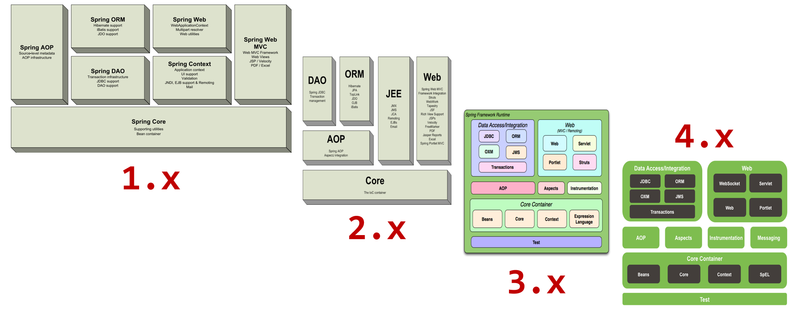

Spring Framework的5版本目前没有最新的架构图，而最新的是4版本，因此接下来主要研究的是4的架构图


1. 核心层

   - Core Container:核心容器，这个模块是Spring最核心的模块，其他的都需要依赖该模块

2. AOP层

   - AOP:面向切面编程，它依赖核心层容器，目的是==在不改变原有代码的前提下对其进行功能增强==
   - Aspects:AOP是思想,Aspects是对AOP思想的具体实现

3. 数据层

   - Data Access:数据访问，Spring全家桶中有对数据访问的具体实现技术

   * Data Integration:数据集成，Spring支持整合其他的数据层解决方案，比如Mybatis
   * Transactions:事务，Spring中事务管理是Spring AOP的一个具体实现，也是后期学习的重点内容

4. Web层

   - SpringMVC框架

5. Test层

   - Spring主要整合Junit来完成单元测试和集成测试

#### 1.2.2 课程学习路线

对于Spring的学习主要包含四部分内容，分别是:

* Spring的IOC/DI
* Spring的AOP
* AOP的具体应用,事务管理
* IOC/DI的具体应用,整合Mybatis


### 1.3 Spring核心概念

在Spring核心概念该部分内容中主要包含`IOC/DI`、`IOC容器`和`Bean`。

#### 1.3.1 目前项目中的问题

#### 1.3.2 IOC、IOC容器、Bean、DI

IOC（Inversion of Control）控制反转

1. 什么是控制反转呢？
   - 使用对象时，由主动new产生对象转换为由外部提供对象，此过程中对象创建控制权由程序转移到外部，此思想称为控制反转。
2. Spring和IOC之间的关系是什么呢?
   - Spring技术对IOC思想进行了实现
   - Spring提供了一个容器，称为IOC容器，用来充当IOC思想中的"外部"
   - IOC思想中的`别人[外部]`指的就是Spring的IOC容器
3. IOC容器的作用以及内部存放的是什么?
   - IOC容器负责对象的创建、初始化等一系列工作，其中包含了数据层和业务层的类对象
   - 被创建或被管理的对象在IOC容器中统称为Bean
   - IOC容器中放的就是一个个的Bean对象
4. 当IOC容器中创建好service和dao对象后，程序能正确执行么?
   - 不行，因为service运行需要依赖dao对象
   - IOC容器中虽然有service和dao对象
   - 但是service对象和dao对象没有任何关系
   - 需要把dao对象交给service,也就是说要绑定service和dao对象之间的关系


在容器中建立对象与对象之间的绑定关系就要用到DI:

DI（Dependency Injection）依赖注入


1. 什么是依赖注入呢?
   - 在容器中建立bean与bean之间的依赖关系的整个过程，称为依赖注入
2. IOC容器中哪些bean之间要建立依赖关系呢?
   - 需要根据业务需求提前建立好关系，如业务层需要依赖数据层，service就要和dao建立依赖关系


Spring的IOC和DI，这两个概念的最终目标就是：充分解耦

具体实现:

* 使用IOC容器管理bean（IOC)
* 在IOC容器内将有依赖关系的bean进行关系绑定（DI）
* 最终结果为:使用对象时不仅可以直接从IOC容器中获取，并且获取到的bean已经绑定所有的依赖关系.

#### 1.3.3 核心概念小结

重点理解`什么是IOC/DI思想`、`什么是IOC容器`和`什么是Bean`：

1. 什么IOC/DI思想?

   - IOC:控制反转，控制反转的是对象的创建权

   * DI:依赖注入，绑定对象与对象之间的依赖关系

2. 什么是IOC容器?

   - Spring创建了一个容器用来存放所创建的对象，这个容器就叫IOC容器

3. 什么是Bean?

   - 容器中所存放的一个个对象就叫Bean或Bean对象


## 2. 入门案例

### 2.1 IOC入门案例

#### 2.1.1 入门案例思路分析

1. Spring是使用容器来管理bean对象的，那么管什么? 

   - 主要管理项目中所使用到的类对象，比如(Service和Dao)
2. 如何将被管理的对象告知IOC容器?

   - 使用配置文件
3. 被管理的对象交给IOC容器，要想从容器中获取对象，就先得思考如何获取到IOC容器?

   - Spring框架提供相应的接口
4. IOC容器得到后，如何从容器中获取bean?

   - 调用Spring框架提供对应接口中的方法
5. 使用Spring导入哪些坐标?

   - 用别人的东西，就需要在pom.xml添加对应的依赖

#### 2.1.2 入门案例代码实现

> 需求分析:将BookServiceImpl和BookDaoImpl交给Spring管理，并从容器中获取对应的bean对象进行方法调用。
>
> 1. 创建Maven的java项目
> 2. pom.xml添加Spring的依赖jar包
>
> 3. 创建BookService,BookServiceImpl，BookDao和BookDaoImpl四个类
>
> 4. resources下添加spring配置文件，并完成bean的配置
>
> 5. 使用Spring提供的接口完成IOC容器的创建
>
> 6. 从容器中获取对象进行方法调用

##### 步骤1:创建Maven项目

- src
  - main
    - java
    - resources
  - test
    - java


##### 步骤2:添加Spring的依赖jar包

pom.xml

```xml
<dependencies>
    <dependency>
        <groupId>org.springframework</groupId>
        <artifactId>spring-context</artifactId>
        <version>5.2.10.RELEASE</version>
    </dependency>
    <dependency>
        <groupId>junit</groupId>
        <artifactId>junit</artifactId>
        <version>4.12</version>
        <scope>test</scope>
    </dependency>
</dependencies>
```

##### 步骤3:添加案例中需要的类

创建BookService、BookServiceImpl、BookDao和BookDaoImpl四个类

```java
public interface BookDao {
    public void save();
}

public class BookDaoImpl implements BookDao {
    public void save() {
        System.out.println("book dao save ...");
    }
}

public interface BookService {
    public void save();
}

public class BookServiceImpl implements BookService {
    private BookDao bookDao = new BookDaoImpl();
    
    public void save() {
        System.out.println("book service save ...");
        bookDao.save();
    }
}
```

##### 步骤4:添加spring配置文件

resources下添加spring配置文件applicationContext.xml，并完成bean的配置

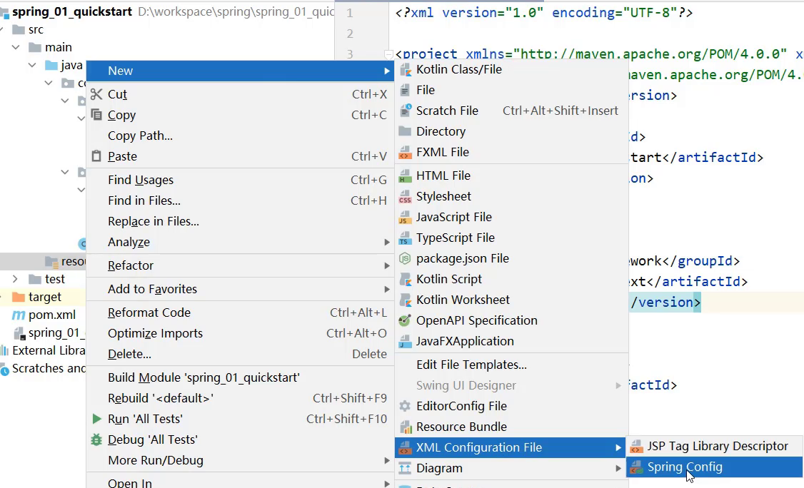

##### 步骤5:在配置文件中完成bean的配置

```xml
<?xml version="1.0" encoding="UTF-8"?>
<beans xmlns="http://www.springframework.org/schema/beans"
       xmlns:xsi="http://www.w3.org/2001/XMLSchema-instance"
       xsi:schemaLocation="http://www.springframework.org/schema/beans http://www.springframework.org/schema/beans/spring-beans.xsd">
 
    <!--bean标签标示配置bean
    	id属性标示给bean起名字
    	class属性表示给bean定义类型
	-->
	<bean id="bookDao" class="com.goes.dao.impl.BookDaoImpl"/>
    <bean id="bookService" class="com.goes.service.impl.BookServiceImpl"/>

</beans>
```

**注意事项：bean定义时id属性在同一个上下文中(配置文件)不能重复**

##### 步骤6:获取IOC容器

使用Spring提供的接口完成IOC容器的创建，创建App类，编写main方法

```java
public class App {
    public static void main(String[] args) {
        //获取IOC容器
		ApplicationContext ctx = new ClassPathXmlApplicationContext("applicationContext.xml"); 
    }
}
```

##### 步骤7:从容器中获取对象进行方法调用

```java
public class App {
    public static void main(String[] args) {
        //获取IOC容器
		ApplicationContext ctx = new ClassPathXmlApplicationContext("applicationContext.xml"); 
		// BookDao bookDao = (BookDao) ctx.getBean("bookDao");
		// bookDao.save();
        BookService bookService = (BookService) ctx.getBean("bookService");
        bookService.save();
    }
}
```

##### 步骤8:运行程序

测试结果为：


### 2.2 DI入门案例

#### 2.2.1 入门案例思路分析

1. (要想实现依赖注入，必须要基于IOC管理Bean

   - DI的入门案例要依赖于前面IOC的入门案例
2. Service中使用new形式创建的Dao对象是否保留?

   - 需要删除掉，最终要使用IOC容器中的bean对象
3. Service中需要的Dao对象如何进入到Service中?

   - 在Service中提供方法，让Spring的IOC容器可以通过该方法传入bean对象
4. Service与Dao间的关系如何描述?

   - 使用配置文件

#### 2.2.2 入门案例代码实现

> 需求:基于IOC入门案例，在BookServiceImpl类中删除new对象的方式，使用Spring的DI完成Dao层的注入
>
> 1. 删除业务层中使用new的方式创建的dao对象
> 2. 在业务层提供BookDao的setter方法
>
> 3. 在配置文件中添加依赖注入的配置
>
> 4. 运行程序调用方法

##### 步骤1: 去除代码中的new

在BookServiceImpl类中，删除业务层中使用new的方式创建的dao对象

```java
public class BookServiceImpl implements BookService {
    //删除业务层中使用new的方式创建的dao对象
    private BookDao bookDao;

    public void save() {
        System.out.println("book service save ...");
        bookDao.save();
    }
}
```

##### 步骤2:为属性提供setter方法

在BookServiceImpl类中，为BookDao提供setter方法

```java
public class BookServiceImpl implements BookService {
    //删除业务层中使用new的方式创建的dao对象
    private BookDao bookDao;

    public void save() {
        System.out.println("book service save ...");
        bookDao.save();
    }
    //提供对应的set方法
    public void setBookDao(BookDao bookDao) {
        this.bookDao = bookDao;
    }
}

```

##### 步骤3:修改配置完成注入

在配置文件中添加依赖注入的配置

```xml
<?xml version="1.0" encoding="UTF-8"?>
<beans xmlns="http://www.springframework.org/schema/beans"
       xmlns:xsi="http://www.w3.org/2001/XMLSchema-instance"
       xsi:schemaLocation="http://www.springframework.org/schema/beans http://www.springframework.org/schema/beans/spring-beans.xsd">
    <!--bean标签标示配置bean
    	id属性标示给bean起名字
    	class属性表示给bean定义类型
	-->
    <bean id="bookDao" class="com.goes.dao.impl.BookDaoImpl"/>

    <bean id="bookService" class="com.goes.service.impl.BookServiceImpl">
        <!--配置server与dao的关系-->
        <!--property标签表示配置当前bean的属性
        		name属性表示配置哪一个具体的属性
        		ref属性表示参照哪一个bean
		-->
        <property name="bookDao" ref="bookDao"/>
    </bean>

</beans>
```

注意:配置中的两个bookDao的含义是不一样的

* name="bookDao"中`bookDao`的作用是让Spring的IOC容器在获取到名称后，将首字母大写，前面加set找对应的`setBookDao()`方法进行对象注入
* ref="bookDao"中`bookDao`的作用是让Spring能在IOC容器中找到id为`bookDao`的Bean对象给`bookService`进行注入
* 综上所述，对应关系如下:


##### 步骤4:运行程序

运行，测试结果为：


## 3. IOC相关内容

### 3.1 bean基础配置

对于bean的配置中，主要会讲解`bean基础配置`、`bean的别名配置`、`bean的作用范围配置`(重点) 三部分内容：

#### 3.1.1 bean基础配置(id与class)

对于bean的基础配置，在前面的案例中已经使用过:

```
<bean id="" class=""/>
```

其中，bean标签的功能、使用方式以及id和class属性的作用，描述如下

- 类别：描述

- 名称：bean

- 类型：标签

- 所属：beans标签

- 功能：定义Spring核心容器管理的对象

- 格式

  - ```xml
    <beans>
        <bean/>
        <bean></bean>
    </beans>
    ```

- 属性列表

  - id：bean的id，使用容器可以通过id值获取对应的bean，在一个容器中id值唯一
  - class：bean的类型，即配置的bean的全路径类名

- 范例

  - ```xml
    <bean id ="bookDao" class="com.goes.dao.impl.BookDaoImpl"/>
    <bean id ="bookService" class="com.goes.service.impl.BookServiceImpl"/>
    ```

其中需要重点掌握的是：bean标签的id和class属性的使用。

**思考：**

1. class属性能不能写接口如`BookDao`的类全名呢?
   - 答案肯定是不行，因为接口是没办法创建对象的。
2. 前面提过为bean设置id时，id必须唯一，但是如果由于命名习惯而产生了分歧后，该如何解决?
   - 在解决这个问题之前，需要准备下开发环境，对于开发环境可以有两种解决方案:
     - 使用前面IOC和DI的案例
     - 重新搭建一个新的案例环境,目的是方便大家查阅代码
       - 搭建的内容和前面的案例是一样的，内容如下：
         - src
           - main
             - java
               - com.goes
                 - dao
                   - impl
                     - BookDaoImpl
                   - BookDao
                 - service
                   - impl
                     - BookServiceImpl
                   - BookService
             - resources
               - applicationContext.xml

#### 3.1.2 bean的name属性

bean别名的配置说明：

- 类别：描述
- 名称：name
- 类型：属性
- 所属：beans标签
- 功能：定义bean的别名，可以定义多个，使用逗号`(,)`分号`(;)`空格`( )`分隔
- 范例
  - <bean id ="bookDao" name="dao bookDaoImpl" class="com.goes.dao.impl.BookDaoImpl"/>
  - <bean id ="bookService" name="service bookServiceImpl" class="com.goes.service.impl.BookServiceImpl"/>

##### 步骤1：配置别名

打开spring的配置文件applicationContext.xml

```xml
<?xml version="1.0" encoding="UTF-8"?>
<beans xmlns="http://www.springframework.org/schema/beans"
       xmlns:xsi="http://www.w3.org/2001/XMLSchema-instance"
       xsi:schemaLocation="http://www.springframework.org/schema/beans http://www.springframework.org/schema/beans/spring-beans.xsd">

    <!--name:为bean指定别名，别名可以有多个，使用逗号，分号，空格进行分隔-->
    <bean id="bookService" name="service service4 bookEbi" class="com.goes.service.impl.BookServiceImpl">
        <property name="bookDao" ref="bookDao"/>
    </bean>

    <!--scope：为bean设置作用范围，可选值为单例singloton，非单例prototype-->
    <bean id="bookDao" name="dao" class="com.goes.dao.impl.BookDaoImpl"/>
</beans>
```

**说明:Ebi全称Enterprise Business Interface，翻译为企业业务接口**

##### 步骤2:根据名称容器中获取bean对象

```java
public class AppForName {
    public static void main(String[] args) {
        ApplicationContext ctx = new ClassPathXmlApplicationContext("applicationContext.xml");
        //此处根据bean标签的id属性和name属性的任意一个值来获取bean对象
        BookService bookService = (BookService) ctx.getBean("service4");
        bookService.save();
    }
}
```

##### 步骤3:运行程序

测试结果为：


注意事项:

* bean依赖注入的ref属性指定bean，必须在容器中存在

  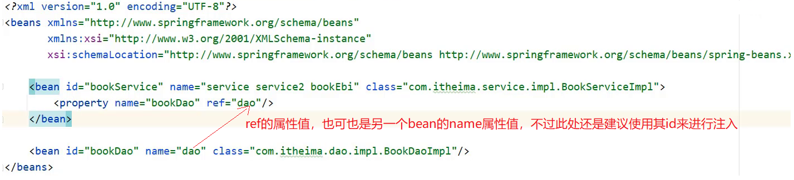

* 如果不存在,则会报错：获取bean无论是通过id还是name获取，如果无法获取到，将抛出异常NoSuchBeanDefinitionException


#### 3.1.3 bean作用范围scope配置

`bean作用范围的配置属性`:

- 类别：描述

- 名称：scope

- 类型：属性

- 所属：beans标签

- 功能：定义bean的作用范围，可选范围如下

  - singleton：单例（默认）
  - prototype：非单例

- 范例：

  ```xml
  <bean id="bookDao" class"com.goes.dao.impl.BookDaoImpl" scope="prototype" />
  ```


##### 3.1.3.1 验证IOC容器中对象是否为单例

验证思路

- 同一个bean获取两次，将对象打印到控制台，看打印出的地址值是否一致。

具体实现

* 创建一个AppForScope的类，在其main方法中来验证

  ```java
  public class AppForScope {
      public static void main(String[] args) {
          ApplicationContext ctx = new ClassPathXmlApplicationContext("applicationContext.xml");
  
          BookDao bookDao1 = (BookDao) ctx.getBean("bookDao");
          BookDao bookDao2 = (BookDao) ctx.getBean("bookDao");
          System.out.println(bookDao1);
          System.out.println(bookDao2);
      }
  }
  ```

* 打印，观察控制台的打印结果

  

* 结论:默认情况下，Spring创建的bean对象都是单例的


##### 3.1.3.2 配置bean为非单例

在Spring配置文件中，配置scope属性来实现bean的非单例创建

* 在Spring的配置文件中，修改`<bean>`的scope属性

  ```xml
  <bean id="bookDao" name="dao" class="com.goes.dao.impl.BookDaoImpl" scope=""/>
  ```

* 将scope设置为`singleton`

  ```xml
  <bean id="bookDao" name="dao" class="com.goes.dao.impl.BookDaoImpl" scope="singleton"/>
  ```

  运行AppForScope，打印看结果

  

* 将scope设置为`prototype`

  ```xml
  <bean id="bookDao" name="dao" class="com.goes.dao.impl.BookDaoImpl" scope="prototype"/>
  ```

  运行AppForScope，打印看结果

  

* 结论，使用bean的`scope`属性可以控制bean的创建是否为单例：

  * `singleton`默认为单例
  * `prototype`为非单例

##### 3.1.3.3 scope使用后续思考

* 为什么bean默认为单例?
  * bean为单例的意思是在Spring的IOC容器中只会有该类的一个对象
  * bean对象只有一个就避免了对象的频繁创建与销毁，达到了bean对象的复用，性能高
* bean在容器中是单例的，会不会产生线程安全问题?
  * 如果对象是有状态对象，即该对象有成员变量可以用来存储数据的，
  * 因为所有请求线程共用一个bean对象，所以会存在线程安全问题。
  * 如果对象是无状态对象，即该对象没有成员变量没有进行数据存储的，
  * 因方法中的局部变量在方法调用完成后会被销毁，所以不会存在线程安全问题。
* 哪些bean对象适合交给容器进行管理?
  * 表现层对象
  * 业务层对象
  * 数据层对象
  * 工具对象
* 哪些bean对象不适合交给容器进行管理?
  * 封装实例的域对象，因为会引发线程安全问题，所以不适合。

#### 3.1.4 bean基础配置小结


### 3.2 bean实例化

* bean是如何创建的
* 实例化bean的三种方式，`构造方法`,`静态工厂`和`实例工厂`

#### 3.2.1 环境准备

* 创建一个Maven项目
* pom.xml添加依赖
* resources下添加spring的配置文件applicationContext.xml
* 项目结构如下：
  - src
    - main
      - java
        - com.goes
      - resources
        - applicationContext.xml

#### 3.2.2 构造方法实例化

##### 步骤1:准备需要被创建的类

准备一个BookDao和BookDaoImpl类

```java
public interface BookDao {
    public void save();
}

public class BookDaoImpl implements BookDao {
    public void save() {
        System.out.println("book dao save ...");
    }

}
```

##### 步骤2:将类配置到Spring容器

```xml
<?xml version="1.0" encoding="UTF-8"?>
<beans xmlns="http://www.springframework.org/schema/beans"
       xmlns:xsi="http://www.w3.org/2001/XMLSchema-instance"
       xsi:schemaLocation="http://www.springframework.org/schema/beans http://www.springframework.org/schema/beans/spring-beans.xsd">

	<bean id="bookDao" class="com.goes.dao.impl.BookDaoImpl"/>

</beans>
```

##### 步骤3:编写运行程序

```java
public class AppForInstanceBook {
    public static void main(String[] args) {
        ApplicationContext ctx = new ClassPathXmlApplicationContext("applicationContext.xml");
        BookDao bookDao = (BookDao) ctx.getBean("bookDao");
        bookDao.save();

    }
}
```

##### 步骤4:类中提供构造函数测试

在BookDaoImpl类中添加一个无参构造函数。

```java
public class BookDaoImpl implements BookDao {
    public BookDaoImpl() {
        System.out.println("book dao constructor is running ....");
    }
    public void save() {
        System.out.println("book dao save ...");
    }

}
```

运行程序，如果控制台有打印构造函数中的输出，说明Spring容器在创建对象的时候也走的是构造函数


##### 步骤5:将构造函数改成private测试

```java
public class BookDaoImpl implements BookDao {
    private BookDaoImpl() {
        System.out.println("book dao constructor is running ....");
    }
    public void save() {
        System.out.println("book dao save ...");
    }

}
```

运行程序，能执行成功,说明内部走的依然是构造函数,能访问到类中的私有构造方法,显而易见Spring底层用的是反射


##### 步骤6:构造函数中添加一个参数测试

```java
public class BookDaoImpl implements BookDao {
    private BookDaoImpl(int i) {
        System.out.println("book dao constructor is running ....");
    }
    public void save() {
        System.out.println("book dao save ...");
    }

}
```

运行程序，程序会报错，说明Spring底层使用的是类的无参构造方法。

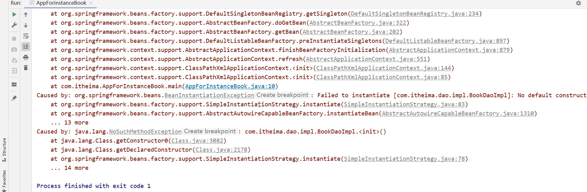


#### 3.2.3 分析Spring的错误信息

主要研究下Spring的报错信息的阅读。

* 错误信息从下往上依次查看，因为上面的错误大都是对下面错误的一个包装，最核心错误是在最下面
* Caused by: java.lang.NoSuchMethodException: com.goes.dao.impl.BookDaoImpl.`<init>`()
  * Caused by 翻译为`引起`，即出现错误的原因
  * java.lang.NoSuchMethodException:抛出的异常为：没有这样的方法异常
  * com.goes.dao.impl.BookDaoImpl.`<init>`()：哪个类的哪个方法没有被找到导致的异常，`<init>`()指定是类的构造方法，即该类的无参构造方法

如果最后一行错误获取不到错误信息，接下来查看第二层:

Caused by: org.springframework.beans.BeanInstantiationException: Failed to instantiate [com.goes.dao.impl.BookDaoImpl]: No default constructor found; nested exception is java.lang.NoSuchMethodException: com.goes.dao.impl.BookDaoImpl.`<init>`()

* nested：嵌套的意思，后面的异常内容和最底层的异常是一致的
* Caused by: org.springframework.beans.BeanInstantiationException: Failed to instantiate [com.goes.dao.impl.BookDaoImpl]: No default constructor found; 
  * Caused by: `引发`
  * BeanInstantiationException：翻译为`bean实例化异常`
  * No default constructor found：没有一个默认的构造函数被发现


#### 3.2.4 静态工厂实例化

##### 3.2.4.1 工厂方式创建bean

1. 准备一个OrderDao和OrderDaoImpl类

   ```java
   public interface OrderDao {
       public void save();
   }
   
   public class OrderDaoImpl implements OrderDao {
       public void save() {
           System.out.println("order dao save ...");
       }
   }
   ```

2. 创建一个工厂类OrderDaoFactory并提供一个静态方法

   ```java
   public class OrderDaoFactory {
       public static OrderDao getOrderDao(){
           return new OrderDaoImpl();
       }
   }
   ```

3. 编写AppForInstanceOrder运行类，在类中通过工厂获取对象

   ```java
   public class AppForInstanceOrder {
       public static void main(String[] args) {
           OrderDao orderDao = OrderDaoFactory.getOrderDao();
           orderDao.save();
       }
   }
   ```

4. 运行后，可以查看到结果


##### 3.2.4.2 静态工厂实例化

1. 在spring的配置文件application.properties中添加以下内容:

   - class:工厂类的类全名

   - factory-mehod:具体工厂类中创建对象的方法名

     ```xml
     <bean id="orderDao" class="com.goes.factory.OrderDaoFactory" factory-method="getOrderDao"/>
     ```

2. 在AppForInstanceOrder运行类，使用从IOC容器中获取bean的方法进行运行测试

   ```java
   public class AppForInstanceOrder {
       public static void main(String[] args) {
           ApplicationContext ctx = new ClassPathXmlApplicationContext("applicationContext.xml");
   
           OrderDao orderDao = (OrderDao) ctx.getBean("orderDao");
   
           orderDao.save();
   
       }
   }
   ```

3. 运行后，可以查看到结果


静态工厂的方式反而更复杂，这种方式的意义是什么？主要的原因是:

* 在工厂的静态方法中，除了new对象还可以做其他的一些业务操作，这些操作必不可少,如:

```java
public class OrderDaoFactory {
    public static OrderDao getOrderDao(){
        System.out.println("factory setup....");//模拟必要的业务操作
        return new OrderDaoImpl();
    }
}
```

之前new对象的方式就无法添加其他的业务内容，重新运行，查看结果:


#### 3.2.5 实例工厂与FactoryBean

接下来继续来研究Spring的第三种bean的创建方式`实例工厂实例化`:

##### 3.2.5.1 环境准备

1. 准备一个UserDao和UserDaoImpl类

   ```java
   public interface UserDao {
       public void save();
   }
   
   public class UserDaoImpl implements UserDao {
   
       public void save() {
           System.out.println("user dao save ...");
       }
   }
   ```

2. 创建一个工厂类UserDaoFactory并提供一个普通方法，注意此处和静态工厂的工厂类不一样的地方是方法不是静态方法

   ```java
   public class UserDaoFactory {
       public UserDao getUserDao(){
           return new UserDaoImpl();
       }
   }
   ```

3. 编写AppForInstanceUser运行类，在类中通过工厂获取对象

   ```java
   public class AppForInstanceUser {
       public static void main(String[] args) {
           //创建实例工厂对象
           UserDaoFactory userDaoFactory = new UserDaoFactory();
           //通过实例工厂对象创建对象
           UserDao userDao = userDaoFactory.getUserDao();
           userDao.save();
   }
   ```

4. 运行后，可以查看到结果

   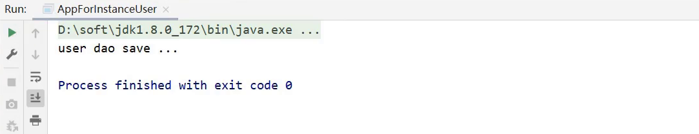


##### 3.2.5.2 实例工厂实例化

具体实现步骤为:

1. 在spring的配置文件中添加以下内容:

   ```xml
   <bean id="userFactory" class="com.goes.factory.UserDaoFactory"/>
   <bean id="userDao" factory-method="getUserDao" factory-bean="userFactory"/>
   ```

   实例化工厂运行的顺序是:

   * 创建实例化工厂对象,对应的是第一行配置
   * 调用对象中的方法来创建bean，对应的是第二行配置

     * factory-bean:工厂的实例对象
     * factory-mehod:具体工厂类中创建对象的方法名

2. 在AppForInstanceUser运行类，使用从IOC容器中获取bean的方法进行运行测试

   ```java
   public class AppForInstanceUser {
       public static void main(String[] args) {
           ApplicationContext ctx = new ClassPathXmlApplicationContext("applicationContext.xml");
           UserDao userDao = (UserDao) ctx.getBean("userDao");
           userDao.save();
       }
   }
   ```

3. 运行后，可以查看到结果

   


##### 3.2.5.3 FactoryBean的使用

具体的使用步骤为:

1. 创建一个UserDaoFactoryBean的类，实现FactoryBean接口，重写接口的方法

   ```java
   public class UserDaoFactoryBean implements FactoryBean<UserDao> {
       //代替原始实例工厂中创建对象的方法
       public UserDao getObject() throws Exception {
           return new UserDaoImpl();
       }
       //返回所创建类的Class对象
       public Class<?> getObjectType() {
           return UserDao.class;
       }
   }
   ```

2. 在Spring的配置文件中进行配置

   ```xml
   <bean id="userDao" class="com.goes.factory.UserDaoFactoryBean"/>
   ```

3. AppForInstanceUser运行类不用做任何修改，直接运行

   


查看源码会发现，FactoryBean接口其实会有三个方法，分别是:

```java
T getObject() throws Exception;

Class<?> getObjectType();

default boolean isSingleton() {
		return true;
}
```

方法一:getObject()，被重写后，在方法中进行对象的创建并返回

方法二:getObjectType(),被重写后，主要返回的是被创建类的Class对象

方法三:没有被重写，因为它已经给了默认值，从方法名中可以看出其作用是设置对象是否为单例，默认true

验证是否单例：从容器中获取该对象的多个值，打印到控制台，查看是否为同一个对象。

```java
public class AppForInstanceUser {
    public static void main(String[] args) {
        ApplicationContext ctx = new 
            ClassPathXmlApplicationContext("applicationContext.xml");
        UserDao userDao1 = (UserDao) ctx.getBean("userDao");
        UserDao userDao2 = (UserDao) ctx.getBean("userDao");
        System.out.println(userDao1);
        System.out.println(userDao2);
    }
}
```

打印结果，如下:


通过验证，会发现默认是单例，那如果想改成单例具体如何实现?

只需要将isSingleton()方法进行重写，修改返回为false，即可

```java
//FactoryBean创建对象
public class UserDaoFactoryBean implements FactoryBean<UserDao> {
    //代替原始实例工厂中创建对象的方法
    public UserDao getObject() throws Exception {
        return new UserDaoImpl();
    }

    public Class<?> getObjectType() {
        return UserDao.class;
    }

    public boolean isSingleton() {
        return false;
    }
}
```

一般情况下都会采用单例，也就是采用默认即可，因此isSingleton()方法一般不需要进行重写。


#### 3.2.6 bean实例化小结

1. bean是如何创建的呢?
   - 构造方法
2. Spring的IOC实例化对象的三种方式分别是:
   - 构造方法(常用)
   - 静态工厂(了解)
   - 实例工厂(了解)
     * FactoryBean(实用)

重点掌握`构造方法`和`FactoryBean`即可。需要注意的是：构造方法在类中默认会提供，但是如果重写了构造方法，默认的就会消失，在使用的过程中需要注意，如果需要重写构造方法，最好把默认的构造方法也重写下。


### 3.3 bean的生命周期

关于bean的相关知识还有最后一个是`bean的生命周期`,对于生命周期，我们主要围绕着`bean生命周期控制`来讲解:

* 首先理解下什么是生命周期?
  * 从创建到消亡的完整过程,例如人从出生到死亡的整个过程就是一个生命周期。
* bean生命周期是什么?
  * bean对象从创建到销毁的整体过程。
* bean生命周期控制是什么?
  * 在bean创建后到销毁前做一些事情。

现在我们面临的问题是如何在bean的创建之后和销毁之前把我们需要添加的内容添加进去。

#### 3.3.1 环境准备

- 创建一个Maven项目
- pom.xml添加依赖
- resources下添加spring的配置文件applicationContext.xml

终项目的结构如下:

- src
  - main
    - java
      - com.goes
    - resources
      - applicationContext.xml

1. 项目中添加BookDao、BookDaoImpl、BookService和BookServiceImpl类

   ```java
   public interface BookDao {
       public void save();
   }
   
   public class BookDaoImpl implements BookDao {
       public void save() {
           System.out.println("book dao save ...");
       }
   }
   
   public interface BookService {
       public void save();
   }
   
   public class BookServiceImpl implements BookService{
       private BookDao bookDao;
   
       public void setBookDao(BookDao bookDao) {
           this.bookDao = bookDao;
       }
   
       public void save() {
           System.out.println("book service save ...");
           bookDao.save();
       }
   }
   ```

2. resources下提供spring的配置文件

   ```xml
   <?xml version="1.0" encoding="UTF-8"?>
   <beans xmlns="http://www.springframework.org/schema/beans"
          xmlns:xsi="http://www.w3.org/2001/XMLSchema-instance"
          xsi:schemaLocation="http://www.springframework.org/schema/beans http://www.springframework.org/schema/beans/spring-beans.xsd">
   
       <bean id="bookDao" class="com.goes.dao.impl.BookDaoImpl"/>
   </beans>
   ```

3. 编写AppForLifeCycle运行类，加载Spring的IOC容器，并从中获取对应的bean对象

   ```java
   public class AppForLifeCycle {
       public static void main( String[] args ) {
           ApplicationContext ctx = new 
           	ClassPathXmlApplicationContext("applicationContext.xml");
           BookDao bookDao = (BookDao) ctx.getBean("bookDao");
           bookDao.save();
       }
   }
   ```

   

#### 3.3.2 生命周期设置

为BookDao添加生命周期的控制方法，具体的控制有两个阶段:

* bean创建之后，想要添加内容，比如用来初始化需要用到资源
* bean销毁之前，想要添加内容，比如用来释放用到的资源

##### 步骤1:添加初始化和销毁方法

```java
public class BookDaoImpl implements BookDao {
    public void save() {
        System.out.println("book dao save ...");
    }
    //表示bean初始化对应的操作
    public void init(){
        System.out.println("init...");
    }
    //表示bean销毁前对应的操作
    public void destory(){
        System.out.println("destory...");
    }
}
```


##### 步骤2:配置生命周期

在配置文件添加配置，如下:

```xml
<bean id="bookDao" class="com.goes.dao.impl.BookDaoImpl" init-method="init" destroy-method="destory"/>
```


##### 步骤3:运行程序

运行AppForLifeCycle打印结果为:


从结果中可以看出，init方法执行了，但是destroy方法却未执行，这是为什么呢?

* Spring的IOC容器是运行在JVM中
* 运行main方法后,JVM启动，Spring加载配置文件生成IOC容器,从容器获取bean对象，然后调方法执行
* main方法执行完后，JVM退出，此时IOC容器中的bean还没有来得及销毁就已经结束
* 因此没有调用对应的destroy方法


#### 3.3.3 close关闭容器

* ApplicationContext中没有close方法

* 需要将ApplicationContext更换成ClassPathXmlApplicationContext

  ```java
  ClassPathXmlApplicationContext ctx = new ClassPathXmlApplicationContext("applicationContext.xml");
  ```

* 调用ctx的close()方法

  ```java
  ctx.close();
  ```

* 运行程序，就能执行destroy方法的内容

  


#### 3.3.4 注册钩子关闭容器

* 在容器未关闭之前，提前设置好回调函数，让JVM在退出之前回调此函数来关闭容器

* 调用ctx的registerShutdownHook()方法

  ```java
  ctx.registerShutdownHook();
  ```

  **注意:**registerShutdownHook在ApplicationContext中也没有

* 运行后，查询打印结果

  

close和registerShutdownHook选哪个?

- 相同点:这两种都能用来关闭容器
- 不同点:close()是在调用的时候关闭，registerShutdownHook()是在JVM退出前调用关闭。


Spring提供了两个接口来完成生命周期的控制，好处是可以不用再进行配置`init-method`和`destroy-method`

修改BookServiceImpl类，添加两个接口`InitializingBean`， `DisposableBean`并实现接口中的两个方法`afterPropertiesSet`和`destroy`

```java
public class BookServiceImpl implements BookService, InitializingBean, DisposableBean {
    private BookDao bookDao;
    public void setBookDao(BookDao bookDao) {
        this.bookDao = bookDao;
    }
    public void save() {
        System.out.println("book service save ...");
        bookDao.save(); 
    }
    public void destroy() throws Exception {
        System.out.println("service destroy");
    }
    public void afterPropertiesSet() throws Exception {
        System.out.println("service init");
    }
}
```

重新运行AppForLifeCycle类

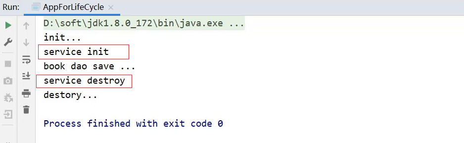


**小细节**

* 对于InitializingBean接口中的afterPropertiesSet方法，翻译过来为`属性设置之后`

* 对于BookServiceImpl来说，bookDao是它的一个属性

* setBookDao方法是Spring的IOC容器为其注入属性的方法

* 思考：afterPropertiesSet和setBookDao谁先执行?

  * 从方法名分析，猜想应该是setBookDao方法先执行

  * 验证思路，在setBookDao方法中添加一句话

    ```java
    public void setBookDao(BookDao bookDao) {
    	System.out.println("set .....");
    	this.bookDao = bookDao;
    }
    ```

  * 重新运行AppForLifeCycle，打印结果如下:

    

    验证的结果和我们猜想的结果是一致的，所以初始化方法会在类中属性设置之后执行。


#### 3.3.5 bean生命周期小结

1. (1)关于Spring中对bean生命周期控制提供了两种方式:

   - 在配置文件中的bean标签中添加`init-method`和`destroy-method`属性
   - 类实现`InitializingBean`与`DisposableBean`接口，这种方式了解下即可。

2. (2)对于bean的生命周期控制在bean的整个生命周期中所处的位置如下:

   - 初始化容器
     1. 创建对象(内存分配)
     2. 执行构造方法
     3. 执行属性注入(set操作)
     4. 执行bean初始化方法

   * 使用bean
     * 执行业务操作
   * 关闭/销毁容器
     * 执行bean销毁方法

3. 关闭容器的两种方式:

   - ConfigurableApplicationContext是ApplicationContext的子类
     - close()方法
     - registerShutdownHook()方法


## 4. DI相关内容

向一个类中传递数据的方式有几种?

* 普通方法(set方法)
* 构造方法

依赖注入描述了在容器中建立bean与bean之间的依赖关系的过程，如果bean运行需要的是数字或字符串呢?

* 引用类型
* 简单类型(基本数据类型与String)

Spring中有哪些注入方式？Spring基于上述知识点，提供两种注入方式，分别是:

* setter注入
  * 简单类型
  * 引用类型
* 构造器注入
  * 简单类型
  * 引用类型

### 4.1 setter注入

1. 对于setter方式注入引用类型的方式之前已经学习过，快速回顾下:

* 在bean中定义引用类型属性，并提供可访问的set方法

```java
public class BookServiceImpl implements BookService {
    private BookDao bookDao;
    public void setBookDao(BookDao bookDao) {
        this.bookDao = bookDao;
    }
}
```

* 配置中使用property标签ref属性注入引用类型对象

```xml
<bean id="bookService" class="com.goes.service.impl.BookServiceImpl">
	<property name="bookDao" ref="bookDao"/>
</bean>

<bean id="bookDao" class="com.goes.dao.imipl.BookDaoImpl"/>
```


#### 4.1.1 环境准备

- 创建一个Maven项目
- pom.xml添加依赖
- resources下添加spring的配置文件

项目的结构如下:

- src
  - main
    - java
      - com.goes
    - resources
      - applicationContext.xml

1. 项目中添加BookDao、BookDaoImpl、UserDao、UserDaoImpl、BookService和BookServiceImpl类

   ```java
   public interface BookDao {
       public void save();
   }
   
   public class BookDaoImpl implements BookDao {
       public void save() {
           System.out.println("book dao save ...");
       }
   }
   
   public interface UserDao {
       public void save();
   }
   
   public class UserDaoImpl implements UserDao {
       public void save() {
           System.out.println("user dao save ...");
       }
   }
   
   public interface BookService {
       public void save();
   }
   
   public class BookServiceImpl implements BookService{
       private BookDao bookDao;
   
       public void setBookDao(BookDao bookDao) {
           this.bookDao = bookDao;
       }
   
       public void save() {
           System.out.println("book service save ...");
           bookDao.save();
       }
   }
   ```

2. resources下提供spring的配置文件

   ```xml
   <?xml version="1.0" encoding="UTF-8"?>
   <beans xmlns="http://www.springframework.org/schema/beans"
          xmlns:xsi="http://www.w3.org/2001/XMLSchema-instance"
          xsi:schemaLocation="http://www.springframework.org/schema/beans http://www.springframework.org/schema/beans/spring-beans.xsd">
   
       <bean id="bookDao" class="com.goes.dao.impl.BookDaoImpl"/>
       <bean id="bookService" class="com.goes.service.impl.BookServiceImpl">
           <property name="bookDao" ref="bookDao"/>
       </bean>
   </beans>
   ```

3. 编写AppForDISet运行类，加载Spring的IOC容器，并从中获取对应的bean对象

   ```java
   public class AppForDISet {
       public static void main( String[] args ) {
           ApplicationContext ctx = new ClassPathXmlApplicationContext("applicationContext.xml");
           BookService bookService = (BookService) ctx.getBean("bookService");
           bookService.save();
       }
   }
   ```

   


#### 4.1.2 注入引用数据类型

> 需求:在bookServiceImpl对象中注入userDao
>
> 1.在BookServiceImpl中声明userDao属性
>
> 2.为userDao属性提供setter方法
>
> 3.在配置文件中使用property标签注入

##### 步骤1:声明属性并提供setter方法

在BookServiceImpl中声明userDao属性，并提供setter方法

```java
public class BookServiceImpl implements BookService{
    private BookDao bookDao;
    private UserDao userDao;
    
    public void setUserDao(UserDao userDao) {
        this.userDao = userDao;
    }
    public void setBookDao(BookDao bookDao) {
        this.bookDao = bookDao;
    }

    public void save() {
        System.out.println("book service save ...");
        bookDao.save();
        userDao.save();
    }
}
```

##### 步骤2:配置文件中进行注入配置

在applicationContext.xml配置文件中使用property标签注入

```xml
<?xml version="1.0" encoding="UTF-8"?>
<beans xmlns="http://www.springframework.org/schema/beans"
       xmlns:xsi="http://www.w3.org/2001/XMLSchema-instance"
       xsi:schemaLocation="http://www.springframework.org/schema/beans http://www.springframework.org/schema/beans/spring-beans.xsd">

    <bean id="bookDao" class="com.goes.dao.impl.BookDaoImpl"/>
    <bean id="userDao" class="com.goes.dao.impl.UserDaoImpl"/>
    <bean id="bookService" class="com.goes.service.impl.BookServiceImpl">
        <property name="bookDao" ref="bookDao"/>
        <property name="userDao" ref="userDao"/>
    </bean>
</beans>
```

##### 步骤3:运行程序

运行AppForDISet类，查看结果，说明userDao已经成功注入。


#### 4.1.3 注入简单数据类型

> 需求：给BookDaoImpl注入一些简单数据类型的数据
>
> 参考引用数据类型的注入，我们可以推出具体的步骤为:
>
> 1.在BookDaoImpl类中声明对应的简单数据类型的属性
>
> 2.为这些属性提供对应的setter方法
>
> 3.在applicationContext.xml中配置

**思考:**

引用类型使用的是`<property name="" ref=""/>`,简单数据类型还是使用ref么?

ref是指向Spring的IOC容器中的另一个bean对象的，对于简单数据类型，没有对应的bean对象，该如何配置?

##### 步骤1:声明属性并提供setter方法

在BookDaoImpl类中声明对应的简单数据类型的属性,并提供对应的setter方法

```java
public class BookDaoImpl implements BookDao {

    private String databaseName;
    private int connectionNum;

    public void setConnectionNum(int connectionNum) {
        this.connectionNum = connectionNum;
    }

    public void setDatabaseName(String databaseName) {
        this.databaseName = databaseName;
    }

    public void save() {
        System.out.println("book dao save ..."+databaseName+","+connectionNum);
    }
}
```

##### 步骤2:配置文件中进行注入配置

在applicationContext.xml配置文件中使用property标签注入

```xml
<?xml version="1.0" encoding="UTF-8"?>
<beans xmlns="http://www.springframework.org/schema/beans"
       xmlns:xsi="http://www.w3.org/2001/XMLSchema-instance"
       xsi:schemaLocation="http://www.springframework.org/schema/beans http://www.springframework.org/schema/beans/spring-beans.xsd">

    <bean id="bookDao" class="com.goes.dao.impl.BookDaoImpl">
        <property name="databaseName" value="mysql"/>
     	<property name="connectionNum" value="10"/>
    </bean>
    <bean id="userDao" class="com.goes.dao.impl.UserDaoImpl"/>
    <bean id="bookService" class="com.goes.service.impl.BookServiceImpl">
        <property name="bookDao" ref="bookDao"/>
        <property name="userDao" ref="userDao"/>
    </bean>
</beans>
```

**说明:**

value:后面跟的是简单数据类型，对于参数类型，Spring在注入的时候会自动转换，但是不能写成

```xml
<property name="connectionNum" value="abc"/>
```

如此spring在将`abc`转换成int类型的时候就会报错。

##### 步骤3:运行程序

运行AppForDISet类，查看结果，说明userDao已经成功注入。


**注意:**两个property注入标签的顺序可以任意。

对于setter注入方式：

* 对于引用数据类型使用的是`<property name="" ref=""/>`
* 对于简单数据类型使用的是`<property name="" value=""/>`


### 4.2 构造器注入

#### 4.2.1 环境准备

构造器注入也就是构造方法注入，学习之前，还是先准备下环境:

- 创建一个Maven项目
- pom.xml添加依赖
- resources下添加spring的配置文件

项目的结构如下:

- src
  - main
    - java
      - com.goes
    - resources
      - applicationContext.xml

1. 项目中添加BookDao、BookDaoImpl、UserDao、UserDaoImpl、BookService和BookServiceImpl类

   ```java
   public interface BookDao {
       public void save();
   }
   
   public class BookDaoImpl implements BookDao {
       
       private String databaseName;
       private int connectionNum;
       
       public void save() {
           System.out.println("book dao save ...");
       }
   }
   public interface UserDao {
       public void save();
   }
   public class UserDaoImpl implements UserDao {
       public void save() {
           System.out.println("user dao save ...");
       }
   }
   
   public interface BookService {
       public void save();
   }
   
   public class BookServiceImpl implements BookService{
       private BookDao bookDao;
   
       public void setBookDao(BookDao bookDao) {
           this.bookDao = bookDao;
       }
   
       public void save() {
           System.out.println("book service save ...");
           bookDao.save();
       }
   }
   ```

2. resources下提供spring的配置文件

   ```xml
   <?xml version="1.0" encoding="UTF-8"?>
   <beans xmlns="http://www.springframework.org/schema/beans"
          xmlns:xsi="http://www.w3.org/2001/XMLSchema-instance"
          xsi:schemaLocation="http://www.springframework.org/schema/beans http://www.springframework.org/schema/beans/spring-beans.xsd">
   
       <bean id="bookDao" class="com.goes.dao.impl.BookDaoImpl"/>
       <bean id="bookService" class="com.goes.service.impl.BookServiceImpl">
           <property name="bookDao" ref="bookDao"/>
       </bean>
   </beans>
   ```

3. 编写AppForDIConstructor运行类，加载Spring的IOC容器，并从中获取对应的bean对象

   ```java
   public class AppForDIConstructor {
       public static void main( String[] args ) {
           ApplicationContext ctx = new ClassPathXmlApplicationContext("applicationContext.xml");
           BookService bookService = (BookService) ctx.getBean("bookService");
           bookService.save();
       }
   }
   ```

   

#### 4.2.2 构造器注入引用数据类型

接下来，在上面这个环境中来完成构造器注入的学习:

> 需求：将BookServiceImpl类中的bookDao修改成使用构造器的方式注入。
>
> 1.将bookDao的setter方法删除掉
>
> 2.添加带有bookDao参数的构造方法
>
> 3.在applicationContext.xml中配置

##### 步骤1:删除setter方法并提供构造方法

在BookServiceImpl类中将bookDao的setter方法删除掉,并添加带有bookDao参数的构造方法

```java
public class BookServiceImpl implements BookService{
    private BookDao bookDao;

    public BookServiceImpl(BookDao bookDao) {
        this.bookDao = bookDao;
    }

    public void save() {
        System.out.println("book service save ...");
        bookDao.save();
    }
}
```

##### 步骤2:配置文件中进行配置构造方式注入

在applicationContext.xml中配置

```xml
<?xml version="1.0" encoding="UTF-8"?>
<beans xmlns="http://www.springframework.org/schema/beans"
       xmlns:xsi="http://www.w3.org/2001/XMLSchema-instance"
       xsi:schemaLocation="http://www.springframework.org/schema/beans http://www.springframework.org/schema/beans/spring-beans.xsd">

    <bean id="bookDao" class="com.goes.dao.impl.BookDaoImpl"/>
    <bean id="bookService" class="com.goes.service.impl.BookServiceImpl">
        <constructor-arg name="bookDao" ref="bookDao"/>
    </bean>
</beans>
```

**说明:**

标签<constructor-arg>中

* name属性对应的值为构造函数中方法形参的参数名，必须要保持一致。

* ref属性指向的是spring的IOC容器中其他bean对象。

##### 步骤3：运行程序

运行AppForDIConstructor类，查看结果，说明bookDao已经成功注入。


#### 5.2.3 构造器注入多个引用数据类型

> 需求:在BookServiceImpl使用构造函数注入多个引用数据类型，比如userDao
>
> 1.声明userDao属性
>
> 2.生成一个带有bookDao和userDao参数的构造函数
>
> 3.在applicationContext.xml中配置注入

##### 步骤1:提供多个属性的构造函数

在BookServiceImpl声明userDao并提供多个参数的构造函数

```java
public class BookServiceImpl implements BookService{
    private BookDao bookDao;
    private UserDao userDao;

    public BookServiceImpl(BookDao bookDao,UserDao userDao) {
        this.bookDao = bookDao;
        this.userDao = userDao;
    }

    public void save() {
        System.out.println("book service save ...");
        bookDao.save();
        userDao.save();
    }
}
```

##### 步骤2:配置文件中配置多参数注入

在applicationContext.xml中配置注入

```xml
<?xml version="1.0" encoding="UTF-8"?>
<beans xmlns="http://www.springframework.org/schema/beans"
       xmlns:xsi="http://www.w3.org/2001/XMLSchema-instance"
       xsi:schemaLocation="http://www.springframework.org/schema/beans http://www.springframework.org/schema/beans/spring-beans.xsd">

    <bean id="bookDao" class="com.goes.dao.impl.BookDaoImpl"/>
    <bean id="userDao" class="com.goes.dao.impl.UserDaoImpl"/>
    <bean id="bookService" class="com.goes.service.impl.BookServiceImpl">
        <constructor-arg name="bookDao" ref="bookDao"/>
        <constructor-arg name="userDao" ref="userDao"/>
    </bean>
</beans>
```

**说明:**这两个`<contructor-arg>`的配置顺序可以任意

##### 步骤3:运行程序

运行AppForDIConstructor类，查看结果，说明userDao已经成功注入。


#### 4.2.4 构造器注入多个简单数据类型

> 需求:在BookDaoImpl中，使用构造函数注入databaseName和connectionNum两个参数。
>
> 参考引用数据类型的注入，我们可以推出具体的步骤为:
>
> 1.提供一个包含这两个参数的构造方法
>
> 2.在applicationContext.xml中进行注入配置

##### 步骤1:添加多个简单属性并提供构造方法

修改BookDaoImpl类，添加构造方法

```java
public class BookDaoImpl implements BookDao {
    private String databaseName;
    private int connectionNum;

    public BookDaoImpl(String databaseName, int connectionNum) {
        this.databaseName = databaseName;
        this.connectionNum = connectionNum;
    }

    public void save() {
        System.out.println("book dao save ..."+databaseName+","+connectionNum);
    }
}
```

##### 步骤2:配置完成多个属性构造器注入

在applicationContext.xml中进行注入配置

```xml
<?xml version="1.0" encoding="UTF-8"?>
<beans xmlns="http://www.springframework.org/schema/beans"
       xmlns:xsi="http://www.w3.org/2001/XMLSchema-instance"
       xsi:schemaLocation="http://www.springframework.org/schema/beans http://www.springframework.org/schema/beans/spring-beans.xsd">

    <bean id="bookDao" class="com.goes.dao.impl.BookDaoImpl">
        <constructor-arg name="databaseName" value="mysql"/>
        <constructor-arg name="connectionNum" value="666"/>
    </bean>
    <bean id="userDao" class="com.goes.dao.impl.UserDaoImpl"/>
    <bean id="bookService" class="com.goes.service.impl.BookServiceImpl">
        <constructor-arg name="bookDao" ref="bookDao"/>
        <constructor-arg name="userDao" ref="userDao"/>
    </bean>
</beans>
```

**说明:**这两个`<contructor-arg>`的配置顺序可以任意

##### 步骤3:运行程序

运行AppForDIConstructor类，查看结果


虽已完成构造函数注入的基本使用，但是会存在一些问题:

* 当构造函数中方法的参数名发生变化后，配置文件中的name属性也需要跟着变
* 这两块存在紧耦合，具体该如何解决?

方式一:删除name属性，添加type属性，按照类型注入

```xml
<bean id="bookDao" class="com.goes.dao.impl.BookDaoImpl">
    <constructor-arg type="int" value="10"/>
    <constructor-arg type="java.lang.String" value="mysql"/>
</bean>
```

此方式可以解决构造函数形参名发生变化带来的耦合问题，但是如果构造方法参数中有类型相同的参数，那么此种方式就不太好实现

方式二:删除type属性，添加index属性，按照索引下标注入，下标从0开始

```xml
<bean id="bookDao" class="com.goes.dao.impl.BookDaoImpl">
    <constructor-arg index="1" value="100"/>
    <constructor-arg index="0" value="mysql"/>
</bean>
```

方式可以解决参数类型重复问题，但是如果构造方法参数顺序发生变化后，那么此种方式又带来了耦合问题

此两种参数的注入方式，具体该如何选择呢?

1. 强制依赖使用构造器进行，使用setter注入有概率不进行注入导致null对象出现
   * 强制依赖指对象在创建的过程中必须要注入指定的参数
2. 可选依赖使用setter注入进行，灵活性强
   * 可选依赖指对象在创建过程中注入的参数可有可无
3. Spring框架倡导使用构造器，第三方框架内部大多数采用构造器注入的形式进行数据初始化，相对严谨
4. 如果有必要可以两者同时使用，使用构造器注入完成强制依赖的注入，使用setter注入完成可选依赖的注入
5. 实际开发过程中还要根据实际情况分析，如果受控对象没有提供setter方法就必须使用构造器注入
6. **自己开发的模块推荐使用setter注入**

Spring的依赖注入的实现方式:

* setter注入

  * 简单数据类型

    ```xml
    <bean ...>
    	<property name="" value=""/>
    </bean>
    ```

  * 引用数据类型

    ```xml
    <bean ...>
    	<property name="" ref=""/>
    </bean>
    ```

* 构造器注入

  * 简单数据类型

    ```xml
    <bean ...>
    	<constructor-arg name="" index="" type="" value=""/>
    </bean>
    ```

  * 引用数据类型

    ```xml
    <bean ...>
    	<constructor-arg name="" index="" type="" ref=""/>
    </bean>
    ```

* 依赖注入的方式选择上

  * 建议使用setter注入
  * 第三方技术根据情况选择


### 4.3 自动配置

#### 4.3.1 什么是依赖自动装配?

* IoC容器根据bean所依赖的资源在容器中自动查找并注入到bean中的过程称为自动装配

#### 4.3.2 自动装配方式有哪些?

* 按类型（常用）
* 按名称
* 按构造方法
* 不启用自动装配


#### 4.3.3 准备下案例环境

- 创建一个Maven项目
- pom.xml添加依赖
- resources下添加spring的配置文件

项目的结构如下:

- src
  - main
    - java
      - com.goes
    - resources
      - applicationContext.xml

1. 项目中添加BookDao、BookDaoImpl、BookService和BookServiceImpl类

   ```java
   public interface BookDao {
       public void save();
   }
   
   public class BookDaoImpl implements BookDao {
       
       private String databaseName;
       private int connectionNum;
       
       public void save() {
           System.out.println("book dao save ...");
       }
   }
   
   public interface BookService {
       public void save();
   }
   
   public class BookServiceImpl implements BookService{
       private BookDao bookDao;
   
       public void setBookDao(BookDao bookDao) {
           this.bookDao = bookDao;
       }
   
       public void save() {
           System.out.println("book service save ...");
           bookDao.save();
       }
   }
   ```

2. resources下提供spring的配置文件

   ```xml                       
   <?xml version="1.0" encoding="UTF-8"?>
   <beans xmlns="http://www.springframework.org/schema/beans"
          xmlns:xsi="http://www.w3.org/2001/XMLSchema-instance"
          xsi:schemaLocation="http://www.springframework.org/schema/beans http://www.springframework.org/schema/beans/spring-beans.xsd">
   
       <bean id="bookDao" class="com.goes.dao.impl.BookDaoImpl"/>
       <bean id="bookService" class="com.goes.service.impl.BookServiceImpl">
           <property name="bookDao" ref="bookDao"/>
       </bean>
   </beans>
   ```

3. 编写AppForAutoware运行类，加载Spring的IOC容器，并从中获取对应的bean对象

   ```java
   public class AppForAutoware {
       public static void main( String[] args ) {
           ApplicationContext ctx = new ClassPathXmlApplicationContext("applicationContext.xml");
           BookService bookService = (BookService) ctx.getBean("bookService");
           bookService.save();
       }
   }
   ```

   

#### 4.3.4 完成自动装配的配置

自动装配只需要修改applicationContext.xml配置文件即可:

1. 将`<property>`标签删除
2. 在`<bean>`标签中添加autowire属性

实现按照类型注入的配置

```xml
<?xml version="1.0" encoding="UTF-8"?>
<beans xmlns="http://www.springframework.org/schema/beans"
       xmlns:xsi="http://www.w3.org/2001/XMLSchema-instance"
       xsi:schemaLocation="http://www.springframework.org/schema/beans http://www.springframework.org/schema/beans/spring-beans.xsd">

    <bean class="com.goes.dao.impl.BookDaoImpl"/>
    <!--autowire属性：开启自动装配，通常使用按类型装配-->
    <bean id="bookService" class="com.goes.service.impl.BookServiceImpl" autowire="byType"/>

</beans>
```

注意事项:

* 需要注入属性的类中对应属性的setter方法不能省略
* 被注入的对象必须要被Spring的IOC容器管理
* 按照类型在Spring的IOC容器中如果找到多个对象，会报`NoUniqueBeanDefinitionException`

一个类型在IOC中有多个对象，还想要注入成功，这个时候就需要按照名称注入，配置方式为:

```xml
<?xml version="1.0" encoding="UTF-8"?>
<beans xmlns="http://www.springframework.org/schema/beans"
       xmlns:xsi="http://www.w3.org/2001/XMLSchema-instance"
       xsi:schemaLocation="http://www.springframework.org/schema/beans http://www.springframework.org/schema/beans/spring-beans.xsd">

    <bean class="com.goes.dao.impl.BookDaoImpl"/>
    <!--autowire属性：开启自动装配，通常使用按类型装配-->
    <bean id="bookService" class="com.goes.service.impl.BookServiceImpl" autowire="byName"/>

</beans>
```

注意事项:

* 按照名称注入中的名称指的是什么?

  

  * bookDao是private修饰的，外部类无法直接方法
  * 外部类只能通过属性的set方法进行访问
  * 对外部类来说，setBookDao方法名，去掉set后首字母小写是其属性名
    * 为什么是去掉set首字母小写?
    * 这个规则是set方法生成的默认规则，set方法的生成是把属性名首字母大写前面加set形成的方法名
  * 所以按照名称注入，其实是和对应的set方法有关，但是如果按照标准起名称，属性名和set对应的名是一致的

* 如果按照名称去找对应的bean对象，找不到则注入Null

* 当某一个类型在IOC容器中有多个对象，按照名称注入只找其指定名称对应的bean对象，不会报错 

两种方式中按照类型注入最常用。

对于依赖注入，需要注意一些其他的配置特征:

1. 自动装配用于引用类型依赖注入，不能对简单类型进行操作
2. 使用按类型装配时（byType）必须保障容器中相同类型的bean唯一，推荐使用
3. 使用按名称装配时（byName）必须保障容器中具有指定名称的bean，因变量名与配置耦合，不推荐使用
4. 自动装配优先级低于setter注入与构造器注入，同时出现时自动装配配置失效


### 4.4 集合注入

常见的集合类型有哪些?

* 数组
* List
* Set
* Map
* Properties

#### 4.4.1 环境准备

- 创建一个Maven项目
- pom.xml添加依赖
- resources下添加spring的配置文件applicationContext.xml

项目的结构如下:

- src
  - main
    - java
      - com.goes
    - resources
      - applicationContext.xml

1. 项目中添加添加BookDao、BookDaoImpl类

   ```java
   public interface BookDao {
       public void save();
   }
   
   public class BookDaoImpl implements BookDao {
       
   public class BookDaoImpl implements BookDao {
   
       private int[] array;
   
       private List<String> list;
   
       private Set<String> set;
   
       private Map<String,String> map;
   
       private Properties properties;
   
        public void save() {
           System.out.println("book dao save ...");
   
           System.out.println("遍历数组:" + Arrays.toString(array));
   
           System.out.println("遍历List" + list);
   
           System.out.println("遍历Set" + set);
   
           System.out.println("遍历Map" + map);
   
           System.out.println("遍历Properties" + properties);
       }
   	//setter....方法省略，自己使用工具生成
   }
   ```

2. resources下提供spring的配置文件，applicationContext.xml

   ```xml
   <?xml version="1.0" encoding="UTF-8"?>
   <beans xmlns="http://www.springframework.org/schema/beans"
          xmlns:xsi="http://www.w3.org/2001/XMLSchema-instance"
          xsi:schemaLocation="http://www.springframework.org/schema/beans http://www.springframework.org/schema/beans/spring-beans.xsd">
   
       <bean id="bookDao" class="com.goes.dao.impl.BookDaoImpl"/>
   </beans>
   ```

3. 编写AppForDICollection运行类，加载Spring的IOC容器，并从中获取对应的bean对象

   ```java
   public class AppForDICollection {
       public static void main( String[] args ) {
           ApplicationContext ctx = new ClassPathXmlApplicationContext("applicationContext.xml");
           BookDao bookDao = (BookDao) ctx.getBean("bookDao");
           bookDao.save();
       }
   }
   ```

   

集合注入的学习:

在bookDao的bean标签中使用<property>进行注入

```xml
<?xml version="1.0" encoding="UTF-8"?>
<beans xmlns="http://www.springframework.org/schema/beans"
       xmlns:xsi="http://www.w3.org/2001/XMLSchema-instance"
       xsi:schemaLocation="http://www.springframework.org/schema/beans http://www.springframework.org/schema/beans/spring-beans.xsd">

    <bean id="bookDao" class="com.goes.dao.impl.BookDaoImpl">
        
    </bean>
</beans>
```


#### 4.4.2 注入数组类型数据

```xml
<property name="array">
    <array>
        <value>100</value>
        <value>200</value>
        <value>300</value>
    </array>
</property>
```


#### 4.4.3 注入List类型数据

```xml
<property name="list">
    <list>
        <value>itcast</value>
        <value>goes</value>
        <value>boxuegu</value>
        <value>chuanzhihui</value>
    </list>
</property>
```


#### 4.4.4 注入Set类型数据

```xml
<property name="set">
    <set>
        <value>itcast</value>
        <value>goes</value>
        <value>boxuegu</value>
        <value>boxuegu</value>
    </set>
</property>
```


#### 4.4.5 注入Map类型数据

```xml
<property name="map">
    <map>
        <entry key="country" value="china"/>
        <entry key="province" value="henan"/>
        <entry key="city" value="kaifeng"/>
    </map>
</property>
```


#### 4.4.6 注入Properties类型数据

```xml
<property name="properties">
    <props>
        <prop key="country">china</prop>
        <prop key="province">henan</prop>
        <prop key="city">kaifeng</prop>
    </props>
</property>
```

配置完成后，运行下看结果:


**说明：**

* property标签表示setter方式注入，构造方式注入constructor-arg标签内部也可以写`<array>`、`<list>`、`<set>`、`<map>`、`<props>`标签
* List的底层也是通过数组实现的，所以`<list>`和`<array>`标签是可以混用
* 集合中要添加引用类型，只需要把`<value>`标签改成`<ref>`标签，这种方式用的比较少


## 5. IOC/DI配置管理第三方bean

### 5.1 案例:数据源对象管理

#### 5.1.1 环境准备

* 创建一个Maven项目

* pom.xml添加依赖

  ```xml
  <dependencies>
      <dependency>
          <groupId>org.springframework</groupId>
          <artifactId>spring-context</artifactId>
          <version>5.2.10.RELEASE</version>
      </dependency>
  </dependencies>
  ```

* resources下添加spring的配置文件applicationContext.xml

  ```xml
  <?xml version="1.0" encoding="UTF-8"?>
  <beans xmlns="http://www.springframework.org/schema/beans"
         xmlns:xsi="http://www.w3.org/2001/XMLSchema-instance"
         xsi:schemaLocation="
              http://www.springframework.org/schema/beans
              http://www.springframework.org/schema/beans/spring-beans.xsd">
  
  </beans>
  ```

* 编写一个运行类App

  ```java
  public class App {
      public static void main(String[] args) {
          ApplicationContext ctx = new ClassPathXmlApplicationContext("applicationContext.xml");
      }
  }
  ```


#### 5.1.2 思路分析

在上述环境下，我们来对数据源进行配置管理，先来分析下思路:

> 需求:使用Spring的IOC容器来管理Druid连接池对象
>
> 1.使用第三方的技术，需要在pom.xml添加依赖
>
> 2.在配置文件中将【第三方的类】制作成一个bean，让IOC容器进行管理
>
> 3.数据库连接需要基础的四要素`驱动`、`连接`、`用户名`和`密码`，【如何注入】到对应的bean中
>
> 4.从IOC容器中获取对应的bean对象，将其打印到控制台查看结果

**思考:**

* 第三方的类指的是什么?
* 如何注入数据库连接四要素?

#### 5.1.3 实现Druid管理

##### 步骤1:导入`druid`的依赖

pom.xml中添加依赖

```xml
<dependency>
    <groupId>com.alibaba</groupId>
    <artifactId>druid</artifactId>
    <version>1.1.16</version>
</dependency>
```

##### 步骤2:配置第三方bean

在applicationContext.xml配置文件中添加`DruidDataSource`的配置

```xml
<?xml version="1.0" encoding="UTF-8"?>
<beans xmlns="http://www.springframework.org/schema/beans"
       xmlns:xsi="http://www.w3.org/2001/XMLSchema-instance"
       xsi:schemaLocation="
            http://www.springframework.org/schema/beans
            http://www.springframework.org/schema/beans/spring-beans.xsd">
	<!--管理DruidDataSource对象-->
    <bean class="com.alibaba.druid.pool.DruidDataSource">
        <property name="driverClassName" value="com.mysql.jdbc.Driver"/>
        <property name="url" value="jdbc:mysql://localhost:3306/spring_db"/>
        <property name="username" value="root"/>
        <property name="password" value="root"/>
    </bean>
</beans>
```

**说明:**

* driverClassName:数据库驱动
* url:数据库连接地址
* username:数据库连接用户名
* password:数据库连接密码
* 数据库连接的四要素要和自己使用的数据库信息一致。

##### 步骤3:从IOC容器中获取对应的bean对象

```java
public class App {
    public static void main(String[] args) {
       ApplicationContext ctx = new ClassPathXmlApplicationContext("applicationContext.xml");
       DataSource dataSource = (DataSource) ctx.getBean("dataSource");
       System.out.println(dataSource);
    }
}
```

##### 步骤4:运行程序

打印如下结果: 说明第三方bean对象已经被spring的IOC容器进行管理


将刚才思考的两个问题答案说下:

- 第三方的类指的是什么?

  ```
  DruidDataSource
  ```

- 如何注入数据库连接四要素?

  ```
  setter注入
  ```


#### 5.1.4 实现C3P0管理

管理`C3P0`数据源，具体的实现步骤是什么呢?

>需求:使用Spring的IOC容器来管理C3P0连接池对象
>
>实现方案和上面基本一致，重点要关注管理的是哪个bean对象`?

##### 步骤1:导入`C3P0`的依赖

pom.xml中添加依赖

```xml
<dependency>
    <groupId>c3p0</groupId>
    <artifactId>c3p0</artifactId>
    <version>0.9.1.2</version>
</dependency>
```

**对于新的技术，不知道具体的坐标该如何查找?**

* 直接百度搜索

* 从mvn的仓库`https://mvnrepository.com/`中进行搜索

  

##### 步骤2:配置第三方bean

在applicationContext.xml配置文件中添加配置

```xml
<bean id="dataSource" class="com.mchange.v2.c3p0.ComboPooledDataSource">
    <property name="driverClass" value="com.mysql.jdbc.Driver"/>
    <property name="jdbcUrl" value="jdbc:mysql://localhost:3306/spring_db"/>
    <property name="user" value="root"/>
    <property name="password" value="root"/>
    <property name="maxPoolSize" value="1000"/>
</bean>
```

**注意:**

* ComboPooledDataSource的属性是通过setter方式进行注入
* 想注入属性就需要在ComboPooledDataSource类或其上层类中有提供属性对应的setter方法
* C3P0的四个属性和Druid的四个属性是不一样的

##### 步骤3:运行程序

程序会报错，错误如下


报的错为ClassNotFoundException，翻译出来是`类没有发现的异常`，具体的类为`com.mysql.jdbc.Driver`。

错误的原因是缺少mysql的驱动包。

分析出错误的原因，具体的解决方案就比较简单，只需要在pom.xml把驱动包引入即可。

```xml
<dependency>
    <groupId>mysql</groupId>
    <artifactId>mysql-connector-java</artifactId>
    <version>5.1.47</version>
</dependency>
```

添加完mysql的驱动包以后，再次运行App,就可以打印出结果:


**注意：**

* 数据连接池在配置属性的时候，除了可以注入数据库连接四要素外还可以配置很多其他的属性，具体都有哪些属性用到的时候再去查，一般配置基础的四个，其他都有自己的默认值
* Druid和C3P0在没导入mysql驱动包的前提下，一个没报错一个报错，说明Druid在初始化的时候没有去加载驱动，而C3P0刚好相反
* Druid程序运行虽然没有报错，但是当调用DruidDataSource的getConnection()方法获取连接的时候，也会报找不到驱动类的错误


### 5.2 加载properties文件

虽已完成两个数据源`druid`和`C3P0`的配置，但是其中包含一些问题分析如下:

* 这两个数据源中都使用到了一些固定的常量如数据库连接四要素，把这些值写在Spring的配置文件中不利于后期维护
* 需要将这些值提取到一个外部的properties配置文件中
* Spring框架如何从配置文件中读取属性值来配置就是接下来要解决的问题。

#### 5.2.1 第三方bean属性优化

##### 5.2.1.1 实现思路

> 需求:将数据库连接四要素提取到properties配置文件，spring来加载配置信息并使用这些信息来完成属性注入。
>
> 1.在resources下创建一个jdbc.properties(文件的名称可以任意)
>
> 2.将数据库连接四要素配置到配置文件中
>
> 3.在Spring的配置文件中加载properties文件
>
> 4.使用加载到的值实现属性注入
>
> 其中第3，4步骤是需要大家重点关注，具体是如何实现。

##### 5.2.1.2 实现步骤

###### 步骤1:准备properties配置文件

resources下创建一个jdbc.properties文件,并添加对应的属性键值对

```properties
jdbc.driver=com.mysql.jdbc.Driver
jdbc.url=jdbc:mysql://127.0.0.1:3306/spring_db
jdbc.username=root
jdbc.password=root
```

###### 步骤2:开启`context`命名空间

在applicationContext.xml中开`context`命名空间

```xml
<?xml version="1.0" encoding="UTF-8"?>
<beans xmlns="http://www.springframework.org/schema/beans"
       xmlns:xsi="http://www.w3.org/2001/XMLSchema-instance"
       xmlns:context="http://www.springframework.org/schema/context"
       xsi:schemaLocation="
            http://www.springframework.org/schema/beans
            http://www.springframework.org/schema/beans/spring-beans.xsd
            http://www.springframework.org/schema/context
            http://www.springframework.org/schema/context/spring-context.xsd">
</beans>
```

###### 步骤3:加载properties配置文件

在配置文件中使用`context`命名空间下的标签来加载properties配置文件

```xml
<context:property-placeholder location="jdbc.properties"/>
```

###### 步骤4:完成属性注入

使用`${key}`来读取properties配置文件中的内容并完成属性注入

```xml
<?xml version="1.0" encoding="UTF-8"?>
<beans xmlns="http://www.springframework.org/schema/beans"
       xmlns:xsi="http://www.w3.org/2001/XMLSchema-instance"
       xmlns:context="http://www.springframework.org/schema/context"
       xsi:schemaLocation="
            http://www.springframework.org/schema/beans
            http://www.springframework.org/schema/beans/spring-beans.xsd
            http://www.springframework.org/schema/context
            http://www.springframework.org/schema/context/spring-context.xsd">
    
    <context:property-placeholder location="jdbc.properties"/>
    <bean id="dataSource" class="com.alibaba.druid.pool.DruidDataSource">
        <property name="driverClassName" value="${jdbc.driver}"/>
        <property name="url" value="${jdbc.url}"/>
        <property name="username" value="${jdbc.username}"/>
        <property name="password" value="${jdbc.password}"/>
    </bean>
</beans>
```

至此，读取外部properties配置文件中的内容就已经完成。


#### 5.2.2 读取单个属性

##### 5.2.2.1 实现思路

对于上面的案例，效果不是很明显，我们可以换个案例来演示下:

> 需求:从properties配置文件中读取key为name的值，并将其注入到BookDao中并在save方法中进行打印。
>
> 1.在项目中添加BookDao和BookDaoImpl类
>
> 2.为BookDaoImpl添加一个name属性并提供setter方法
>
> 3.在jdbc.properties中添加数据注入到bookDao中打印方便查询结果
>
> 4.在applicationContext.xml添加配置完成配置文件加载、属性注入(${key})

##### 5.2.2.2 实现步骤

###### 步骤1:在项目中添对应的类

BookDao和BookDaoImpl类，并在BookDaoImpl类中添加`name`属性与setter方法

```java
public interface BookDao {
    public void save();
}

public class BookDaoImpl implements BookDao {
    private String name;

    public void setName(String name) {
        this.name = name;
    }

    public void save() {
        System.out.println("book dao save ..." + name);
    }
}
```

###### 步骤2:完成配置文件的读取与注入

在applicationContext.xml添加配置，`bean的配置管理`、`读取外部properties`、`依赖注入`:

```xml
<?xml version="1.0" encoding="UTF-8"?>
<beans xmlns="http://www.springframework.org/schema/beans"
       xmlns:xsi="http://www.w3.org/2001/XMLSchema-instance"
       xmlns:context="http://www.springframework.org/schema/context"
       xsi:schemaLocation="
            http://www.springframework.org/schema/beans
            http://www.springframework.org/schema/beans/spring-beans.xsd
            http://www.springframework.org/schema/context
            http://www.springframework.org/schema/context/spring-context.xsd">
    
    <context:property-placeholder location="jdbc.properties"/>
    
    <bean id="bookDao" class="com.goes.dao.impl.BookDaoImpl">
        <property name="name" value="${jdbc.driver}"/>
    </bean>
</beans>
```

###### 步骤3:运行程序

在App类中，从IOC容器中获取bookDao对象，调用方法，查看值是否已经被获取到并打印控制台

```java
public class App {
    public static void main(String[] args) throws Exception{
        ApplicationContext ctx = new ClassPathXmlApplicationContext("applicationContext.xml");
        BookDao bookDao = (BookDao) ctx.getBean("bookDao");
        bookDao.save();

    }
}
```


##### 5.2.2.3 注意事项

至此，读取properties配置文件中的内容就已经完成，但是在使用的时候，有些注意事项:

* 问题一:键值对的key为`username`引发的问题

  1.在properties中配置键值对的时候，如果key设置为`username`

  ```
  username=root666
  ```

  2.在applicationContext.xml注入该属性

  ```xml
  <?xml version="1.0" encoding="UTF-8"?>
  <beans xmlns="http://www.springframework.org/schema/beans"
         xmlns:xsi="http://www.w3.org/2001/XMLSchema-instance"
         xmlns:context="http://www.springframework.org/schema/context"
         xsi:schemaLocation="
              http://www.springframework.org/schema/beans
              http://www.springframework.org/schema/beans/spring-beans.xsd
              http://www.springframework.org/schema/context
              http://www.springframework.org/schema/context/spring-context.xsd">
      
      <context:property-placeholder location="jdbc.properties"/>
      
      <bean id="bookDao" class="com.goes.dao.impl.BookDaoImpl">
          <property name="name" value="${username}"/>
      </bean>
  </beans>
  ```

  3.运行后，在控制台打印的却不是`root666`，而是自己电脑的用户名

  

  4.出现问题的原因是`<context:property-placeholder/>`标签会加载系统的环境变量，而且环境变量的值会被优先加载，如何查看系统的环境变量?

  ```java
  public static void main(String[] args) throws Exception{
      Map<String, String> env = System.getenv();
      System.out.println(env);
  }
  ```

  大家可以自行运行，在打印出来的结果中会有一个USERNAME=XXX[自己电脑的用户名称]

  5.解决方案

  ```xml
  <?xml version="1.0" encoding="UTF-8"?>
  <beans xmlns="http://www.springframework.org/schema/beans"
         xmlns:xsi="http://www.w3.org/2001/XMLSchema-instance"
         xmlns:context="http://www.springframework.org/schema/context"
         xsi:schemaLocation="
              http://www.springframework.org/schema/beans
              http://www.springframework.org/schema/beans/spring-beans.xsd
              http://www.springframework.org/schema/context
              http://www.springframework.org/schema/context/spring-context.xsd">
      
      <context:property-placeholder location="jdbc.properties" system-properties-mode="NEVER"/>
  </beans>
  ```

  system-properties-mode:设置为NEVER,表示不加载系统属性，就可以解决上述问题。

  当然还有一个解决方案就是避免使用`username`作为属性的`key`。

* 问题二:当有多个properties配置文件需要被加载，该如何配置?

  1.调整下配置文件的内容，在resources下添加`jdbc.properties`,`jdbc2.properties`,内容如下:

  jdbc.properties

  ```properties
  jdbc.driver=com.mysql.jdbc.Driver
  jdbc.url=jdbc:mysql://127.0.0.1:3306/spring_db
  jdbc.username=root
  jdbc.password=root
  ```

  jdbc2.properties

  ```properties
  username=root666
  ```

  2.修改applicationContext.xml

  ```xml
  <?xml version="1.0" encoding="UTF-8"?>
  <beans xmlns="http://www.springframework.org/schema/beans"
         xmlns:xsi="http://www.w3.org/2001/XMLSchema-instance"
         xmlns:context="http://www.springframework.org/schema/context"
         xsi:schemaLocation="
              http://www.springframework.org/schema/beans
              http://www.springframework.org/schema/beans/spring-beans.xsd
              http://www.springframework.org/schema/context
              http://www.springframework.org/schema/context/spring-context.xsd">
      <!--方式一 -->
      <context:property-placeholder location="jdbc.properties,jdbc2.properties" system-properties-mode="NEVER"/>
      <!--方式二-->
      <context:property-placeholder location="*.properties" system-properties-mode="NEVER"/>
      <!--方式三 -->
      <context:property-placeholder location="classpath:*.properties" system-properties-mode="NEVER"/>
      <!--方式四-->
      <context:property-placeholder location="classpath*:*.properties" system-properties-mode="NEVER"/>
  </beans>	
  ```

  **说明:**

  * 方式一:可以实现，如果配置文件多的话，每个都需要配置
  * 方式二:`*.properties`代表所有以properties结尾的文件都会被加载，可以解决方式一的问题，但是不标准
  * 方式三:标准的写法，`classpath:`代表的是从根路径下开始查找，但是只能查询当前项目的根路径
  * 方式四:不仅可以加载当前项目还可以加载当前项目所依赖的所有项目的根路径下的properties配置文件


#### 5.2.3 加载properties文件小结

  本节主要讲解的是properties配置文件的加载，需要掌握的内容有:

  * 如何开启`context`命名空间

    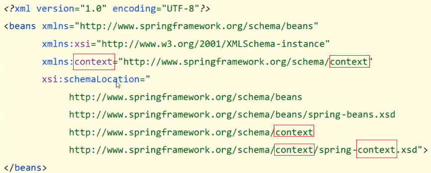

  * 如何加载properties配置文件

    ```xml
    <context:property-placeholder location="" system-properties-mode="NEVER"/>
    ```

  * 如何在applicationContext.xml引入properties配置文件中的值

    ```
    ${key}
    ```


## 6. 核心容器

学习容器的相关知识:

* 如何创建容器?
* 创建好容器后，如何从容器中获取bean对象?
* 容器类的层次结构是什么?
* BeanFactory是什么?


### 6.1 环境准备

准备下案例环境:

* 创建一个Maven项目

* pom.xml添加Spring的依赖

  ```xml
  <dependencies>
      <dependency>
          <groupId>org.springframework</groupId>
          <artifactId>spring-context</artifactId>
          <version>5.2.10.RELEASE</version>
      </dependency>
  </dependencies>
  ```

* resources下添加applicationContext.xml

  ```xml
  <?xml version="1.0" encoding="UTF-8"?>
  <beans xmlns="http://www.springframework.org/schema/beans"
         xmlns:xsi="http://www.w3.org/2001/XMLSchema-instance"
         xsi:schemaLocation="
              http://www.springframework.org/schema/beans http://www.springframework.org/schema/beans/spring-beans.xsd">
      <bean id="bookDao" class="com.goes.dao.impl.BookDaoImpl"/>
  </beans>
  ```

* 添加BookDao和BookDaoImpl类

  ```java
  public interface BookDao {
      public void save();
  }
  public class BookDaoImpl implements BookDao {
      public void save() {
          System.out.println("book dao save ..." );
      }
  }
  ```

* 创建运行类App

  ```java
  public class App {
      public static void main(String[] args) {
          ApplicationContext ctx = new ClassPathXmlApplicationContext("applicationContext.xml");
          BookDao bookDao = (BookDao) ctx.getBean("bookDao");
          bookDao.save();
      }
  }
  ```


### 6.2 容器

#### 6.2.1 容器的创建方式

案例中创建`ApplicationContext`的方式为：类路径下的XML配置文件

```java
ApplicationContext ctx = new ClassPathXmlApplicationContext("applicationContext.xml");
```

Spring还提供另外一种创建方式为：文件系统下的XML配置文件

```java
ApplicationContext ctx = new FileSystemXmlApplicationContext("applicationContext.xml");
```

使用这种方式，运行，会出现如下错误:

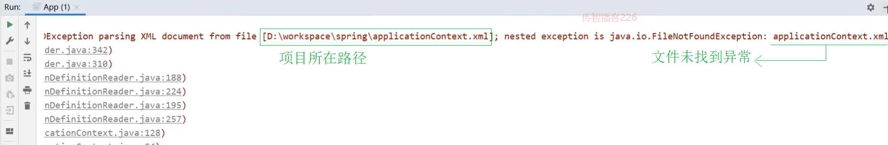

从错误信息中能发现，此方式是从项目路径下开始查找`applicationContext.xml`配置文件的，所以需要将其修改为:

```java
ApplicationContext ctx = new FileSystemXmlApplicationContext("D:\\workspace\\spring\\spring_10_container\\src\\main\\resources\\applicationContext.xml"); 
```

**说明:**此方式虽能实现，但是当项目的位置发生变化后,代码也需要跟着改,耦合度较高,不推荐使用。


#### 6.2.2 Bean的三种获取方式

方式一：目前案例中获取的方式

```java
BookDao bookDao = (BookDao) ctx.getBean("bookDao");
```

方式二：方式可以解决类型强转问题

```java
BookDao bookDao = ctx.getBean("bookDao"，BookDao.class);
```

方式三：按类型注入（必须要确保IOC容器中该类型对应的bean对象只能有一个）

```java
BookDao bookDao = ctx.getBean(BookDao.class);
```


#### 6.2.3 容器类层次结构

(1)在IDEA中双击`shift`,输入BeanFactory


(2)点击进入BeanFactory类，ctrl+h,就能查看到如下结构的层次关系


#### 6.2.4 BeanFactory的使用

使用BeanFactory来创建IOC容器的具体实现方式为:

```java
public class AppForBeanFactory {
    public static void main(String[] args) {
        Resource resources = new ClassPathResource("applicationContext.xml");
        BeanFactory bf = new XmlBeanFactory(resources);
        BookDao bookDao = bf.getBean(BookDao.class);
        bookDao.save();
    }
}
```

为了更好的看出`BeanFactory`和`ApplicationContext`之间的区别，在BookDaoImpl添加如下构造函数:

```java
public class BookDaoImpl implements BookDao {
    public BookDaoImpl() {
        System.out.println("constructor");
    }
    public void save() {
        System.out.println("book dao save ..." );
    }
}
```

如果不去获取bean对象，打印会发现：

* BeanFactory是延迟加载，只有在获取bean对象的时候才会去创建

* ApplicationContext是立即加载，容器加载的时候就会创建bean对象

* ApplicationContext要想成为延迟加载，只需要按照如下方式进行配置

  ```xml
  <?xml version="1.0" encoding="UTF-8"?>
  <beans xmlns="http://www.springframework.org/schema/beans"
         xmlns:xsi="http://www.w3.org/2001/XMLSchema-instance"
         xsi:schemaLocation="
              http://www.springframework.org/schema/beans http://www.springframework.org/schema/beans/spring-beans.xsd">
      <bean id="bookDao" class="com.goes.dao.impl.BookDaoImpl"  lazy-init="true"/>
  </beans>
  ```

**小结**

这一节中所讲的知识点包括:

* 容器创建的两种方式

  * ClassPathXmlApplicationContext[掌握]
  * FileSystemXmlApplicationContext[知道即可]

* 获取Bean的三种方式

  * getBean("名称"):需要类型转换
  * getBean("名称",类型.class):多了一个参数
  * getBean(类型.class):容器中不能有多个该类的bean对象

  上述三种方式，各有各的优缺点，用哪个都可以。

* 容器类层次结构

  * 只需要知晓容器的最上级的父接口为 BeanFactory即可

* BeanFactory

  * 使用BeanFactory创建的容器是延迟加载
  * 使用ApplicationContext创建的容器是立即加载
  * 具体BeanFactory如何创建只需要了解即可。


### 6.3 核心容器总结

#### 6.3.1 容器相关

- BeanFactory是IoC容器的顶层接口，初始化BeanFactory对象时，加载的bean延迟加载
- ApplicationContext接口是Spring容器的核心接口，初始化时bean立即加载
- ApplicationContext接口提供基础的bean操作相关方法，通过其他接口扩展其功能
- ApplicationContext接口常用初始化类
  - **ClassPathXmlApplicationContext(常用)**
  - FileSystemXmlApplicationContext


#### 6.3.2 bean相关


#### 6.3.3 依赖注入相关


## 7. IOC/DI注解开发

Spring的IOC/DI对应的配置开发就已经讲解完成，但是使用起来相对来说还是比较复杂的，复杂的地方在==配置文件==。

前面咱们聊Spring的时候说过，Spring可以简化代码的开发，到现在并没有体会到。

所以Spring到底是如何简化代码开发的呢?

要想真正简化开发，就需要用到Spring的注解开发，Spring对注解支持的版本历程:

* 2.0版开始支持注解
* 2.5版注解功能趋于完善
* 3.0版支持纯注解开发

关于注解开发，我们会讲解两块内容`注解开发定义bean`和`纯注解开发`。

注解开发定义bean用的是2.5版提供的注解，纯注解开发用的是3.0版提供的注解。

### 7.1 环境准备

在学习注解开发之前，先来准备下案例环境:

- 创建一个Maven项目

- pom.xml添加Spring的依赖

  ```xml
  <dependencies>
      <dependency>
          <groupId>org.springframework</groupId>
          <artifactId>spring-context</artifactId>
          <version>5.2.10.RELEASE</version>
      </dependency>
  </dependencies>
  ```

- resources下添加applicationContext.xml

  ```xml
  <?xml version="1.0" encoding="UTF-8"?>
  <beans xmlns="http://www.springframework.org/schema/beans"
         xmlns:xsi="http://www.w3.org/2001/XMLSchema-instance"
         xsi:schemaLocation="
              http://www.springframework.org/schema/beans http://www.springframework.org/schema/beans/spring-beans.xsd">
      <bean id="bookDao" class="com.goes.dao.impl.BookDaoImpl"/>
  </beans>
  ```

- 添加BookDao、BookDaoImpl、BookService、BookServiceImpl类

  ```java
  public interface BookDao {
      public void save();
  }
  public class BookDaoImpl implements BookDao {
      public void save() {
          System.out.println("book dao save ..." );
      }
  }
  public interface BookService {
      public void save();
  }
  
  public class BookServiceImpl implements BookService {
      public void save() {
          System.out.println("book service save ...");
      }
  }
  
  ```

- 创建运行类App

  ```java
  public class App {
      public static void main(String[] args) {
          ApplicationContext ctx = new ClassPathXmlApplicationContext("applicationContext.xml");
          BookDao bookDao = (BookDao) ctx.getBean("bookDao");
          bookDao.save();
      }
  }
  ```

项目结构如下:

- src
  - main
    - java
      - com.goes
    - resources
      - applicationContext.xml

### 7.2 注解开发定义bean

#### 步骤1:删除原XML配置

将配置文件中的`<bean>`标签删除掉

```xml
<bean id="bookDao" class="com.goes.dao.impl.BookDaoImpl"/>
```

#### 步骤2:Dao上添加注解

在BookDaoImpl类上添加`@Component`注解

```java
@Component("bookDao")
public class BookDaoImpl implements BookDao {
    public void save() {
        System.out.println("book dao save ..." );
    }
}
```

注意:@Component注解不可以添加在接口上，因为接口是无法创建对象的。

#### 步骤3:配置Spring的注解包扫描

为了让Spring框架能够扫描到写在类上的注解，需要在配置文件上进行包扫描

```xml
<?xml version="1.0" encoding="UTF-8"?>
<beans xmlns="http://www.springframework.org/schema/beans"
       xmlns:xsi="http://www.w3.org/2001/XMLSchema-instance"
       xsi:schemaLocation="
            http://www.springframework.org/schema/beans http://www.springframework.org/schema/beans/spring-beans.xsd">
    <context:component-scan base-package="com.goes"/>
</beans>
```

**说明:**

component-scan

* component:组件,Spring将管理的bean视作自己的一个组件
* scan:扫描

base-package指定Spring框架扫描的包路径，它会扫描指定包及其子包中的所有类上的注解。

* 包路径越多[如:com.goes.dao.impl]，扫描的范围越小速度越快
* 包路径越少[如:com.goes],扫描的范围越大速度越慢
* 一般扫描到项目的组织名称即Maven的groupId下[如:com.goes]即可。

#### 步骤4：运行程序

运行`App`类查看打印结果

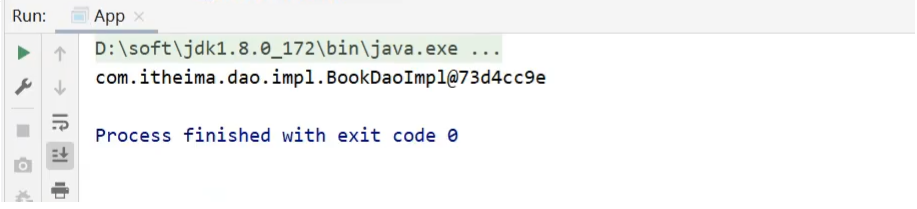

#### 步骤5:Service上添加注解

在BookServiceImpl类上也添加`@Component`交给Spring框架管理

```java
@Component
public class BookServiceImpl implements BookService {
    private BookDao bookDao;

    public void setBookDao(BookDao bookDao) {
        this.bookDao = bookDao;
    }

    public void save() {
        System.out.println("book service save ...");
        bookDao.save();
    }
}
```

#### 步骤6:运行程序

在App类中，从IOC容器中获取BookServiceImpl对应的bean对象，打印

```java
public class App {
    public static void main(String[] args) {
        ApplicationContext ctx = new ClassPathXmlApplicationContext("applicationContext.xml");
        BookDao bookDao = (BookDao) ctx.getBean("bookDao");
        System.out.println(bookDao);
        //按类型获取bean
        BookService bookService = ctx.getBean(BookService.class);
        System.out.println(bookService);
    }
}
```

打印观察结果，两个bean对象都已经打印到控制台


**说明:**

* BookServiceImpl类没有起名称，所以在App中是按照类型来获取bean对象

* @Component注解如果不起名称，会有一个默认值就是`当前类名首字母小写`，所以也可以按照名称获取，如

  ```java
  BookService bookService = (BookService)ctx.getBean("bookServiceImpl");
  System.out.println(bookService);
  ```

对于@Component注解，还衍生出了其他三个注解`@Controller`、`@Service`、`@Repository`

通过查看源码会发现:


这三个注解和@Component注解的作用是一样的，为什么要衍生出这三个呢?

原因：为了区分出该类是属于`表现层`、`业务层`还是`数据层`的类。

#### 知识点1:@Component等

| 名称 | @Component/@Controller/@Service/@Repository |
| ---- | ------------------------------------------- |
| 类型 | 类注解                                      |
| 位置 | 类定义上方                                  |
| 作用 | 设置该类为spring管理的bean                  |
| 属性 | value（默认）：定义bean的id                 |


### 7.3 纯注解开发模式

#### 7.3.1 思路分析

实现思路为：将配置文件applicationContext.xml删除掉，使用类来替换。

#### 7.3.2 实现步骤

##### 步骤1:创建配置类

创建一个配置类`SpringConfig`

```java
public class SpringConfig {
}

```

##### 步骤2:标识该类为配置类

在配置类上添加`@Configuration`注解，将其标识为一个配置类,替换`applicationContext.xml`

```java
@Configuration
public class SpringConfig {
}
```

##### 步骤3:用注解替换包扫描配置

在配置类上添加包扫描注解`@ComponentScan`替换`<context:component-scan base-package=""/>`

```java
@Configuration
@ComponentScan("com.goes")
public class SpringConfig {
}
```

##### 步骤4:创建运行类并执行

创建一个新的运行类`AppForAnnotation`

```java
public class AppForAnnotation {

    public static void main(String[] args) {
        ApplicationContext ctx = new AnnotationConfigApplicationContext(SpringConfig.class);
        BookDao bookDao = (BookDao) ctx.getBean("bookDao");
        System.out.println(bookDao);
        BookService bookService = ctx.getBean(BookService.class);
        System.out.println(bookService);
    }
}
```

运行AppForAnnotation,可以看到两个对象依然被获取成功


主要内容包括:

* Java类替换Spring核心配置文件

* @Configuration注解用于设定当前类为配置类

* @ComponentScan注解用于设定扫描路径，此注解只能添加一次，多个数据请用数组格式

  ```java
  @ComponentScan({"com.goes.service","com.goes.dao"})
  ```

* 读取Spring核心配置文件初始化容器对象切换为读取Java配置类初始化容器对象

  ```java
  //加载配置文件初始化容器
  ApplicationContext ctx = new ClassPathXmlApplicationContext("applicationContext.xml");
  //加载配置类初始化容器
  ApplicationContext ctx = new AnnotationConfigApplicationContext(SpringConfig.class);
  ```

#### 知识点1：@Configuration

| 名称 | @Configuration              |
| ---- | --------------------------- |
| 类型 | 类注解                      |
| 位置 | 类定义上方                  |
| 作用 | 设置该类为spring配置类      |
| 属性 | value（默认）：定义bean的id |

#### 知识点2：@ComponentScan

| 名称 | @ComponentScan                                           |
| ---- | -------------------------------------------------------- |
| 类型 | 类注解                                                   |
| 位置 | 类定义上方                                               |
| 作用 | 设置spring配置类扫描路径，用于加载使用注解格式定义的bean |
| 属性 | value（默认）：扫描路径，此路径可以逐层向下扫描          |

**小结:**

重点掌握使用注解完成Spring的bean管理：

* 记住@Component、@Controller、@Service、@Repository这四个注解
* applicationContext.xml中`<context:component-san/>`的作用是指定扫描包路径，注解为@ComponentScan
* @Configuration标识该类为配置类，使用类替换applicationContext.xml文件
* ClassPathXmlApplicationContext是加载XML配置文件
* AnnotationConfigApplicationContext是加载配置类


### 7.4 注解开发bean作用范围与生命周期管理

使用注解已经完成了bean的管理，接下来按照前面所学习的内容，将通过配置实现的内容都换成对应的注解实现，包含两部分内容:`bean作用范围`和`bean生命周期`。

#### 7.4.1 环境准备

- 创建一个Maven项目

- pom.xml添加Spring的依赖

  ```xml
  <dependencies>
      <dependency>
          <groupId>org.springframework</groupId>
          <artifactId>spring-context</artifactId>
          <version>5.2.10.RELEASE</version>
      </dependency>
  </dependencies>
  ```

- 添加一个配置类`SpringConfig`

  ```java
  @Configuration
  @ComponentScan("com.goes")
  public class SpringConfig {
  }
  ```

- 添加BookDao、BookDaoImpl类

  ```java
  public interface BookDao {
      public void save();
  }
  @Repository
  public class BookDaoImpl implements BookDao {
      public void save() {
          System.out.println("book dao save ..." );
      }
  }
  ```

- 创建运行类App

  ```java
  public class App {
      public static void main(String[] args) {
          AnnotationConfigApplicationContext ctx = new AnnotationConfigApplicationContext(SpringConfig.class);
          BookDao bookDao1 = ctx.getBean(BookDao.class);
          BookDao bookDao2 = ctx.getBean(BookDao.class);
          System.out.println(bookDao1);
          System.out.println(bookDao2);
      }
  }
  ```

最终创建好的项目结构如下:

- src
  - main
    - java
      - com.goes
        - config
        - dao
        - App(启动类)

#### 7.4.2 Bean的作用范围

(1)先运行App类,在控制台打印两个一摸一样的地址，说明默认情况下bean是单例


(2)要想将BookDaoImpl变成非单例，只需要在其类上添加`@scope`注解

```java
@Repository
//@Scope设置bean的作用范围
@Scope("prototype")
public class BookDaoImpl implements BookDao {

    public void save() {
        System.out.println("book dao save ...");
    }
}
```

再次执行App类，打印结果:


##### 知识点1：@Scope

| 名称 | @Scope                                                       |
| ---- | ------------------------------------------------------------ |
| 类型 | 类注解                                                       |
| 位置 | 类定义上方                                                   |
| 作用 | 设置该类创建对象的作用范围<br/>可用于设置创建出的bean是否为单例对象 |
| 属性 | value（默认）：定义bean作用范围，<br/>默认值singleton（单例），可选值prototype（非单例） |


#### 7.4.3 Bean的生命周期

(1)在BookDaoImpl中添加两个方法，`init`和`destroy`,方法名可以任意

```java
@Repository
public class BookDaoImpl implements BookDao {
    public void save() {
        System.out.println("book dao save ...");
    }
    public void init() {
        System.out.println("init ...");
    }
    public void destroy() {
        System.out.println("destroy ...");
    }
}

```

(2)如何对方法进行标识，哪个是初始化方法，哪个是销毁方法?

只需要在对应的方法上添加`@PostConstruct`和`@PreDestroy`注解即可。

```java
@Repository
public class BookDaoImpl implements BookDao {
    public void save() {
        System.out.println("book dao save ...");
    }
    @PostConstruct //在构造方法之后执行，替换 init-method
    public void init() {
        System.out.println("init ...");
    }
    @PreDestroy //在销毁方法之前执行,替换 destroy-method
    public void destroy() {
        System.out.println("destroy ...");
    }
}

```

(3)要想看到两个方法执行，需要注意的是`destroy`只有在容器关闭的时候，才会执行，所以需要修改App的类

```java
public class App {
    public static void main(String[] args) {
        AnnotationConfigApplicationContext ctx = new AnnotationConfigApplicationContext(SpringConfig.class);
        BookDao bookDao1 = ctx.getBean(BookDao.class);
        BookDao bookDao2 = ctx.getBean(BookDao.class);
        System.out.println(bookDao1);
        System.out.println(bookDao2);
        ctx.close(); //关闭容器
    }
}
```

(4)运行App，类查看打印结果，证明init和destroy方法都被执行。

**注意:**@PostConstruct和@PreDestroy注解如果找不到，需要导入下面的jar包

```xml
<dependency>
  <groupId>javax.annotation</groupId>
  <artifactId>javax.annotation-api</artifactId>
  <version>1.3.2</version>
</dependency>
```

找不到的原因是，从JDK9以后jdk中的javax.annotation包被移除了，这两个注解刚好就在这个包中。

##### 知识点1：@PostConstruct

| 名称 | @PostConstruct         |
| ---- | ---------------------- |
| 类型 | 方法注解               |
| 位置 | 方法上                 |
| 作用 | 设置该方法为初始化方法 |
| 属性 | 无                     |

##### 知识点2：@PreDestroy

| 名称 | @PreDestroy          |
| ---- | -------------------- |
| 类型 | 方法注解             |
| 位置 | 方法上               |
| 作用 | 设置该方法为销毁方法 |
| 属性 | 无                   |

**小结**


### 7.5 注解开发依赖注入

#### 7.5.1 环境准备

- 创建一个Maven项目

- pom.xml添加Spring的依赖

  ```xml
  <dependencies>
      <dependency>
          <groupId>org.springframework</groupId>
          <artifactId>spring-context</artifactId>
          <version>5.2.10.RELEASE</version>
      </dependency>
  </dependencies>
  ```

- 添加一个配置类`SpringConfig`

  ```java
  @Configuration
  @ComponentScan("com.goes")
  public class SpringConfig {
  }
  ```

- 添加BookDao、BookDaoImpl、BookService、BookServiceImpl类

  ```java
  public interface BookDao {
      public void save();
  }
  @Repository
  public class BookDaoImpl implements BookDao {
      public void save() {
          System.out.println("book dao save ..." );
      }
  }
  public interface BookService {
      public void save();
  }
  @Service
  public class BookServiceImpl implements BookService {
      private BookDao bookDao;
  	public void setBookDao(BookDao bookDao) {
          this.bookDao = bookDao;
      }
      public void save() {
          System.out.println("book service save ...");
          bookDao.save();
      }
  }
  ```

- 创建运行类App

  ```java
  public class App {
      public static void main(String[] args) {
          AnnotationConfigApplicationContext ctx = new AnnotationConfigApplicationContext(SpringConfig.class);
          BookService bookService = ctx.getBean(BookService.class);
          bookService.save();
      }
  }
  ```

项目结构如下:

- src
  - main
    - java
      - com.goes
        - config
        - dao
          - impl
        - service
          - impl
        - App(启动类)
    - resources

环境准备好后，运行后会发现有问题


出现问题的原因是，在BookServiceImpl类中添加了BookDao的属性，并提供了setter方法，但是目前是没有提供配置注入BookDao的，所以bookDao对象为Null,调用其save方法就会报`控指针异常`。


#### 7.5.2 注解实现按照类型注入

(1) 在BookServiceImpl类的bookDao属性上添加`@Autowired`注解

```java
@Service
public class BookServiceImpl implements BookService {
    @Autowired
    private BookDao bookDao;
    
//	  public void setBookDao(BookDao bookDao) {
//        this.bookDao = bookDao;
//    }
    public void save() {
        System.out.println("book service save ...");
        bookDao.save();
    }
}
```

**注意:**

* @Autowired可以写在属性上，也可也写在setter方法上，最简单的处理方式是`写在属性上并将setter方法删除掉`
* 为什么setter方法可以删除呢?
  * 自动装配基于反射设计创建对象并通过暴力反射为私有属性进行设值
  * 普通反射只能获取public修饰的内容
  * 暴力反射除了获取public修饰的内容还可以获取private修改的内容
  * 所以此处无需提供setter方法

(2)@Autowired是按照类型注入，那么对应BookDao接口如果有多个实现类，比如添加BookDaoImpl2

```java
@Repository
public class BookDaoImpl2 implements BookDao {
    public void save() {
        System.out.println("book dao save ...2");
    }
}
```

此时再次运行App，就会报错


此时，按照类型注入就无法区分到底注入哪个对象，解决方案:`按照名称注入`

* 先给两个Dao类分别起个名称

  ```java
  @Repository("bookDao")
  public class BookDaoImpl implements BookDao {
      public void save() {
          System.out.println("book dao save ..." );
      }
  }
  
  @Repository("bookDao2")
  public class BookDaoImpl2 implements BookDao {
      public void save() {
          System.out.println("book dao save ...2" );
      }
  }
  ```

  此时就可以注入成功，但是得思考个问题: 

  * @Autowired是按照类型注入的，给BookDao的两个实现起了名称，它还是有两个bean对象，为什么不报错?

  * @Autowired默认按照类型自动装配，如果IOC容器中同类的Bean找到多个，就按照变量名和Bean的名称匹配。因为变量名叫`bookDao`而容器中也有一个`booDao`，所以可以成功注入。

  * 分析下面这种情况是否能完成注入呢?

    

  * 不行，因为按照类型会找到多个bean对象，此时会按照`bookDao`名称去找，因为IOC容器只有名称叫`bookDao1`和`bookDao2`,所以找不到，会报`NoUniqueBeanDefinitionException`


#### 7.5.3 注解实现按照名称注入

当根据类型在容器中找到多个bean,注入参数的属性名又和容器中bean的名称不一致，这个时候该如何解决，就需要使用到`@Qualifier`来指定注入哪个名称的bean对象。

```java
@Service
public class BookServiceImpl implements BookService {
    @Autowired
    @Qualifier("bookDao1")
    private BookDao bookDao;
    
    public void save() {
        System.out.println("book service save ...");
        bookDao.save();
    }
}
```

@Qualifier注解后的值就是需要注入的bean的名称。

注意:@Qualifier不能独立使用，必须和@Autowired一起使用


#### 7.5.4 简单数据类型注入

```java
@Repository("bookDao")
public class BookDaoImpl implements BookDao {
    private String name;
    public void save() {
        System.out.println("book dao save ..." + name);
    }
}
```

数据类型换，对应的注解也要跟着换，此次使用`@Value`注解，将值写入注解的参数中就行

```java
@Repository("bookDao")
public class BookDaoImpl implements BookDao {
    @Value("goes")
    private String name;
    public void save() {
        System.out.println("book dao save ..." + name);
    }
}
```


#### 7.5.5 注解读取properties配置文件

`@Value`一般会被用在从properties配置文件中读取内容进行使用，具体如何实现?

##### 步骤1：resource下准备properties文件

jdbc.properties

```properties
name=goes
```

##### 步骤2: 使用注解加载properties配置文件

在配置类上添加`@PropertySource`注解

```java
@Configuration
@ComponentScan("com.goes")
@PropertySource("jdbc.properties")
public class SpringConfig {
}

```

##### 步骤3：使用@Value读取配置文件中的内容

```java
@Repository("bookDao")
public class BookDaoImpl implements BookDao {
    @Value("${name}")
    private String name;
    public void save() {
        System.out.println("book dao save ..." + name);
    }
}
```

##### 步骤4:运行程序

运行App类，查看运行结果，说明配置文件中的内容已经被加载到


**注意:**

* 如果读取的properties配置文件有多个，可以使用`@PropertySource`的属性来指定多个

  ```java
  @PropertySource({"jdbc.properties","xxx.properties"})
  ```

* `@PropertySource`注解属性中不支持使用通配符`*`,运行会报错

  ```java
  @PropertySource({"*.properties"})
  ```

* `@PropertySource`注解属性中可以把`classpath:`加上,代表从当前项目的根路径找文件

  ```java
  @PropertySource({"classpath:jdbc.properties"})
  ```


#### 知识点1：@Autowired


| 名称 | @Autowired                                                   |
| ---- | ------------------------------------------------------------ |
| 类型 | 属性注解  或  方法注解（了解）  或  方法形参注解（了解）     |
| 位置 | 属性定义上方  或  标准set方法上方  或  类set方法上方  或  方法形参前面 |
| 作用 | 为引用类型属性设置值                                         |
| 属性 | required：true/false，定义该属性是否允许为null               |

#### 知识点2：@Qualifier

| 名称 | @Qualifier                                           |
| ---- | ---------------------------------------------------- |
| 类型 | 属性注解  或  方法注解（了解）                       |
| 位置 | 属性定义上方  或  标准set方法上方  或  类set方法上方 |
| 作用 | 为引用类型属性指定注入的beanId                       |
| 属性 | value（默认）：设置注入的beanId                      |

#### 知识点3：@Value

| 名称 | @Value                                               |
| ---- | ---------------------------------------------------- |
| 类型 | 属性注解  或  方法注解（了解）                       |
| 位置 | 属性定义上方  或  标准set方法上方  或  类set方法上方 |
| 作用 | 为  基本数据类型  或  字符串类型  属性设置值         |
| 属性 | value（默认）：要注入的属性值                        |

#### 知识点4：@PropertySource

| 名称 | @PropertySource                                              |
| ---- | ------------------------------------------------------------ |
| 类型 | 类注解                                                       |
| 位置 | 类定义上方                                                   |
| 作用 | 加载properties文件中的属性值                                 |
| 属性 | value（默认）：设置加载的properties文件对应的文件名或文件名组成的数组 |


## 8. IOC/DI注解开发管理第三方bean

### 8.1 环境准备

学习@Bean注解之前先来准备环境:

- 创建一个Maven项目

- pom.xml添加Spring的依赖

  ```xml
  <dependencies>
      <dependency>
          <groupId>org.springframework</groupId>
          <artifactId>spring-context</artifactId>
          <version>5.2.10.RELEASE</version>
      </dependency>
  </dependencies>
  ```

- 添加一个配置类`SpringConfig`

  ```java
  @Configuration
  public class SpringConfig {
  }
  ```

- 添加BookDao、BookDaoImpl类

  ```java
  public interface BookDao {
      public void save();
  }
  @Repository
  public class BookDaoImpl implements BookDao {
      public void save() {
          System.out.println("book dao save ..." );
      }
  }
  ```

- 创建运行类App

  ```java
  public class App {
      public static void main(String[] args) {
          AnnotationConfigApplicationContext ctx = new AnnotationConfigApplicationContext(SpringConfig.class);
      }
  }
  ```

项目结构如下:

- src
  - main
    - java
      - com.goes
        - config
        - dao
          - impl
        - App(启动类)


### 8.2 注解开发管理第三方bean

在上述环境中完成对`Druid`数据源的管理，具体的实现步骤为:

#### 步骤1:导入对应的jar包

```xml
<dependency>
    <groupId>com.alibaba</groupId>
    <artifactId>druid</artifactId>
    <version>1.1.16</version>
</dependency>
```

#### 步骤2:在配置类中添加一个方法

注意该方法的返回值就是要创建的Bean对象类型

```java
@Configuration
public class SpringConfig {
    public DataSource dataSource(){
        DruidDataSource ds = new DruidDataSource();
        ds.setDriverClassName("com.mysql.jdbc.Driver");
        ds.setUrl("jdbc:mysql://localhost:3306/springdb");
        ds.setUsername("root");
        ds.setPassword("root");
        return ds;
    }
}
```

#### 步骤3:在方法上添加`@Bean`注解

@Bean注解的作用是将方法的返回值制作为Spring管理的一个bean对象

```java
@Configuration
public class SpringConfig {
	@Bean
    public DataSource dataSource(){
        DruidDataSource ds = new DruidDataSource();
        ds.setDriverClassName("com.mysql.jdbc.Driver");
        ds.setUrl("jdbc:mysql://localhost:3306/springdb");
        ds.setUsername("root");
        ds.setPassword("root");
        return ds;
    }
}
```

**注意:不能使用`DataSource ds = new DruidDataSource()`** => 原因：DataSource接口中没有对应的setter方法来设置属性。

#### 步骤4:从IOC容器中获取对象并打印

```java
public class App {
    public static void main(String[] args) {
        AnnotationConfigApplicationContext ctx = new AnnotationConfigApplicationContext(SpringConfig.class);
        DataSource dataSource = ctx.getBean(DataSource.class);
        System.out.println(dataSource);
    }
}
```

至此使用@Bean来管理第三方bean的案例就已经完成。

如果有多个bean要被Spring管理，直接在配置类中多些几个方法，方法上添加@Bean注解即可。


### 8.3 引入外部配置类

对于数据源的bean，新建一个`JdbcConfig`配置类，并把数据源配置到该类下。

```java
public class JdbcConfig {
	@Bean
    public DataSource dataSource(){
        DruidDataSource ds = new DruidDataSource();
        ds.setDriverClassName("com.mysql.jdbc.Driver");
        ds.setUrl("jdbc:mysql://localhost:3306/springdb");
        ds.setUsername("root");
        ds.setPassword("root");
        return ds;
    }
}
```

该配置类如何能被Spring配置类加载到，并创建DataSource对象在IOC容器中?

#### 4.3.1 使用包扫描引入

##### 步骤1:在Spring的配置类上添加包扫描

```java
@Configuration
@ComponentScan("com.goes.config")
public class SpringConfig {
	
}
```

##### 步骤2:在JdbcConfig上添加配置注解

JdbcConfig类要放入到`com.goes.config`包下，需要被Spring的配置类扫描到即可

```java
@Configuration
public class JdbcConfig {
	@Bean
    public DataSource dataSource(){
        DruidDataSource ds = new DruidDataSource();
        ds.setDriverClassName("com.mysql.jdbc.Driver");
        ds.setUrl("jdbc:mysql://localhost:3306/springdb");
        ds.setUsername("root");
        ds.setPassword("root");
        return ds;
    }
}
```

##### 步骤3:运行程序

依然能获取到bean对象并打印控制台。此方式虽然能够扫描到，但是不能很快的知晓都引入哪些配置类，因此该方式不推荐使用。


#### 8.3.2 使用`@Import`引入

##### 步骤1:去除JdbcConfig类上的注解

```java
public class JdbcConfig {
	@Bean
    public DataSource dataSource(){
        DruidDataSource ds = new DruidDataSource();
        ds.setDriverClassName("com.mysql.jdbc.Driver");
        ds.setUrl("jdbc:mysql://localhost:3306/springdb");
        ds.setUsername("root");
        ds.setPassword("root");
        return ds;
    }
}
```

##### 步骤2:在Spring配置类中引入

```java
@Configuration
//@ComponentScan("com.goes.config")
@Import({JdbcConfig.class})
public class SpringConfig {
	
}
```

**注意:**

* 扫描注解可以移除

* @Import参数需要的是一个数组，可以引入多个配置类。

* @Import注解在配置类中只能写一次，下面的方式是不允许的

  ```java
  @Configuration
  //@ComponentScan("com.goes.config")
  @Import(JdbcConfig.class)
  @Import(Xxx.class)
  public class SpringConfig {
  	
  }
  ```

##### 步骤3:运行程序

依然能获取到bean对象并打印控制台


### 知识点1：@Bean

| 名称 | @Bean                                  |
| ---- | -------------------------------------- |
| 类型 | 方法注解                               |
| 位置 | 方法定义上方                           |
| 作用 | 设置该方法的返回值作为spring管理的bean |
| 属性 | value（默认）：定义bean的id            |

### 知识点2：@Import

| 名称 | @Import                                                      |
| ---- | ------------------------------------------------------------ |
| 类型 | 类注解                                                       |
| 位置 | 类定义上方                                                   |
| 作用 | 导入配置类                                                   |
| 属性 | value（默认）：定义导入的配置类类名，<br/>当配置类有多个时使用数组格式一次性导入多个配置类 |


### 8.4 注解开发实现为第三方bean注入资源

在使用@Bean创建bean对象的时候，如果方法在创建的过程中需要其他资源该怎么办?

这些资源会有两大类，分别是`简单数据类型` 和`引用数据类型`。

#### 8.4.1 简单数据类型

##### 8.4.1.1 需求分析

对于下面代码关于数据库的四要素不应该写死在代码中，应该是从properties配置文件中读取。如何来优化下面的代码?

```java
public class JdbcConfig {
	@Bean
    public DataSource dataSource(){
        DruidDataSource ds = new DruidDataSource();
        ds.setDriverClassName("com.mysql.jdbc.Driver");
        ds.setUrl("jdbc:mysql://localhost:3306/springdb");
        ds.setUsername("root");
        ds.setPassword("root");
        return ds;
    }
}
```

##### 8.4.1.2 注入简单数据类型步骤

###### 步骤1:类中提供四个属性

```java
public class JdbcConfig {
    private String driver;
    private String url;
    private String userName;
    private String password;
	@Bean
    public DataSource dataSource(){
        DruidDataSource ds = new DruidDataSource();
        ds.setDriverClassName("com.mysql.jdbc.Driver");
        ds.setUrl("jdbc:mysql://localhost:3306/springdb");
        ds.setUsername("root");
        ds.setPassword("root");
        return ds;
    }
}
```

###### 步骤2:使用`@Value`注解引入值

```java
public class JdbcConfig {
    @Value("com.mysql.jdbc.Driver")
    private String driver;
    @Value("jdbc:mysql://localhost:3306/springdb")
    private String url;
    @Value("root")
    private String userName;
    @Value("password")
    private String password;
	@Bean
    public DataSource dataSource(){
        DruidDataSource ds = new DruidDataSource();
        ds.setDriverClassName(driver);
        ds.setUrl(url);
        ds.setUsername(userName);
        ds.setPassword(password);
        return ds;
    }
}
```

###### 扩展

现在的数据库连接四要素还是写在代码中，需要做的是将这些内容提取到jdbc.properties配置文件，思考下该如何实现?

> 1.resources目录下添加jdbc.properties
>
> 2.配置文件中提供四个键值对分别是数据库的四要素
>
> 3.使用@PropertySource加载jdbc.properties配置文件
>
> 4.修改@Value注解属性的值，将其修改为`${key}`，key就是键值对中的键的值


#### 8.4.2 引用数据类型

##### 8.4.2.1 需求分析 

假设在构建DataSource对象的时候，需要用到BookDao对象，该如何把BookDao对象注入进方法内让其使用呢?

```java
public class JdbcConfig {
	@Bean
    public DataSource dataSource(){
        DruidDataSource ds = new DruidDataSource();
        ds.setDriverClassName("com.mysql.jdbc.Driver");
        ds.setUrl("jdbc:mysql://localhost:3306/springdb");
        ds.setUsername("root");
        ds.setPassword("root");
        return ds;
    }
}
```

##### 8.4.2.2 注入引用数据类型步骤

###### 步骤1:在SpringConfig中扫描BookDao

扫描的目的是让Spring能管理到BookDao,也就是说要让IOC容器中有一个bookDao对象

```java
@Configuration
@ComponentScan("com.goes.dao")
@Import({JdbcConfig.class})
public class SpringConfig {
}
```

###### 步骤2:在JdbcConfig类的方法上添加参数

```java
@Bean
public DataSource dataSource(BookDao bookDao){
    System.out.println(bookDao);
    DruidDataSource ds = new DruidDataSource();
    ds.setDriverClassName(driver);
    ds.setUrl(url);
    ds.setUsername(userName);
    ds.setPassword(password);
    return ds;
}
```

引用类型注入只需要为bean定义方法设置形参即可，容器会根据类型自动装配对象。

###### 步骤3:运行程序


## 9. 注解开发总结

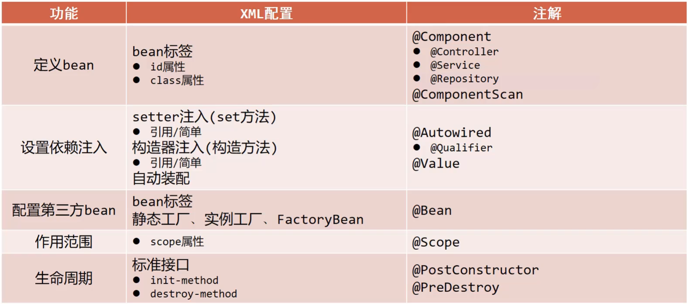


## 10. Spring整合

### 10.1 Spring整合Mybatis思路分析

#### 10.1.1 环境准备

##### 步骤1:准备数据库表

Mybatis是来操作数据库表，所以先创建一个数据库及表

```sql
create database spring_db character set utf8;
use spring_db;
create table tbl_account(
    id int primary key auto_increment,
    name varchar(35),
    money double
);
```

##### 步骤2:创建项目导入jar包

项目的pom.xml添加相关依赖

```xml
<dependencies>
    <dependency>
        <groupId>org.springframework</groupId>
        <artifactId>spring-context</artifactId>
        <version>5.2.10.RELEASE</version>
    </dependency>
    <dependency>
        <groupId>com.alibaba</groupId>
        <artifactId>druid</artifactId>
        <version>1.1.16</version>
    </dependency>
    <dependency>
        <groupId>org.mybatis</groupId>
        <artifactId>mybatis</artifactId>
        <version>3.5.6</version>
    </dependency>
    <dependency>
        <groupId>mysql</groupId>
        <artifactId>mysql-connector-java</artifactId>
        <version>5.1.47</version>
    </dependency>
</dependencies>
```

##### 步骤3:根据表创建模型类

```java
public class Account implements Serializable {

    private Integer id;
    private String name;
    private Double money;
	//setter...getter...toString...方法略    
}
```

##### 步骤4:创建Dao接口

```java
public interface AccountDao {

    @Insert("insert into tbl_account(name,money)values(#{name},#{money})")
    void save(Account account);

    @Delete("delete from tbl_account where id = #{id} ")
    void delete(Integer id);

    @Update("update tbl_account set name = #{name} , money = #{money} where id = #{id} ")
    void update(Account account);

    @Select("select * from tbl_account")
    List<Account> findAll();

    @Select("select * from tbl_account where id = #{id} ")
    Account findById(Integer id);
}
```

##### 步骤5:创建Service接口和实现类

```java
public interface AccountService {

    void save(Account account);

    void delete(Integer id);

    void update(Account account);

    List<Account> findAll();

    Account findById(Integer id);

}

@Service
public class AccountServiceImpl implements AccountService {

    @Autowired
    private AccountDao accountDao;

    public void save(Account account) {
        accountDao.save(account);
    }

    public void update(Account account){
        accountDao.update(account);
    }

    public void delete(Integer id) {
        accountDao.delete(id);
    }

    public Account findById(Integer id) {
        return accountDao.findById(id);
    }

    public List<Account> findAll() {
        return accountDao.findAll();
    }
}
```

##### 步骤6:添加jdbc.properties文件

resources目录下添加，用于配置数据库连接四要素

```properties
jdbc.driver=com.mysql.jdbc.Driver
jdbc.url=jdbc:mysql://localhost:3306/springdb?useSSL=false
jdbc.username=root
jdbc.password=root
```

useSSL:关闭MySQL的SSL连接

##### 步骤7:添加Mybatis核心配置文件

```xml
<?xml version="1.0" encoding="UTF-8"?>
<!DOCTYPE configuration
        PUBLIC "-//mybatis.org//DTD Config 3.0//EN"
        "http://mybatis.org/dtd/mybatis-3-config.dtd">
<configuration>
    <!--读取外部properties配置文件-->
    <properties resource="jdbc.properties"></properties>
    <!--别名扫描的包路径-->
    <typeAliases>
        <package name="com.goes.domain"/>
    </typeAliases>
    <!--数据源-->
    <environments default="mysql">
        <environment id="mysql">
            <transactionManager type="JDBC"></transactionManager>
            <dataSource type="POOLED">
                <property name="driver" value="${jdbc.driver}"></property>
                <property name="url" value="${jdbc.url}"></property>
                <property name="username" value="${jdbc.username}"></property>
                <property name="password" value="${jdbc.password}"></property>
            </dataSource>
        </environment>
    </environments>
    <!--映射文件扫描包路径-->
    <mappers>
        <package name="com.goes.dao"></package>
    </mappers>
</configuration>
```

##### 步骤8:编写应用程序

```java
public class App {
    public static void main(String[] args) throws IOException {
        // 1. 创建SqlSessionFactoryBuilder对象
        SqlSessionFactoryBuilder sqlSessionFactoryBuilder = new SqlSessionFactoryBuilder();
        // 2. 加载SqlMapConfig.xml配置文件
        InputStream inputStream = Resources.getResourceAsStream("SqlMapConfig.xml");
        // 3. 创建SqlSessionFactory对象
        SqlSessionFactory sqlSessionFactory = sqlSessionFactoryBuilder.build(inputStream);
        // 4. 获取SqlSession
        SqlSession sqlSession = sqlSessionFactory.openSession();
        // 5. 执行SqlSession对象执行查询，获取结果User
        AccountDao accountDao = sqlSession.getMapper(AccountDao.class);

        Account ac = accountDao.findById(1);
        System.out.println(ac);

        // 6. 释放资源
        sqlSession.close();
    }
}
```

##### 步骤9:运行程序


#### 10.1.2 整合思路分析

Mybatis的基础环境我们已经准备好了，接下来就得分析下在上述的内容中，哪些对象可以交给Spring来管理?

* Mybatis程序核心对象分析

  

  从图中可以获取到，真正需要交给Spring管理的是SqlSessionFactory

* 整合Mybatis，就是将Mybatis用到的内容交给Spring管理，分析下配置文件

  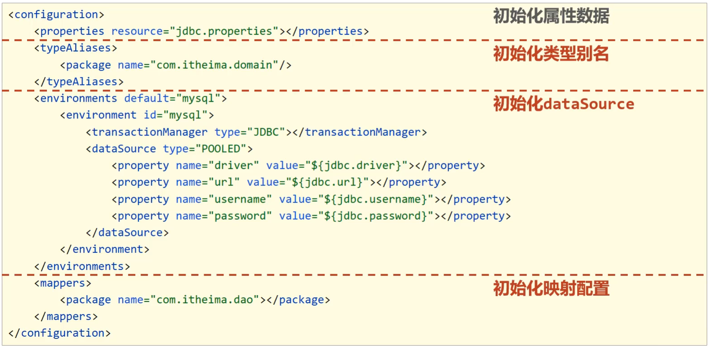

  **说明:**

  * 第一行读取外部properties配置文件，Spring有提供具体的解决方案`@PropertySource`,需要交给Spring
  * 第二行起别名包扫描，为SqlSessionFactory服务的，需要交给Spring
  * 第三行主要用于做连接池，Spring之前我们已经整合了Druid连接池，这块也需要交给Spring
  * 前面三行一起都是为了创建SqlSession对象用的，那么用Spring管理SqlSession对象吗?回忆下SqlSession是由SqlSessionFactory创建出来的，所以只需要将SqlSessionFactory交给Spring管理即可。
  * 第四行是Mapper接口和映射文件[如果使用注解就没有该映射文件]，这个是在获取到SqlSession以后执行具体操作的时候用，所以它和SqlSessionFactory创建的时机都不在同一个时间，可能需要单独管理。


### 10.2 Spring整合Mybatis

分析Spring与Mybatis的整合，大体需要做两件事

- 第一件事是：Spring要管理MyBatis中的SqlSessionFactory
- 第二件事是：Spring要管理Mapper接口的扫描

具体该如何实现，具体的步骤为:

#### 步骤1:项目中导入整合需要的jar包

```xml
<dependency>
    <!--Spring操作数据库需要该jar包-->
    <groupId>org.springframework</groupId>
    <artifactId>spring-jdbc</artifactId>
    <version>5.2.10.RELEASE</version>
</dependency>
<dependency>
    <!--
		Spring与Mybatis整合的jar包
		这个jar包mybatis在前面，是Mybatis提供的
	-->
    <groupId>org.mybatis</groupId>
    <artifactId>mybatis-spring</artifactId>
    <version>1.3.0</version>
</dependency>
```

#### 步骤2:创建Spring的主配置类

```java
//配置类注解
@Configuration
//包扫描，主要扫描的是项目中的AccountServiceImpl类
@ComponentScan("com.goes")
public class SpringConfig {
}

```

#### 步骤3:创建数据源的配置类

在配置类中完成数据源的创建

```java
public class JdbcConfig {
    @Value("${jdbc.driver}")
    private String driver;
    @Value("${jdbc.url}")
    private String url;
    @Value("${jdbc.username}")
    private String userName;
    @Value("${jdbc.password}")
    private String password;

    @Bean
    public DataSource dataSource(){
        DruidDataSource ds = new DruidDataSource();
        ds.setDriverClassName(driver);
        ds.setUrl(url);
        ds.setUsername(userName);
        ds.setPassword(password);
        return ds;
    }
}
```

#### 步骤4:主配置类中读properties并引入数据源配置类

```java
@Configuration
@ComponentScan("com.goes")
@PropertySource("classpath:jdbc.properties")
@Import(JdbcConfig.class)
public class SpringConfig {
}

```

#### 步骤5:创建Mybatis配置类并配置SqlSessionFactory

```java
public class MybatisConfig {
    //定义bean，SqlSessionFactoryBean，用于产生SqlSessionFactory对象
    @Bean
    public SqlSessionFactoryBean sqlSessionFactory(DataSource dataSource){
        SqlSessionFactoryBean ssfb = new SqlSessionFactoryBean();
        //设置模型类的别名扫描
        ssfb.setTypeAliasesPackage("com.goes.domain");
        //设置数据源
        ssfb.setDataSource(dataSource);
        return ssfb;
    }
    //定义bean，返回MapperScannerConfigurer对象
    @Bean
    public MapperScannerConfigurer mapperScannerConfigurer(){
        MapperScannerConfigurer msc = new MapperScannerConfigurer();
        msc.setBasePackage("com.goes.dao");
        return msc;
    }
}
```

**说明:**

* 使用SqlSessionFactoryBean封装SqlSessionFactory需要的环境信息

  * SqlSessionFactoryBean是FactoryBean的一个子类，在该类中将SqlSessionFactory的创建进行封装，简化对象的创建，只需要将其需要的内容设置即可。
  * 方法中有一个参数为dataSource，当前Spring容器中已经创建Druid数据源，类型刚好是DataSource类型，此时在初始化SqlSessionFactoryBean该对象时，发现需要使用DataSource对象，而容器中刚好有这么一个对象，就自动加载DruidDataSource对象。

* 使用MapperScannerConfigurer加载Dao接口，创建代理对象保存到IOC容器中

  * MapperScannerConfigurer对象也是MyBatis提供的专用于整合的jar包中的类，用来处理原始配置文件中的mappers相关配置，加载数据层的Mapper接口类
  * MapperScannerConfigurer有一个核心属性basePackage，就是用来设置所扫描的包路径

#### 步骤6:主配置类中引入Mybatis配置类

```java
@Configuration
@ComponentScan("com.goes")
@PropertySource("classpath:jdbc.properties")
@Import({JdbcConfig.class,MybatisConfig.class})
public class SpringConfig {
}
```

#### 步骤7:编写运行类

在运行类中，从IOC容器中获取Service对象，调用方法获取结果

```java
public class App2 {
    public static void main(String[] args) {
        ApplicationContext ctx = new AnnotationConfigApplicationContext(SpringConfig.class);

        AccountService accountService = ctx.getBean(AccountService.class);

        Account ac = accountService.findById(1);
        System.out.println(ac);
    }
}

```

#### 步骤8:运行程序


支持Spring与Mybatis的整合就已经完成了，其中主要用到的两个类分别是:

* SqlSessionFactoryBean
* MapperScannerConfigurer


### 10.3 Spring整合Junit

Junit是一个搞单元测试用的工具，它不是我们程序的主体，也不会参加最终程序的运行，可看作是一个辅助工具。

#### 10.3.1 环境准备

项目结构如下：

- src
  - main
    - java
      - com.goes
        - config
        - dao
        - domain
        - service
          - impl
        - App(启动类)
    - resources
  - test


#### 10.3.2 整合Junit步骤

##### 步骤1:引入依赖

pom.xml

```xml
<dependency>
    <groupId>junit</groupId>
    <artifactId>junit</artifactId>
    <version>4.12</version>
    <scope>test</scope>
</dependency>

<dependency>
    <groupId>org.springframework</groupId>
    <artifactId>spring-test</artifactId>
    <version>5.2.10.RELEASE</version>
</dependency>
```

##### 步骤2:编写测试类

在test\java下创建一个AccountServiceTest,这个名字任意

```java
//设置类运行器
@RunWith(SpringJUnit4ClassRunner.class)
//设置Spring环境对应的配置类
@ContextConfiguration(classes = {SpringConfiguration.class}) //加载配置类
//@ContextConfiguration(locations={"classpath:applicationContext.xml"})//加载配置文件
public class AccountServiceTest {
    //支持自动装配注入bean
    @Autowired
    private AccountService accountService;
    @Test
    public void testFindById(){
        System.out.println(accountService.findById(1));

    }
    @Test
    public void testFindAll(){
        System.out.println(accountService.findAll());
    }
}
```

**注意:**

* 单元测试，如果测试的是注解配置类，则使用`@ContextConfiguration(classes = 配置类.class)`
* 单元测试，如果测试的是配置文件，则使用`@ContextConfiguration(locations={配置文件名,...})`
* Junit运行后是基于Spring环境运行的，因此Spring提供一个专用的类运行器，并且务必要设置，此类运行器就在Spring的测试专用包中提供的，导入的坐标就是`SpringJUnit4ClassRunner`
* 当需要测试哪个bean时，使用自动装配加载对应的对象，编码与以前做Junit单元测试完全一样

#### 知识点1：@RunWith

| 名称 | @RunWith                          |
| ---- | --------------------------------- |
| 类型 | 测试类注解                        |
| 位置 | 测试类定义上方                    |
| 作用 | 设置JUnit运行器                   |
| 属性 | value（默认）：运行所使用的运行期 |

#### 知识点2：@ContextConfiguration

| 名称 | @ContextConfiguration                                        |
| ---- | ------------------------------------------------------------ |
| 类型 | 测试类注解                                                   |
| 位置 | 测试类定义上方                                               |
| 作用 | 设置JUnit加载的Spring核心配置                                |
| 属性 | classes：核心配置类，可以使用数组的格式设定加载多个配置类<br/>locations:配置文件，可以使用数组的格式设定加载多个配置文件名称 |


# SpringAOP

## 1. AOP简介

对于AOP：AOP是在不改原有代码的前提下对其进行增强。

因此主要学习两方面内容`AOP核心概念`,`AOP作用`:

### 1.1 什么是AOP?

* AOP(Aspect Oriented Programming)面向切面编程，一种编程范式，指导开发者如何组织程序结构。

  > OOP(Object Oriented Programming) 面向对象编程

### 1.2 AOP作用

- 作用:在不惊动原始设计的基础上为其进行功能增强，即代理模式。


### 1.3 AOP核心概念

准备环境：最主要的类为:`BookDaoImpl` => 对`save`方法中有计算万次执行消耗的时间。

```java
@Repository
public class BookDaoImpl implements BookDao {
    public void save() {
        //记录程序当前执行执行（开始时间）
        Long startTime = System.currentTimeMillis();
        //业务执行万次
        for (int i = 0;i<10000;i++) {
            System.out.println("book dao save ...");
        }
        //记录程序当前执行时间（结束时间）
        Long endTime = System.currentTimeMillis();
        //计算时间差
        Long totalTime = endTime-startTime;
        //输出信息
        System.out.println("执行万次消耗时间：" + totalTime + "ms");
    }
    public void update(){
        System.out.println("book dao update ...");
    }
    public void delete(){
        System.out.println("book dao delete ...");
    }
    public void select(){
        System.out.println("book dao select ...");
    }
}
```


当在App类中从容器中获取bookDao对象后，分别执行其`save`,`delete`,`update`和`select`方法后会有如下的打印结果:


这个时候，我们就应该有些疑问?

* 对于计算万次执行消耗的时间只有save方法有，为什么delete和update方法也会有呢?
* delete和update方法有，那什么select方法为什么又没有呢?

这个案例中其实就使用了Spring的AOP，在不惊动(改动)原有设计(代码)的前提下，想给谁添加功能就给谁添加。这个也就是Spring的理念：

* 无入侵式/无侵入式

说了这么多，Spring到底是如何实现的呢?


(1)前面一直在强调，Spring的AOP是对一个类的方法在不进行任何修改的前提下实现增强。对于上面的案例中BookServiceImpl中有`save`,`update`,`delete`和`select`方法,这些方法我们给起了一个名字叫==连接点==

(2)在BookServiceImpl的四个方法中，`update`和`delete`只有打印没有计算万次执行消耗时间，但是在运行的时候已经有该功能，那也就是说`update`和`delete`方法都已经被增强，所以对于需要增强的方法我们给起了一个名字叫==切入点==

(3)执行BookServiceImpl的update和delete方法的时候都被添加了一个计算万次执行消耗时间的功能，将这个功能抽取到一个方法中，换句话说就是存放共性功能的方法，我们给起了个名字叫==通知==

(4)通知是要增强的内容，会有多个，切入点是需要被增强的方法，也会有多个，那哪个切入点需要添加哪个通知，就需要提前将它们之间的关系描述清楚，那么对于通知和切入点之间的关系描述，我们给起了个名字叫==切面==

(5)通知是一个方法，方法不能独立存在需要被写在一个类中，这个类我们也给起了个名字叫==通知类==

至此AOP中的核心概念就已经介绍完了，总结下:

* 连接点(JoinPoint)：程序执行过程中的任意位置，粒度为执行方法、抛出异常、设置变量等
  * 在SpringAOP中，理解为方法的执行
* 切入点(Pointcut):匹配连接点的式子
  * 在SpringAOP中，一个切入点可以描述一个具体方法，也可也匹配多个方法
    * 一个具体的方法:如com.goes.dao包下的BookDao接口中的无形参无返回值的save方法
    * 匹配多个方法:所有的save方法，所有的get开头的方法，所有以Dao结尾的接口中的任意方法，所有带有一个参数的方法
  * 连接点范围要比切入点范围大，是切入点的方法也一定是连接点，但是是连接点的方法就不一定要被增强，所以可能不是切入点。
* 通知(Advice):在切入点处执行的操作，也就是共性功能
  * 在SpringAOP中，功能最终以方法的形式呈现
* 通知类：定义通知的类
* 切面(Aspect):描述通知与切入点的对应关系。

**小结**

这一节中主要讲解了AOP的概念与作用，以及AOP中的核心概念，学完以后大家需要能说出:

* 什么是AOP?
* AOP的作用是什么?
* AOP中核心概念分别指的是什么?
  * 连接点
  * 切入点
  * 通知
  * 通知类
  * 切面

## 2. AOP入门案例

### 2.1 需求分析

案例设定：测算接口执行效率，但是该案例稍微复杂点，对其进行简化。

简化设定：在方法执行前输出当前系统时间。

对于SpringAOP的开发有两种方式，XML 和 注解，应该使用哪个呢?

总结需求为：使用SpringAOP的注解方式完成在方法执行的前打印出当前系统时间。

### 2.2 思路分析

需求明确后，具体该如何实现，都有哪些步骤，我们先来分析下:

> 1.导入坐标(pom.xml)
>
> 2.制作连接点(原始操作，Dao接口与实现类)
>
> 3.制作共性功能(通知类与通知)
>
> 4.定义切入点
>
> 5.绑定切入点与通知关系(切面)

### 2.3 环境准备

* 创建一个Maven项目

* pom.xml添加Spring依赖

  ```xml
  <dependencies>
      <dependency>
          <groupId>org.springframework</groupId>
          <artifactId>spring-context</artifactId>
          <version>5.2.10.RELEASE</version>
      </dependency>
  </dependencies>
  ```

* 添加BookDao和BookDaoImpl类

  ```java
  public interface BookDao {
      public void save();
      public void update();
  }
  
  @Repository
  public class BookDaoImpl implements BookDao {
  
      public void save() {
          System.out.println(System.currentTimeMillis());
          System.out.println("book dao save ...");
      }
  
      public void update(){
          System.out.println("book dao update ...");
      }
  }
  ```

* 创建Spring的配置类

  ```java
  @Configuration
  @ComponentScan("com.goes")
  public class SpringConfig {
  }
  ```

* 编写App运行类

  ```java
  public class App {
      public static void main(String[] args) {
          ApplicationContext ctx = new AnnotationConfigApplicationContext(SpringConfig.class);
          BookDao bookDao = ctx.getBean(BookDao.class);
          bookDao.save();
      }
  }
  ```

项目结构如下:

- src
  - main
    - com.goes
      - config
      - dao
        - impl
      - App(启动类)

**说明:**

* 目前打印save方法的时候，因为方法中有打印系统时间，所以运行的时候是可以看到系统时间
* 对于update方法来说，就没有该功能
* 因此要使用SpringAOP的方式在不改变update方法的前提下让其具有打印系统时间的功能。


### 2.4 AOP实现步骤

#### 步骤1:添加依赖

pom.xml

```xml
<dependency>
    <groupId>org.aspectj</groupId>
    <artifactId>aspectjweaver</artifactId>
    <version>1.9.4</version>
</dependency>
```


* 因为`spring-context`中已经导入`spring-aop`，所以不需要再单独导入`spring-aop`
* 导入AspectJ的jar包，AspectJ是AOP思想的一个具体实现，Spring有自己的AOP实现，但是相比于AspectJ来说比较麻烦，因此直接采用Spring整合ApsectJ的方式进行AOP开发。

#### 步骤2:定义接口与实现类

环境准备的时候，BookDaoImpl已经准备好，不需要做任何修改


#### 步骤3:定义通知类和通知

通知就是将共性功能抽取出来后形成的方法，共性功能指的就是当前系统时间的打印。

```java
public class MyAdvice {
    public void method(){
        System.out.println(System.currentTimeMillis());
    }
}
```


#### 步骤4:定义切入点

BookDaoImpl中有两个方法，分别是save和update，要增强的是update方法，该如何定义呢?

```java
public class MyAdvice {
    @Pointcut("execution(void com.goes.dao.BookDao.update())")
    private void pt(){}
    
    public void method(){
        System.out.println(System.currentTimeMillis());
    }
}
```

**说明:**

* 切入点定义依托一个不具有实际意义的方法进行，即无参数、无返回值、方法体无实际逻辑。
* execution及后面编写的内容，后面会有章节专门去学习。


#### 步骤5:制作切面

切面是用来描述通知和切入点之间的关系，如何进行关系的绑定?

```java
public class MyAdvice {
    @Pointcut("execution(void com.goes.dao.BookDao.update())")
    private void pt(){}
    
    @Before("pt()")
    public void method(){
        System.out.println(System.currentTimeMillis());
    }
}
```

绑定切入点与通知关系，并指定通知添加到原始连接点的具体执行位置

**说明:**@Before翻译过来是之前，也就是说通知会在切入点方法执行之前执行，除此之前还有其他四种类型，后面会讲。


#### 步骤6:将通知类配给容器并标识其为切面类

```java
@Component
@Aspect
public class MyAdvice {
    @Pointcut("execution(void com.goes.dao.BookDao.update())")
    private void pt(){}
    
    @Before("pt()")
    public void method(){
        System.out.println(System.currentTimeMillis());
    }
}
```

#### 步骤7:开启注解格式AOP功能

```java
@Configuration
@ComponentScan("com.goes")
@EnableAspectJAutoProxy
public class SpringConfig {
}
```

#### 步骤8:运行程序

```java
public class App {
    public static void main(String[] args) {
        ApplicationContext ctx = new AnnotationConfigApplicationContext(SpringConfig.class);
        BookDao bookDao = ctx.getBean(BookDao.class);
        bookDao.update();
    }
}
```

看到在执行update方法之前打印了系统时间戳，说明对原始方法进行了增强，AOP编程成功。


### 知识点1：@EnableAspectJAutoProxy  

| 名称 | @EnableAspectJAutoProxy |
| ---- | ----------------------- |
| 类型 | 配置类注解              |
| 位置 | 配置类定义上方          |
| 作用 | 开启注解格式AOP功能     |

### 知识点2：@Aspect

| 名称 | @Aspect               |
| ---- | --------------------- |
| 类型 | 类注解                |
| 位置 | 切面类定义上方        |
| 作用 | 设置当前类为AOP切面类 |

### 知识点3：@Pointcut   

| 名称 | @Pointcut                   |
| ---- | --------------------------- |
| 类型 | 方法注解                    |
| 位置 | 切入点方法定义上方          |
| 作用 | 设置切入点方法              |
| 属性 | value（默认）：切入点表达式 |

### 知识点4：@Before

| 名称 | @Before                                                      |
| ---- | ------------------------------------------------------------ |
| 类型 | 方法注解                                                     |
| 位置 | 通知方法定义上方                                             |
| 作用 | 设置当前通知方法与切入点之间的绑定关系，当前通知方法在原始切入点方法前运行 |


## 3. AOP工作流程

主要讲解两个知识点:`AOP工作流程`和`AOP核心概念`

### 3.1 AOP工作流程

#### 流程1:Spring容器启动

* 容器启动就需要去加载bean,哪些类需要被加载呢?
* 需要被增强的类，如:BookServiceImpl
* 通知类，如:MyAdvice
* 注意此时bean对象还没有创建成功

#### 流程2:读取所有切面配置中的切入点

* 仅仅读取被使用的切入点；没有被使用就不会被读取。


#### 流程3:初始化bean

判定bean对应的类中的方法是否匹配到任意切入点

* 注意刚开始在容器启动的时候，bean对象还没有被创建成功。

* 要被实例化bean对象的类中的方法和切入点进行匹配

  * 匹配失败，创建原始对象,如`UserDao`
    * 匹配失败说明不需要增强，直接调用原始对象的方法即可。
  * 匹配成功，创建原始对象（目标对象）的代理对象,如:`BookDao`
    * 匹配成功说明需要对其进行增强
    * 对哪个类做增强，这个类对应的对象就叫做目标对象
    * 因为要对目标对象进行功能增强，而采用的技术是动态代理，所以会为其创建一个代理对象
    * 最终运行的是代理对象的方法，在该方法中会对原始方法进行功能增强


#### 流程4:获取bean执行方法

* 获取的bean是原始对象时，调用方法并执行，完成操作
* 获取的bean是代理对象时，根据代理对象的运行模式运行原始方法与增强的内容，完成操作


#### 验证容器中是否为代理对象

为了验证IOC容器中创建的对象和我们刚才所说的结论是否一致，首先先把结论理出来:

* 如果目标对象中的方法会被增强，那么容器中将存入的是目标对象的代理对象
* 如果目标对象中的方法不被增强，那么容器中将存入的是目标对象本身。

##### 验证思路

> 1.要执行的方法，不被定义的切入点包含，即不要增强，打印当前类的getClass()方法
>
> 2.要执行的方法，被定义的切入点包含，即要增强，打印出当前类的getClass()方法
>
> 3.观察两次打印的结果

##### 步骤1:修改App类,获取类的类型

```java
public class App {
    public static void main(String[] args) {
        ApplicationContext ctx = new AnnotationConfigApplicationContext(SpringConfig.class);
        BookDao bookDao = ctx.getBean(BookDao.class);
        System.out.println(bookDao);
        System.out.println(bookDao.getClass());
    }
}
```

##### 步骤2:修改MyAdvice类，不增强

因为定义的切入点中，被修改成`update1`,所以BookDao中的update方法在执行的时候，就不会被增强，所以容器中的对象应该是目标对象本身。

```java
@Component
@Aspect
public class MyAdvice {
    @Pointcut("execution(void com.goes.dao.BookDao.update1())")
    private void pt(){}
    
    @Before("pt()")
    public void method(){
        System.out.println(System.currentTimeMillis());
    }
}
```

##### 步骤3:运行程序，查看控制台检验

##### 步骤4:修改MyAdvice类，增强

因为定义的切入点中，被修改成`update`,所以BookDao中的update方法在执行的时候，就会被增强，所以容器中的对象应该是目标对象的代理对象

```java
@Component
@Aspect
public class MyAdvice {
    @Pointcut("execution(void com.goes.dao.BookDao.update())")
    private void pt(){}
    
    @Before("pt()")
    public void method(){
        System.out.println(System.currentTimeMillis());
    }
}
```

##### 步骤5:运行程序，查看控制台检验


### 3.2 AOP核心概念

AOP的工作流程中的两个核心概念，分别是:

* 目标对象(Target)：原始功能去掉共性功能对应的类产生的对象，这种对象是无法直接完成最终工作的
* 代理(Proxy)：目标对象无法直接完成工作，需要对其进行功能回填，通过原始对象的代理对象实现

SpringAOP是在不改变原有设计(代码)的前提下对其进行增强的，它的底层采用的是代理模式实现的，所以要对原始对象进行增强，就需要对原始对象创建代理对象，在代理对象中的方法把通知[如：MyAdvice中的method方法]内容加进去就实现了增强，这就是所说的代理(Proxy)。

**小结**

需掌握的内容：

* 能说出AOP的工作流程
* AOP的核心概念
  * 目标对象、连接点、切入点
  * 通知类、通知
  * 切面
  * 代理
* SpringAOP的本质或者可以说底层实现是通过代理模式。


## 4. AOP配置管理

### 4.1 AOP切入点表达式

对于AOP中切入点表达式需学习三个内容，分别是`语法格式`、`通配符`和`书写技巧`。

#### 4.1.1 语法格式

首先先要明确两个概念:

* 切入点:要进行增强的方法
* 切入点表达式:要进行增强的方法的描述方式

对于切入点的描述，先来看下前面的例子

描述方式一：执行com.goes.dao包下的BookDao接口中的无参数update方法

```java
execution(void com.goes.dao.BookDao.update())
```

描述方式二：执行com.goes.dao.impl包下的BookDaoImpl类中的无参数update方法

```
execution(void com.goes.dao.impl.BookDaoImpl.update())
```

对于切入点表达式的语法为:

* 切入点表达式标准格式：动作关键字(访问修饰符  返回值  包名.类/接口名.方法名(参数) 异常名）

```java
execution(public User com.goes.service.UserService.findById(int))
```

* execution：动作关键字，描述切入点的行为动作，例如execution表示执行到指定切入点
* public:访问修饰符,还可以是public，private等，可以省略
* User：返回值，写返回值类型
* com.goes.service：包名，多级包使用点连接
* UserService:类/接口名称
* findById：方法名
* int:参数，直接写参数的类型，多个类型用逗号隔开
* 异常名：方法定义中抛出指定异常，可以省略


#### 4.1.2 通配符

使用通配符描述切入点，主要的目的就是简化之前的配置，具体都有哪些通配符可以使用?

* `*`:单个独立的任意符号，可以独立出现，也可以作为前缀或者后缀的匹配符出现

  ```java
  execution（public * com.goes.*.UserService.find*(*))
  ```

  匹配com.goes包下的任意包中的UserService类或接口中所有find开头的带有一个参数的方法

* `..`：多个连续的任意符号，可以独立出现，常用于简化包名与参数的书写

  ```java
  execution（public User com..UserService.findById(..))
  ```

  匹配com包下的任意包中的UserService类或接口中所有名称为findById的方法

* `+`：专用于匹配子类类型(一般不使用此方式)

  ```java
  execution(* *..*Service+.*(..))
  ```

  

把案例中使用到的切入点表达式来分析下:

```java
execution(void com.goes.dao.BookDao.update())
匹配接口，能匹配到

execution(void com.goes.dao.impl.BookDaoImpl.update())
匹配实现类，能匹配到

execution(* com.goes.dao.impl.BookDaoImpl.update())
返回值任意，能匹配到

execution(* com.goes.dao.impl.BookDaoImpl.update(*))
返回值任意，但是update方法必须要有一个参数，无法匹配，要想匹配需要在update接口和实现类添加参数

execution(void com.*.*.*.*.update())
返回值为void,com包下的任意包三层包下的任意类的update方法，匹配到的是实现类，能匹配

execution(void com.*.*.*.update())
返回值为void,com包下的任意两层包下的任意类的update方法，匹配到的是接口，能匹配

execution(void *..update())
返回值为void，方法名是update的任意包下的任意类，能匹配

execution(* *..*(..))
匹配项目中任意类的任意方法，能匹配，但是不建议使用这种方式，影响范围广

execution(* *..u*(..))
匹配项目中任意包任意类下只要以u开头的方法，update方法能满足，能匹配

execution(* *..*e(..))
匹配项目中任意包任意类下只要以e结尾的方法，update和save方法能满足，能匹配

execution(void com..*())
返回值为void，com包下的任意包任意类任意方法，能匹配，*代表的是方法

execution(* com.goes.*.*Service.find*(..))
将项目中所有业务层方法的以find开头的方法匹配

execution(* com.goes.*.*Service.save*(..))
将项目中所有业务层方法的以save开头的方法匹配
```


#### 4.1.3 书写技巧

- 所有代码按照标准规范开发，否则以下技巧全部失效
- 描述切入点通**常描述接口**，而不描述实现类,如果描述到实现类，就出现紧耦合了
- 访问控制修饰符针对接口开发均采用public描述（**可省略访问控制修饰符描述**）
- 返回值类型对于增删改类使用精准类型加速匹配，对于查询类使用\*通配快速描述
- **包名**书写**尽量不使用..匹配**，效率过低，常用\*做单个包描述匹配，或精准匹配
- **接口名/类名**书写名称与模块相关的**采用\*匹配**，例如UserService书写成\*Service，绑定业务层接口名
- **方法名**书写以**动词**进行**精准匹配**，名词采用*匹配，例如getById书写成getBy*,selectAll书写成selectAll
- 参数规则较为复杂，根据业务方法灵活调整
- 通常**不使用异常**作为**匹配**规则


### 4.2 AOP通知类型

涉及到如下内容：所代表的含义是将`通知`添加到`切入点`方法执行的前面。


#### 4.2.1 类型介绍

AOP通知：AOP通知描述了抽取的共性功能，根据共性功能抽取的位置不同，最终运行代码时要将其加入到合理的位置

通知具体要添加到切入点的哪里？一共提供了5种通知类型:

- 前置通知
- 后置通知
- **环绕通知(重点)**
- 返回后通知(了解)
- 抛出异常后通知(了解)

为了更好的理解这几种通知类型，请看下图：


1. 前置通知，追加功能到方法执行前，类似于在代码1或者代码2添加内容
2. 后置通知，追加功能到方法执行后，不管方法执行的过程中有没有抛出异常都会执行，类似于在代码5添加内容
3. 返回后通知,追加功能到方法执行后，只有方法正常执行结束后才进行，类似于在代码3添加内容，如果方法执行抛出异常，返回后通知将不会被添加
4. 抛出异常后通知，追加功能到方法抛出异常后，只有方法执行出异常才进行，类似于在代码4添加内容，只有方法抛出异常后才会被添加
5. 环绕通知，环绕通知功能比较强大，它可以追加功能到方法执行的前后，这也是比较常用的方式，它可以实现其他四种通知类型的功能。

#### 4.2.2 环境准备

- 创建一个Maven项目

- pom.xml添加Spring依赖

  ```xml
  <dependencies>
      <dependency>
          <groupId>org.springframework</groupId>
          <artifactId>spring-context</artifactId>
          <version>5.2.10.RELEASE</version>
      </dependency>
      <dependency>
        <groupId>org.aspectj</groupId>
        <artifactId>aspectjweaver</artifactId>
        <version>1.9.4</version>
      </dependency>
  </dependencies>
  ```

- 添加BookDao和BookDaoImpl类

  ```java
  public interface BookDao {
      public void update();
      public int select();
  }
  
  @Repository
  public class BookDaoImpl implements BookDao {
      public void update(){
          System.out.println("book dao update ...");
      }
      public int select() {
          System.out.println("book dao select is running ...");
          return 100;
      }
  }
  ```

- 创建Spring的配置类

  ```java
  @Configuration
  @ComponentScan("com.goes")
  @EnableAspectJAutoProxy
  public class SpringConfig {
  }
  ```

- 创建通知类

  ```java
  @Component
  @Aspect
  public class MyAdvice {
      @Pointcut("execution(void com.goes.dao.BookDao.update())")
      private void pt(){}
  
      public void before() {
          System.out.println("before advice ...");
      }
  
      public void after() {
          System.out.println("after advice ...");
      }
  
      public void around(){
          System.out.println("around before advice ...");
          System.out.println("around after advice ...");
      }
  
      public void afterReturning() {
          System.out.println("afterReturning advice ...");
      }
      
      public void afterThrowing() {
          System.out.println("afterThrowing advice ...");
      }
  }
  ```

- 编写App运行类

  ```java
  public class App {
      public static void main(String[] args) {
          ApplicationContext ctx = new AnnotationConfigApplicationContext(SpringConfig.class);
          BookDao bookDao = ctx.getBean(BookDao.class);
          bookDao.update();
      }
  }
  ```

项目结构如下:

- src
  - main
    - java
      - com.goes
        - aop
        - config
        - dao
          - impl
        - App(启动类)


#### 4.2.3 通知类型的使用

##### 前置通知

修改MyAdvice,在before方法上添加`@Before注解`

```java
@Component
@Aspect
public class MyAdvice {
    @Pointcut("execution(void com.goes.dao.BookDao.update())")
    private void pt(){}
    
    @Before("pt()")
    //此处也可以写成 @Before("MyAdvice.pt()"),不建议
    public void before() {
        System.out.println("before advice ...");
    }
}
```

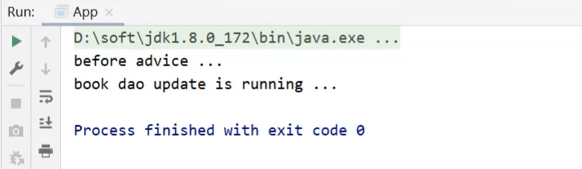

##### 后置通知

```java
@Component
@Aspect
public class MyAdvice {
    @Pointcut("execution(void com.goes.dao.BookDao.update())")
    private void pt(){}
    
    @Before("pt()")
    public void before() {
        System.out.println("before advice ...");
    }
    @After("pt()")
    public void after() {
        System.out.println("after advice ...");
    }
}
```


##### 环绕通知

###### 基本使用

```java
@Component
@Aspect
public class MyAdvice {
    @Pointcut("execution(void com.goes.dao.BookDao.update())")
    private void pt(){}
    
    @Around("pt()")
    public void around(){
        System.out.println("around before advice ...");
        System.out.println("around after advice ...");
    }
}
```

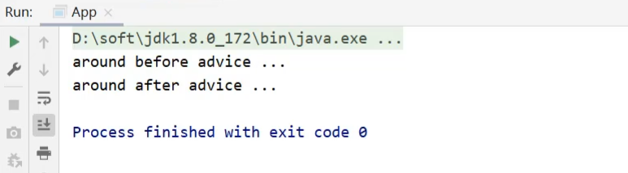

运行结果中，通知的内容打印出来，但是原始方法的内容却没有被执行。

因为环绕通知需要在原始方法的前后进行增强，所以环绕通知就必须要能对原始操作进行调用，具体如何实现?

```java
@Component
@Aspect
public class MyAdvice {
    @Pointcut("execution(void com.goes.dao.BookDao.update())")
    private void pt(){}
    
    @Around("pt()")
    public void around(ProceedingJoinPoint pjp) throws Throwable{
        System.out.println("around before advice ...");
        //表示对原始操作的调用
        pjp.proceed();
        System.out.println("around after advice ...");
    }
}
```

**说明：**proceed()为什么要抛出异常?

原因很简单，看下源码就知道


再次运行，程序可以看到原始方法已经被执行


###### 注意事项

(1)原始方法有返回值的处理

* 修改MyAdvice，对BookDao中的select方法添加环绕通知

```java
@Component
@Aspect
public class MyAdvice {
    @Pointcut("execution(void com.goes.dao.BookDao.update())")
    private void pt(){}
    
    @Pointcut("execution(int com.goes.dao.BookDao.select())")
    private void pt2(){}
    
    @Around("pt2()")
    public void aroundSelect(ProceedingJoinPoint pjp) throws Throwable {
        System.out.println("around before advice ...");
        //表示对原始操作的调用
        pjp.proceed();
        System.out.println("around after advice ...");
    }
}
```

* 修改App类，调用select方法

```java
public class App {
    public static void main(String[] args) {
        ApplicationContext ctx = new AnnotationConfigApplicationContext(SpringConfig.class);
        BookDao bookDao = ctx.getBean(BookDao.class);
        int num = bookDao.select();
        System.out.println(num);
    }
}
```

运行后会报错，错误内容为:

```cmd
Exception in thread "main" org.springframework.aop.AopInvocationException: ==Null return value from advice does not match primitive return type for: public abstract int com.goes.dao.BookDao.select()==
	at org.springframework.aop.framework.JdkDynamicAopProxy.invoke(JdkDynamicAopProxy.java:226)
	at com.sun.proxy.$Proxy19.select(Unknown Source)
	at com.goes.App.main(App.java:12)
```

错误大概的意思是:`空的返回不匹配原始方法的int返回`

* void就是返回Null
* 原始方法就是BookDao下的select方法

因此如果我们使用环绕通知的话，要根据原始方法的返回值来设置环绕通知的返回值，具体解决方案为:

```java
@Component
@Aspect
public class MyAdvice {
    @Pointcut("execution(void com.goes.dao.BookDao.update())")
    private void pt(){}
    
    @Pointcut("execution(int com.goes.dao.BookDao.select())")
    private void pt2(){}
    
    @Around("pt2()")
    public Object aroundSelect(ProceedingJoinPoint pjp) throws Throwable {
        System.out.println("around before advice ...");
        //表示对原始操作的调用
        Object ret = pjp.proceed();
        System.out.println("around after advice ...");
        return ret;
    }
}
```

**说明:**

​	为什么返回的是Object而不是int的主要原因是Object类型更通用。

​	在环绕通知中是可以对原始方法返回值就行修改的。

##### 返回后通知

```java
@Component
@Aspect
public class MyAdvice {
    @Pointcut("execution(void com.goes.dao.BookDao.update())")
    private void pt(){}
    
    @Pointcut("execution(int com.goes.dao.BookDao.select())")
    private void pt2(){}
    
    @AfterReturning("pt2()")
    public void afterReturning() {
        System.out.println("afterReturning advice ...");
    }
}
```

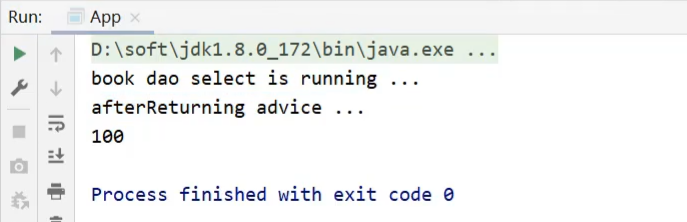

**注意：**返回后通知是需要在原始方法`select`正常执行后才会被执行，如果`select()`方法执行的过程中出现了异常，那么返回后通知是不会被执行。后置通知是不管原始方法有没有抛出异常都会被执行。这个案例大家下去可以自己练习验证下。

##### 异常后通知

```java
@Component
@Aspect
public class MyAdvice {
    @Pointcut("execution(void com.goes.dao.BookDao.update())")
    private void pt(){}
    
    @Pointcut("execution(int com.goes.dao.BookDao.select())")
    private void pt2(){}
    
    @AfterReturning("pt2()")
    public void afterThrowing() {
        System.out.println("afterThrowing advice ...");
    }
}
```


**注意：**异常后通知是需要原始方法抛出异常，可以在`select()`方法中添加一行代码`int i = 1/0`即可。如果没有抛异常，异常后通知将不会被执行。


思考下环绕通知是如何实现其他通知类型的功能的？因为环绕通知是可以控制原始方法执行的，所以把增强的代码写在调用原始方法的不同位置就可以实现不同的通知类型的功能，如:


##### 通知类型总结

###### 知识点1：@After

| 名称 | @After                                                       |
| ---- | ------------------------------------------------------------ |
| 类型 | 方法注解                                                     |
| 位置 | 通知方法定义上方                                             |
| 作用 | 设置当前通知方法与切入点之间的绑定关系，当前通知方法在原始切入点方法后运行 |

###### 知识点2：@AfterReturning  

| 名称 | @AfterReturning                                              |
| ---- | ------------------------------------------------------------ |
| 类型 | 方法注解                                                     |
| 位置 | 通知方法定义上方                                             |
| 作用 | 设置当前通知方法与切入点之间绑定关系，当前通知方法在原始切入点方法正常执行完毕后执行 |

###### 知识点3：@AfterThrowing  

| 名称 | @AfterThrowing                                               |
| ---- | ------------------------------------------------------------ |
| 类型 | 方法注解                                                     |
| 位置 | 通知方法定义上方                                             |
| 作用 | 设置当前通知方法与切入点之间绑定关系，当前通知方法在原始切入点方法运行抛出异常后执行 |

###### 知识点4：@Around

| 名称 | @Around                                                      |
| ---- | ------------------------------------------------------------ |
| 类型 | 方法注解                                                     |
| 位置 | 通知方法定义上方                                             |
| 作用 | 设置当前通知方法与切入点之间的绑定关系，当前通知方法在原始切入点方法前后运行 |

**环绕通知注意事项**

1. 环绕通知必须依赖形参ProceedingJoinPoint才能实现对原始方法的调用，进而实现原始方法调用前后同时添加通知
2. 通知中如果未使用ProceedingJoinPoint对原始方法进行调用将跳过原始方法的执行
3. 对原始方法的调用可以不接收返回值，通知方法设置成void即可，如果接收返回值，最好设定为Object类型
4. 原始方法的返回值如果是void类型，通知方法的返回值类型可以设置成void,也可以设置成Object
5. 由于无法预知原始方法运行后是否会抛出异常，因此环绕通知方法必须要处理Throwable异常


### 4.3 业务层接口执行效率

#### 4.3.1 需求分析

需求:任意业务层接口执行均可显示其执行效率（执行时长）

具体实现的思路:

1. 开始执行方法之前记录一个时间
2. 执行方法
3. 执行完方法之后记录一个时间
4. 用后一个时间减去前一个时间的差值，就是我们需要的结果。

在方法执行的前后添加业务，经过分析将采用`环绕通知`。

**说明:**原始方法如果只执行一次，时间太快，两个时间差可能为0，所以我们要执行万次来计算时间差。

#### 4.3.2 环境准备

- 创建一个Maven项目

- pom.xml添加Spring依赖

  ```xml
  <dependencies>
      <dependency>
        <groupId>org.springframework</groupId>
        <artifactId>spring-context</artifactId>
        <version>5.2.10.RELEASE</version>
      </dependency>
      <dependency>
        <groupId>org.springframework</groupId>
        <artifactId>spring-jdbc</artifactId>
        <version>5.2.10.RELEASE</version>
      </dependency>
      <dependency>
        <groupId>org.springframework</groupId>
        <artifactId>spring-test</artifactId>
        <version>5.2.10.RELEASE</version>
      </dependency>
      <dependency>
        <groupId>org.aspectj</groupId>
        <artifactId>aspectjweaver</artifactId>
        <version>1.9.4</version>
      </dependency>
      <dependency>
        <groupId>mysql</groupId>
        <artifactId>mysql-connector-java</artifactId>
        <version>5.1.47</version>
      </dependency>
      <dependency>
        <groupId>com.alibaba</groupId>
        <artifactId>druid</artifactId>
        <version>1.1.16</version>
      </dependency>
      <dependency>
        <groupId>org.mybatis</groupId>
        <artifactId>mybatis</artifactId>
        <version>3.5.6</version>
      </dependency>
      <dependency>
        <groupId>org.mybatis</groupId>
        <artifactId>mybatis-spring</artifactId>
        <version>1.3.0</version>
      </dependency>
      <dependency>
        <groupId>junit</groupId>
        <artifactId>junit</artifactId>
        <version>4.12</version>
        <scope>test</scope>
      </dependency>
    </dependencies>
  ```

- 添加AccountService、AccountServiceImpl、AccountDao与Account类

  ```java
  public interface AccountService {
      void save(Account account);
      void delete(Integer id);
      void update(Account account);
      List<Account> findAll();
      Account findById(Integer id);
  }
  
  @Service
  public class AccountServiceImpl implements AccountService {
  
      @Autowired
      private AccountDao accountDao;
  
      public void save(Account account) {
          accountDao.save(account);
      }
  
      public void update(Account account){
          accountDao.update(account);
      }
  
      public void delete(Integer id) {
          accountDao.delete(id);
      }
  
      public Account findById(Integer id) {
          return accountDao.findById(id);
      }
  
      public List<Account> findAll() {
          return accountDao.findAll();
      }
  }
  public interface AccountDao {
  
      @Insert("insert into tbl_account(name,money)values(#{name},#{money})")
      void save(Account account);
  
      @Delete("delete from tbl_account where id = #{id} ")
      void delete(Integer id);
  
      @Update("update tbl_account set name = #{name} , money = #{money} where id = #{id} ")
      void update(Account account);
  
      @Select("select * from tbl_account")
      List<Account> findAll();
  
      @Select("select * from tbl_account where id = #{id} ")
      Account findById(Integer id);
  }
  
  public class Account implements Serializable {
  
      private Integer id;
      private String name;
      private Double money;
      //setter..getter..toString方法省略
  }
  ```

- resources下提供一个jdbc.properties

  ```properties
  jdbc.driver=com.mysql.jdbc.Driver
  jdbc.url=jdbc:mysql://localhost:3306/springdb?useSSL=false
  jdbc.username=root
  jdbc.password=root
  ```

- 创建相关配置类

  ```java
  //Spring配置类:SpringConfig
  @Configuration
  @ComponentScan("com.goes")
  @PropertySource("classpath:jdbc.properties")
  @Import({JdbcConfig.class,MybatisConfig.class})
  public class SpringConfig {
  }
  //JdbcConfig配置类
  public class JdbcConfig {
      @Value("${jdbc.driver}")
      private String driver;
      @Value("${jdbc.url}")
      private String url;
      @Value("${jdbc.username}")
      private String userName;
      @Value("${jdbc.password}")
      private String password;
  
      @Bean
      public DataSource dataSource(){
          DruidDataSource ds = new DruidDataSource();
          ds.setDriverClassName(driver);
          ds.setUrl(url);
          ds.setUsername(userName);
          ds.setPassword(password);
          return ds;
      }
  }
  //MybatisConfig配置类
  public class MybatisConfig {
  
      @Bean
      public SqlSessionFactoryBean sqlSessionFactory(DataSource dataSource){
          SqlSessionFactoryBean ssfb = new SqlSessionFactoryBean();
          ssfb.setTypeAliasesPackage("com.goes.domain");
          ssfb.setDataSource(dataSource);
          return ssfb;
      }
  
      @Bean
      public MapperScannerConfigurer mapperScannerConfigurer(){
          MapperScannerConfigurer msc = new MapperScannerConfigurer();
          msc.setBasePackage("com.goes.dao");
          return msc;
      }
  }
  
  ```

- 编写Spring整合Junit的测试类

  ```java
  @RunWith(SpringJUnit4ClassRunner.class)
  @ContextConfiguration(classes = SpringConfig.class)
  public class AccountServiceTestCase {
      @Autowired
      private AccountService accountService;
  
      @Test
      public void testFindById(){
          Account ac = accountService.findById(2);
      }
  
      @Test
      public void testFindAll(){
          List<Account> all = accountService.findAll();
      }
  
  }
  ```

项目结构如下:

- src
  - main
    - java
      - com.goes
        - config
        - dao
        - domain
        - service
          - impl
    - resources
      - jdbc.properties
  - test
    - java
      - com.goes.service


#### 4.3.3 功能开发

##### 步骤1:开启SpringAOP的注解功能

在Spring的主配置文件SpringConfig类中添加注解

```java
@EnableAspectJAutoProxy
```

##### 步骤2:创建AOP的通知类

* 该类要被Spring管理，需要添加@Component

* 要标识该类是一个AOP的切面类，需要添加@Aspect
* 配置切入点表达式，需要添加一个方法，并添加@Pointcut

```java
@Component
@Aspect
public class ProjectAdvice {
    //配置业务层的所有方法
    @Pointcut("execution(* com.goes.service.*Service.*(..))")
    private void servicePt(){}
    
    public void runSpeed(){
        
    } 
}
```

##### 步骤3:添加环绕通知

在runSpeed()方法上添加@Around

```java
@Component
@Aspect
public class ProjectAdvice {
    //配置业务层的所有方法
    @Pointcut("execution(* com.goes.service.*Service.*(..))")
    private void servicePt(){}
    //@Around("ProjectAdvice.servicePt()") 可以简写为下面的方式
    @Around("servicePt()")
    public Object runSpeed(ProceedingJoinPoint pjp){
        Object ret = pjp.proceed();
        return ret;
    } 
}
```

**注意:**目前并没有做任何增强

##### 步骤4:完成核心业务，记录万次执行的时间

```java
@Component
@Aspect
public class ProjectAdvice {
    //配置业务层的所有方法
    @Pointcut("execution(* com.goes.service.*Service.*(..))")
    private void servicePt(){}
    //@Around("ProjectAdvice.servicePt()") 可以简写为下面的方式
    @Around("servicePt()")
    public void runSpeed(ProceedingJoinPoint pjp){
        
        long start = System.currentTimeMillis();
        for (int i = 0; i < 10000; i++) {
           pjp.proceed();
        }
        long end = System.currentTimeMillis();
        System.out.println("业务层接口万次执行时间: "+(end-start)+"ms");
    } 
}
```

##### 步骤5:运行单元测试类


**注意:**因为程序每次执行的时长是不一样的，所以运行多次最终的结果是不一样的。


##### 步骤6:程序优化

目前程序所面临的问题是，多个方法一起执行测试的时候，控制台都打印的是:

`业务层接口万次执行时间:xxxms`

没有办法区分到底是哪个接口的哪个方法执行的具体时间，具体如何优化?

```java
@Component
@Aspect
public class ProjectAdvice {
    //配置业务层的所有方法
    @Pointcut("execution(* com.goes.service.*Service.*(..))")
    private void servicePt(){}
    //@Around("ProjectAdvice.servicePt()") 可以简写为下面的方式
    @Around("servicePt()")
    public void runSpeed(ProceedingJoinPoint pjp){
        //获取执行签名信息
        Signature signature = pjp.getSignature();
        //通过签名获取执行操作名称(接口名)
        String className = signature.getDeclaringTypeName();
        //通过签名获取执行操作名称(方法名)
        String methodName = signature.getName();
        
        long start = System.currentTimeMillis();
        for (int i = 0; i < 10000; i++) {
           pjp.proceed();
        }
        long end = System.currentTimeMillis();
        System.out.println("万次执行："+ className+"."+methodName+"---->" +(end-start) + "ms");
    } 
}
```

##### 步骤7:运行单元测试类

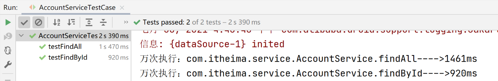


### 4.4 AOP通知获取数据

目前我们写AOP仅仅是在原始方法前后追加一些操作，接下来我们要说说AOP中数据相关的内容，我们将从`获取参数`、`获取返回值`和`获取异常`三个方面来研究切入点的相关信息。

前面我们介绍通知类型的时候总共讲了五种，那么对于这五种类型都会有参数，返回值和异常吗?

我们先来一个个分析下:

* 获取切入点方法的参数，所有的通知类型都可以获取参数
  * JoinPoint：适用于前置、后置、返回后、抛出异常后通知
  * ProceedingJoinPoint：适用于环绕通知
* 获取切入点方法返回值，前置和抛出异常后通知是没有返回值，后置通知可有可无，所以不做研究
  * 返回后通知
  * 环绕通知
* 获取切入点方法运行异常信息，前置和返回后通知是不会有，后置通知可有可无，所以不做研究
  * 抛出异常后通知
  * 环绕通知

#### 4.4.1 环境准备

- 创建一个Maven项目

- pom.xml添加Spring依赖

  ```xml
  <dependencies>
      <dependency>
        <groupId>org.springframework</groupId>
        <artifactId>spring-context</artifactId>
        <version>5.2.10.RELEASE</version>
      </dependency>
      <dependency>
        <groupId>org.aspectj</groupId>
        <artifactId>aspectjweaver</artifactId>
        <version>1.9.4</version>
      </dependency>
    </dependencies>
  ```

- 添加BookDao和BookDaoImpl类

  ```java
  public interface BookDao {
      public String findName(int id);
  }
  @Repository
  public class BookDaoImpl implements BookDao {
  
      public String findName(int id) {
          System.out.println("id:"+id);
          return "itcast";
      }
  }
  ```

- 创建Spring的配置类

  ```java
  @Configuration
  @ComponentScan("com.goes")
  @EnableAspectJAutoProxy
  public class SpringConfig {
  }
  ```

- 编写通知类

  ```java
  @Component
  @Aspect
  public class MyAdvice {
      @Pointcut("execution(* com.goes.dao.BookDao.findName(..))")
      private void pt(){}
  
      @Before("pt()")
      public void before() {
          System.out.println("before advice ..." );
      }
  
      @After("pt()")
      public void after() {
          System.out.println("after advice ...");
      }
  
      @Around("pt()")
      public Object around() throws Throwable{
          Object ret = pjp.proceed();
          return ret;
      }
      @AfterReturning("pt()")
      public void afterReturning() {
          System.out.println("afterReturning advice ...");
      }
  
  
      @AfterThrowing("pt()")
      public void afterThrowing() {
          System.out.println("afterThrowing advice ...");
      }
  }
  ```

- 编写App运行类

  ```java
  public class App {
      public static void main(String[] args) {
          ApplicationContext ctx = new AnnotationConfigApplicationContext(SpringConfig.class);
          BookDao bookDao = ctx.getBean(BookDao.class);
          String name = bookDao.findName(100);
          System.out.println(name);
      }
  }
  ```

项目结构如下:

- src
  - java
    - com.goes
      - aop
      - config
      - dao
        - impl
      - App(启动类)

#### 4.4.2 获取参数

##### 非环绕通知获取方式

在方法上添加JoinPoint,通过JoinPoint来获取参数

```java
@Component
@Aspect
public class MyAdvice {
    @Pointcut("execution(* com.goes.dao.BookDao.findName(..))")
    private void pt(){}

    @Before("pt()")
    public void before(JoinPoint jp) 
        Object[] args = jp.getArgs();
        System.out.println(Arrays.toString(args));
        System.out.println("before advice ..." );
    }
	//...其他的略
}
```

运行App类，可以获取如下内容，说明参数100已经被获取

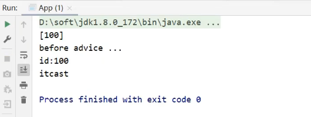

**思考:方法的参数只有一个，为什么获取的是一个数组?**

因为参数的个数是不固定的，所以使用数组更通配些。

如果将参数改成两个会是什么效果呢?

(1)修改BookDao接口和BookDaoImpl实现类

```java
public interface BookDao {
    public String findName(int id,String password);
}
@Repository
public class BookDaoImpl implements BookDao {

    public String findName(int id,String password) {
        System.out.println("id:"+id);
        return "myhikari";
    }
}
```

(2)修改App类，调用方法传入多个参数

```java
public class App {
    public static void main(String[] args) {
        ApplicationContext ctx = new AnnotationConfigApplicationContext(SpringConfig.class);
        BookDao bookDao = ctx.getBean(BookDao.class);
        String name = bookDao.findName(100,"goes");
        System.out.println(name);
    }
}
```

(3)运行App，查看结果,说明两个参数都已经被获取到


**说明:**

使用JoinPoint的方式获取参数适用于`前置`、`后置`、`返回后`、`抛出异常后`通知。剩下的大家自行去验证。

##### 环绕通知获取方式

环绕通知使用的是ProceedingJoinPoint，因为ProceedingJoinPoint是JoinPoint类的子类，所以对于ProceedingJoinPoint类中应该也会有对应的`getArgs()`方法，去验证下:

```java
@Component
@Aspect
public class MyAdvice {
    @Pointcut("execution(* com.goes.dao.BookDao.findName(..))")
    private void pt(){}

    @Around("pt()")
    public Object around(ProceedingJoinPoint pjp)throws Throwable {
        Object[] args = pjp.getArgs();
        System.out.println(Arrays.toString(args));
        Object ret = pjp.proceed();
        return ret;
    }
	//其他的略
}
```

运行App后查看运行结果，说明ProceedingJoinPoint也是可以通过getArgs()获取参数


**注意:**

* pjp.proceed()方法是有两个构造方法，分别是:

  

  * 调用无参数的proceed，当原始方法有参数，会在调用的过程中自动传入参数

  * 所以调用这两个方法的任意一个都可以完成功能

  * 但是当需要修改原始方法的参数时，就只能采用带有参数的方法,如下:

    ```java
    @Component
    @Aspect
    public class MyAdvice {
        @Pointcut("execution(* com.goes.dao.BookDao.findName(..))")
        private void pt(){}
    
        @Around("pt()")
        public Object around(ProceedingJoinPoint pjp) throws Throwable{
            Object[] args = pjp.getArgs();
            System.out.println(Arrays.toString(args));
            args[0] = 666;
            Object ret = pjp.proceed(args);
            return ret;
        }
    	//其他的略
    }
    ```

#### 4.4.3 获取返回值

对于返回值，只有返回后`AfterReturing`和环绕`Around`这两个通知类型可以获取，具体如何获取?

##### 环绕通知获取返回值

```java
@Component
@Aspect
public class MyAdvice {
    @Pointcut("execution(* com.goes.dao.BookDao.findName(..))")
    private void pt(){}

    @Around("pt()")
    public Object around(ProceedingJoinPoint pjp) throws Throwable{
        Object[] args = pjp.getArgs();
        System.out.println(Arrays.toString(args));
        args[0] = 666;
        Object ret = pjp.proceed(args);
        return ret;
    }
	//其他的略
}
```

上述代码中，`ret`就是方法的返回值，是可以直接获取，不但可以获取，如果需要还可以进行修改。

##### 返回后通知获取返回值

```java
@Component
@Aspect
public class MyAdvice {
    @Pointcut("execution(* com.goes.dao.BookDao.findName(..))")
    private void pt(){}

    @AfterReturning(value = "pt()",returning = "ret")
    public void afterReturning(Object ret) {
        System.out.println("afterReturning advice ..."+ret);
    }
	//其他的略
}
```

注意:

(1)参数名的问题


(2)afterReturning方法参数类型的问题

参数类型可以写成String，但是为了能匹配更多的参数类型，建议写成Object类型

(3)afterReturning方法参数的顺序问题

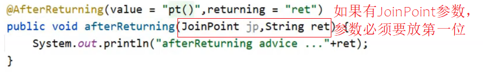

运行App后查看运行结果，说明返回值已经被获取到


#### 4.4.4 获取异常

对于获取抛出的异常，只有抛出异常后`AfterThrowing`和环绕`Around`这两个通知类型可以获取，具体如何获取?

##### 环绕通知获取异常

这块比较简单，以前我们是抛出异常，现在只需要将异常捕获，就可以获取到原始方法的异常信息了

```java
@Component
@Aspect
public class MyAdvice {
    @Pointcut("execution(* com.goes.dao.BookDao.findName(..))")
    private void pt(){}

    @Around("pt()")
    public Object around(ProceedingJoinPoint pjp){
        Object[] args = pjp.getArgs();
        System.out.println(Arrays.toString(args));
        args[0] = 666;
        Object ret = null;
        try{
            ret = pjp.proceed(args);
        }catch(Throwable throwable){
            t.printStackTrace();
        }
        return ret;
    }
	//其他的略
}
```

在catch方法中就可以获取到异常，至于获取到异常以后该如何处理，这个就和你的业务需求有关了。

##### 抛出异常后通知获取异常

```java
@Component
@Aspect
public class MyAdvice {
    @Pointcut("execution(* com.goes.dao.BookDao.findName(..))")
    private void pt(){}

    @AfterThrowing(value = "pt()",throwing = "t")
    public void afterThrowing(Throwable t) {
        System.out.println("afterThrowing advice ..."+t);
    }
	//其他的略
}
```

如何让原始方法抛出异常，方式有很多，

```java
@Repository
public class BookDaoImpl implements BookDao {

    public String findName(int id,String password) {
        System.out.println("id:"+id);
        if(true){
            throw new NullPointerException();
        }
        return "myhikari";
    }
}
```

注意:


运行App后，查看控制台，就能看的异常信息被打印到控制台


### 4.5 百度网盘密码数据兼容处理

#### 4.5.1 需求分析

需求: 对百度网盘分享链接输入密码时尾部多输入的空格做兼容处理。


问题描述:

* 点击链接，会提示，请输入提取码，如下图所示

  

* 当我们从别人发给我们的内容中复制提取码的时候，有时候会多复制到一些空格，直接粘贴到百度的提取码输入框

* 但是百度那边记录的提取码是没有空格的

* 此时如果不做处理，直接对比的话，就会引发提取码不一致，导致无法访问百度盘上的内容

* 所以多输入一个空格可能会导致项目的功能无法正常使用。

* 此时我们就想能不能将输入的参数先帮用户去掉空格再操作呢?

只需要在业务方法执行之前对所有的输入参数进行格式处理——trim()

* 是对所有的参数都需要去除空格么? => 一般只需要针对字符串处理即可。

* 以后涉及到需要去除前后空格的业务可能会有很多，这个去空格的代码是每个业务都写么? => 可以考虑使用AOP来统一处理。

* AOP有五种通知类型，该使用哪种呢? => 需求是将原始方法的参数处理后在参与原始方法的调用，能做这件事的就只有环绕通知。

综上所述，我们需要考虑两件事:
①：在业务方法执行之前对所有的输入参数进行格式处理——trim()
②：使用处理后的参数调用原始方法——环绕通知中存在对原始方法的调用

#### 4.5.2 环境准备

- 创建一个Maven项目

- pom.xml添加Spring依赖

  ```xml
  <dependencies>
      <dependency>
        <groupId>org.springframework</groupId>
        <artifactId>spring-context</artifactId>
        <version>5.2.10.RELEASE</version>
      </dependency>
      <dependency>
        <groupId>org.aspectj</groupId>
        <artifactId>aspectjweaver</artifactId>
        <version>1.9.4</version>
      </dependency>
    </dependencies>
  ```

- 添加ResourcesService，ResourcesServiceImpl,ResourcesDao和ResourcesDaoImpl类

  ```java
  public interface ResourcesDao {
      boolean readResources(String url, String password);
  }
  @Repository
  public class ResourcesDaoImpl implements ResourcesDao {
      public boolean readResources(String url, String password) {
          //模拟校验
          return password.equals("root");
      }
  }
  public interface ResourcesService {
      public boolean openURL(String url ,String password);
  }
  @Service
  public class ResourcesServiceImpl implements ResourcesService {
      @Autowired
      private ResourcesDao resourcesDao;
  
      public boolean openURL(String url, String password) {
          return resourcesDao.readResources(url,password);
      }
  }
  
  ```

- 创建Spring的配置类

  ```java
  @Configuration
  @ComponentScan("com.goes")
  public class SpringConfig {
  }
  ```

- 编写App运行类

  ```java
  public class App {
      public static void main(String[] args) {
          ApplicationContext ctx = new AnnotationConfigApplicationContext(SpringConfig.class);
          ResourcesService resourcesService = ctx.getBean(ResourcesService.class);
          boolean flag = resourcesService.openURL("http://pan.baidu.com/haha", "root");
          System.out.println(flag);
      }
  }
  ```

项目结构如下:

- src
  - main
    - java
      - com.goes
        - config
        - dao
          - impl
        - service
          - impl

现在项目的效果是，当输入密码为"root"控制台打印为true,如果密码改为"root  "控制台打印的是false

需求是使用AOP将参数进行统一处理，不管输入的密码`root`前后包含多少个空格，最终控制台打印的都是true。

#### 4.5.3 具体实现

##### 步骤1:开启SpringAOP的注解功能

```java
@Configuration
@ComponentScan("com.goes")
@EnableAspectJAutoProxy
public class SpringConfig {
}
```

##### 步骤2:编写通知类

```java
@Component
@Aspect
public class DataAdvice {
    @Pointcut("execution(boolean com.goes.service.*Service.*(*,*))")
    private void servicePt(){}
    
}
```

##### 步骤3:添加环绕通知

```java
@Component
@Aspect
public class DataAdvice {
    @Pointcut("execution(boolean com.goes.service.*Service.*(*,*))")
    private void servicePt(){}
    
    @Around("DataAdvice.servicePt()")
    // @Around("servicePt()")这两种写法都对
    public Object trimStr(ProceedingJoinPoint pjp) throws Throwable {
        Object ret = pjp.proceed();
        return ret;
    }
    
}
```

##### 步骤4:完成核心业务，处理参数中的空格

```java
@Component
@Aspect
public class DataAdvice {
    @Pointcut("execution(boolean com.goes.service.*Service.*(*,*))")
    private void servicePt(){}
    
    @Around("DataAdvice.servicePt()")
    // @Around("servicePt()")这两种写法都对
    public Object trimStr(ProceedingJoinPoint pjp) throws Throwable {
        //获取原始方法的参数
        Object[] args = pjp.getArgs();
        for (int i = 0; i < args.length; i++) {
            //判断参数是不是字符串
            if(args[i].getClass().equals(String.class)){
                args[i] = args[i].toString().trim();
            }
        }
        //将修改后的参数传入到原始方法的执行中
        Object ret = pjp.proceed(args);
        return ret;
    }
    
}
```

##### 步骤5:运行程序

不管密码`root`前后是否加空格，最终控制台打印的都是true

##### 步骤6:优化测试

为了能更好的看出AOP已经生效，可以修改ResourcesImpl类，在方法中将密码的长度进行打印

```java
@Repository
public class ResourcesDaoImpl implements ResourcesDao {
    public boolean readResources(String url, String password) {
        System.out.println(password.length());
        //模拟校验
        return password.equals("root");
    }
}
```

再次运行成功就可以根据最终打印的长度来看看，字符串的空格有没有被去除掉。

**注意：**

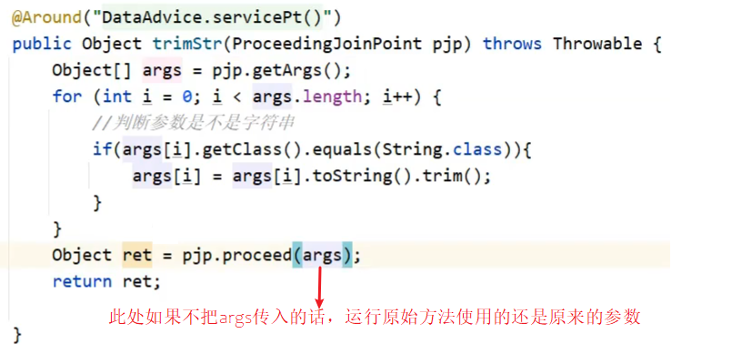


## 5. AOP总结

### 5.1 AOP的核心概念

* 概念：AOP(Aspect Oriented Programming)面向切面编程，一种编程范式
* 作用：在不惊动原始设计的基础上为方法进行功能增强
* 核心概念
  * 代理（Proxy）：SpringAOP的核心本质是采用代理模式实现的
  * 连接点（JoinPoint）：在SpringAOP中，理解为任意方法的执行
  * 切入点（Pointcut）：匹配连接点的式子，也是具有共性功能的方法描述
  * 通知（Advice）：若干个方法的共性功能，在切入点处执行，最终体现为一个方法
  * 切面（Aspect）：描述通知与切入点的对应关系
  * 目标对象（Target）：被代理的原始对象成为目标对象

### 5.2 切入点表达式

* 切入点表达式标准格式：动作关键字(访问修饰符  返回值  包名.类/接口名.方法名（参数）异常名)

  ```java
  execution(* com.goes.service.*Service.*(..))
  ```

* 切入点表达式描述通配符：

  * 作用：用于快速描述，范围描述
  * `*`：匹配任意符号（常用）
  * `..` ：匹配多个连续的任意符号（常用）
  * `+`：匹配子类类型

* 切入点表达式书写技巧

  1.按标准规范开发
  2.查询操作的返回值建议使用\*匹配
  3.减少使用..的形式描述包
  4.对接口进行描述，使用\*表示模块名，例如UserService的匹配描述为*Service
  5.方法名书写保留动词，例如get，使用\*表示名词，例如getById匹配描述为getBy\*
  6.参数根据实际情况灵活调整

### 5.3 五种通知类型

- 前置通知
- 后置通知
- 环绕通知（重点）
  - 环绕通知依赖形参ProceedingJoinPoint才能实现对原始方法的调用
  - 环绕通知可以隔离原始方法的调用执行
  - 环绕通知返回值设置为Object类型
  - 环绕通知中可以对原始方法调用过程中出现的异常进行处理
- 返回后通知
- 抛出异常后通知

### 5.4 通知中获取参数

- 获取切入点方法的参数，所有的通知类型都可以获取参数
  - JoinPoint：适用于前置、后置、返回后、抛出异常后通知
  - ProceedingJoinPoint：适用于环绕通知
- 获取切入点方法返回值，前置和抛出异常后通知是没有返回值，后置通知可有可无，所以不做研究
  - 返回后通知
  - 环绕通知
- 获取切入点方法运行异常信息，前置和返回后通知是不会有，后置通知可有可无，所以不做研究
  - 抛出异常后通知
  - 环绕通知


## 6. AOP事务管理

### 6.1 Spring事务简介

#### 6.1.1 相关概念介绍

- 事务作用：在数据层保障一系列的数据库操作同成功同失败
- Spring事务作用：在数据层或**业务层**保障一系列的数据库操作同成功同失败

数据层有事务我们可以理解，为什么业务层也需要处理事务呢?

举个简单的例子:

* 转账业务会有两次数据层的调用，一次是加钱一次是减钱
* 把事务放在数据层，加钱和减钱就有两个事务
* 没办法保证加钱和减钱同时成功或者同时失败
* 这个时候就需要将事务放在业务层进行处理。

Spring为了管理事务，提供了一个平台事务管理器`PlatformTransactionManager`


commit是用来提交事务，rollback是用来回滚事务。

PlatformTransactionManager只是一个接口，Spring还为其提供了一个具体的实现:


从名称上可以看出只需要给它一个DataSource对象，它就可以帮助去在业务层管理事务。其内部采用的是JDBC的事务。所以如果在持久层采用的是JDBC相关的技术，就可以采用这个事务管理器来管理事务。而Mybatis内部采用的就是JDBC的事务，所以后期Spring整合Mybatis就采用的这个DataSourceTransactionManager事务管理器。


#### 6.1.2 转账案例-需求分析

先来分析下需求:

需求: 实现任意两个账户间转账操作

需求微缩: A账户减钱，B账户加钱

为了实现上述的业务需求，我们可以按照下面步骤来实现下:

1. ①：数据层提供基础操作，指定账户减钱（outMoney），指定账户加钱（inMoney）
2. ②：业务层提供转账操作（transfer），调用减钱与加钱的操作
3. ③：提供2个账号和操作金额执行转账操作
4. ④：基于Spring整合MyBatis环境搭建上述操作


#### 6.1.3 转账案例-环境搭建

##### 步骤1:准备数据库表

之前我们在整合Mybatis的时候已经创建了这个表,可以直接使用

```sql
create database springdb character set utf8;
use spring_db;
create table tbl_account(
    id int primary key auto_increment,
    name varchar(35),
    money double
);
insert into tbl_account values(1,'Tom',1000);
insert into tbl_account values(2,'Jerry',1000);
```

##### 步骤2:创建项目导入jar包

项目的pom.xml添加相关依赖

```xml
<dependencies>
    <dependency>
      <groupId>org.springframework</groupId>
      <artifactId>spring-context</artifactId>
      <version>5.2.10.RELEASE</version>
    </dependency>
    <dependency>
      <groupId>com.alibaba</groupId>
      <artifactId>druid</artifactId>
      <version>1.1.16</version>
    </dependency>

    <dependency>
      <groupId>org.mybatis</groupId>
      <artifactId>mybatis</artifactId>
      <version>3.5.6</version>
    </dependency>

    <dependency>
      <groupId>mysql</groupId>
      <artifactId>mysql-connector-java</artifactId>
      <version>5.1.47</version>
    </dependency>

    <dependency>
      <groupId>org.springframework</groupId>
      <artifactId>spring-jdbc</artifactId>
      <version>5.2.10.RELEASE</version>
    </dependency>

    <dependency>
      <groupId>org.mybatis</groupId>
      <artifactId>mybatis-spring</artifactId>
      <version>1.3.0</version>
    </dependency>

    <dependency>
      <groupId>junit</groupId>
      <artifactId>junit</artifactId>
      <version>4.12</version>
      <scope>test</scope>
    </dependency>

    <dependency>
      <groupId>org.springframework</groupId>
      <artifactId>spring-test</artifactId>
      <version>5.2.10.RELEASE</version>
    </dependency>

  </dependencies>
```

##### 步骤3:根据表创建模型类

```java
public class Account implements Serializable {

    private Integer id;
    private String name;
    private Double money;
	//setter...getter...toString...方法略    
}
```

##### 步骤4:创建Dao接口

```java
public interface AccountDao {

    @Update("update tbl_account set money = money + #{money} where name = #{name}")
    void inMoney(@Param("name") String name, @Param("money") Double money);

    @Update("update tbl_account set money = money - #{money} where name = #{name}")
    void outMoney(@Param("name") String name, @Param("money") Double money);
}
```

##### 步骤5:创建Service接口和实现类

```java
public interface AccountService {
    /**
     * 转账操作
     * @param out 传出方
     * @param in 转入方
     * @param money 金额
     */
    public void transfer(String out,String in ,Double money) ;
}

@Service
public class AccountServiceImpl implements AccountService {

    @Autowired
    private AccountDao accountDao;

    public void transfer(String out,String in ,Double money) {
        accountDao.outMoney(out,money);
        accountDao.inMoney(in,money);
    }

}
```

##### 步骤6:添加jdbc.properties文件

```properties
jdbc.driver=com.mysql.jdbc.Driver
jdbc.url=jdbc:mysql://localhost:3306/springdb?useSSL=false
jdbc.username=root
jdbc.password=root
```

##### 步骤7:创建JdbcConfig配置类

```java
public class JdbcConfig {
    @Value("${jdbc.driver}")
    private String driver;
    @Value("${jdbc.url}")
    private String url;
    @Value("${jdbc.username}")
    private String userName;
    @Value("${jdbc.password}")
    private String password;

    @Bean
    public DataSource dataSource(){
        DruidDataSource ds = new DruidDataSource();
        ds.setDriverClassName(driver);
        ds.setUrl(url);
        ds.setUsername(userName);
        ds.setPassword(password);
        return ds;
    }
}
```

##### 步骤8:创建MybatisConfig配置类

```java
public class MybatisConfig {

    @Bean
    public SqlSessionFactoryBean sqlSessionFactory(DataSource dataSource){
        SqlSessionFactoryBean ssfb = new SqlSessionFactoryBean();
        ssfb.setTypeAliasesPackage("com.goes.domain");
        ssfb.setDataSource(dataSource);
        return ssfb;
    }

    @Bean
    public MapperScannerConfigurer mapperScannerConfigurer(){
        MapperScannerConfigurer msc = new MapperScannerConfigurer();
        msc.setBasePackage("com.goes.dao");
        return msc;
    }
}
```

##### 步骤9:创建SpringConfig配置类

```java
@Configuration
@ComponentScan("com.goes")
@PropertySource("classpath:jdbc.properties")
@Import({JdbcConfig.class,MybatisConfig.class})
public class SpringConfig {
}

```

##### 步骤10:编写测试类

```java
@RunWith(SpringJUnit4ClassRunner.class)
@ContextConfiguration(classes = SpringConfig.class)
public class AccountServiceTest {

    @Autowired
    private AccountService accountService;

    @Test
    public void testTransfer() throws IOException {
        accountService.transfer("Tom","Jerry",100D);
    }

}
```

项目结构如下:

- src
  - main
    - java
      - com.goes
        - config
        - dao
        - domain
        - service
          - impl
    - resources
      - jdbc.properties
  - test
    - java
      - com.goes.service


#### 6.1.4 事务管理

上述环境，运行单元测试类，会执行转账操作，`Tom`的账户会减少100，`Jerry`的账户会加100。

上述是在正常情况下的运行结果，但是如果在转账的过程中出现了异常，如:

```java
@Service
public class AccountServiceImpl implements AccountService {

    @Autowired
    private AccountDao accountDao;

    public void transfer(String out,String in ,Double money) {
        accountDao.outMoney(out,money);
        int i = 1/0;
        accountDao.inMoney(in,money);
    }

}
```

此时就模拟了转账过程中出现异常的情况，正确的操作应该是转账出问题了，`Tom`应该还是900，`Jerry`应该还是1100，但是真正运行后会发现，并没有像我们想象的那样，`Tom`账户为800而`Jerry`还是1100,100块钱凭空消息了，银行乐疯了。如果把转账换个顺序，银行就该哭了。

不管哪种情况，都是不允许出现的，对刚才的结果我们做一个分析:

①：程序正常执行时，账户金额A减B加，没有问题

②：程序出现异常后，转账失败，但是异常之前操作成功，异常之后操作失败，整体业务失败

当程序出问题后，我们需要让事务进行回滚，而且这个事务应该是加在业务层上，而Spring的事务管理就是用来解决这类问题的。

Spring事务管理具体的实现步骤为:

##### 步骤1:在需要被事务管理的方法上添加注解

```java
public interface AccountService {
    /**
     * 转账操作
     * @param out 传出方
     * @param in 转入方
     * @param money 金额
     */
    //配置当前接口方法具有事务
    public void transfer(String out,String in ,Double money) ;
}

@Service
public class AccountServiceImpl implements AccountService {

    @Autowired
    private AccountDao accountDao;
	@Transactional
    public void transfer(String out,String in ,Double money) {
        accountDao.outMoney(out,money);
        int i = 1/0;
        accountDao.inMoney(in,money);
    }

}
```

注意:

@Transactional可以写在接口类上、接口方法上、实现类上和实现类方法上

* 写在接口类上，该接口的所有实现类的所有方法都会有事务
* 写在接口方法上，该接口的所有实现类的该方法都会有事务
* 写在实现类上，该类中的所有方法都会有事务
* 写在实现类方法上，该方法上有事务
* 建议写在实现类或实现类的方法上

##### 步骤2:在JdbcConfig类中配置事务管理器

```java
public class JdbcConfig {
    @Value("${jdbc.driver}")
    private String driver;
    @Value("${jdbc.url}")
    private String url;
    @Value("${jdbc.username}")
    private String userName;
    @Value("${jdbc.password}")
    private String password;

    @Bean
    public DataSource dataSource(){
        DruidDataSource ds = new DruidDataSource();
        ds.setDriverClassName(driver);
        ds.setUrl(url);
        ds.setUsername(userName);
        ds.setPassword(password);
        return ds;
    }

    //配置事务管理器，mybatis使用的是jdbc事务
    @Bean
    public PlatformTransactionManager transactionManager(DataSource dataSource){
        DataSourceTransactionManager transactionManager = new DataSourceTransactionManager();
        transactionManager.setDataSource(dataSource);
        return transactionManager;
    }
}
```

**注意：**事务管理器要根据使用技术进行选择，Mybatis框架使用的是JDBC事务，可以直接使用`DataSourceTransactionManager`

##### 步骤3：开启事务注解

在SpringConfig的配置类中开启

```java
@Configuration
@ComponentScan("com.goes")
@PropertySource("classpath:jdbc.properties")
@Import({JdbcConfig.class,MybatisConfig.class
//开启注解式事务驱动
@EnableTransactionManagement
public class SpringConfig {
}

```

##### 步骤4:运行测试类

会发现在转换的业务出现错误后，事务就可以控制回顾，保证数据的正确性。

##### 知识点1：@EnableTransactionManagement

| 名称 | @EnableTransactionManagement           |
| ---- | -------------------------------------- |
| 类型 | 配置类注解                             |
| 位置 | 配置类定义上方                         |
| 作用 | 设置当前Spring环境中开启注解式事务支持 |

##### 知识点2：@Transactional   

| 名称 | @Transactional                                               |
| ---- | ------------------------------------------------------------ |
| 类型 | 接口注解  类注解  方法注解                                   |
| 位置 | 业务层接口上方  业务层实现类上方  业务方法上方               |
| 作用 | 为当前业务层方法添加事务（如果设置在类或接口上方则类或接口中所有方法均添加事务） |

### 6.2 Spring事务角色

重点要理解两个概念，分别是`事务管理员`和`事务协调员`。

1. 未开启Spring事务之前:

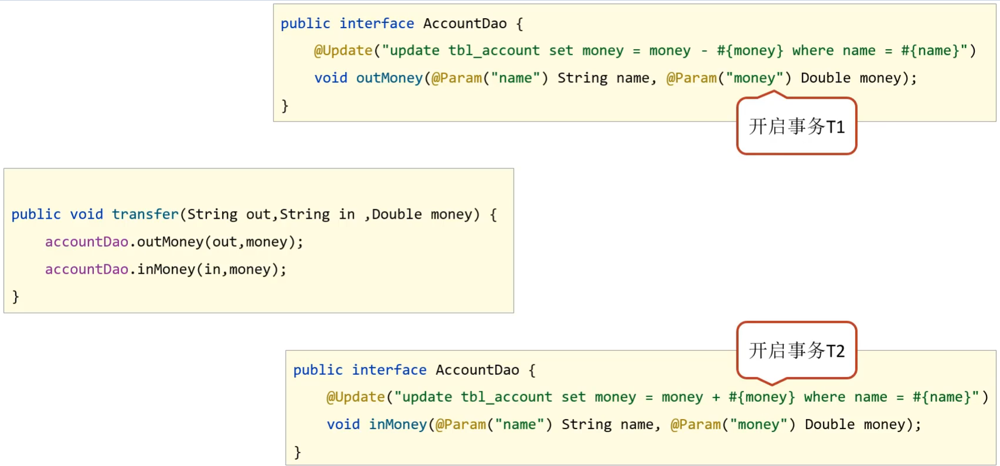

* AccountDao的outMoney因为是修改操作，会开启一个事务T1
* AccountDao的inMoney因为是修改操作，会开启一个事务T2
* AccountService的transfer没有事务，
  * 运行过程中如果没有抛出异常，则T1和T2都正常提交，数据正确
  * 如果在两个方法中间抛出异常，T1因为执行成功提交事务，T2因为抛异常不会被执行
  * 就会导致数据出现错误

2. 开启Spring的事务管理后


* transfer上添加了@Transactional注解，在该方法上就会有一个事务T
* AccountDao的outMoney方法的事务T1加入到transfer的事务T中
* AccountDao的inMoney方法的事务T2加入到transfer的事务T中
* 如此就保证他们在同一个事务中，当业务层中出现异常，整个事务就会回滚，保证数据的准确性。

通过上面例子的分析，可以得到如下概念:

- 事务管理员：发起事务方，在Spring中通常指代业务层开启事务的方法
- 事务协调员：加入事务方，在Spring中通常指代数据层方法，也可以是业务层方法

注意:

目前的事务管理是基于`DataSourceTransactionManager`和`SqlSessionFactoryBean`使用的是同一个数据源。


### 6.3 Spring事务属性

主要学习三部分内容`事务配置`、`转账业务追加日志`、`事务传播行为`。

#### 6.3.1 事务配置


上面属性都可以在`@Transactional`注解的参数上进行设置。

* readOnly：true只读事务，false读写事务，增删改要设为false,查询设为true。

* timeout:设置超时时间单位秒，在多长时间之内事务没有提交成功就自动回滚，-1表示不设置超时时间。

* rollbackFor:当出现指定异常进行事务回滚

* noRollbackFor:当出现指定异常不进行事务回滚

  * 思考:出现异常事务会自动回滚，这个是我们之前就已经知道的

  * noRollbackFor是设定对于指定的异常不回滚，这个好理解

  * rollbackFor是指定回滚异常，对于异常事务不应该都回滚么，为什么还要指定?

    * 这块需要更正一个知识点，并不是所有的异常都会回滚事务，比如下面的代码就不会回滚

      ```java
      public interface AccountService {
          /**
           * 转账操作
           * @param out 传出方
           * @param in 转入方
           * @param money 金额
           */
          //配置当前接口方法具有事务
          public void transfer(String out,String in ,Double money) throws IOException;
      }
      
      @Service
      public class AccountServiceImpl implements AccountService {
      
          @Autowired
          private AccountDao accountDao;
      	@Transactional
          public void transfer(String out,String in ,Double money) throws IOException{
              accountDao.outMoney(out,money);
              //int i = 1/0; //这个异常事务会回滚
              if(true){
                  throw new IOException(); //这个异常事务就不会回滚
              }
              accountDao.inMoney(in,money);
          }
      
      }
      ```

* 出现这个问题的原因是，Spring的事务只会对`Error异常`和`RuntimeException异常`及其子类进行事务回顾，其他的异常类型是不会回滚的，对应IOException不符合上述条件所以不回滚
      

  * 此时就可以使用rollbackFor属性来设置出现IOException异常不回滚

    ```java
    @Service
    public class AccountServiceImpl implements AccountService {
    
        @Autowired
        private AccountDao accountDao;
    	 @Transactional(rollbackFor = {IOException.class})
        public void transfer(String out,String in ,Double money) throws IOException{
            accountDao.outMoney(out,money);
            //int i = 1/0; //这个异常事务会回滚
            if(true){
                throw new IOException(); //这个异常事务就不会回滚
            }
            accountDao.inMoney(in,money);
        }
    
    }
    ```

* rollbackForClassName等同于rollbackFor,只不过属性为异常的类全名字符串

* noRollbackForClassName等同于noRollbackFor，只不过属性为异常的类全名字符串

* isolation设置事务的隔离级别

  * DEFAULT   :默认隔离级别, 会采用数据库的隔离级别
  * READ_UNCOMMITTED : 读未提交
  * READ_COMMITTED : 读已提交
  * REPEATABLE_READ : 重复读取
  * SERIALIZABLE: 串行化


#### 6.3.2 转账业务追加日志案例

##### 6.3.2.1 需求分析

在前面的转案例的基础上添加新的需求，完成转账后记录日志。

- 需求：实现任意两个账户间转账操作，并对每次转账操作在数据库进行留痕
- 需求微缩：A账户减钱，B账户加钱，数据库记录日志

基于上述的业务需求，我们来分析下该如何实现:

①：基于转账操作案例添加日志模块，实现数据库中记录日志

②：业务层转账操作（transfer），调用减钱、加钱与记录日志功能

需要注意一点就是，该案例的预期效果为：无论转账操作是否成功，均进行转账操作的日志留痕

##### 6.3.2.2 环境准备

该环境是基于转账环境来完成的，因此环境的准备可以参考`6.1.3的环境搭建步骤`，在其基础上继续往下写

###### 步骤1:创建日志表

```sql
create table tbl_log(
   id int primary key auto_increment,
   info varchar(255),
   createDate datetime
)
```

###### 步骤2:添加LogDao接口

```java
public interface LogDao {
    @Insert("insert into tbl_log (info,createDate) values(#{info},now())")
    void log(String info);
}

```

###### 步骤3:添加LogService接口与实现类

```java
public interface LogService {
    void log(String out, String in, Double money);
}
@Service
public class LogServiceImpl implements LogService {

    @Autowired
    private LogDao logDao;
	@Transactional
    public void log(String out,String in,Double money ) {
        logDao.log("转账操作由"+out+"到"+in+",金额："+money);
    }
}
```

###### 步骤4:在转账的业务中添加记录日志

```java
public interface AccountService {
    /**
     * 转账操作
     * @param out 传出方
     * @param in 转入方
     * @param money 金额
     */
    //配置当前接口方法具有事务
    public void transfer(String out,String in ,Double money)throws IOException ;
}
@Service
public class AccountServiceImpl implements AccountService {

    @Autowired
    private AccountDao accountDao;
    @Autowired
    private LogService logService;
	@Transactional
    public void transfer(String out,String in ,Double money) {
        try{
            accountDao.outMoney(out,money);
            accountDao.inMoney(in,money);
        }finally {
            logService.log(out,in,money);
        }
    }

}
```

###### 步骤5:运行程序

* 当程序正常运行，tbl_account表中转账成功，tbl_log表中日志记录成功

* 当转账业务之间出现异常(int i =1/0),转账失败，tbl_account成功回滚，但是tbl_log表未添加数据
* 这个结果和我们想要的不一样，什么原因?该如何解决?
* 失败原因:日志的记录与转账操作隶属同一个事务，同成功同失败
* 最终效果:无论转账操作是否成功，日志必须保留

#### 6.3.3 事务传播行为

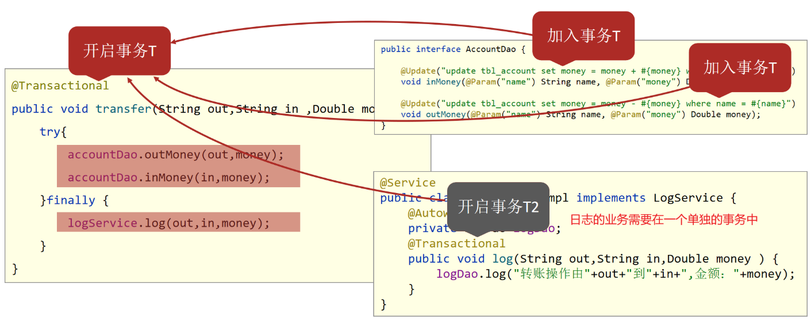

对于上述案例的分析:

* log方法、inMoney方法和outMoney方法都属于增删改，分别有事务T1,T2,T3
* transfer因为加了@Transactional注解，也开启了事务T
* 前面我们讲过Spring事务会把T1,T2,T3都加入到事务T中
* 所以当转账失败后，所有的事务都回滚，导致日志没有记录下来
* 这和需求不符，此时就想能不能让log方法单独是一个事务呢?

要想解决这个问题，就需要用到事务传播行为，所谓的事务传播行为指的是:

事务传播行为：事务协调员对事务管理员所携带事务的处理态度。

具体如何解决，就需要用到之前没有说的`propagation属性`。

##### 1.修改logService改变事务的传播行为

```java
@Service
public class LogServiceImpl implements LogService {

    @Autowired
    private LogDao logDao;
	//propagation设置事务属性：传播行为设置为当前操作需要新事务
    @Transactional(propagation = Propagation.REQUIRES_NEW)
    public void log(String out,String in,Double money ) {
        logDao.log("转账操作由"+out+"到"+in+",金额："+money);
    }
}
```

运行后，就能实现想要的结果，不管转账是否成功，都会记录日志。

##### 2.事务传播行为的可选值


对于开发实际中使用的话，因为默认值需要事务是常态的。根据开发过程选择其他的就可以，例如案例中需要新事务就需要手工配置。其实入账和出账操作上也有事务，采用的就是默认值。


# Spring面试题

## 1、Bean生命周期

> IOC中Bean的生命周期：生产、使用、销毁
>
> 步骤：
>
> 1. 解析xml配置或者注解配置的类获取BeanDefinition
> 2. 通过BeanDefinition反射创建Bean对象
> 3. 对Bean对象进行属性填充
> 4. 回调实现Aware接口的方法，比如BeanNameAware
> 5. 调用BeanPostProcessor的初始化前方法
> 6. 调用init初始化方法
> 7. 调用BeanPostProcessor的初始化后方法，该方法会进行AOP
> 8. 将创建的Bean对象放入Map集合中
> 9. 业务中使用Bean对象
> 10. Spring容器关闭时调用DisposableBean的destory方法。

### 1.1、生产

1. 启动Spring项目

2. "加载Bean定义"loadBeanDefinitions，并放在容器中的“Bean定义”BeanDefinitionMap集合中

   大致流程如下图所示：

   ```mermaid
   graph LR;
   run --> refreshContext --> refresh --> obtainFreshBeanFactory --> refreshBeanFactory --> loadBeanDefinition
   ```

3. 创建Bean对象：构造对象、填充属性、初始化实例、注册销毁

   大致流程如下图所示：

   ```mermaid
   graph LR;
   run --> refreshContext --> finishBeanFactoryInitialization --> preInstantiateSingletons --> doGetBean --> createBean
   ```

   1. 构造对象：createBeanInstance，先通过反射机制从“Bean定义”中BeanClass获取该类的构造方法

      1. 获取构造方法：
         1. 单构造方法：无论该构造方法是否有参数都只能获取
         2. 多构造方法：
            1. 首先选择获取带有@Autowired注解的构造方法（若有多个构造方法带有该注解会因此而报错！）
            2. 其次选择优先获取无参数的构造方法（若没有无参构造方法，并且有多个有参的构造方法则会因此而报错）
      2. 准备参数：在容器的单例池中根据参数的Class类进行查找，若该类在容器中含有多个实例则会根据参数名进行再匹配，若没有找到则会报构造信息不完整的错误。
      3. Bean构造：通过反射创建Bean对象，即实例化

   2. 填充属性：populateBean，通过该方法为Bean内部所需的属性进行赋值填充，通常是@Autowired注解的变量。

      - 通过“三级缓存”机制进行填充，即依赖注入

   3. 初始化实例：InitializeBean

      1. 初始化容器相关信息，通过InvokeAwareMethods方法为实现各种Aware接口的Bean设置诸如：beanName、beanFactory等容器信息

         > Aware接口代表“信息感知”接口，一旦实现该接口，就可以在bean实例中感知并获取对应的信息

      2. 通过invokeInitMethods方法执行Bean的初始化方法，Bean的初始化方法是通过实现InittializingBean接口而实现的afterPropertiesSet方法

      3. 接着执行在Bean上自定义的initMethod方法，在执行该方法的前后还需要对“Bean后置处理器”BeanPostProcessors进行处理，可通过applyBeanPostProcessorsBeforeInitialization、applyBeanPostProcessorsAfterInitialization在初始化方法前后处理各种Bean的后置处理器（包括：Spring自身提供的负责“AOP处理”的AnnotationAwareAspectJAutoProxyCreator、负责“构造后@PostConstruct和销毁前@PreDestroy处理”的InitDestroyAnnotationBeanPostProcessor等“系统级”处理器以及项目自定义实现BeanPostProcessor接口的“自定义处理器”，自定义处理器可通过实现PriorityOrdered接口来指定顺序进行逐一处理

   4. 注册销毁：RegistryDisposabeBean

      1. 通过RegistryDisposabeBean方法将实现销毁接口DisposabeBean的Bean进行注册，在销毁时就可执行destroy方法

4. 将Bean放入单例池：将创建好的完整Bean对象通过addSingleton方法放入单例池singletonObjects中即可获取或使用

生产总流程

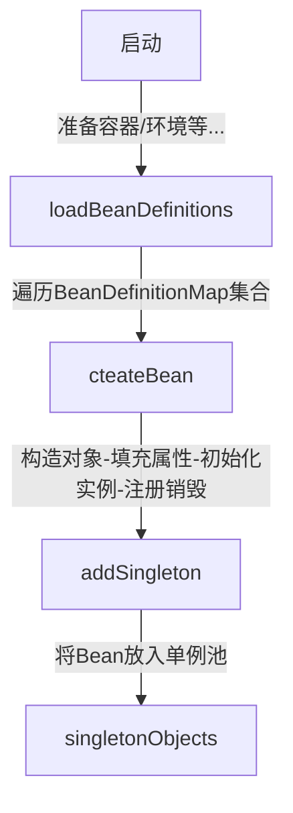


### 1.2、使用

生产完成后即可在容器内使用Bean对象们！


### 1.3、销毁

在执行close()方法时

1. 在销毁前先执行“销毁前处理器”postProcessBeforeDectruction，该过程会执行Bean中@PreDestroy注解的方法。
2. 接着通过destroyBeans方法逐一销毁容器内的所有Bean，销毁时会执行destroy方法。
3. 最后通过“客户销毁方法”invokeCustomDestroyMethod方法执行项目中自定义Bean中自定义的destroyMethod方法。


## 2、启动流程

### 2.1、服务构建

> 目标：SpringApplication
>
> 总结：SpringApplication.run()
>
> 1. 创建ApplicationContext实例，即创建Ioc容器
>
>    ```java
>    ApplicationContext context  = createApplicationContext();
>    ```
>
> 2. 加载源配置类（通常是main方法所在的类，而被注解@SpringBootApplication所修饰的类称为主类）：将主类（primaryClass）注解到Ioc容器中
>
>    ```java
>    loadSourceClass(context, primaryClass);
>    ```
>
> 3. 递归加载并处理所有的配置类：“自动配置”
>
>    ```java
>    processConfigurationClasses(context);
>    ```
>
>    1. 从Ioc容器中取出当前存在的源配置类
>
>       ```java
>       Class<?> sourceConfigurationClass =  getSourceConfigurationClass(context);
>       ```
>
>    2. 创建配置类解析器，然后递归加载并处理应用中所有的配置类
>
>       ```java
>       ConfigClassParser parser = new ConfigClassParser(context);
>       parser.parse(sourceConfigurationClass);
>       ```
>
>       `parse()`方法解析程序：
>
>       1. 处理@ComponentScan：根据@ComponentScan扫描指定的package得到一系列配置类
>
>          ```java
>          if(hasComponentScan(confiClas)) {
>              for(Class<?> clazz : doScan(configClass)) {
>                  this.parse(clazz);
>              }
>          }
>          ```
>
>       2. 处理注解@Import：根据@Import得到一系列被导入的配置类
>
>          ```java
>          if(hasImportClasses(confiClas)) {
>              for(Class<?> clazz : getImports(configClass)) {
>                  this.parse(clazz);
>              }
>          }
>          ```
>
>       3. 处理@Bean方法
>
>          ```java
>          processBeanMethods(configClass);
>          ```
>
>       4. 处理Import导入的Import导入的ImportBeanDefinitionRegistrar
>
>          ```java
>          processRegistrars(configClass);
>          ```
>
>       5. 加入全局的配置类集合中
>
>          ```java
>          this.configurationClasses.add(configClass);
>          ```
>
>    3. 向Ioc容器中注解@Bean方法对应的BeanDefinition
>
>       ```java
>       loadBeanDefinitionsFromBeanMethods(parser.configurationClasses);
>       ```
>
>    4. 向Ioc容器中注解ImportBeanDefinitionRegistrar导入的BeanDefinition
>
>       ```java
>       loadBeanDefinitionsFromRegistrars(parser.configurationClasses);
>       ```
>
> 4. 实例化所有的单例Bean：“依赖注入” 和 “自动装配”
>
>    ```java
>    instantiateSingletonBeans(context);
>    ```
>
> 5. 启动服务器
>
>    ```java
>    startServer(context);
>    ```
>
> 
>
> 两种配置注解
>
> 1. @ComponentScan
>
>    - 对指定的package进行扫描，找到其中符合条件的类，默认是搜索被注解@Component修饰的配置类
>    - 通过属性basePackages或basePackageClasses，来指定要进行扫描的package
>    - 如果为指定package，则默认扫描当前@ComponentScan所修饰的类所在的package
>
> 2. @Import
>
>    - 提供一种显示地从其他地方加载配置类的方式，该方式可避免使用性能较差的组件扫描（Component Scan）
>    - 支持导入：
>      1. 普通类（相对后两种方式而言）
>      2. 接口ImportSelector的实现类
>      3. 接口ImportBeanDefinitionRegistrar的实现类
>
> 3. @Conditional
>
>    它的作用是实现：只有在特定条件满足时，才会向Ioc容器注册知道你过的组件。也可以将@Conditional理解为某种IF语句
>
>    常用的Conditional扩展注解：
>
>    - ConditionalOnBean：当容器中存在指定的Bean时，满足条件
>    - ConditionalOnMissingBean：当容器中不存在指定的Bean时，满足条件
>    - ConditionalOnClass：当classpath中存在指定的类时，满足条件
>    - ConditionalOnMissingClass：当classpath中不存在指定的类时，满足条件
>    - ConditionalOnProperty：当指定的属性具备指定的值时，满足条件
>    - ConditionalOnWebApplication：当应用程序是web应用时，满足条件
>
> 

SpringApplication构造方法：public SpringApplication(ResourceLoader resourceLoader, Class<?>... primarySources)；

```java
public SpringApplication(ResourceLoader resourceLoader, Class<?>... primarySources) {
    // ...
    // 1、将资源加载器、主方法类记录在内存中
    this.resourceLoader = resourceLoader;
    Assert.notNull(primarySources, "PrimarySources must not be null");
    this.primarySources = new LinkedHashSet(Arrays.asList(primarySources));
    
    // 2、注意判断对应的服务类是否存在：确定web服务的类型（servlet[默认]\reactive\node\...）
    this.webApplicationType = WebApplicationType.deduceFromClasspath();
    
    // 3、加载初始化类：读取所有META-INF/spring.factories文件中的三类配置：
    // 注册初始化：BootstrapRegistryInitializer
    // 上下文初始化：ApplicationContextInitializer
    // 监听器：ApplicationListener
    // 无默认的注册初始化配置, 但spring-boot和spring-boot-autoconfigure两工程中配置有7个“上下文初始化”及8个“监听器”
    this.bootstrapRegistryInitializers = new ArrayList<>(
        getSpringFactoriesInstances(BootstrapRegistryInitializer.class)
    );
    this.setInitializers(this.getSpringFactoriesInstances(ApplicationContextInitializer.class));
    this.setListeners(this.getSpringFactoriesInstances(ApplicationListener.class));
    
    // 4、运行栈stackTrack判断main方法所在类（启动类本身）的位置
    this.mainApplicationClass = this.deduceMainApplicationClass();
}
```


### 2.2、环境准备

> ```
> SpringApplication.run(Application.class, args);
> ```

```java
public ConfigurableApplicationContext run(String... args) {
    long startTime = System.nanoTime();
    
    // 1、加载“启动注册初始化器”BootstrapRegistryInitializer的initialize()方法
    // 由于无默认BootstrapRegistryInitializer，即默认不执行
    DefaultBootstrapContext bootstrapContext = createBootstrapContext();
    
    ConfigurableApplicationContext context = null;
    // 2、将java.awtheadless该值设置为true：无输入设备启动（即缺少显示器、键盘等输入设备也可以正常启动）
    this.configureHeadlessProperty();
    
    // 3.1、启动“运行监听器”SpringApplicationRunListener
    SpringApplicationRunListeners listeners = this.getRunListeners(args);
    // 3.2、发布启动事件：获取并加载spring-boot工程的spring.factories配置文件中EventPublishingRunListener及另外8个监听器
    listeners.starting(bootstrapContext, this.mainApplicationClass);
    try{
        ApplicationArguments applicationArguments = new DefaultApplicationArguments(args);
        // 4、组装启动参数：prepareEnvironment方法进行构造“可配置环境”ConfigurableEnvironment
        ConfigurableEnvironment environment = this.prepareEnvironment(
            listeners, 
            bootstrapContext, 
            applicationArguments
        );
        // 5、将“spring.beaninfo.ignore”设为true：表示不加载Bean的元数据信息
        this.configureIgnoreBeanInfo(environment);
        // 6、打印Banner图
        Banner printedBanner = this.printBanner(environment);
        // ...
    }
}
```

> 4、组装启动参数：prepareEnvironment方法
>
> ```java
> private ConfigurableEnvironment prepareEnvironment(
>  SpringApplicationRunListeners listeners, ApplicationArguments applicationArguments) {
>  // 1、根据不同的web服务类型构造不同的环境：默认servlet
>  ConfigurableEnvironment environment = this.getOrCreateEnvironment();
>  // 2.1、通过“配置环境”configureEnvironment, 加载“系统环境变量”systemEnvironment、
>  //    “Jvm系统属性”systemProperties等在内的4组配置信息到propertySources的内存集合
>  // 2.2、以及通过“配置环境”configureEnvironment，将启动时传入的环境参数args进行设置（“开发/生产”环境配置）
>  this.configureEnvironment((ConfigurableEnvironment)environment, applicationArguments.getSourceArgs());
> 
>  // 3、在propertySources集合的首个位置添加一个值为空的配置内容“configurationProperties”
>  ConfigurationPropertySources.attach((Environment)environment);
> 
>  // 4、发布“环境准备完成”事件（之前加载的8个监听器会监听到该事件，并且部分监听器会进行相应的处理）
>  // 诸如：“环境配置后处理监听器”EnvironmentPostProcessorApplicationListener会去加载spring.factories
>  //       配置文件中“环境配置后处理器”EnvironmentPostProcessor
> 	// 注意：“监听器”通过观察者设计模式会逐一“串行”执行（即需要等待所有监听器的处理完成后才会继续执行后续的逻辑）
>  listeners.environmentPrepared((ConfigurableEnvironment)environment);
> 
>  // 5、将环境配置跟容器绑定
>  this.bindToSpringApplication((ConfigurableEnvironment)environment);
>  if (!this.isCustomEnvironment) {
>      environment = (
>          new EnvironmentConverter(this.getClassLoader())
>      ).convertEnvironmentIfNecessary(
>          (ConfigurableEnvironment)environment, 
>          this.deduceEnvironmentClass()
>      );
>  }
>  // 6、考虑到刚创建的“可配置环境”在一系列过程中可能会发生变化，通过二次更新保证匹配
>  ConfigurationPropertySources.attach((Environment)environment);
>  return (ConfigurableEnvironment)environment;
> }
> ```


### 2.3、容器创建

> “容器”ApplicationContext：指各种属性、集合以及配套功能的结构体，也成为“上下文”。

```java
public ConfigurableApplicationContext run(String... args) {
    // ...
    try {
        // ...
        // 1、根据服务类型创建”容器“ConfigurableApplicationContext
        context = this.createApplicationContext();
     	
        context.setApplicationStartUp(this.applicationStarpUp);
        
        // 2、对容器中的部分属性进行初始化
        this.prepareContext(context, environment, listeners, applicationArguments, printedBanner);
        // ...
    }
}
```


> 1、根据服务类型创建”容器“ConfigurableApplicationContext，由于默认服务类型为servlet，故创建的是”注解配置的Servler-Web服务容器“，即AnnotationConfigServletWebServerApplicationContext。在此过程中会构造诸如：存放或生产“Bean实例的”Bean工厂”DefaultListableBeanFactory
>
> 诸如：
>
> - 用以解析@Conponent、@ComponentSan等注解的“配置类后处理器”ConfigurationClassPostProcessor
> - 用以解析@Autowired、@Value、@Inject等注解的“自动注解后处理器”AutowiredAnnotationBeanPostProcessor等在内的属性对象
>
> ```java
> protected ConfigurableApplicationContext createApplicationContext() {
>     Class<?> contextClass = this.applicationContextClass;
>     if (contextClass == null) {
>         try {
>             switch (this.webApplicationType) {
>                 case SERVLET:
>                     contextClass = Class.forName("org.springframework.boot.web.servlet.context. " +
>                                                  + "AnnotationConfigServletWebServerApplicationContext");
>                     break;
>                 case REACTIVE:
>                     contextClass = Class.forName("org.springframework.boot.web.reactive.context." +
>                                                  + "AnnotationConfigReactiveWebServerApplicationContext");
>                     break;
>                 default:
>                     contextClass = Class.forName("org.springframework.context.annotation." +
>                                                  + "AnnotationConfigApplicationContext");
>             }
>         } catch (ClassNotFoundException var3) {
>             throw new IllegalStateException("Unable create a default ApplicationContext, " +
>                                                  + "please specify an ApplicationContextClass", var3);
>         }
>     }
>     return (ConfigurableApplicationContext)BeanUtils.instantiateClass(contextClass);
> }
> ```
>
> 2、对容器中的部分属性进行初始化
>
> ```java
> private void prepareContext(ConfigurableApplicationContext context, ConfigurableEnvironment environment, 
>                             SpringApplicationRunListeners llisteners, 
>                             ApplicationArguments applicationArguments, Banner printedBanner) {
>     context.setEnvironment(environment);
> 
>     // 1、设置“Bean名称生成器”BeanNameGenerator、“资源加载器”ResourceLoader、“类型转换器”ConversionService等
>     this.postProcessApplicationContext(context);
> 
>     // 2、执行之前加载的“上下文初始化”ApplicationContextInitializer，默认加载7个，
>     //	  容器ID、警告日志处理、日志监听等都是在此时实现的
>     this.applyInitializers(context);
> 
>     // 3、发布“容器准备完成”监听事件
>     listeners.contextPrepared(context);
>     if (this.logStartupInfo) {
>         this.logStartupInfo(context.getParent() == null);
>         this.logStartupProfileInfo(context);
>     }
> 
>     // 4、陆续为容器注册“启动参数”、“Banner”、“Bean引用策略”、“懒加载策略”和“属性排序”等等
>     ConfigurableListableBeanFactory beanFactory = context.getBeanFactory();
>     beanFactory.registerSingleton("springApplicationArguments", applicationArguments);
>     if (printedBanner != null) {
>         beanFactory.registerSingleton("springBootBanner", printedBanner);
>     }
>     if (beanFactory instanceof DefaultListableBeanFactory) {
>         ((DefaultListableBeanFactory)beanFactory).setAllowBeanDefinitionOverriding(
>             this.allowBeanDefinitionOverriding
>         );
>     }
> 
> 
>     Set<Object> sources = this.getAllSources();
>     Assert.notEmpty(sources, "Sources must not be empty");
> 
>     // 5、通过“Bean定义加载器”将“启动类”在内的资源加载到“Bean定义池”BeanDefinitionMap中
>     this.load(context, sources.toArray(new Object[0]));
> 
>     // 6、发布“资源加载完成”事件
>     listeners.contextLoaded(context);
> }
> ```
>
> 


### 2.4、填充容器

1、生产Spring自身提供的以及项目自定义的所有Bean对象，并存放在“容器”中，该过程也成为“自动装配”，包含12个步骤。

2、发布“启动完成”事件并回调自定义实现的Runner接口


### 2.5、总结

1. 加载各种配置信息，初始化各种配置对象

   ```java
   SpringApplication(primarySources)
   ```

   1. 初始化资源加载器

      ```java
      this.resourceLoader = resourceLoader;
      ```

   2. 初始化配置类的类名信息（格式转换）

      ```java
      this.primarySources = new LinkedHashSet<>(Arrays.asList(primarySources));
      ```

   3. 确认当前容器加载的类型

      ```java
      this.webApplicationType = WebApplicationType.deduceFromClasspath();
      ```

   4. 获取系统配置引导信息

      ```java
      this.bootstrapRegistryInitializers = getBootstrapRegistryInitializersFromSpringFactories();
      ```

   5. 获取ApplicationContextInitializer.class对应的实例

      ```java
      setInitializers((Collection) getSpringFactoriesInstances(ApplicationContextInitializer.class));
      ```

   6. 初始化监听器，对初始化过程及运行过程进行干预

      ```java
      setListeners((Collection) getSpringFactoriesInstances(ApplicationListener.class));
      ```

   7. 初始化引导类类名信息，备用

      ```java
      this.mainApplicationClass = deduceMainApplicationClass();
      ```

2. 初始化容器，得到ApplicationContext对象

   ```java
   new SpringApplication(primarySources).run(args)
   ```

   1. 设置计时器

      ```java
      StopWatch stopWatch = new StopWatch();
      ```

   2. 计时开始

      ```java
      stopWatch.start();
      ```

   3. 系统引导信息对应的上下文对象

      ```java
      DefaultBootstrapContext bootstrapContext = createBootstrapContext();
      ```

   4. 模拟输入输出信号，避免出现因缺少外设导致的信号传输失败，进而引发错误（模拟显示器，键盘，鼠标...）

      ```java
      configureHeadlessProperty();
      ```

   5. 获取当前注册的所有监听器

      ```java
      SpringApplicationRunListeners listeners = getRunListeners(args);
      ```

   6. 监听器执行了对应的操作步骤

      ```java
      listeners.starting(bootstrapContext, this.mainApplicationClass);
      ```

   7. 获取参数

      ```java
      ApplicationArguments applicationArguments = new DefaultApplicationArguments(args);
      ```

   8. 将前期读取的数据加载成了一个环境对象，用来描述信息

      ```java
      ConfigurableEnvironment environment = prepareEnvironment(listeners, bootstrapContext, applicationArguments);
      ```

   9. 做了一个配置，备用

      ```java
      configureIgnoreBeanInfo(environment);
      ```

   10. 初始化logo

       ```java
       Banner printedBanner = printBanner(environment);
       ```

   11. 创建容器对象，根据前期配置的容器类型进行判定并创建

       ```java
       context = createApplicationContext();
       ```

   12. 设置启动模式

       ```java
       context.setApplicationStartup(this.applicationStartup);
       ```

   13. 对容器进行设置，参数来源于前期的设定

       ```java
       prepareContext(bootstrapContext, context, environment, listeners, applicationArguments, printedBanner);
       ```

   14. 刷新容器环境

       ```java
       refreshContext(context);
       ```

   15. 刷新完毕后做后处理

       ```java
       afterRefresh(context, applicationArguments);
       ```

   16. 计时结束

       ```java
       stopWatch.stop();
       ```

   17. 判定是否记录启动时间的日志

       ```java
       if (this.logStartupInfo) {
       	// ...
       }
       ```

   18. 创建日志对应的对象，输出日志信息，包含启动时间

       ```java
       new StartupInfoLogger(this.mainApplicationClass).logStarted(getApplicationLog(), stopWatch);
       ```

   19. 监听器执行了对应的操作步骤

       ```java
       listeners.started(context);
       ```

   20. 监听器执行了对应的操作步骤

       ```java
       listeners.running(context);
       ```

       


## 3、循环依赖

> **问题：**当Bean对象A内部注入Bean对象B，而Bean对象B内部也注入Bean对象A，此时就会出现循环依赖问题，Spring容器一般不支持该现象。
>
> **解决方法：**application中配置allow-circular-references的值为true，sb2.6之后版本默认为false。即：与其解决循环依赖在技术层面的实现问题，不如在设计时避免循环依赖。
>
> ```yaml
> spring:
>   main:
>     allow-circular-references: true
> ```
>
> 

### 3.1、循环依赖大概流程

1. Spring进行扫描 -> 反射后封装成beanDefinition对象 -> 放入beanDefinitionMap
2. 遍历beanDefinitionMap
   1. 验证(是否单例/是否延迟加载/是否抽象)
   2. 推断构造方法
   3. 准备开始进行实例
   4. 在单例池中查找-没有
   5. 在二级缓存中查找-没有提前暴露
   6. 生成objectFactory对象暴露到二级缓存中
3. 属性注入-发现依赖Y
4. 进行Y的生命周期直到属性注入-发现依赖X
5. 进行X生命周期
   1. 当在二级缓存中查找时找到X
   2. 往Y中注入X的objectFactory对象
6. 完成循环依赖


**某些疑问**

1、为什么要使用X的objectFacory对象而不是直接使用X对象？

- 利于拓展，开发者可通过beanPostProcess接口操作objectFactory对象生成自定义对象

2、是不是只能支持单例(scope=singleton)而不支持原型(scope=prototype)？

- 是。因为单例是spring在启动时进行bean加载放入单例池中，在依赖的bean开始生命周期后，可以直接从二级缓存中取到它所依赖的bean的objectFactory对象从而结束循环依赖。
- 而原型只有在用到时才会走生命周期流程，但是原型不存在一个已经实例化好的bean，所以会无限的创建->依赖->创建->依赖->...。

3、循环依赖是不是只支持非构造方法？

- 是。类似死锁问题


## 4、自动配置

> 自动配置：Auto-Configuration
>
> 配置类：ConfigurationClass
>
> - 广义”配置类“：被注解@Component直接或间接修饰的某个类
> - 狭义”配置类“：特指被注解@Configuration所修饰的某个类

在Springboot项目的启动类中会添加注解`@SpringBootApplication`，而该注解的关系图如下

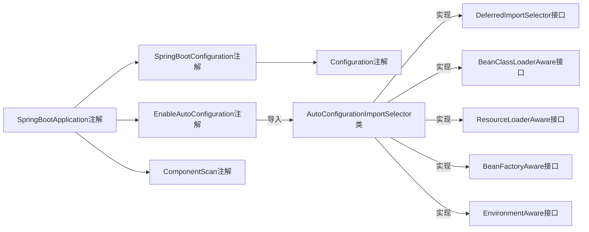

SpringFactories机制：它的核心是从classpath中读取到所有Jar包的中的配置文件META-IF/spring.factories，然后根据指定的key从配置文件中解析出对应的value值。其中key是指定的某个类名，value是逗号隔开的多个类名。

AutoConfigurationImportSelector的实现流程：

```java
// 自动配置源码分析
public String[] selectImports(AnnotationMetadata annotationMetadata) {
    if (!this.isEnabled(annotationMetadata)) {
        return NO_IMPORTS;
    } else {
        // 
        AutoConfigurationMetadata autoConfigurationMetadata = AutoConfigurationMetadataLoader.loadMetadata(
            this.beanClassLoader
        );
        
        // SpringBoot自动配置入口
        AutoConfigurationEntry autoConfigurationEntry = this.getAutoConfigurationEntry(
            autoConfigurationMetadata, 
            annotationMetadata
        );
        return StringUtils.toStringArray(autoConfigurationEntry.getConfigurations());
    }
}

// SpringBoot自动配置入口
protected AutoConfigurationEntry getAutoConfigurationEntry(AutoConfigurationMetadata autoConfigurationMetadata,
                                                           AnnotationMetadata annotationMetadata) {
    if (!this.isEnabled(annotationMetadata)) {
        return EMPTY_ENTRY;
    } else {
        // 1、获取 annotationMetadata 的注解 @EnableAutoConfiguration 的属性
        AnnotationAttributes attributes = this.getAttributes(annotationMetadata);
        
        // 2、从资源文件 spring.factories 中获取 EnableAutoConfiguration 对应的所有的类
        List<String> configurations = this.getCandidateConfigurations(annotationMetadata, attributes);
        configurations = this.removeDuplicates(configurations);
        
        // 3、通过在注解 @EnableAutoConfiguration 设置 exclude 的相关属性，可以排除指定的自动配置类
        Set<String> exclusions = this.getExclusions(annotationMetadata, attributes);
        this.checkExcludedClasses(configurations, exclusions);
        configurations.removeAll(exclusions);
        
        // 4、根据注解 @Conditional 来判断是否需要排除某些自动配置类
        configurations = this.filter(configurations, autoConfigurationMetadata);
        
        // 5、触发 AutoConfiguration 导入的相关事件
        this.fireAutoConfigurationImportEvents(configurations, exclusions);
        return new AutoConfigurationEntry(configurations, exclusions);
    }
}

// 3、从资源文件 spring.factories 中获取 EnableAutoConfiguration 对应的所有的类
protected List<String> getCandidateConfigurations(AnnotationMetadata metadata, 
                                                  AnnotationAttributes attributes) {
    // 通过 SpringFactories 机制，从配置文件 spring.factories 中找出所有的自动配置类
    List<String> configurations = SpringFactoriesLoader.loadFactoryNames(
        EnableAutoConfiguration.class, 
        this.getBeanClassLoader()
    );
    Assert.notEmpty(
        configurations, 
        "No auto configuration classes found in META-INF/spring.factories. " + 
        "If you are using a custom packaging, make sure that file is correct."
    );
    return configurations;
}

// 加载工厂
public static List<String> loadFactoryNames(Class<?> factoryClass, @Nullable ClassLoader classLoader) {
    String factoryClassName = factoryClass.getName();
    return (List)loadSpringFactories(classLoader).getOrDefault(factoryClassName, Collections.emptyList());
}

// 加载Spring工厂
private static Map<String, List<String>> loadSpringFactories(@Nullable ClassLoader classLoader) {
    MultiValueMap<String, String> result = (MultiValueMap)cache.get(classLoader);
    if (result != null) {
        return result;
    } else {
        try {
            Enumeration<URL> urls = classLoader != null ? 
                classLoader.getResources("META-INF/spring.factories") 
                : 
            	ClassLoader.getSystemResources("META-INF/spring.factories");
            
            MultiValueMap<String, String> result = new LinkedMultiValueMap();
            while(urls.hasMoreElements()) {
                URL url = (URL)urls.nextElement();
                UrlResource resource = new UrlResource(url);
                Properties properties = PropertiesLoaderUtils.loadProperties(resource);
                Iterator var6 = properties.entrySet().iterator();
                while(var6.hasNext()) {
                    Map.Entry<?, ?> entry = (Map.Entry)var6.next();
                    String factoryClassName = ((String)entry.getKey()).trim();
                    String[] var9 = StringUtils.commaDelimitedListToStringArray((String)entry.getValue());
                    int var10 = var9.length;
                    for(int var11 = 0; var11 < var10; ++var11) {
                        String factoryName = var9[var11];
                        result.add(factoryClassName, factoryName.trim());
                    }
                }
            }
            cache.put(classLoader, result);
            return result;
        } catch (IOException var13) {
            throw new IllegalArgumentException(
                "Unable to load factories from location [META-INF/spring.factories]", 
                var13
            );
        }
    }
}
```

AutoConfigurationImportSelector.selectImports(...) 实现流程：

1. 通过SpringFactories机制加载配置文件：通过 ClassLoader 去获取 classpath 中的配置文件 META/spring.factories
2. 找出所有的自动配置类：在所有的配置文件 META/spring.factories 中筛选出以 EnableAutoConfiguration.class 为 key 的、符合条件的配置类
3. 根据注解@Conditional过滤掉不必要的自动配置类


总统流程：

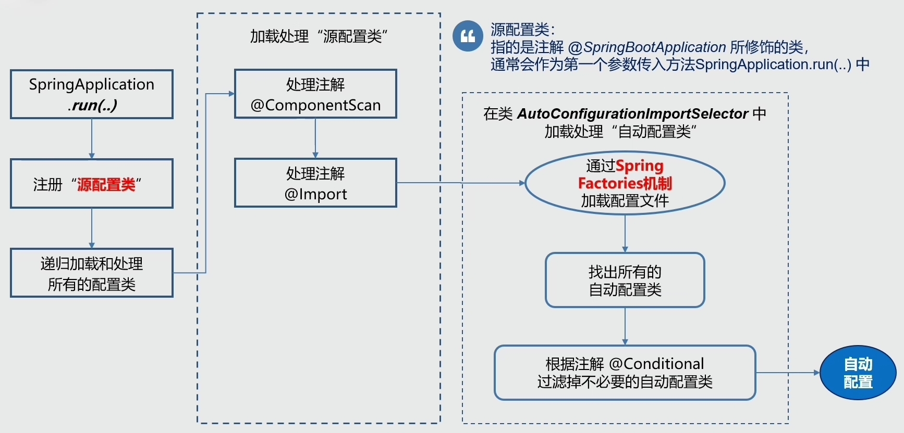


## 5、自动装配

> 自动装配：Autowire

Spring的自动装配是指Spring框架根据一定的规则，自动将应用程序中的组件（例如bean）装配到需要它们的地方，而无需手动进行显式的配置。

Spring的自动装配可以通过在XML配置文件中使用 `<context:annotation-config>` 或 `<context:component-scan>` 来启用，或者通过在Java配置类上使用@ComponentScan和@Autowired注解来实现。如此Spring会自动扫描并装配应用程序中标记特定注解（例如@Component、@Service、@Repository等）的类。

### 1、三种自动装配模式

#### 1、基于类型的自动装配（byType）

Spring会检查应用程序上下文中所有的bean，并尝试将某个属性的类型与另一个bean的类型匹配。如果找到唯一匹配的bean，则自动装配成功。如果存在多个匹配项，Spring将抛出异常，表示无法确定要使用哪个bean。

#### 2、基于名称的自动装配（byName）

> 该模式要求所有的Bean都有唯一的名称

Spring会将一个bean的属性名与其他bean的名称进行匹配。如果找到与属性名相同的bean，则自动装配成功。

#### 3、构造函数自动装配（constructor）

> 该模式适用于通过构造函数注入依赖的情况

Spring会检查应用程序上下文中所有的bean，并尝试根据构造函数参数的类型进行匹配。如果某个bean的构造函数参数类型与另一个bean的类型匹配，则自动装配成功。


### 2、自动装配原理

自动装配原理基于依赖注入（DI）和反射机制。

#### 依赖注入（DI）

> 优点：对象之间的耦合度降低，更易于测试和维护

在依赖注入中，对象不再负责创建或查找依赖对象，而是由外部容器（即Spring容器）负责在创建对象时将依赖项传递给它。

#### 反射机制

反射机制允许在运行时动态地检查类的结构并调用类的方法、访问或修改字段。Spring通过反射来检查类的属性、构造函数以及方法，以确定它们的依赖关系，并在需要时自动注入依赖项。


#### 在Spring的自动装配流程

##### 1、组件扫描

> Component Scanning

Spring容器会扫描指定包及其子包下的类，查找带有特定注解的类（如`@Component`、`@Service`、`@Repository`等）。被标记的类会被Spring识别为组件，可以被自动装配。


##### 2、自动装配规则

Spring会根据自动装配的模式（byType、byName、constructor）以及注解上的元数据，决定如何进行装配。如果一个类的属性被标记`@Autowired`注解，Spring就会尝试自动将与该属性类型相匹配的bean装配进来。


##### 3、依赖解析

> Dependency Resolution

当Spring确定要自动装配一个组件时，它会去容器中查找相应的bean。如果找到了一个匹配的bean，则将其装配到目标位置；如果找不到或者存在多个匹配项，Spring可能会抛出异常或者选择一个默认的装配策略（如优先选择首选bean）。


##### 4、装配过程

> Assembly Process

一旦确定了要装配的bean，Spring会使用反射机制将bean注入到目标组件中。

通过调用目标组件的setter方法、直接赋值给字段，或者通过构造函数注入等方式来实现。


## 6、常见事务传播行为

事务传播行为是指在一个方法调用另一个方法时，如何处理被调用方法的事务。

在使用事务管理器时，可以指定事务的传播行为来控制事务的行为。

### 1、PROPAGATION_REQUIRED

> 默认传播行为

如果当前存在事务，则加入该事务；如果当前没有事务，则创建一个新的事务。


### 2、PROPAGATION_REQUIRES_NEW

每次都会创建一个新的事务。如果当前存在事务，则将当前事务挂起。


### 3、PROPAGATION_SUPPORTS

如果当前存在事务，则加入该事务；如果当前没有事务，则以非事务的方式执行。


### 4、PROPAGATION_NOT_SUPPORTED

以非事务的方式执行，并挂起当前存在的事务（如果有）。


### 5、PROPAGATION_MANDATORY

强制要求当前存在事务，并加入该事务；如果当前没有事务，则抛出异常。


### 6、PROPAGATION_NEVER

强制要求当前不存在事务；如果当前存在事务，则抛出异常。


### 7、PROPAGATION_NESTED

如果当前存在事务，则在嵌套事务中执行；如果当前没有事务，则创建一个新的事务。


## 7、Spring中事务失效场景

### 1、数据库引擎不支持事务

> **Database Engine Doesn't Support Transactions**

在某些情况下，数据库引擎可能不支持事务，或者数据库的配置不正确，导致事务无法正常工作。例如，某些轻量级数据库或特殊配置下的数据库可能不支持事务。

MyISAM引擎是不支持事务操作的，一般要支持事务都会使用InnoDB引擎，根据MySQL 的官方文档说明，从MySQL 5.5.5 开始的默认存储引擎是 InnoDB，之前默认的都是 MyISAM。


### 2、没有被 Spring 管理

> **Not Managed by Spring**

Spring的事务管理器只能管理由Spring容器管理的Bean上的事务。如果在没有通过Spring容器创建的对象上使用了`@Transactional`注解或者Spring的事务管理功能，事务将不会生效。

假设创建一个普通的Java类，并在其中使用`@Transactional`注解，但是这个类没有被Spring容器管理。

示例：在下述情况下，`@Transactional`注解将不会生效，由于`@Service` 被注释使得 `Spring` 无法管理`MyService`类。

```java
// @Service // 配置该类由Spring管理
public class MyService {
    @Autowired
    private MyRepository repository;
    
    @Transactional
    private void doSomething() {
        // 这里执行数据库操作
        repository.save(someEntity);
    }
}
```


### 3、方法并非 public 修饰

> **Non-Public Methods**

Spring只能代理公共方法上的事务注解。如果一个方法不是public的，并且被注解`@Transactional`，那么事务注解将不会生效。

例如：在下述情况下，`@Transactional`注解同样不会生效，因为Spring只能代理公共方法上的事务注解。

```java
public class MyService {
    @Autowired
    private MyRepository repository;
    
    @Transactional
    private void doSomething() {
        // 这里执行数据库操作
        repository.save(someEntity);
    }
}
```


### 4、发生自身调用

> **Self Invocation**

当一个事务方法内部调用另一个事务方法时，事务失效可能发生。因为Spring默认使用基于代理的AOP来实现事务，内部自调用将会绕过代理对象，导致事务不被拦截。

示例：在下述情况下，`anotherTransactionalMethod()`方法内的事务将不会被激活。

```java
public class MyService {
    @Autowired
    private MyRepository repository;
    
    @Transactional
    public void doSomething() {
        // 这里执行一些操作
        anotherTransactionalMethod();
    }
    
    @Transactional
    public void anotherTransactionalMethod() {
        // 这里执行另一些操作
    }
}
```


### 5、没有配置事务管理器

> **Missing Transaction Manager Configuration**

如果应用程序中没有配置Spring的事务管理器，或者没有正确配置事务管理器，事务将无法正常工作。Spring需要一个事务管理器来管理事务的开始、提交和回滚。

在Spring配置文件中配置事务管理器，如下所示：下述配置告诉Spring使用指定的数据源来管理事务。

```xml
<bean id="transactionManager" class="org.springframework.jdbc.datasource.DataSourceTransactionManager">
    <property name="dataSource" ref="dataSource"/>
</bean>
```


### 6、设置了不支持事务

> **Unsupported Transaction Setting**

如果在应用程序中设置了不支持事务的配置，如`@EnableTransactionManagement`注解的`mode`属性设置为`AdviceMode.PROXY`，而应用程序却使用了基于AspectJ的事务管理器，事务可能会失效。

示例：在下述情况下，事务可能会失效，因为配置了不支持事务的模式。

```java
@Configuration
@EnableTransactionManagement(mode = AdviceMode.PROXY) // 设置了不支持事务
public class AppConfig {
    // 其他配置...
}
```


### 7、异常没有被抛出

> **Unthrown Exception**

Spring的事务管理默认只会回滚受检异常（checked exception）。如果在方法中发生异常但没有被正确抛出，则事务可能不会回滚。

例如：在下述情况下，虽然发生异常，但由于没有将其正确抛出，事务可能不会回滚。

```java
@Transactional
public void doSomething() {
    try {
        // 这里可能会抛出异常
        someMethod();
    } catch (Exception e) {
        // 异常被捕获，但没有被抛出
    }
}

private void someMethod() {
    // 这里可能会抛出异常
}
```


### 8、异常类型不匹配

> **Mismatched Exception Types**

如果事务管理器配置捕获特定类型的异常进行回滚，但实际抛出的异常类型与配置不匹配，事务可能不会按预期回滚。

例如：在下述情况下，由于抛出`OtherException`而不是`MyCustomException`，事务可能不会回滚。

```java
@Transactional(rollbackFor = MyCustomException.class)
public void doSomething() {
    try {
        // 这里可能会抛出其他类型的异常
        someMethod();
    } catch (Exception e) {
        // 这里捕获了异常，但是类型不匹配
    }
}

private void someMethod() throws OtherException {
    // 这里可能会抛出 OtherException
}
```


## 8、Bean的加载方式

#### 1、配置文件+```<bean/>```标签

```XML
<?xml version="1.0" encoding="UTF-8"?>
<beans xmlns="http://www.springframework.org/schema/beans"
       xmlns:xsi="http://www.w3.org/2001/XMLSchema-instance"
       xsi:schemaLocation="http://www.springframework.org/schema/beans http://www.springframework.org/schema/beans/spring-beans.xsd">
    <!--xml方式声明自己开发的bean-->
    <bean id="cat" class="Cat"/>
    <bean class="Dog"/>

    <!--xml方式声明第三方开发的bean-->
    <bean id="dataSource" class="com.alibaba.druid.pool.DruidDataSource"/>
    <bean class="com.alibaba.druid.pool.DruidDataSource"/>
    <bean class="com.alibaba.druid.pool.DruidDataSource"/>
</beans>
```


#### 2、配置文件扫描+注解定义bean

使用的注解有@Component以及三个衍生注解@Service、@Controller、@Repository

```JAVA
@Component("tom")
public class Cat {
}
```

```JAVA
@Service
public class Mouse {
}
```

当你需要加载第三方开发的bean的时候可以使用下列方式定义注解式的bean。

@Bean定义在一个方法上方，当前方法的返回值就可以交给spring管控

> ⚠️**记得该方法所在的类必须要定义在@Component修饰的类中**

```java
@Component
public class DbConfig {
    @Bean
    public DruidDataSource dataSource(){
        DruidDataSource ds = new DruidDataSource();
        return ds;
    }
}
```

上面提供的仅仅只是bean的声明，spring并没有感知到这些类，想让spring感知到，可以通过下列xml配置设置spring去检查哪些包，发现定对应注解，就将对应的类纳入spring管控范围，声明成bean。

```XML
<?xml version="1.0" encoding="UTF-8"?>
<beans xmlns="http://www.springframework.org/schema/beans"
       xmlns:context="http://www.springframework.org/schema/context"
       xmlns:xsi="http://www.w3.org/2001/XMLSchema-instance"
       xsi:schemaLocation="
       http://www.springframework.org/schema/beans
       http://www.springframework.org/schema/beans/spring-beans.xsd
       http://www.springframework.org/schema/context
       http://www.springframework.org/schema/context/spring-context.xsd
    ">
    
    <!--指定扫描加载bean的位置-->
    <context:component-scan base-package="com.goes.bean,com.goes.config"/>
</beans>
```

方式二声明bean的方式是目前企业中较为常见的bean的声明方式，但是也有缺点。方式一中，通过一个配置文件，你可以查阅当前spring环境中定义了多少个或者说多少种bean，但是方式二没有任何一个地方可以查阅整体信息。


#### 3、注解方式声明配置类

定义一个类并使用@ComponentScan替代原始xml配置中的包扫描，其实功能基本相同。

```java
@ComponentScan({"com.goes.bean","com.goes.config"})
public class SpringConfig {
    @Bean
    public DogFactoryBean dog(){
        return new DogFactoryBean();
    }
}
```


##### 使用FactroyBean接口

补充一个小知识，spring提供一个接口FactoryBean，也可以用于声明bean，只不过实现FactoryBean接口的类造出来的对象不是当前类的对象，而是FactoryBean接口泛型指定类型的对象。该方式在对象初始化前可以做一些事情，比如在下例中的注释位置可扩展要做的其他事情的。

```JAVA
public class DogFactoryBean implements FactoryBean<Dog> {
    @Override
    public Dog getObject() throws Exception {
        Dog d = new Dog();
        //.........
        return d;
    }
    @Override
    public Class<?> getObjectType() {
        return Dog.class;
    }
    @Override
    public boolean isSingleton() {
        return true;
    }
}
```

该方式可理解为Dog是一个抽象后剥离的特别干净的模型，但是实际使用的时候必须进行一系列的初始化动作。只不过根据情况不同，初始化动作不同而已。如果写入Dog，或许初始化动作A当前并不能满足你的需要，此时就要做一个Dog初始化动作B的方案，而使用FactoryBean接口即可完美解决该问题。

通常实现FactoryBean接口的类使用@Bean的形式进行加载，当然也可以使用@Component去声明DogFactoryBean，只要被扫描加载到即可，但是这种格式加载总觉得奇怪的，指向性不是很明确。

```java
@ComponentScan({"com.goes.bean","com.goes.config"})
public class SpringConfig {
    @Bean
    public DogFactoryBean dog(){
        return new DogFactoryBean();
    }
}
```


##### 注解格式导入XML格式配置的bean

由于早起开发的系统大部分都是采用xml的形式配置bean，而现在的企业级开发基本上不用这种模式。但如果需要基于之前的系统进行二次开发，即新开发的用注解格式，之前开发的是xml格式。Spring提供一个注解可以解决该问题，@ImportResource在配置类上直接写上要被融合的xml配置文件名即可，是一种兼容性解决方案。

```JAVA
@Configuration
@ImportResource("applicationContext1.xml")
public class SpringConfig {
}
```


##### proxyBeanMethods属性

上述例子中用到@Configuration注解，当使用AnnotationConfigApplicationContext加载配置类的时，配置类可以不添加这个注解。但是该注解有一个更加强大的功能，它可以保障配置类中使用方法创建的bean的唯一性。为@Configuration注解设置proxyBeanMethods属性值为true即可，由于此属性默认值为true。

```JAVA
@Configuration(proxyBeanMethods = true)
public class SpringConfig {
    @Bean
    public Cat cat(){
        return new Cat();
    }
}
```

通过容器调用上面的cat方法时即可得到同一个对象。

> ⚠️**注意：必须使用spring容器对象调用此方法才有保持bean唯一性的特性。**

```JAVA
public class App {
    public static void main(String[] args) {
        ApplicationContext ctx = new AnnotationConfigApplicationContext(SpringConfig.class);
        String[] names = ctx.getBeanDefinitionNames();
        for (String name : names) {
            System.out.println(name);
        }
        
        System.out.println("-------------------------");
        
        SpringConfig springConfig = ctx.getBean("springConfig", SpringConfig.class);
        System.out.println(springConfig.cat());
        System.out.println(springConfig.cat());
        System.out.println(springConfig.cat());
    }
}
```


#### 4、使用@Import注解注入bean

使用扫描的方式加载bean是企业级开发中常见的bean的加载方式，但是由于扫描的包名可能在其他依赖也有相同名称的包名，此时就会将外部依赖包名下符合要求的类也加载成bean。

@ComponentScan

一种精准制导的加载方式，使用@Import注解就可以解该问题。只需要在注解的参数中写上加载的类对应的.class即可。并且加载的bean没有使用@Component修饰也可以，而@ComponentScan注解就无法完成该功能。

```java
@Import({Dog.class,DbConfig.class})
public class SpringConfig {
}
```


##### 使用@Import注解注入配置类

除加载bean，还可以使用@Import注解加载配置类。

```java
@Import(DogFactoryBean.class)
public class SpringConfig {
}
```


#### 5、编程形式注册bean

前面介绍的加载bean的方式都是在容器启动阶段完成bean的加载，而通过下面方式可在容器初始化完成后手动加载bean，实现编程式控制bean的加载。但是该方式会覆盖之前加载的bean，因此慎用。

```java
public class App {
    public static void main(String[] args) {
        AnnotationConfigApplicationContext ctx = new AnnotationConfigApplicationContext(SpringConfig.class);
        //上下文容器对象已经初始化完毕后，手工加载bean
        ctx.register(Mouse.class);
    }
}
```


#### 6、导入实现ImportSelector接口的类

实现ImportSelector接口的类可以设置加载的bean的全路径类名，实现在容器初始化过程中进行bean的加载控制

```java
public class MyImportSelector implements ImportSelector {
    @Override
    public String[] selectImports(AnnotationMetadata metadata) {
        //各种条件的判定，判定完毕后，决定是否装载指定的bean
        boolean flag = metadata.hasAnnotation("org.springframework.context.annotation.Configuration");
        if(flag){
            return new String[]{"com.goes.bean.Dog"};
        }
        return new String[]{"com.goes.bean.Cat"};
    }
}

```


#### 7、导入实现ImportBeanDefinitionRegistrar接口的类

实现ImportBeanDefinitionRegistrar接口的方式定义bean，并且还可以让你对bean的初始化进行更加细粒度的控制。

```java
public class MyRegistrar implements ImportBeanDefinitionRegistrar {
    @Override
    public void registerBeanDefinitions(AnnotationMetadata metadata, BeanDefinitionRegistry registry) {
        BeanDefinition beanDefinition = 	
            BeanDefinitionBuilder.rootBeanDefinition(BookServiceImpl.class).getBeanDefinition();
        registry.registerBeanDefinition("bookService",beanDefinition);
    }
}
```


#### 8、导入实现BeanDefinitionRegistryPostProcessor接口的类

BeanDefinitionRegistryPostProcessor，全称bean定义后处理器，是在所有bean都注册完后才运行，即它是最后一个运行的。因此使用该方式注册bean可以将之前加载的bean进行重新定义，使该方式创建的bean生效。

```java
public class MyPostProcessor implements BeanDefinitionRegistryPostProcessor {
    @Override
    public void postProcessBeanDefinitionRegistry(BeanDefinitionRegistry registry) throws BeansException {
        BeanDefinition beanDefinition = 
            BeanDefinitionBuilder.rootBeanDefinition(BookServiceImpl.class).getBeanDefinition();
        registry.registerBeanDefinition("bookService",beanDefinition);
    }
}
```


**总结**

1. bean的定义由前期xml配置逐步演化成注解配置，都是通过反射机制加载类名后创建对象，对象就是spring管控的bean
2. @Import注解可以指定加载某一个类作为spring管控的bean，如果被加载的类中还具有@Bean相关的定义，会被一同加载
3. spring开放出若干种可编程控制的bean的初始化方式，通过分支语句使由固定的方式加载bean转成可以选择bean是否加载或者选择加载哪一种bean。