# SpringMVC

## 1、SpringMVC概述

WEB三层架构

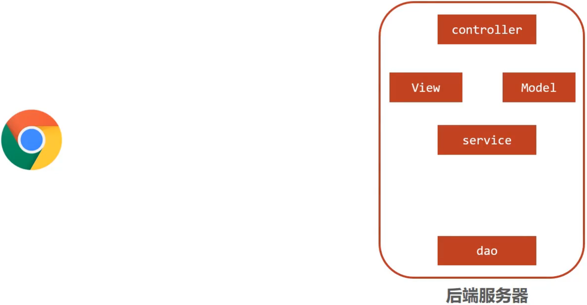

* 浏览器发送一个请求给后端服务器，后端服务器使用Servlet来接收请求和数据

* 如果所有的处理都交给Servlet来处理的话，所有的东西都耦合在一起，对后期的维护和扩展极为不利

* 于是将后端服务器Servlet拆分成三层，分别是`web`、`service`和`dao`
  * web层主要由servlet来处理，负责页面请求和数据的收集以及响应结果给前端
  * service层主要负责业务逻辑的处理
  * dao层主要负责数据的增删改查操作
* servlet处理请求和数据的时候，存在的问题是一个servlet只能处理一个请求
* 针对web层进行优化，采用MVC设计模式，将其设计为`controller`、`view`和`Model`
  * controller负责请求和数据的接收，接收后将其转发给service进行业务处理
  * service根据需要会调用dao对数据进行增删改查
  * dao把数据处理完后将结果交给service,service再交给controller
  * controller根据需求组装成Model和View,Model和View组合起来生成页面转发给前端浏览器
  * 如此controller可以处理多个请求，并对请求进行分发，执行不同的业务操作。

随着互联网的发展，之前模式的同步调用，性能不满足需求，因此异步调用成为目前流行的一种处理方式。

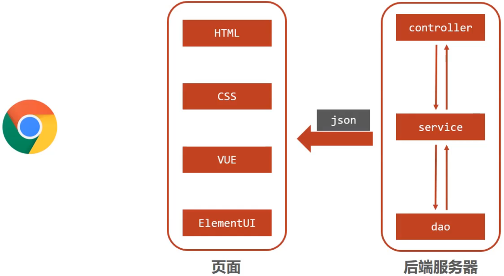

* 因为异步调用使得后端不需要返回view视图，因此可将其去除
* 前端如果通过异步调用的方式进行交互，后台就需要将返回的数据转换成json格式进行返回
* SpringMVC主要负责的就是
  * controller如何接收请求和数据
  * 如何将请求和数据转发给业务层
  * 如何将响应数据转换成json发回到前端


对SpringMVC进行一个定义

* SpringMVC是一种基于Java实现MVC模型的轻量级Web框架

* 优点

  * 使用简单、开发便捷(相比于Servlet)
  * 灵活性强


## 2、SpringMVC入门案例

回顾Servlet是如何进行开发的?

1. 创建web工程(Maven结构)
2. 设置tomcat服务器，加载web工程(tomcat插件)

3. 导入坐标(Servlet)
4. 定义处理请求的功能类(UserServlet)

5. 设置请求映射(配置映射关系)

SpringMVC的制作过程和上述流程几乎是一致的，具体的实现流程是什么?

1. 创建web工程(Maven结构)

2. 设置tomcat服务器，加载web工程(tomcat插件)

3. 导入坐标(SpringMVC+Servlet)

4. 定义处理请求的功能类(UserController)

5. 设置请求映射(配置映射关系)
6. 将SpringMVC设定加载到Tomcat容器中


### 2.1、案例制作

1. 步骤1:创建Maven项目

   - 使用IDEA创建新的web项目

2. 步骤2:补全目录结构

   使用骨架创建的项目结构不完整，需要手动补全

   - src
     - main // 生产目录（主目录）
       - java // 编写代码
       - webapp  // 存放web资源
         - WEB-INF
     - test // 测试目录

3. 步骤3:导入jar包

   将pom.xml中多余的内容删除掉，再添加SpringMVC需要的依赖

   ```xml
   <?xml version="1.0" encoding="UTF-8"?>
   <project xmlns="http://maven.apache.org/POM/4.0.0" xmlns:xsi="http://www.w3.org/2001/XMLSchema-instance"
     xsi:schemaLocation="http://maven.apache.org/POM/4.0.0 http://maven.apache.org/xsd/maven-4.0.0.xsd">
     <modelVersion>4.0.0</modelVersion>
     <groupId>com.goes</groupId>
     <artifactId>springmvc_01_quickstart</artifactId>
     <version>1.0-SNAPSHOT</version>
     <packaging>war</packaging>
   
     <dependencies>
       <dependency>
         <groupId>javax.servlet</groupId>
         <artifactId>javax.servlet-api</artifactId>
         <version>3.1.0</version>
         <scope>provided</scope>
       </dependency>
       <dependency>
         <groupId>org.springframework</groupId>
         <artifactId>spring-webmvc</artifactId>
         <version>5.2.10.RELEASE</version>
       </dependency>
     </dependencies>
   
     <build>
       <plugins>
         <plugin>
           <groupId>org.apache.tomcat.maven</groupId>
           <artifactId>tomcat7-maven-plugin</artifactId>
           <version>2.1</version>
           <configuration>
             <port>80</port>
             <path>/</path>
           </configuration>
         </plugin>
       </plugins>
     </build>
   </project>
   ```

   **说明:**servlet的坐标为什么需要添加`<scope>provided</scope>`

   * scope是maven中jar包依赖作用范围的描述
   * 如果不设置默认是`compile`在在编译、运行、测试时均有效
   * 如果运行有效的话就会和tomcat中的servlet-api包发生冲突，导致启动报错

   * provided代表的是该包只在编译和测试的时候用，运行的时候无效直接使用tomcat中的，就避免冲突

4. 步骤4:创建配置类

   ```java
   @Configuration
   @ComponentScan("com.goes.controller")
   	public class SpringMvcConfig {
   }
   ```

5. 步骤5:创建Controller类

   ```java
   @Controller
   public class UserController {
       
       @RequestMapping("/save")
       public void save(){
           System.out.println("user save ...");
       }
   }
   ```

6. 步骤6:使用配置类替换web.xml

   将web.xml删除，换成ServletContainersInitConfig

   ```java
   public class ServletContainersInitConfig extends AbstractDispatcherServletInitializer {
       //加载springmvc配置类
       protected WebApplicationContext createServletApplicationContext() {
           //初始化WebApplicationContext对象
           AnnotationConfigWebApplicationContext ctx = new AnnotationConfigWebApplicationContext();
           //加载指定配置类
           ctx.register(SpringMvcConfig.class);
           return ctx;
       }
   
       //设置由springmvc控制器处理的请求映射路径
       protected String[] getServletMappings() {
           return new String[]{"/"};
       }
   
       //加载spring配置类
       protected WebApplicationContext createRootApplicationContext() {
           return null;
       }
   }
   ```

7. 步骤7:配置Tomcat环境

   

8. 步骤8:启动运行项目

   

9. 步骤9:浏览器访问

   浏览器输入`http://localhost/save`进行访问，会报如下错误：

   

   页面报错的原因是后台没有指定返回的页面，目前只需要关注控制台看`user save ...`有没有被执行即可。

10. 步骤10:修改Controller返回值解决上述问题

    前端发送异步请求，后台响应json数据，对Controller类的save方法进行修改

    ```java
    @Controller
    public class UserController {
        
        @RequestMapping("/save")
        public String save(){
            System.out.println("user save ...");
            return "{'info':'springmvc'}";
        }
    }
    ```

    再次重启tomcat服务器，然后重新通过浏览器测试访问,会发现还是会报错，这次的错是404

    

    出错的原因是，如果方法直接返回字符串，springmvc会把字符串当成页面的名称在项目中进行查找返回，因为不存在对应返回值名称的页面，所以会报404错误，找不到资源。

    而我们其实是想要直接返回的是json数据，具体如何修改呢?

11. 步骤11:设置返回数据为json

    ```java
    @Controller
    public class UserController {
        
        @RequestMapping("/save")
        @ResponseBody
        public String save(){
            System.out.println("user save ...");
            return "{'info':'springmvc'}";
        }
    }
    ```

    再次重启tomcat服务器，然后重新通过浏览器测试访问，就能看到返回的结果数据

    

    至此SpringMVC的入门案例就已经完成。


**注意事项**

* SpringMVC是基于Spring的，在pom.xml只导入`spring-webmvc`jar包的原因是它会自动依赖spring相关坐标
* AbstractDispatcherServletInitializer类是SpringMVC提供的快速初始化Web3.0容器的抽象类
* AbstractDispatcherServletInitializer提供了三个接口方法供用户实现
  * createServletApplicationContext方法，创建Servlet容器时，加载SpringMVC对应的bean并放入WebApplicationContext对象范围中，而WebApplicationContext的作用范围为ServletContext范围，即整个web容器范围
  * getServletMappings方法，设定SpringMVC对应的请求映射路径，即SpringMVC拦截哪些请求
  * createRootApplicationContext方法，如果创建Servlet容器时需要加载非SpringMVC对应的bean,使用当前方法进行，使用方式和createServletApplicationContext相同。
  * createServletApplicationContext用来加载SpringMVC环境
  * createRootApplicationContext用来加载Spring环境


> **知识点1：@Controller**
>
> | 名称 | @Controller                   |
> | ---- | ----------------------------- |
> | 类型 | 类注解                        |
> | 位置 | SpringMVC控制器类定义上方     |
> | 作用 | 设定SpringMVC的核心控制器bean |
>
> **知识点2：@RequestMapping**
>
> | 名称     | @RequestMapping                 |
> | -------- | ------------------------------- |
> | 类型     | 类注解或方法注解                |
> | 位置     | SpringMVC控制器类或方法定义上方 |
> | 作用     | 设置当前控制器方法请求访问路径  |
> | 相关属性 | value(默认)，请求访问路径       |
>
> **知识点3：@ResponseBody**
>
> | 名称 | @ResponseBody                                    |
> | ---- | ------------------------------------------------ |
> | 类型 | 类注解或方法注解                                 |
> | 位置 | SpringMVC控制器类或方法定义上方                  |
> | 作用 | 设置当前控制器方法响应内容为当前返回值，无需解析 |


### 2.2、总结

- 一次性工作
  - 创建工程，设置服务器，加载工程
  - 导入坐标
  - 创建web容器启动类，加载SpringMVC配置，并设置SpringMVC请求拦截路径
  - SpringMVC核心配置类（设置配置类，扫描controller包，加载Controller控制器bean）
- 多次工作
  - 定义处理请求的控制器类
  - 定义处理请求的控制器方法，并配置映射路径（@RequestMapping）与返回json数据（@ResponseBody）


### 2.3、工作流程解析

为了更好的使用SpringMVC,可将SpringMVC的使用过程总共分两个阶段来分析，分别是`启动服务器初始化过程`和`单次请求过程`


#### 2.3.1、启动服务器初始化过程

1. 服务器启动，执行ServletContainersInitConfig类，初始化web容器

   * 功能类似于以前的web.xml

2. 执行createServletApplicationContext方法，创建了WebApplicationContext对象

   * 该方法加载SpringMVC的配置类SpringMvcConfig来初始化SpringMVC的容器

3. 加载SpringMvcConfig配置类

   ```java
   @Configuration
   @ComponentScan("com.goes.controller")
   public class SpringMvcConfig {
   
   }
   ```

4. 执行@ComponentScan加载对应的bean

   * 扫描指定包及其子包下所有类上的注解，如Controller类上的@Controller注解

5. 加载UserController，每个@RequestMapping的名称对应一个具体的方法

   ```
   @Controller
   public class UserController {
   	
   	@RequestMapping("/save")
   	@ResponseBody
   	public String save() {
   		System.out.println("usre save ...");
   		return "{'info' : 'springmvc'}"
   	}
   }
   ```

   * 此时就建立 `/save` 和 save方法的对应关系

6. 执行getServletMappings方法，设定SpringMVC拦截请求的路径规则

   ```java
   protected String[] getServletMappings() {
   	return new String[]{"/"};
   }
   ```

   * `/`代表所拦截请求的路径规则，只有被拦截后才能交给SpringMVC来处理请求


#### 2.3.2、单次请求过程

1. 发送请求`http://localhost/save`
2. web容器发现该请求满足SpringMVC拦截规则，将请求交给SpringMVC处理
3. 解析请求路径/save
4. 由/save匹配执行对应的方法save(）
   * 上面的第五步已经将请求路径和方法建立了对应关系，通过/save就能找到对应的save方法
5. 执行save()
6. 检测到有@ResponseBody直接将save()方法的返回值作为响应体返回给请求方


### 2.4、bean加载控制

#### 2.4.1、问题分析

在入门案例中我们创建过一个`SpringMvcConfig`的配置类，以及学习Spring时也创建过一个配置类`SpringConfig`。

这两个配置类都需要加载资源，那么它们分别都需要加载哪些内容?

目前项目目录结构:

* config目录存入的是配置类,写过的配置类有:

  * ServletContainersInitConfig
  * SpringConfig
  * SpringMvcConfig
  * JdbcConfig
  * MybatisConfig
* controller目录存放的是SpringMVC的controller类
* service目录存放的是service接口和实现类
* dao目录存放的是dao/Mapper接口

controller、service和dao这些类都需要被容器管理成bean对象，那么到底是该让SpringMVC加载还是让Spring加载呢?

* SpringMVC加载其相关bean(表现层bean),也就是controller包下的类
* Spring控制的bean
  * 业务bean(Service)
  * 功能bean(DataSource,SqlSessionFactoryBean,MapperScannerConfigurer等)

分析清楚谁该管哪些bean以后，接下来要解决的问题是如何让Spring和SpringMVC分开加载各自的内容。

在SpringMVC的配置类`SpringMvcConfig`中使用注解`@ComponentScan`，只需要将其扫描范围设置到controller即可，如

```java
@Configuartion
@ComponentScan("com.goes.controller")
public class SpringMvcConfig {

}
```

在Spring的配置类`SpringConfig`中使用注解`@ComponentScan`,当时扫描的范围中其实是已经包含了controller,如:

```java
@ComponentScan(value = "com.goes")
public class SpringConfig {

}
```

从包结构来看的话，Spring已把SpringMVC的controller类也给扫描。

问题：因为功能不同，如何避免Spring错误加载到SpringMVC的bean?


#### 2.4.2、思路分析

针对上面的问题，解决方案也比较简单，就是:

* 加载Spring控制的bean的时候排除掉SpringMVC控制的bean

具体该如何排除：

* 方式一:Spring加载的bean设定扫描范围为精准范围，例如service包、dao包等
* 方式二:Spring加载的bean设定扫描范围为com.goes,排除掉controller包中的bean
* 方式三:不区分Spring与SpringMVC的环境，加载到同一个环境中[了解即可]


#### 2.4.3、环境准备

- 创建一个Web的Maven项目

- pom.xml添加Spring依赖

  ```xml
  <?xml version="1.0" encoding="UTF-8"?>
  
  <project xmlns="http://maven.apache.org/POM/4.0.0" xmlns:xsi="http://www.w3.org/2001/XMLSchema-instance"
    xsi:schemaLocation="http://maven.apache.org/POM/4.0.0 http://maven.apache.org/xsd/maven-4.0.0.xsd">
    <modelVersion>4.0.0</modelVersion>
  
    <groupId>com.goes</groupId>
    <artifactId>springmvc_02_bean_load</artifactId>
    <version>1.0-SNAPSHOT</version>
    <packaging>war</packaging>
  
    <dependencies>
      <dependency>
        <groupId>javax.servlet</groupId>
        <artifactId>javax.servlet-api</artifactId>
        <version>3.1.0</version>
        <scope>provided</scope>
      </dependency>
      <dependency>
        <groupId>org.springframework</groupId>
        <artifactId>spring-webmvc</artifactId>
        <version>5.2.10.RELEASE</version>
      </dependency>
      <dependency>
        <groupId>com.alibaba</groupId>
        <artifactId>druid</artifactId>
        <version>1.1.16</version>
      </dependency>
  
      <dependency>
        <groupId>org.mybatis</groupId>
        <artifactId>mybatis</artifactId>
        <version>3.5.6</version>
      </dependency>
  
      <dependency>
        <groupId>mysql</groupId>
        <artifactId>mysql-connector-java</artifactId>
        <version>5.1.47</version>
      </dependency>
  
      <dependency>
        <groupId>org.springframework</groupId>
        <artifactId>spring-jdbc</artifactId>
        <version>5.2.10.RELEASE</version>
      </dependency>
  
      <dependency>
        <groupId>org.mybatis</groupId>
        <artifactId>mybatis-spring</artifactId>
        <version>1.3.0</version>
      </dependency>
    </dependencies>
  
    <build>
      <plugins>
        <plugin>
          <groupId>org.apache.tomcat.maven</groupId>
          <artifactId>tomcat7-maven-plugin</artifactId>
          <version>2.1</version>
          <configuration>
            <port>80</port>
            <path>/</path>
          </configuration>
        </plugin>
      </plugins>
    </build>
  </project>
  
  ```

- 创建对应的配置类

  ```java
  public class ServletContainersInitConfig extends AbstractDispatcherServletInitializer {
      protected WebApplicationContext createServletApplicationContext() {
          AnnotationConfigWebApplicationContext ctx = new AnnotationConfigWebApplicationContext();
          ctx.register(SpringMvcConfig.class);
          return ctx;
      }
      protected String[] getServletMappings() {
          return new String[]{"/"};
      }
      protected WebApplicationContext createRootApplicationContext() {
        return null;
      }
  }
  
  @Configuration
  @ComponentScan("com.goes.controller")
  public class SpringMvcConfig {
  }
  
  @Configuration
  @ComponentScan("com.goes")
  public class SpringConfig {
  }
  
  ```

- 编写Controller，Service，Dao，Domain类

  ```java
  @Controller
  public class UserController {
  
      @RequestMapping("/save")
      @ResponseBody
      public String save(){
          System.out.println("user save ...");
          return "{'info':'springmvc'}";
      }
  }
  
  public interface UserService {
      public void save(User user);
  }
  
  @Service
  public class UserServiceImpl implements UserService {
      public void save(User user) {
          System.out.println("user service ...");
      }
  }
  
  public interface UserDao {
      @Insert("insert into tbl_user(name,age)values(#{name},#{age})")
      public void save(User user);
  }
  public class User {
      private Integer id;
      private String name;
      private Integer age;
      //setter..getter..toString略
  }
  ```

创建好的项目结构如下:

- src
  - main
    - java
      - com.goes
        - config // 配置类包
        - controller // 控制类包
        - dao // 数据操作包
        - domain // 实体包
        - service // 服务接口包
          - impl // 服务接口实现包
    - resources
    - webapp
  - test

#### 2.4.4、设置bean加载控制

方式一:修改Spring配置类，设定扫描范围为精准范围。

```java
@Configuration
@ComponentScan({"com.goes.service","com.goes.dao"})
public class SpringConfig {
}
```

**说明:**

上述只是通过例子说明可以精确指定让Spring扫描对应的包结构，在生产环境中Dao最终交给`MapperScannerConfigurer`对象来进行扫描处理的，因此只需要将其扫描到service包即可。

方式二:修改Spring配置类，设定扫描范围为com.goes,排除掉controller包中的bean

```java
@Configuration
@ComponentScan(value="com.goes",
    excludeFilters=@ComponentScan.Filter(
    	type = FilterType.ANNOTATION,
        classes = Controller.class
    )
)
public class SpringConfig {
}
```

* excludeFilters属性：设置扫描加载bean时，排除的过滤规则

* type属性：设置排除规则，当前使用按照bean定义时的注解类型进行排除

  * ANNOTATION：按照注解排除
  * ASSIGNABLE_TYPE:按照指定的类型过滤
  * ASPECTJ:按照Aspectj表达式排除，基本上不会用
  * REGEX:按照正则表达式排除
  * CUSTOM:按照自定义规则排除

  只需要知道第一种ANNOTATION即可

* classes属性：设置排除的具体注解类，当前设置排除@Controller定义的bean

如何测试controller类已经被排除掉?

```java
public class App{
	public static void main (String[] args){
        AnnotationConfigApplicationContext ctx = new AnnotationConfigApplicationContext(SpringConfig.class);
        System.out.println(ctx.getBean(UserController.class));
    }
}
```

如果被排除，该方法执行就会报bean未被定义的错误


注意:测试的时候，需要把SpringMvcConfig配置类上的@ComponentScan注解注释掉，否则不会报错

出现问题的原因是，

* Spring配置类扫描的包是`com.goes`
* SpringMVC的配置类，`SpringMvcConfig`上有一个@Configuration注解，也会被Spring扫描到
* SpringMvcConfig上又有一个@ComponentScan，把controller类又给扫描进来
* 所以如果不把@ComponentScan注释掉，Spring配置类将Controller排除，但是因为扫描到SpringMVC的配置类，又将其加载回来，演示的效果就出不来
* 解决方案，也简单，把SpringMVC的配置类移出Spring配置类的扫描范围即可。

最后问题：有Spring的配置类，要想在tomcat服务器启动将其加载，需要修改ServletContainersInitConfig

```java
public class ServletContainersInitConfig extends AbstractDispatcherServletInitializer {
    protected WebApplicationContext createServletApplicationContext() {
        AnnotationConfigWebApplicationContext ctx = new AnnotationConfigWebApplicationContext();
        ctx.register(SpringMvcConfig.class);
        return ctx;
    }
    protected String[] getServletMappings() {
        return new String[]{"/"};
    }
    protected WebApplicationContext createRootApplicationContext() {
      AnnotationConfigWebApplicationContext ctx = new AnnotationConfigWebApplicationContext();
        ctx.register(SpringConfig.class);
        return ctx;
    }
}
```

对于上述的配置方式，Spring还提供一种更简单的配置方式，可以不用再去创建`AnnotationConfigWebApplicationContext`对象，不用手动`register`对应的配置类，如何实现?

```java
public class ServletContainersInitConfig extends AbstractAnnotationConfigDispatcherServletInitializer {

    protected Class<?>[] getRootConfigClasses() {
        return new Class[]{SpringConfig.class};
    }

    protected Class<?>[] getServletConfigClasses() {
        return new Class[]{SpringMvcConfig.class};
    }

    protected String[] getServletMappings() {
        return new String[]{"/"};
    }
}
```


### 知识点1：@ComponentScan

| 名称     | @ComponentScan                                               |
| -------- | ------------------------------------------------------------ |
| 类型     | 类注解                                                       |
| 位置     | 类定义上方                                                   |
| 作用     | 设置spring配置类扫描路径，用于加载使用注解格式定义的bean     |
| 相关属性 | excludeFilters:排除扫描路径中加载的bean,需要指定类别(type)和具体项(classes)<br/>includeFilters:加载指定的bean，需要指定类别(type)和具体项(classes) |


## 3、PostMan工具的使用

### 3.1、PostMan简介

发送的是`GET`请求可以直接使用浏览器，但是如果要发送的是`POST`请求呢?

如果要求发送的是post请求，就得准备页面在页面上准备form表单，测试起来比较麻烦。因此就需要借助一些第三方工具，如PostMan.

* PostMan是一款功能强大的网页调试与发送网页HTTP请求的Chrome插件。
* 作用：常用于进行接口测试
* 特征
  * 简单
  * 实用
  * 美观
  * 大方

### 3.2、 PostMan使用

#### 3.2.1、创建WorkSpace工作空间


#### 3.2.2、发送请求


#### 3.2.3、保存当前请求

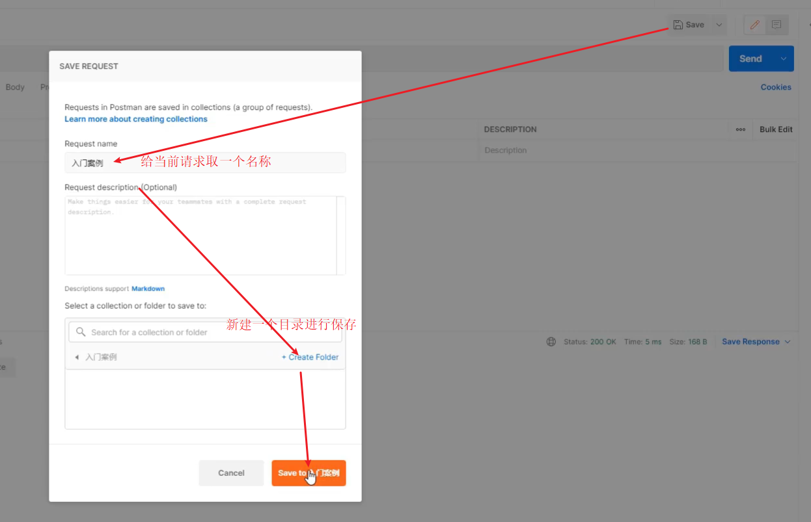

**注意:**第一次请求需要创建一个新的目录，后面就不需要创建新目录，直接保存到已经创建好的目录即可。


## 4、请求与响应

SpringMVC是web层的框架，主要的作用是接收请求、接收数据、响应结果

* 请求映射路径
* 请求参数
* 日期类型参数传递
* 响应json数据

### 4.1、设置请求映射路径

#### 4.1.1、环境准备

- 创建一个Web的Maven项目

- pom.xml添加Spring依赖

  ```xml
  <?xml version="1.0" encoding="UTF-8"?>
  
  <project xmlns="http://maven.apache.org/POM/4.0.0" xmlns:xsi="http://www.w3.org/2001/XMLSchema-instance"
    xsi:schemaLocation="http://maven.apache.org/POM/4.0.0 http://maven.apache.org/xsd/maven-4.0.0.xsd">
    <modelVersion>4.0.0</modelVersion>
  
    <groupId>com.goes</groupId>
    <artifactId>springmvc_03_request_mapping</artifactId>
    <version>1.0-SNAPSHOT</version>
    <packaging>war</packaging>
  
    <dependencies>
      <dependency>
        <groupId>javax.servlet</groupId>
        <artifactId>javax.servlet-api</artifactId>
        <version>3.1.0</version>
        <scope>provided</scope>
      </dependency>
      <dependency>
        <groupId>org.springframework</groupId>
        <artifactId>spring-webmvc</artifactId>
        <version>5.2.10.RELEASE</version>
      </dependency>
    </dependencies>
  
    <build>
      <plugins>
        <plugin>
          <groupId>org.apache.tomcat.maven</groupId>
          <artifactId>tomcat7-maven-plugin</artifactId>
          <version>2.1</version>
          <configuration>
            <port>80</port>
            <path>/</path>
          </configuration>
        </plugin>
      </plugins>
    </build>
  </project>
  
  ```

- 创建对应的配置类

  ```java
  public class ServletContainersInitConfig extends AbstractAnnotationConfigDispatcherServletInitializer {
  
      protected Class<?>[] getServletConfigClasses() {
          return new Class[]{SpringMvcConfig.class};
      }
      protected String[] getServletMappings() {
          return new String[]{"/"};
      }
      protected Class<?>[] getRootConfigClasses() {
          return new Class[0];
      }
  }
  
  @Configuration
  @ComponentScan("com.goes.controller")
  public class SpringMvcConfig {
  }
  
  ```

- 编写BookController和UserController

  ```java
  @Controller
  public class UserController {
  
      @RequestMapping("/save")
      @ResponseBody
      public String save(){
          System.out.println("user save ...");
          return "{'module':'user save'}";
      }
      
      @RequestMapping("/delete")
      @ResponseBody
      public String save(){
          System.out.println("user delete ...");
          return "{'module':'user delete'}";
      }
  }
  
  @Controller
  public class BookController {
  
      @RequestMapping("/save")
      @ResponseBody
      public String save(){
          System.out.println("book save ...");
          return "{'module':'book save'}";
      }
  }
  ```

环境准备好后，启动Tomcat服务器，后台会报错:


从错误信息可以看出:

* UserController有一个save方法，访问路径为`http://localhost/save`
* BookController也有一个save方法，访问路径为`http://localhost/save`
* 当访问`http://localhost/saved`的时候，到底是访问UserController还是BookController?


#### 4.1.2、问题分析

团队开发中每人设置不同的请求路径，冲突问题该如何解决?

解决思路:为不同模块设置模块名作为请求路径前置

- 对于Book模块的save,将其访问路径设置`http://localhost/book/save`

- 对于User模块的save,将其访问路径设置`http://localhost/user/save`


#### 4.1.3、设置映射路径

##### 步骤1:修改Controller

```java
@Controller
public class UserController {

    @RequestMapping("/user/save")
    @ResponseBody
    public String save(){
        System.out.println("user save ...");
        return "{'module':'user save'}";
    }
    
    @RequestMapping("/user/delete")
    @ResponseBody
    public String save(){
        System.out.println("user delete ...");
        return "{'module':'user delete'}";
    }
}

@Controller
public class BookController {

    @RequestMapping("/book/save")
    @ResponseBody
    public String save(){
        System.out.println("book save ...");
        return "{'module':'book save'}";
    }
}
```

上述问题虽已解决，但是如果/user后期发生变化，所有的方法都需要改，耦合度太高。

##### 步骤2:优化路径配置

优化方案:

```java
@Controller
@RequestMapping("/user")
public class UserController {

    @RequestMapping("/save")
    @ResponseBody
    public String save(){
        System.out.println("user save ...");
        return "{'module':'user save'}";
    }
    
    @RequestMapping("/delete")
    @ResponseBody
    public String save(){
        System.out.println("user delete ...");
        return "{'module':'user delete'}";
    }
}

@Controller
@RequestMapping("/book")
public class BookController {

    @RequestMapping("/save")
    @ResponseBody
    public String save(){
        System.out.println("book save ...");
        return "{'module':'book save'}";
    }
}
```

**注意:**

* 当类上和方法上都添加了`@RequestMapping`注解，前端发送请求的时候，要和两个注解的value值相加匹配才能访问到。
* @RequestMapping注解value属性前面加不加`/`都可以


### 4.2 请求参数

只要确保页面发送请求地址和后台Controller类中配置的路径一致就可以接收到前端的请求，但是如何接收页面传递的参数?

关于请求参数的传递与接收是和请求方式有关系的，目前比较常见的两种请求方式为：

* GET
* POST

针对于不同的请求前端如何发送，后端如何接收?

#### 4.2.1、环境准备

- 创建一个Web的Maven项目

- pom.xml添加Spring依赖

  ```xml
  <?xml version="1.0" encoding="UTF-8"?>
  
  <project xmlns="http://maven.apache.org/POM/4.0.0" xmlns:xsi="http://www.w3.org/2001/XMLSchema-instance"
    xsi:schemaLocation="http://maven.apache.org/POM/4.0.0 http://maven.apache.org/xsd/maven-4.0.0.xsd">
    <modelVersion>4.0.0</modelVersion>
  
    <groupId>com.goes</groupId>
    <artifactId>springmvc_03_request_mapping</artifactId>
    <version>1.0-SNAPSHOT</version>
    <packaging>war</packaging>
  
    <dependencies>
      <dependency>
        <groupId>javax.servlet</groupId>
        <artifactId>javax.servlet-api</artifactId>
        <version>3.1.0</version>
        <scope>provided</scope>
      </dependency>
      <dependency>
        <groupId>org.springframework</groupId>
        <artifactId>spring-webmvc</artifactId>
        <version>5.2.10.RELEASE</version>
      </dependency>
    </dependencies>
  
    <build>
      <plugins>
        <plugin>
          <groupId>org.apache.tomcat.maven</groupId>
          <artifactId>tomcat7-maven-plugin</artifactId>
          <version>2.1</version>
          <configuration>
            <port>80</port>
            <path>/</path>
          </configuration>
        </plugin>
      </plugins>
    </build>
  </project>
  
  ```

- 创建对应的配置类

  ```java
  public class ServletContainersInitConfig extends AbstractAnnotationConfigDispatcherServletInitializer {
  
      protected Class<?>[] getServletConfigClasses() {
          return new Class[]{SpringMvcConfig.class};
      }
      protected String[] getServletMappings() {
          return new String[]{"/"};
      }
      protected Class<?>[] getRootConfigClasses() {
          return new Class[0];
      }
  }
  
  @Configuration
  @ComponentScan("com.goes.controller")
  public class SpringMvcConfig {
  }
  
  ```

- 编写UserController

  ```java
  @Controller
  public class UserController {
  
      @RequestMapping("/commonParam")
      @ResponseBody
      public String commonParam(){
          return "{'module':'commonParam'}";
      }
  }
  ```

* 编写模型类，User和Address

  ```java
  public class Address {
      private String province;
      private String city;
      //setter...getter...略
  }
  public class User {
      private String name;
      private int age;
      //setter...getter...略
  }
  ```

#### 4.2.2、参数传递

##### GET发送单个参数

发送请求与参数：`http://localhost/commonParam?name=itcast`

接收参数：

```java
@Controller
public class UserController {

    @RequestMapping("/commonParam")
    @ResponseBody
    public String commonParam(String name){
        System.out.println("普通参数传递 name ==> "+name);
        return "{'module':'commonParam'}";
    }
}
```

##### GET发送多个参数

发送请求与参数：`http://localhost/commonParam?name=itcast&age=15`

接收参数：

```java
@Controller
public class UserController {

    @RequestMapping("/commonParam")
    @ResponseBody
    public String commonParam(String name,int age){
        System.out.println("普通参数传递 name ==> "+name);
        System.out.println("普通参数传递 age ==> "+age);
        return "{'module':'commonParam'}";
    }
}
```

##### GET请求中文乱码

如果我们传递的参数中有中文，你会发现接收到的参数会出现中文乱码问题。

发送请求:`http://localhost/commonParam?name=张三&age=18`

控制台:


出现乱码的原因是IDEA中的Tomcat插件目前只到Tomcat7，Tomcat8.5以后的版本已经处理中文乱码的问题，因此修改pom.xml来解决GET请求中文乱码问题

```xml
<build>
    <plugins>
      <plugin>
        <groupId>org.apache.tomcat.maven</groupId>
        <artifactId>tomcat7-maven-plugin</artifactId>
        <version>2.1</version>
        <configuration>
          <port>80</port><!--tomcat端口号-->
          <path>/</path> <!--虚拟目录-->
          <uriEncoding>UTF-8</uriEncoding><!--访问路径编解码字符集-->
        </configuration>
      </plugin>
    </plugins>
  </build>
```

##### POST发送参数

发送请求与参数:

接收参数：

```java
@Controller
public class UserController {

    @RequestMapping("/commonParam")
    @ResponseBody
    public String commonParam(String name,int age){
        System.out.println("普通参数传递 name ==> "+name);
        System.out.println("普通参数传递 age ==> "+age);
        return "{'module':'commonParam'}";
    }
}
```

##### POST请求中文乱码

发送请求与参数:


接收参数:

控制台打印，会发现有中文乱码问题。


解决方案:配置过滤器

```java
public class ServletContainersInitConfig extends AbstractAnnotationConfigDispatcherServletInitializer {
    protected Class<?>[] getRootConfigClasses() {
        return new Class[0];
    }

    protected Class<?>[] getServletConfigClasses() {
        return new Class[]{SpringMvcConfig.class};
    }

    protected String[] getServletMappings() {
        return new String[]{"/"};
    }

    // 乱码处理
    @Override
    protected Filter[] getServletFilters() {
        // CharacterEncodingFilter是在spring-web包中，用之前需要导入对应的jar包
        CharacterEncodingFilter filter = new CharacterEncodingFilter();
        filter.setEncoding("UTF-8");
        return new Filter[]{filter};
    }
}
```


### 4.3、五种类型参数传递

前面我们已经能够使用GET或POST来发送请求和数据，所携带的数据都是比较简单的数据，接下来在这个基础上，我们来研究一些比较复杂的参数传递，常见的参数种类有:

* 普通参数
* POJO类型参数
* 嵌套POJO类型参数
* 数组类型参数
* 集合类型参数


#### 4.3.1、普通参数

* 普通参数:url地址传参，地址参数名与形参变量名相同，定义形参即可接收参数。


如果形参与地址参数名不一致该如何解决?

发送请求与参数：`http://localhost/commonParamDifferentName?name=张三&age=18`

后台接收参数:

```java
@RequestMapping("/commonParamDifferentName")
@ResponseBody
public String commonParamDifferentName(String userName , int age){
    System.out.println("普通参数传递 userName ==> "+userName);
    System.out.println("普通参数传递 age ==> "+age);
    return "{'module':'common param different name'}";
}
```

因为前端给的是`name`,后台接收使用的是`userName`,两个名称对不上，导致接收数据失败:


解决方案:使用@RequestParam注解

```java
@RequestMapping("/commonParamDifferentName")
    @ResponseBody
    public String commonParamDifferentName(@RequestPaam("name") String userName , int age){
        System.out.println("普通参数传递 userName ==> "+userName);
        System.out.println("普通参数传递 age ==> "+age);
        return "{'module':'common param different name'}";
    }
```

**注意:写上@RequestParam注解框架就不需要自己去解析注入，能提升框架处理性能**


#### 4.3.2、POJO数据类型

简单数据类型一般处理的是参数个数比较少的请求，如果参数比较多，后台接收参数就比较复杂，这时可以考虑使用POJO数据类型。

* POJO参数：请求参数名与形参对象属性名相同，定义POJO类型形参即可接收参数

User类

```java
public class User {
    private String name;
    private int age;
    //setter...getter...略
}
```

发送请求和参数:


后台接收参数:

```java
//POJO参数：请求参数与形参对象中的属性对应即可完成参数传递
@RequestMapping("/pojoParam")
@ResponseBody
public String pojoParam(User user){
    System.out.println("pojo参数传递 user ==> "+user);
    return "{'module':'pojo param'}";
}
```

**注意:**

* POJO参数接收，前端GET和POST发送请求数据的方式不变。
* 请求参数key的名称要和POJO中属性的名称一致，否则无法封装。


#### 4.3.3、嵌套POJO类型参数

如果POJO对象中嵌套了其他的POJO类，如

```java
public class Address {
    private String province;
    private String city;
    //setter...getter...略
}
public class User {
    private String name;
    private int age;
    private Address address;
    //setter...getter...略
}
```

* 嵌套POJO参数：请求参数名与形参对象属性名相同，按照对象层次结构关系即可接收嵌套POJO属性参数

发送请求和参数:


后台接收参数:

```java
//POJO参数：请求参数与形参对象中的属性对应即可完成参数传递
@RequestMapping("/pojoParam")
@ResponseBody
public String pojoParam(User user){
    System.out.println("pojo参数传递 user ==> "+user);
    return "{'module':'pojo param'}";
}
```

**注意:**请求参数key的名称要和POJO中属性的名称一致，否则无法封装


#### 4.3.4、数组类型参数

如果前端需要获取用户的爱好，爱好绝大多数情况下都是多个，如何发送请求数据和接收数据呢?

* 数组参数：请求参数名与形参对象属性名相同且请求参数为多个，定义数组类型即可接收参数

发送请求和参数:


后台接收参数:

```java
  //数组参数：同名请求参数可以直接映射到对应名称的形参数组对象中
    @RequestMapping("/arrayParam")
    @ResponseBody
    public String arrayParam(String[] likes){
        System.out.println("数组参数传递 likes ==> "+ Arrays.toString(likes));
        return "{'module':'array param'}";
    }
```


#### 4.3.5、集合类型参数

数组能接收多个值，那么集合是否也可以实现这个功能呢?

发送请求和参数:


后台接收参数:

```java
//集合参数：同名请求参数可以使用@RequestParam注解映射到对应名称的集合对象中作为数据
@RequestMapping("/listParam")
@ResponseBody
public String listParam(List<String> likes){
    System.out.println("集合参数传递 likes ==> "+ likes);
    return "{'module':'list param'}";
}
```

运行会报错:


错误的原因是:SpringMVC将List看做是一个POJO对象来处理，将其创建一个对象并准备把前端的数据封装到对象中，但是List是一个接口无法创建对象，所以报错。

解决方案是:使用`@RequestParam`注解

```java
//集合参数：同名请求参数可以使用@RequestParam注解映射到对应名称的集合对象中作为数据
@RequestMapping("/listParam")
@ResponseBody
public String listParam(@RequestParam List<String> likes){
    System.out.println("集合参数传递 likes ==> "+ likes);
    return "{'module':'list param'}";
}
```

* 集合保存普通参数：请求参数名与形参集合对象名相同且请求参数为多个，@RequestParam绑定参数关系
* 对于简单数据类型使用数组会比集合更简单些。


> 🔔**知识点1：@RequestParam**
>
> | 名称     | @RequestParam                                          |
> | -------- | ------------------------------------------------------ |
> | 类型     | 形参注解                                               |
> | 位置     | SpringMVC控制器方法形参定义前面                        |
> | 作用     | 绑定请求参数与处理器方法形参间的关系                   |
> | 相关参数 | required：是否为必传参数 <br/>defaultValue：参数默认值 |


### 4.4、JSON数据传输参数

前面我们说过，现在比较流行的开发方式为异步调用。前后台以异步方式进行交换，传输的数据使用的是==JSON==,所以前端如果发送的是JSON数据，后端该如何接收?

对于JSON数据类型，我们常见的有三种:

- json普通数组（["value1","value2","value3",...]）
- json对象（{key1:value1,key2:value2,...}）
- json对象数组（[{key1:value1,...},{key2:value2,...}]）

对于上述数据，前端如何发送，后端如何接收?


#### JSON普通数组

###### 步骤1:pom.xml添加依赖

SpringMVC默认使用的是jackson来处理json的转换，所以需要在pom.xml添加jackson依赖

```xml
<dependency>
    <groupId>com.fasterxml.jackson.core</groupId>
    <artifactId>jackson-databind</artifactId>
    <version>2.9.0</version>
</dependency>
```

###### 步骤2:PostMan发送JSON数据


###### 步骤3:开启SpringMVC注解支持

在SpringMVC的配置类中开启SpringMVC的注解支持，包含将JSON转换成对象的功能。

```java
@Configuration
@ComponentScan("com.goes.controller")
//开启json数据类型自动转换
@EnableWebMvc
public class SpringMvcConfig {
}
```

###### 步骤4:参数前添加@RequestBody

```java
//使用@RequestBody注解将外部传递的json数组数据映射到形参的集合对象中作为数据
@RequestMapping("/listParamForJson")
@ResponseBody
public String listParamForJson(@RequestBody List<String> likes){
    System.out.println("list common(json)参数传递 list ==> "+likes);
    return "{'module':'list common for json param'}";
}
```

###### 步骤5:启动运行程序


JSON普通数组的数据就已经传递完成，下面针对JSON对象数据和JSON对象数组的数据该如何传递呢?


#### JSON对象数据

只需要关注请求和数据如何发送?后端数据如何接收?

请求和数据的发送:

```json
{
	"name":"itcast",
	"age":15
}
```


后端接收数据：

```java
@RequestMapping("/pojoParamForJson")
@ResponseBody
public String pojoParamForJson(@RequestBody User user){
    System.out.println("pojo(json)参数传递 user ==> "+user);
    return "{'module':'pojo for json param'}";
}
```

启动程序访问测试


**说明:**

address为null的原因是前端没有传递数据给后端。

如果想要address也有数据，我们需求修改前端传递的数据内容:

```json
{
	"name":"itcast",
	"age":15,
    "address":{
        "province":"beijing",
        "city":"beijing"
    }
}
```

再次发送请求，就能看到address中的数据

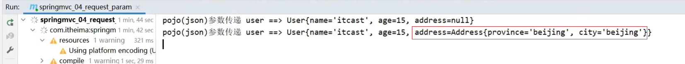


#### JSON对象数组

集合中保存多个POJO该如何实现?

请求和数据的发送:

```json
[
    {"name":"myhikari","age":15},
    {"name":"goes","age":12}
]
```

 

后端接收数据:

```java
@RequestMapping("/listPojoParamForJson")
@ResponseBody
public String listPojoParamForJson(@RequestBody List<User> list){
    System.out.println("list pojo(json)参数传递 list ==> "+list);
    return "{'module':'list pojo for json param'}";
}
```

启动程序访问测试


#### 小结

SpringMVC接收JSON数据的实现步骤为:

(1)导入jackson包

(2)使用PostMan发送JSON数据

(3)开启SpringMVC注解驱动，在配置类上添加@EnableWebMvc注解

(4)Controller方法的参数前添加@RequestBody注解


> **知识点1：@EnableWebMvc**
>
> | 名称 | @EnableWebMvc             |
> | ---- | ------------------------- |
> | 类型 | 配置类注解                |
> | 位置 | SpringMVC配置类定义上方   |
> | 作用 | 开启SpringMVC多项辅助功能 |
>
> **知识点2：@RequestBody**
>
> | 名称 | @RequestBody                                                 |
> | ---- | ------------------------------------------------------------ |
> | 类型 | 形参注解                                                     |
> | 位置 | SpringMVC控制器方法形参定义前面                              |
> | 作用 | 将请求中请求体所包含的数据传递给请求参数，此注解一个处理器方法只能使用一次 |
>
> **@RequestBody与@RequestParam区别**
>
> * 区别
>   * @RequestParam用于接收url地址传参，表单传参【application/x-www-form-urlencoded】
>   * @RequestBody用于接收json数据【application/json】
>
> * 应用
>   * 后期开发中，发送json格式数据为主，@RequestBody应用较广
>   * 如果发送非json格式数据，选用@RequestParam接收请求参数


### 4.5、日期类型参数传递

接下来处理一种开发中比较常见的一种数据类型：`日期类型`

日期类型比较特殊，因为对于日期的格式有N多中输入方式，比如:

* 2088-08-18
* 2088/08/18
* 08/18/2088
* ......

针对这么多日期格式，SpringMVC该如何接收，它能很好的处理日期类型数据么?

#### 步骤1:编写方法接收日期数据

在UserController类中添加方法，把参数设置为日期类型

```java
@RequestMapping("/dataParam")
@ResponseBody
public String dataParam(Date date)
    System.out.println("参数传递 date ==> "+date);
    return "{'module':'data param'}";
}
```

#### 步骤2:启动Tomcat服务器

查看控制台是否报错，如果有错误，先解决错误。

#### 步骤3:使用PostMan发送请求

使用PostMan发送GET请求，并设置date参数

`http://localhost/dataParam?date=2088/08/08`


#### 步骤4:查看控制台


通过打印，我们发现SpringMVC可以接收日期数据类型，并将其打印在控制台。


如果把日期参数的格式改成其他的，SpringMVC还能处理么?

#### 步骤5:更换日期格式

为了能更好的看到程序运行的结果，在方法中多添加一个日期参数

```java
@RequestMapping("/dataParam")
@ResponseBody
public String dataParam(Date date,Date date1)
    System.out.println("参数传递 date ==> "+date);
    return "{'module':'data param'}";
}
```

使用PostMan发送请求，携带两个不同的日期格式，

`http://localhost/dataParam?date=2088/08/08&date1=2088-08-08`


发送请求和数据后，页面会报400，控制台会报出一个错误

```
Resolved [org.springframework.web.method.annotation.==MethodArgumentTypeMismatchException==: Failed to convert value of type 'java.lang.String' to required type 'java.util.Date'; nested exception is org.springframework.core.convert.==ConversionFailedException==: Failed to convert from type [java.lang.String] to type [java.util.Date] for value '2088-08-08'; nested exception is java.lang.IllegalArgumentException]
```

从错误信息可以看出，错误的原因是在将`2088-08-08`转换成日期类型的时候失败，原因是SpringMVC默认支持的字符串转日期的格式为`yyyy/MM/dd`,而现在传递的不符合其默认格式，SpringMVC就无法进行格式转换，所以报错。


解决方案也比较简单，需要使用`@DateTimeFormat`

```java
@RequestMapping("/dataParam")
@ResponseBody
public String dataParam(Date date,
                        @DateTimeFormat(pattern="yyyy-MM-dd") Date date1)
    System.out.println("参数传递 date ==> "+date);
	System.out.println("参数传递 date1(yyyy-MM-dd) ==> "+date1);
    return "{'module':'data param'}";
}
```

重新启动服务器，重新发送请求测试，SpringMVC就可以正确的进行日期转换

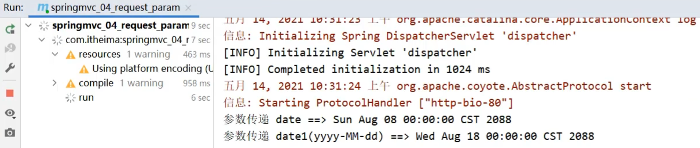

#### 步骤6:携带时间的日期

接下来我们再来发送一个携带时间的日期，看下SpringMVC该如何处理?

先修改UserController类，添加第三个参数

```java
@RequestMapping("/dataParam")
@ResponseBody
public String dataParam(Date date,
                        @DateTimeFormat(pattern="yyyy-MM-dd") Date date1,
                        @DateTimeFormat(pattern="yyyy/MM/dd HH:mm:ss") Date date2)
    System.out.println("参数传递 date ==> "+date);
	System.out.println("参数传递 date1(yyyy-MM-dd) ==> "+date1);
	System.out.println("参数传递 date2(yyyy/MM/dd HH:mm:ss) ==> "+date2);
    return "{'module':'data param'}";
}
```

使用PostMan发送请求，携带两个不同的日期格式，

`http://localhost/dataParam?date=2088/08/08&date1=2088-08-08&date2=2088/08/08 8:08:08`


重新启动服务器，重新发送请求测试，SpringMVC就可以将日期时间的数据进行转换


知识点1：@DateTimeFormat

| 名称     | @DateTimeFormat                 |
| -------- | ------------------------------- |
| 类型     | 形参注解                        |
| 位置     | SpringMVC控制器方法形参前面     |
| 作用     | 设定日期时间型数据格式          |
| 相关属性 | pattern：指定日期时间格式字符串 |


#### 内部实现原理

* 前端传递字符串，后端使用日期Date接收
* 前端传递JSON数据，后端使用对象接收
* 前端传递字符串，后端使用Integer接收
* 后台需要的数据类型有很多中
* 在数据的传递过程中存在很多类型的转换

> 问:谁来做这个类型转换?
>
> 答:SpringMVC
>
> 问:SpringMVC是如何实现类型转换的?
>
> 答:SpringMVC中提供很多类型转换接口和实现类

在框架中有一些类型转换接口，其中有:

1. Converter接口

   ```java
   /**
   *	S: the source type
   *	T: the target type
   */
   public interface Converter<S, T> {
       @Nullable
       //该方法就是将从页面上接收的数据(S)转换成我们想要的数据类型(T)返回
       T convert(S source);
   }
   ```

   **注意:Converter所属的包为`org.springframework.core.convert.converter`**

   Converter接口的实现类

   

   框架中有提供很多对应Converter接口的实现类，用来实现不同数据类型之间的转换,如:

   请求参数年龄数据（String→Integer）

   日期格式转换（String → Date）

2. HttpMessageConverter接口

   该接口是实现对象与JSON之间的转换工作


**注意:SpringMVC的配置类把@EnableWebMvc当做标配配置上去，不要省略**


### 4.6、响应

SpringMVC接收到请求和数据后，进行一些了的处理，处理完以后，都需要将结果告知给用户。

比如:根据用户ID查询用户信息、查询用户列表、新增用户等。

对于响应，主要就包含两部分内容：

* 响应页面
* 响应数据
  * 文本数据
  * json数据

异步调用是目前常用的主流方式，因此需要更关注的就是如何返回JSON数据，对于其他只需要认识了解即可。


#### 4.6.1、环境准备

- 创建一个Web的Maven项目

- pom.xml添加Spring依赖

  ```xml
  <?xml version="1.0" encoding="UTF-8"?>
  
  <project xmlns="http://maven.apache.org/POM/4.0.0" xmlns:xsi="http://www.w3.org/2001/XMLSchema-instance"
    xsi:schemaLocation="http://maven.apache.org/POM/4.0.0 http://maven.apache.org/xsd/maven-4.0.0.xsd">
    <modelVersion>4.0.0</modelVersion>
  
    <groupId>com.goes</groupId>
    <artifactId>springmvc_05_response</artifactId>
    <version>1.0-SNAPSHOT</version>
    <packaging>war</packaging>
  
    <dependencies>
      <dependency>
        <groupId>javax.servlet</groupId>
        <artifactId>javax.servlet-api</artifactId>
        <version>3.1.0</version>
        <scope>provided</scope>
      </dependency>
      <dependency>
        <groupId>org.springframework</groupId>
        <artifactId>spring-webmvc</artifactId>
        <version>5.2.10.RELEASE</version>
      </dependency>
      <dependency>
        <groupId>com.fasterxml.jackson.core</groupId>
        <artifactId>jackson-databind</artifactId>
        <version>2.9.0</version>
      </dependency>
    </dependencies>
  
    <build>
      <plugins>
        <plugin>
          <groupId>org.apache.tomcat.maven</groupId>
          <artifactId>tomcat7-maven-plugin</artifactId>
          <version>2.1</version>
          <configuration>
            <port>80</port>
            <path>/</path>
          </configuration>
        </plugin>
      </plugins>
    </build>
  </project>
  
  ```

- 创建对应的配置类

  ```java
  public class ServletContainersInitConfig extends AbstractAnnotationConfigDispatcherServletInitializer {
      protected Class<?>[] getRootConfigClasses() {
          return new Class[0];
      }
  
      protected Class<?>[] getServletConfigClasses() {
          return new Class[]{SpringMvcConfig.class};
      }
  
      protected String[] getServletMappings() {
          return new String[]{"/"};
      }
  
      //乱码处理
      @Override
      protected Filter[] getServletFilters() {
          CharacterEncodingFilter filter = new CharacterEncodingFilter();
          filter.setEncoding("UTF-8");
          return new Filter[]{filter};
      }
  }
  
  @Configuration
  @ComponentScan("com.goes.controller")
  //开启json数据类型自动转换
  @EnableWebMvc
  public class SpringMvcConfig {
  }
  
  
  ```

- 编写模型类User

  ```java
  public class User {
      private String name;
      private int age;
      //getter...setter...toString省略
  }
  ```

- webapp下创建page.jsp

  ```jsp
  <html>
  <body>
  <h2>Hello Spring MVC!</h2>
  </body>
  </html>
  ```

- 编写UserController

  ```java
  @Controller
  public class UserController {
  
      
  }
  ```


#### 4.6.2、响应页面[了解]

##### 步骤1:设置返回页面

```java
@Controller
public class UserController {
    
    @RequestMapping("/toJumpPage")
    //注意
    //1.此处不能添加@ResponseBody,如果加了该注入，会直接将page.jsp当字符串返回前端
    //2.方法需要返回String
    public String toJumpPage(){
        System.out.println("跳转页面");
        return "page.jsp";
    }
    
}
```

##### 步骤2:启动程序测试

此处涉及到页面跳转，所以不适合采用PostMan进行测试，直接打开浏览器，输入`http://localhost/toJumpPage`


#### 4.6.3、返回文本数据[了解]

##### 步骤1:设置返回文本内容

```java
@Controller
public class UserController {
    
   	@RequestMapping("/toText")
	//注意此处该注解就不能省略，如果省略了,会把response text当前页面名称去查找，如果没有回报404错误
    @ResponseBody
    public String toText(){
        System.out.println("返回纯文本数据");
        return "response text";
    }
    
}
```

##### 步骤2:启动程序测试

由于发送的是GET请求，此处不涉及到页面跳转，可使用浏览器也可使用PostMan进行测试，输入地址`http://localhost/toText`访问


#### 4.6.4、响应JSON数据

##### 响应POJO对象

```java
@Controller
public class UserController {
    
    @RequestMapping("/toJsonPOJO")
    @ResponseBody
    public User toJsonPOJO(){
        System.out.println("返回json对象数据");
        User user = new User();
        user.setName("itcast");
        user.setAge(15);
        return user;
    }
    
}
```

设置返回值为实体类类型，即可实现返回对应对象的json数据，需要依赖@ResponseBody注解和@EnableWebMvc注解

重新启动服务器，访问`http://localhost/toJsonPOJO`


##### 响应POJO集合对象

```java
@Controller
public class UserController {
    
    @RequestMapping("/toJsonList")
    @ResponseBody
    public List<User> toJsonList(){
        System.out.println("返回json集合数据");
        User user1 = new User();
        user1.setName("传智播客");
        user1.setAge(15);

        User user2 = new User();
        user2.setName("程序员");
        user2.setAge(12);

        List<User> userList = new ArrayList<User>();
        userList.add(user1);
        userList.add(user2);

        return userList;
    }
    
}
```

重新启动服务器，访问`http://localhost/toJsonList`


知识点1：@ResponseBody

| 名称     | @ResponseBody                                                |
| -------- | ------------------------------------------------------------ |
| 类型     | ==方法\类注解==                                              |
| 位置     | SpringMVC控制器方法定义上方和控制类上                        |
| 作用     | 设置当前控制器返回值作为响应体,<br/>写在类上，该类的所有方法都有该注解功能 |
| 相关属性 | pattern：指定日期时间格式字符串                              |

**说明:**

* 该注解可以写在类上或者方法上
* 写在类上就是该类下的所有方法都有@ReponseBody功能
* 当方法上有@ReponseBody注解后
  * 方法的返回值为字符串，会将其作为文本内容直接响应给前端
  * 方法的返回值为对象，会将对象转换成JSON响应给前端

此处又使用到了类型转换，内部还是通过Converter接口的实现类完成的，所以Converter除了前面所说的功能外，它还可以实现:

* 对象转Json数据(POJO -> json)
* 集合转Json数据(Collection -> json)


## 5、Rest风格

### 5.1、REST简介

* REST（Representational State Transfer），表现形式状态转换,它是一种软件架构风格

  当我们想表示一个网络资源的时候，可以使用两种方式:

  * 传统风格资源描述形式
    * `http://localhost/user/getById?id=1` 查询id为1的用户信息
    * `http://localhost/user/saveUser` 保存用户信息
  * REST风格描述形式
    * `http://localhost/user/1` 
    * `http://localhost/user`

REST的优点有:

- 隐藏资源的访问行为，无法通过地址得知对资源是何种操作
- 书写简化

问题：如何区分该请求到底是什么操作呢?

* 按照REST风格访问资源时使用==行为动作==区分对资源进行了何种操作
  * `http://localhost/users`	查询全部用户信息 GET（查询）
  * `http://localhost/users/1`  查询指定用户信息 GET（查询）
  * `http://localhost/users`    添加用户信息    POST（新增/保存）
  * `http://localhost/users`    修改用户信息    PUT（修改/更新）
  * `http://localhost/users/1`  删除用户信息    DELETE（删除）

请求的方式比较多，但是比较常用的就4种，分别是`GET`,`POST`,`PUT`,`DELETE`。

按照不同的请求方式代表不同的操作类型。

* 发送GET请求是用来做查询
* 发送POST请求是用来做新增
* 发送PUT请求是用来做修改
* 发送DELETE请求是用来做删除

但是注意:

* 上述行为是约定方式，约定不是规范，可以打破，所以称REST风格，而不是REST规范
  * REST提供对应的架构方式，按照这种架构设计项目可以降低开发的复杂性，提高系统的可伸缩性
  * REST中规定GET/POST/PUT/DELETE针对的是查询/新增/修改/删除，但是如果非要用GET请求做删除，这点在程序上运行是可以实现的
  * 但是如果绝大多数人都遵循这种风格，你写的代码让别人读起来就有点莫名其妙。
* 描述模块的名称通常使用复数，也就是加s的格式描述，表示此类资源，而非单个资源，例如:users、books、accounts......

清楚什么是REST风格后，后期会经常提到一个概念叫`RESTful`，那什么又是RESTful呢?

* 根据REST风格对资源进行访问称为RESTful。

后期在进行开发的过程中，大多是都是遵从REST风格来访问我们的后台服务，所以以后都是基于RESTful来进行开发的。


### 5.2 RESTful入门案例

#### 5.2.1、环境准备

- 创建一个Web的Maven项目

- pom.xml添加Spring依赖

  ```xml
  <?xml version="1.0" encoding="UTF-8"?>
  
  <project xmlns="http://maven.apache.org/POM/4.0.0" xmlns:xsi="http://www.w3.org/2001/XMLSchema-instance"
    xsi:schemaLocation="http://maven.apache.org/POM/4.0.0 http://maven.apache.org/xsd/maven-4.0.0.xsd">
    <modelVersion>4.0.0</modelVersion>
  
    <groupId>com.goes</groupId>
    <artifactId>springmvc_06_rest</artifactId>
    <version>1.0-SNAPSHOT</version>
    <packaging>war</packaging>
  
    <dependencies>
      <dependency>
        <groupId>javax.servlet</groupId>
        <artifactId>javax.servlet-api</artifactId>
        <version>3.1.0</version>
        <scope>provided</scope>
      </dependency>
      <dependency>
        <groupId>org.springframework</groupId>
        <artifactId>spring-webmvc</artifactId>
        <version>5.2.10.RELEASE</version>
      </dependency>
      <dependency>
        <groupId>com.fasterxml.jackson.core</groupId>
        <artifactId>jackson-databind</artifactId>
        <version>2.9.0</version>
      </dependency>
    </dependencies>
  
    <build>
      <plugins>
        <plugin>
          <groupId>org.apache.tomcat.maven</groupId>
          <artifactId>tomcat7-maven-plugin</artifactId>
          <version>2.1</version>
          <configuration>
            <port>80</port>
            <path>/</path>
          </configuration>
        </plugin>
      </plugins>
    </build>
  </project>
  
  ```

- 创建对应的配置类

  ```java
  public class ServletContainersInitConfig extends AbstractAnnotationConfigDispatcherServletInitializer {
      protected Class<?>[] getRootConfigClasses() {
          return new Class[0];
      }
  
      protected Class<?>[] getServletConfigClasses() {
          return new Class[]{SpringMvcConfig.class};
      }
  
      protected String[] getServletMappings() {
          return new String[]{"/"};
      }
  
      //乱码处理
      @Override
      protected Filter[] getServletFilters() {
          CharacterEncodingFilter filter = new CharacterEncodingFilter();
          filter.setEncoding("UTF-8");
          return new Filter[]{filter};
      }
  }
  
  @Configuration
  @ComponentScan("com.goes.controller")
  //开启json数据类型自动转换
  @EnableWebMvc
  public class SpringMvcConfig {
  }
  ```

- 编写模型类User和Book

  ```java
  public class User {
      private String name;
      private int age;
      //getter...setter...toString省略
  }
  
  public class Book {
      private String name;
      private double price;
       //getter...setter...toString省略
  }
  ```

- 编写UserController和BookController

  ```java
  @Controller
  public class UserController {
  	@RequestMapping("/save")
      @ResponseBody
      public String save(@RequestBody User user) {
          System.out.println("user save..."+user);
          return "{'module':'user save'}";
      }
  
      @RequestMapping("/delete")
      @ResponseBody
      public String delete(Integer id) {
          System.out.println("user delete..." + id);
          return "{'module':'user delete'}";
      }
  
      @RequestMapping("/update")
      @ResponseBody
      public String update(@RequestBody User user) {
          System.out.println("user update..." + user);
          return "{'module':'user update'}";
      }
  
      @RequestMapping("/getById")
      @ResponseBody
      public String getById(Integer id) {
          System.out.println("user getById..." + id);
          return "{'module':'user getById'}";
      }
  
      @RequestMapping("/findAll")
      @ResponseBody
      public String getAll() {
          System.out.println("user getAll...");
          return "{'module':'user getAll'}";
      }
  }
  
  
  @Controller
  public class BookController {
      
  	@RequestMapping(value = "/books",method = RequestMethod.POST)
      @ResponseBody
      public String save(@RequestBody Book book){
          System.out.println("book save..." + book);
          return "{'module':'book save'}";
      }
  
      @RequestMapping(value = "/books/{id}",method = RequestMethod.DELETE)
      @ResponseBody
      public String delete(@PathVariable Integer id){
          System.out.println("book delete..." + id);
          return "{'module':'book delete'}";
      }
  
      @RequestMapping(value = "/books",method = RequestMethod.PUT)
      @ResponseBody
      public String update(@RequestBody Book book){
          System.out.println("book update..." + book);
          return "{'module':'book update'}";
      }
  
      @RequestMapping(value = "/books/{id}",method = RequestMethod.GET)
      @ResponseBody
      public String getById(@PathVariable Integer id){
          System.out.println("book getById..." + id);
          return "{'module':'book getById'}";
      }
  
      @RequestMapping(value = "/books",method = RequestMethod.GET)
      @ResponseBody
      public String getAll(){
          System.out.println("book getAll...");
          return "{'module':'book getAll'}";
      }
      
  }
  ```


#### 5.2.2、思路分析

> 需求:将之前的增删改查替换成RESTful的开发方式。
>
> 1.之前不同的请求有不同的路径,现在要将其修改为统一的请求路径
>
> 修改前: 新增: /save ,修改: /update,删除 /delete...
>
> 修改后: 增删改查: /users
>
> 2.根据GET查询、POST新增、PUT修改、DELETE删除对方法的请求方式进行限定
>
> 3.发送请求的过程中如何设置请求参数?


#### 5.2.3、修改RESTful风格

##### 新增

```java
@Controller
public class UserController {
	//设置当前请求方法为POST，表示REST风格中的添加操作
    @RequestMapping(value = "/users",method = RequestMethod.POST)
    @ResponseBody
    public String save() {
        System.out.println("user save...");
        return "{'module':'user save'}";
    }
}
```

* 将请求路径更改为`/users`

  * 访问该方法使用 POST: `http://localhost/users`

* 使用method属性限定该方法的访问方式为`POST`

  * 如果发送的不是POST请求，比如发送GET请求，则会报错

    

##### 删除

```java
@Controller
public class UserController {
    //设置当前请求方法为DELETE，表示REST风格中的删除操作
	@RequestMapping(value = "/users",method = RequestMethod.DELETE)
    @ResponseBody
    public String delete(Integer id) {
        System.out.println("user delete..." + id);
        return "{'module':'user delete'}";
    }
}
```

* 将请求路径更改为`/users`
  - 访问该方法使用 DELETE: `http://localhost/users`


但是删除方法没有携带所要删除数据的id，如何针对RESTful的开发携带数据参数?

**传递路径参数**

前端发送请求的时候使用:`http://localhost/users/1`,路径中的`1`就是想要传递的参数。

后端获取参数，需要做如下修改:

* 修改@RequestMapping的value属性，将其中修改为`/users/{id}`，目的是和路径匹配
* 在方法的形参前添加@PathVariable注解

```java
@Controller
public class UserController {
    //设置当前请求方法为DELETE，表示REST风格中的删除操作
	@RequestMapping(value = "/users/{id}",method = RequestMethod.DELETE)
    @ResponseBody
    public String delete(@PathVariable Integer id) {
        System.out.println("user delete..." + id);
        return "{'module':'user delete'}";
    }
}
```

**思考如下两个问题:**

1. 如果方法形参的名称和路径`{}`中的值不一致，该怎么办?

   使用注解 `@ PathVariable` => `@PathVariable("param")`，只要 `param` 与 路径参数 `{}` 保持一致即可。

2. 如果有多个参数需要传递该如何编写?

   前端发送请求的时候使用:`http://localhost/users/1/tom`,路径中的`1`和`tom`就是我们想要传递的两个参数。

   后端获取参数，需要做如下修改:

   ```java
   @Controller
   public class UserController {
       //设置当前请求方法为DELETE，表示REST风格中的删除操作
   	@RequestMapping(value = "/users/{id}/{name}",method = RequestMethod.DELETE)
       @ResponseBody
       public String delete(@PathVariable Integer id,@PathVariable String name) {
           System.out.println("user delete..." + id+","+name);
           return "{'module':'user delete'}";
       }
   }
   ```


##### 修改

```java
@Controller
public class UserController {
    //设置当前请求方法为PUT，表示REST风格中的修改操作
    @RequestMapping(value = "/users",method = RequestMethod.PUT)
    @ResponseBody
    public String update(@RequestBody User user) {
        System.out.println("user update..." + user);
        return "{'module':'user update'}";
    }
}
```

- 将请求路径更改为`/users`

  - 访问该方法使用 PUT: `http://localhost/users`

- 访问并携带参数:

  

##### 根据ID查询

```java
@Controller
public class UserController {
    //设置当前请求方法为GET，表示REST风格中的查询操作
    @RequestMapping(value = "/users/{id}" ,method = RequestMethod.GET)
    @ResponseBody
    public String getById(@PathVariable Integer id){
        System.out.println("user getById..."+id);
        return "{'module':'user getById'}";
    }
}
```

将请求路径更改为`/users`

- 访问该方法使用 GET: `http://localhost/users/666`

##### 查询所有

```java
@Controller
public class UserController {
    //设置当前请求方法为GET，表示REST风格中的查询操作
    @RequestMapping(value = "/users" ,method = RequestMethod.GET)
    @ResponseBody
    public String getAll() {
        System.out.println("user getAll...");
        return "{'module':'user getAll'}";
    }
}
```

将请求路径更改为`/users`

- 访问该方法使用 GET: `http://localhost/users`

**小结**

1. 设定Http请求动作(动词)

   ```java
   @RequestMapping(value="",method = RequestMethod.POST|GET|PUT|DELETE)
   ```

2. (2)设定请求参数(路径变量)

   ```java
   @RequestMapping(value="/users/=={id}==",method = RequestMethod.DELETE)
   @ReponseBody
   public String delete(@PathVariable Integer id){
   
   }
   ```


知识点1：@PathVariable

| 名称 | @PathVariable                                                |
| ---- | ------------------------------------------------------------ |
| 类型 | ==形参注解==                                                 |
| 位置 | SpringMVC控制器方法形参定义前面                              |
| 作用 | 绑定路径参数与处理器方法形参间的关系，要求路径参数名与形参名一一对应 |

关于接收参数的三个注解`@RequestBody`、`@RequestParam`、`@PathVariable`,这三个注解之间的区别和应用分别是什么?

* 区别
  * @RequestParam用于接收url地址传参或表单传参
  * @RequestBody用于接收json数据
  * @PathVariable用于接收路径参数，使用{参数名称}描述路径参数
* 应用
  * 后期开发中，发送请求参数超过1个时，以json格式为主，@RequestBody应用较广
  * 如果发送非json格式数据，选用@RequestParam接收请求参数
  * 采用RESTful进行开发，当参数数量较少时，例如1个，可以采用@PathVariable接收请求路径变量，通常用于传递id值


### 5.3、RESTful快速开发

RESTful的开发的重复性工作！


问题1：每个方法的@RequestMapping注解中都定义了访问路径/books，重复性太高。

问题2：每个方法的@RequestMapping注解中都要使用method属性定义请求方式，重复性太高。

问题3：每个方法响应json都需要加上@ResponseBody注解，重复性太高。

对于上面所提的这三个问题，具体该如何解决?

```java
@RestController //@Controller + ReponseBody
@RequestMapping("/books")
public class BookController {
    
	//@RequestMapping(method = RequestMethod.POST)
    @PostMapping
    public String save(@RequestBody Book book){
        System.out.println("book save..." + book);
        return "{'module':'book save'}";
    }

    //@RequestMapping(value = "/{id}",method = RequestMethod.DELETE)
    @DeleteMapping("/{id}")
    public String delete(@PathVariable Integer id){
        System.out.println("book delete..." + id);
        return "{'module':'book delete'}";
    }

    //@RequestMapping(method = RequestMethod.PUT)
    @PutMapping
    public String update(@RequestBody Book book){
        System.out.println("book update..." + book);
        return "{'module':'book update'}";
    }

    //@RequestMapping(value = "/{id}",method = RequestMethod.GET)
    @GetMapping("/{id}")
    public String getById(@PathVariable Integer id){
        System.out.println("book getById..." + id);
        return "{'module':'book getById'}";
    }

    //@RequestMapping(method = RequestMethod.GET)
    @GetMapping
    public String getAll(){
        System.out.println("book getAll...");
        return "{'module':'book getAll'}";
    }
    
}
```

对于刚才的问题，我们都有对应的解决方案：

问题1：每个方法的@RequestMapping注解中都定义了访问路径/books，重复性太高。

```
将@RequestMapping提到类上面，用来定义所有方法共同的访问路径。
```

问题2：每个方法的@RequestMapping注解中都要使用method属性定义请求方式，重复性太高。

```
使用@GetMapping  @PostMapping  @PutMapping  @DeleteMapping代替
```

问题3：每个方法响应json都需要加上@ResponseBody注解，重复性太高。

```
1.将ResponseBody提到类上面，让所有的方法都有@ResponseBody的功能
2.使用@RestController注解替换@Controller与@ResponseBody注解，简化书写
```


> **知识点1：@RestController**
>
> | 名称 | @RestController                                              |
> | ---- | ------------------------------------------------------------ |
> | 类型 | ==类注解==                                                   |
> | 位置 | 基于SpringMVC的RESTful开发控制器类定义上方                   |
> | 作用 | 设置当前控制器类为RESTful风格，<br/>等同于@Controller与@ResponseBody两个注解组合功能 |
>
> **知识点2：@GetMapping @PostMapping @PutMapping @DeleteMapping**
>
> | 名称     | @GetMapping @PostMapping @PutMapping @DeleteMapping          |
> | -------- | ------------------------------------------------------------ |
> | 类型     | ==方法注解==                                                 |
> | 位置     | 基于SpringMVC的RESTful开发控制器方法定义上方                 |
> | 作用     | 设置当前控制器方法请求访问路径与请求动作，每种对应一个请求动作，<br/>例如@GetMapping对应GET请求 |
> | 相关属性 | value（默认）：请求访问路径                                  |


### 5.4 RESTful案例

#### 5.4.1 需求分析

需求一:图片列表查询，从后台返回数据，将数据展示在页面上


需求二:新增图片，将新增图书的数据传递到后台，并在控制台打印


**说明:**此次案例的重点是在SpringMVC中如何使用RESTful实现前后台交互，所以本案例并没有和数据库进行交互，所有数据使用`假`数据来完成开发。

步骤分析:

> 1.搭建项目导入jar包
>
> 2.编写Controller类，提供两个方法，一个用来做列表查询，一个用来做新增
>
> 3.在方法上使用RESTful进行路径设置
>
> 4.完成请求、参数的接收和结果的响应
>
> 5.使用PostMan进行测试
>
> 6.将前端页面拷贝到项目中
>
> 7.页面发送ajax请求
>
> 8.完成页面数据的展示

#### 5.4.2 环境准备

- 创建一个Web的Maven项目

- pom.xml添加Spring依赖

  ```xml
  <?xml version="1.0" encoding="UTF-8"?>
  
  <project xmlns="http://maven.apache.org/POM/4.0.0" xmlns:xsi="http://www.w3.org/2001/XMLSchema-instance"
    xsi:schemaLocation="http://maven.apache.org/POM/4.0.0 http://maven.apache.org/xsd/maven-4.0.0.xsd">
    <modelVersion>4.0.0</modelVersion>
  
    <groupId>com.goes</groupId>
    <artifactId>springmvc_07_rest_case</artifactId>
    <version>1.0-SNAPSHOT</version>
    <packaging>war</packaging>
  
    <dependencies>
      <dependency>
        <groupId>javax.servlet</groupId>
        <artifactId>javax.servlet-api</artifactId>
        <version>3.1.0</version>
        <scope>provided</scope>
      </dependency>
      <dependency>
        <groupId>org.springframework</groupId>
        <artifactId>spring-webmvc</artifactId>
        <version>5.2.10.RELEASE</version>
      </dependency>
      <dependency>
        <groupId>com.fasterxml.jackson.core</groupId>
        <artifactId>jackson-databind</artifactId>
        <version>2.9.0</version>
      </dependency>
    </dependencies>
  
    <build>
      <plugins>
        <plugin>
          <groupId>org.apache.tomcat.maven</groupId>
          <artifactId>tomcat7-maven-plugin</artifactId>
          <version>2.1</version>
          <configuration>
            <port>80</port>
            <path>/</path>
          </configuration>
        </plugin>
      </plugins>
    </build>
  </project>
  
  ```

- 创建对应的配置类

  ```java
  public class ServletContainersInitConfig extends AbstractAnnotationConfigDispatcherServletInitializer {
      protected Class<?>[] getRootConfigClasses() {
          return new Class[0];
      }
  
      protected Class<?>[] getServletConfigClasses() {
          return new Class[]{SpringMvcConfig.class};
      }
  
      protected String[] getServletMappings() {
          return new String[]{"/"};
      }
  
      //乱码处理
      @Override
      protected Filter[] getServletFilters() {
          CharacterEncodingFilter filter = new CharacterEncodingFilter();
          filter.setEncoding("UTF-8");
          return new Filter[]{filter};
      }
  }
  
  @Configuration
  @ComponentScan("com.goes.controller")
  //开启json数据类型自动转换
  @EnableWebMvc
  public class SpringMvcConfig {
  }
  
  
  ```

- 编写模型类Book

  ```java
  public class Book {
      private Integer id;
      private String type;
      private String name;
      private String description;
      //setter...getter...toString略
  }
  ```

- 编写BookController

  ```java
  @Controller
  public class BookController {
  
      
  }
  ```

#### 5.4.2 后台接口开发

##### 步骤1:编写Controller类并使用RESTful进行配置

```java
@RestController
@RequestMapping("/books")
public class BookController {

    @PostMapping
    public String save(@RequestBody Book book){
        System.out.println("book save ==> "+ book);
        return "{'module':'book save success'}";
    }

 	@GetMapping
    public List<Book> getAll(){
        System.out.println("book getAll is running ...");
        List<Book> bookList = new ArrayList<Book>();

        Book book1 = new Book();
        book1.setType("计算机");
        book1.setName("SpringMVC入门教程");
        book1.setDescription("小试牛刀");
        bookList.add(book1);

        Book book2 = new Book();
        book2.setType("计算机");
        book2.setName("SpringMVC实战教程");
        book2.setDescription("一代宗师");
        bookList.add(book2);

        Book book3 = new Book();
        book3.setType("计算机丛书");
        book3.setName("SpringMVC实战教程进阶");
        book3.setDescription("一代宗师呕心创作");
        bookList.add(book3);

        return bookList;
    }

}
```

##### 步骤2：使用PostMan进行测试

测试新增

```json
{
    "type":"计算机丛书",
    "name":"SpringMVC终极开发",
    "description":"这是一本好书"
}
```


测试查询


#### 5.4.3 页面访问处理

##### 步骤1:拷贝静态页面

将静态资源拷贝到项目的`webapp`目录下

##### 步骤2:访问pages目录下的books.html

打开浏览器输入`http://localhost/pages/books.html`


(1)出现错误的原因?


SpringMVC拦截了静态资源，根据/pages/books.html去controller找对应的方法，找不到所以会报404的错误。

(2)SpringMVC为什么会拦截静态资源呢?


(3)解决方案?

* SpringMVC需要将静态资源进行放行。

```java
@Configuration
public class SpringMvcSupport extends WebMvcConfigurationSupport {
    //设置静态资源访问过滤，当前类需要设置为配置类，并被扫描加载
    @Override
    protected void addResourceHandlers(ResourceHandlerRegistry registry) {
        //当访问/pages/????时候，从/pages目录下查找内容
        registry.addResourceHandler("/pages/**").addResourceLocations("/pages/");
        registry.addResourceHandler("/js/**").addResourceLocations("/js/");
        registry.addResourceHandler("/css/**").addResourceLocations("/css/");
        registry.addResourceHandler("/plugins/**").addResourceLocations("/plugins/");
    }
}

```

* 该配置类是在config目录下，SpringMVC扫描的是controller包，所以该配置类还未生效，要想生效需要将SpringMvcConfig配置类进行修改

```java
@Configuration
@ComponentScan({"com.goes.controller","com.goes.config"})
@EnableWebMvc
public class SpringMvcConfig {
}

或者

@Configuration
@ComponentScan("com.goes")
@EnableWebMvc
public class SpringMvcConfig {
}
```

##### 步骤3:修改books.html页面

```html
<!DOCTYPE html>
<html>
    <head>
        <!-- 页面meta -->
        <meta charset="utf-8">
        <title>SpringMVC案例</title>
        <!-- 引入样式 -->
        <link rel="stylesheet" href="../plugins/elementui/index.css">
        <link rel="stylesheet" href="../plugins/font-awesome/css/font-awesome.min.css">
        <link rel="stylesheet" href="../css/style.css">
    </head>

    <body class="hold-transition">

        <div id="app">

            <div class="content-header">
                <h1>图书管理</h1>
            </div>

            <div class="app-container">
                <div class="box">
                    <div class="filter-container">
                        <el-input placeholder="图书名称" style="width: 200px;" class="filter-item"></el-input>
                        <el-button class="dalfBut">查询</el-button>
                        <el-button type="primary" class="butT" @click="openSave()">新建</el-button>
                    </div>

                    <el-table size="small" current-row-key="id" :data="dataList" stripe highlight-current-row>
                        <el-table-column type="index" align="center" label="序号"></el-table-column>
                        <el-table-column prop="type" label="图书类别" align="center"></el-table-column>
                        <el-table-column prop="name" label="图书名称" align="center"></el-table-column>
                        <el-table-column prop="description" label="描述" align="center"></el-table-column>
                        <el-table-column label="操作" align="center">
                            <template slot-scope="scope">
                                <el-button type="primary" size="mini">编辑</el-button>
                                <el-button size="mini" type="danger">删除</el-button>
                            </template>
                        </el-table-column>
                    </el-table>

                    <div class="pagination-container">
                        <el-pagination
                            class="pagiantion"
                            @current-change="handleCurrentChange"
                            :current-page="pagination.currentPage"
                            :page-size="pagination.pageSize"
                            layout="total, prev, pager, next, jumper"
                            :total="pagination.total">
                        </el-pagination>
                    </div>

                    <!-- 新增标签弹层 -->
                    <div class="add-form">
                        <el-dialog title="新增图书" :visible.sync="dialogFormVisible">
                            <el-form ref="dataAddForm" :model="formData" :rules="rules" label-position="right" label-width="100px">
                                <el-row>
                                    <el-col :span="12">
                                        <el-form-item label="图书类别" prop="type">
                                            <el-input v-model="formData.type"/>
                                        </el-form-item>
                                    </el-col>
                                    <el-col :span="12">
                                        <el-form-item label="图书名称" prop="name">
                                            <el-input v-model="formData.name"/>
                                        </el-form-item>
                                    </el-col>
                                </el-row>
                                <el-row>
                                    <el-col :span="24">
                                        <el-form-item label="描述">
                                            <el-input v-model="formData.description" type="textarea"></el-input>
                                        </el-form-item>
                                    </el-col>
                                </el-row>
                            </el-form>
                            <div slot="footer" class="dialog-footer">
                                <el-button @click="dialogFormVisible = false">取消</el-button>
                                <el-button type="primary" @click="saveBook()">确定</el-button>
                            </div>
                        </el-dialog>
                    </div>

                </div>
            </div>
        </div>
    </body>

    <!-- 引入组件库 -->
    <script src="../js/vue.js"></script>
    <script src="../plugins/elementui/index.js"></script>
    <script type="text/javascript" src="../js/jquery.min.js"></script>
    <script src="../js/axios-0.18.0.js"></script>

    <script>
        var vue = new Vue({

            el: '#app',

            data:{
				dataList: [],//当前页要展示的分页列表数据
                formData: {},//表单数据
                dialogFormVisible: false,//增加表单是否可见
                dialogFormVisible4Edit:false,//编辑表单是否可见
                pagination: {},//分页模型数据，暂时弃用
            },

            //钩子函数，VUE对象初始化完成后自动执行
            created() {
                this.getAll();
            },

            methods: {
                // 重置表单
                resetForm() {
                    //清空输入框
                    this.formData = {};
                },

                // 弹出添加窗口
                openSave() {
                    this.dialogFormVisible = true;
                    this.resetForm();
                },

                //添加
                saveBook () {
                    axios.post("/books",this.formData).then((res)=>{

                    });
                },

                //主页列表查询
                getAll() {
                    axios.get("/books").then((res)=>{
                        this.dataList = res.data;
                    });
                },

            }
        })
    </script>
</html>
```


## 6、SSM整合

### 6.1、流程分析

(1) 创建工程

* 创建一个Maven的web工程
* pom.xml添加SSM需要的依赖jar包
* 编写Web项目的入口配置类，实现`AbstractAnnotationConfigDispatcherServletInitializer`重写以下方法
  * getRootConfigClasses()	：返回Spring的配置类->需要SpringConfig配置类
  * getServletConfigClasses() ：返回SpringMVC的配置类->需要SpringMvcConfig配置类
  * getServletMappings()      : 设置SpringMVC请求拦截路径规则
  * getServletFilters()       ：设置过滤器，解决POST请求中文乱码问题

(2)SSM整合[重点：各个配置的编写]

* SpringConfig
  * 标识该类为配置类 @Configuration
  * 扫描Service所在的包 @ComponentScan
  * 在Service层要管理事务 @EnableTransactionManagement
  * 读取外部的properties配置文件 @PropertySource
  * 整合Mybatis需要引入Mybatis相关配置类 @Import
    * 第三方数据源配置类 JdbcConfig
      * 构建DataSource数据源，DruidDataSouroce,需要注入数据库连接四要素， @Bean @Value
      * 构建平台事务管理器，DataSourceTransactionManager,@Bean
    * Mybatis配置类 MybatisConfig
      * 构建SqlSessionFactoryBean并设置别名扫描与数据源，@Bean
      * 构建MapperScannerConfigurer并设置DAO层的包扫描
* SpringMvcConfig
  * 标识该类为配置类 @Configuration
  * 扫描Controller所在的包 @ComponentScan
  * 开启SpringMVC注解支持 @EnableWebMvc

(3)功能模块[与具体的业务模块有关]

* 创建数据库表
* 根据数据库表创建对应的模型类
* 通过Dao层完成数据库表的增删改查(接口+自动代理)
* 编写Service层[Service接口+实现类]
  * @Service
  * @Transactional
  * 整合Junit对业务层进行单元测试
    * @RunWith
    * @ContextConfiguration
    * @Test
* 编写Controller层
  * 接收请求 @RequestMapping @GetMapping @PostMapping @PutMapping @DeleteMapping
  * 接收数据 简单、POJO、嵌套POJO、集合、数组、JSON数据类型
    * @RequestParam
    * @PathVariable
    * @RequestBody
  * 转发业务层 
    * @Autowired
  * 响应结果
    * @ResponseBody

### 6.2、整合配置

#### 步骤1：创建Maven的web项目

> 选择创建的模板（archetype）：org.apache.maven.archetypes:maven-archetype-webapp

#### 步骤2:添加依赖

pom.xml添加SSM所需要的依赖jar包

```xml
<?xml version="1.0" encoding="UTF-8"?>

<project xmlns="http://maven.apache.org/POM/4.0.0" xmlns:xsi="http://www.w3.org/2001/XMLSchema-instance"
  xsi:schemaLocation="http://maven.apache.org/POM/4.0.0 http://maven.apache.org/xsd/maven-4.0.0.xsd">
  <modelVersion>4.0.0</modelVersion>

  <groupId>com.goes</groupId>
  <artifactId>springmvc_08_ssm</artifactId>
  <version>1.0-SNAPSHOT</version>
  <packaging>war</packaging>

  <dependencies>
    <dependency>
      <groupId>org.springframework</groupId>
      <artifactId>spring-webmvc</artifactId>
      <version>5.2.10.RELEASE</version>
    </dependency>

    <dependency>
      <groupId>org.springframework</groupId>
      <artifactId>spring-jdbc</artifactId>
      <version>5.2.10.RELEASE</version>
    </dependency>

    <dependency>
      <groupId>org.springframework</groupId>
      <artifactId>spring-test</artifactId>
      <version>5.2.10.RELEASE</version>
    </dependency>

    <dependency>
      <groupId>org.mybatis</groupId>
      <artifactId>mybatis</artifactId>
      <version>3.5.6</version>
    </dependency>

    <dependency>
      <groupId>org.mybatis</groupId>
      <artifactId>mybatis-spring</artifactId>
      <version>1.3.0</version>
    </dependency>

    <dependency>
      <groupId>mysql</groupId>
      <artifactId>mysql-connector-java</artifactId>
      <version>5.1.47</version>
    </dependency>

    <dependency>
      <groupId>com.alibaba</groupId>
      <artifactId>druid</artifactId>
      <version>1.1.16</version>
    </dependency>

    <dependency>
      <groupId>junit</groupId>
      <artifactId>junit</artifactId>
      <version>4.12</version>
      <scope>test</scope>
    </dependency>

    <dependency>
      <groupId>javax.servlet</groupId>
      <artifactId>javax.servlet-api</artifactId>
      <version>3.1.0</version>
      <scope>provided</scope>
    </dependency>

    <dependency>
      <groupId>com.fasterxml.jackson.core</groupId>
      <artifactId>jackson-databind</artifactId>
      <version>2.9.0</version>
    </dependency>
  </dependencies>

  <build>
    <plugins>
      <plugin>
        <groupId>org.apache.tomcat.maven</groupId>
        <artifactId>tomcat7-maven-plugin</artifactId>
        <version>2.1</version>
        <configuration>
          <port>80</port>
          <path>/</path>
        </configuration>
      </plugin>
    </plugins>
  </build>
</project>


```

#### 步骤3:创建项目包结构

- src
  - main
    - java
      - com.goes
        - config // 存放的是相关的配置类
        - controller // 编写的是Controller类
        - dao // 存放的是Dao接口（因为使用的是Mapper接口代理方式，所以没有实现类包）
        - domain
        - service // 存放Service接口
          - impl // 存放Service实现类
    - resources 
    - webapp // 存放静态资源
  - test // 存放的是测试类
- pom.xml


#### 步骤4:创建SpringConfig配置类

```java
@Configuration
@ComponentScan({"com.goes.service"})
@PropertySource("classpath:jdbc.properties")
@Import({JdbcConfig.class,MyBatisConfig.class})
@EnableTransactionManagement
public class SpringConfig {
}
```

#### 步骤5:创建JdbcConfig配置类

```java
public class JdbcConfig {
    @Value("${jdbc.driver}")
    private String driver;
    @Value("${jdbc.url}")
    private String url;
    @Value("${jdbc.username}")
    private String username;
    @Value("${jdbc.password}")
    private String password;

    @Bean
    public DataSource dataSource(){
        DruidDataSource dataSource = new DruidDataSource();
        dataSource.setDriverClassName(driver);
        dataSource.setUrl(url);
        dataSource.setUsername(username);
        dataSource.setPassword(password);
        return dataSource;
    }

    @Bean
    public PlatformTransactionManager transactionManager(DataSource dataSource){
        DataSourceTransactionManager ds = new DataSourceTransactionManager();
        ds.setDataSource(dataSource);
        return ds;
    }
}
```

#### 步骤6:创建MybatisConfig配置类

```java
public class MyBatisConfig {
    @Bean
    public SqlSessionFactoryBean sqlSessionFactory(DataSource dataSource){
        SqlSessionFactoryBean factoryBean = new SqlSessionFactoryBean();
        factoryBean.setDataSource(dataSource);
        factoryBean.setTypeAliasesPackage("com.goes.domain");
        return factoryBean;
    }

    @Bean
    public MapperScannerConfigurer mapperScannerConfigurer(){
        MapperScannerConfigurer msc = new MapperScannerConfigurer();
        msc.setBasePackage("com.goes.dao");
        return msc;
    }
}
```

#### 步骤7:创建jdbc.properties

在resources下提供jdbc.properties,设置数据库连接四要素

```properties
jdbc.driver=com.mysql.jdbc.Driver
jdbc.url=jdbc:mysql://localhost:3306/ssm_db
jdbc.username=root
jdbc.password=root
```

#### 步骤8:创建SpringMVC配置类

```java
@Configuration
@ComponentScan("com.goes.controller")
@EnableWebMvc
public class SpringMvcConfig {
}
```

#### 步骤9:创建Web项目入口配置类

```java
public class ServletConfig extends AbstractAnnotationConfigDispatcherServletInitializer {
    //加载Spring配置类
    protected Class<?>[] getRootConfigClasses() {
        return new Class[]{SpringConfig.class};
    }
    //加载SpringMVC配置类
    protected Class<?>[] getServletConfigClasses() {
        return new Class[]{SpringMvcConfig.class};
    }
    //设置SpringMVC请求地址拦截规则
    protected String[] getServletMappings() {
        return new String[]{"/"};
    }
    //设置post请求中文乱码过滤器
    @Override
    protected Filter[] getServletFilters() {
        CharacterEncodingFilter filter = new CharacterEncodingFilter();
        filter.setEncoding("utf-8");
        return new Filter[]{filter};
    }
}

```

至此SSM整合的环境就已经搭建好了。在这个环境上，我们如何进行功能模块的开发呢?

### 1.3 功能模块开发

> 需求:对表tbl_book进行新增、修改、删除、根据ID查询和查询所有

#### 步骤1:创建数据库及表

```sql
create database ssm_db character set utf8;
use ssm_db;
create table tbl_book(
  id int primary key auto_increment,
  type varchar(20),
  name varchar(50),
  description varchar(255)
)

insert  into `tbl_book`(`id`,`type`,`name`,`description`) 
values 
	(1,'计算机理论','Spring实战 第五版','Spring入门经典教程，深入理解Spring原理技术内幕'),
	(2,'计算机理论','Spring 5核心原理与30个类手写实践','十年沉淀之作，手写Spring精华思想'),
	(3,'计算机理论','Spring 5设计模式','深入Spring源码刨析Spring源码中蕴含的10大设计模式'),
	(4,'计算机理论','Spring MVC+Mybatis开发从入门到项目实战','全方位解析面向Web应用的轻量级框架，带你成为Spring MVC开发高手'),
	(5,'计算机理论','轻量级Java Web企业应用实战','源码级刨析Spring框架，适合已掌握Java基础的读者'),
	(6,'计算机理论','Java核心技术 卷Ⅰ 基础知识(原书第11版)','Core Java第11版，Jolt大奖获奖作品，针对Java SE9、10、11全面更新'),
	(7,'计算机理论','深入理解Java虚拟机','5个纬度全面刨析JVM,大厂面试知识点全覆盖'),
	(8,'计算机理论','Java编程思想(第4版)','Java学习必读经典，殿堂级著作！赢得了全球程序员的广泛赞誉'),
	(9,'计算机理论','零基础学Java(全彩版)','零基础自学编程的入门图书，由浅入深，详解Java语言的编程思想和核心技术'),
	(10,'市场营销','直播就这么做:主播高效沟通实战指南','李子柒、李佳奇、薇娅成长为网红的秘密都在书中'),
	(11,'市场营销','直播销讲实战一本通','和秋叶一起学系列网络营销书籍'),
	(12,'市场营销','直播带货:淘宝、天猫直播从新手到高手','一本教你如何玩转直播的书，10堂课轻松实现带货月入3W+');
```

#### 步骤2:编写模型类

```java
public class Book {
    private Integer id;
    private String type;
    private String name;
    private String description;
    //getter...setter...toString省略
}
```

#### 步骤3:编写Dao接口

```java
public interface BookDao {

//    @Insert("insert into tbl_book values(null,#{type},#{name},#{description})")
    @Insert("insert into tbl_book (type,name,description) values(#{type},#{name},#{description})")
    public void save(Book book);

    @Update("update tbl_book set type = #{type}, name = #{name}, description = #{description} where id = #{id}")
    public void update(Book book);

    @Delete("delete from tbl_book where id = #{id}")
    public void delete(Integer id);

    @Select("select * from tbl_book where id = #{id}")
    public Book getById(Integer id);

    @Select("select * from tbl_book")
    public List<Book> getAll();
}
```

#### 步骤4:编写Service接口和实现类

```java
@Transactional
public interface BookService {
    /**
     * 保存
     * @param book
     * @return
     */
    public boolean save(Book book);

    /**
     * 修改
     * @param book
     * @return
     */
    public boolean update(Book book);

    /**
     * 按id删除
     * @param id
     * @return
     */
    public boolean delete(Integer id);

    /**
     * 按id查询
     * @param id
     * @return
     */
    public Book getById(Integer id);

    /**
     * 查询全部
     * @return
     */
    public List<Book> getAll();
}
```

```java
@Service
public class BookServiceImpl implements BookService {
    @Autowired
    private BookDao bookDao;

    public boolean save(Book book) {
        bookDao.save(book);
        return true;
    }

    public boolean update(Book book) {
        bookDao.update(book);
        return true;
    }

    public boolean delete(Integer id) {
        bookDao.delete(id);
        return true;
    }

    public Book getById(Integer id) {
        return bookDao.getById(id);
    }

    public List<Book> getAll() {
        return bookDao.getAll();
    }
}
```

**说明:**

* bookDao在Service中注入的会提示一个红线提示，为什么呢?

  * BookDao是一个接口，没有实现类，接口是不能创建对象的，所以最终注入的应该是代理对象
  * 代理对象是由Spring的IOC容器来创建管理的
  * IOC容器又是在Web服务器启动的时候才会创建
  * IDEA在检测依赖关系的时候，没有找到适合的类注入，所以会提示错误提示
  * 但是程序运行的时候，代理对象就会被创建，框架会使用DI进行注入，所以程序运行无影响。

* 如何解决上述问题?

  * 可以不用理会，因为运行是正常的

  * 设置错误提示级别

    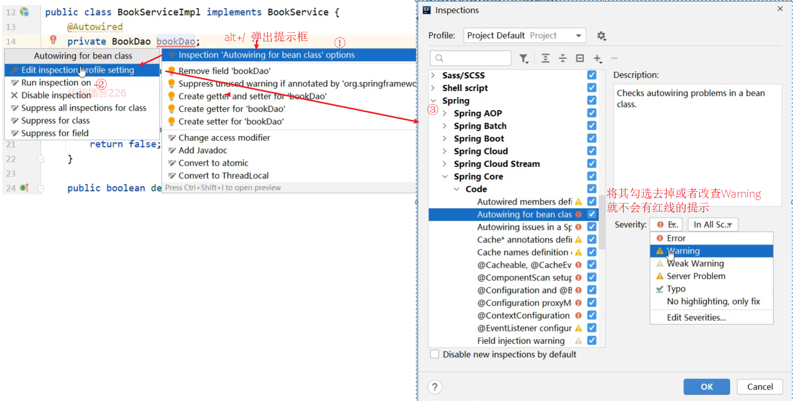


#### 步骤5:编写Contorller类

```java
@RestController
@RequestMapping("/books")
public class BookController {

    @Autowired
    private BookService bookService;

    @PostMapping
    public boolean save(@RequestBody Book book) {
        return bookService.save(book);
    }

    @PutMapping
    public boolean update(@RequestBody Book book) {
        return bookService.update(book);
    }

    @DeleteMapping("/{id}")
    public boolean delete(@PathVariable Integer id) {
        return bookService.delete(id);
    }

    @GetMapping("/{id}")
    public Book getById(@PathVariable Integer id) {
        return bookService.getById(id);
    }

    @GetMapping
    public List<Book> getAll() {
        return bookService.getAll();
    }
}
```

对于图书模块的增删改查就已经完成了编写，我们可以从后往前写也可以从前往后写，最终只需要能把功能实现即可。

接下来我们就先把业务层的代码使用`Spring整合Junit`的知识点进行单元测试:

### 1.4 单元测试

#### 步骤1:新建测试类

```java
@RunWith(SpringJUnit4ClassRunner.class)
@ContextConfiguration(classes = SpringConfig.class)
public class BookServiceTest {

}
```

#### 步骤2:注入Service类

```java
@RunWith(SpringJUnit4ClassRunner.class)
@ContextConfiguration(classes = SpringConfig.class)
public class BookServiceTest {

    @Autowired
    private BookService bookService;


}
```

#### 步骤3:编写测试方法

我们先来对查询进行单元测试。

```java
@RunWith(SpringJUnit4ClassRunner.class)
@ContextConfiguration(classes = SpringConfig.class)
public class BookServiceTest {

    @Autowired
    private BookService bookService;

    @Test
    public void testGetById(){
        Book book = bookService.getById(1);
        System.out.println(book);
    }

    @Test
    public void testGetAll(){
        List<Book> all = bookService.getAll();
        System.out.println(all);
    }

}
```

根据ID查询，测试的结果为:


查询所有，测试的结果为:


## 7、统一结果封装

### 7.1、表现层与前端数据传输协议定义

SSM整合以及功能模块开发完成后，接下来，我们在上述案例的基础上分析下有哪些问题需要我们去解决下。首先第一个问题是:

* 在Controller层增删改返回给前端的是boolean类型数据

* 在Controller层查询单个返回给前端的是对象

  

* 在Controller层查询所有返回给前端的是集合对象

  

将返回结果的数据进行统一，大体的思路为:

* 为了封装返回的结果数据:**创建结果模型类，封装数据到data属性中**
* 为了封装返回的数据是何种操作及是否操作成功:**封装操作结果到code属性中**
* 操作失败后为了封装返回的错误信息:**封装特殊消息到message(msg)属性中**


根据分析可以设置统一数据返回结果类

```java
public class Result{
	private Object data;
	private Integer code;
	private String msg;
}
```

**注意:**Result类名及类中的字段并不是固定的，可以根据需要自行增减提供若干个构造方法，方便操作。


### 7.2、表现层与前端数据传输协议实现

#### 7.2.1、环境准备

- 创建一个Web的Maven项目
- pom.xml添加SSM整合所需jar包
- 创建对应的配置类
- 编写Controller、Service接口、Service实现类、Dao接口和模型类
- resources下提供jdbc.properties配置文件

#### 7.2.2、 结果封装

具体如何实现结果封装，具体的步骤为:

##### 步骤1:创建Result类

```java
public class Result {
    //描述统一格式中的数据
    private Object data;
    //描述统一格式中的编码，用于区分操作，可以简化配置0或1表示成功失败
    private Integer code;
    //描述统一格式中的消息，可选属性
    private String msg;

    public Result() {
    }
	//构造方法是方便对象的创建
    public Result(Integer code,Object data) {
        this.data = data;
        this.code = code;
    }
	//构造方法是方便对象的创建
    public Result(Integer code, Object data, String msg) {
        this.data = data;
        this.code = code;
        this.msg = msg;
    }
	//setter...getter...省略
}
```

##### 步骤2:定义返回码Code类

```java
//状态码
public class Code {
    public static final Integer SAVE_OK = 20011;
    public static final Integer DELETE_OK = 20021;
    public static final Integer UPDATE_OK = 20031;
    public static final Integer GET_OK = 20041;

    public static final Integer SAVE_ERR = 20010;
    public static final Integer DELETE_ERR = 20020;
    public static final Integer UPDATE_ERR = 20030;
    public static final Integer GET_ERR = 20040;
}

```

**注意：**Code类中的常量设计不是固定的，可根据需要自行增减，例如将查询再进行细分为GET_OK,GET_ALL_OK,GET_PAGE_OK等。

##### 步骤3:修改Controller类的返回值

```java
//统一每一个控制器方法返回值
@RestController
@RequestMapping("/books")
public class BookController {

    @Autowired
    private BookService bookService;

    @PostMapping
    public Result save(@RequestBody Book book) {
        boolean flag = bookService.save(book);
        return new Result(flag ? Code.SAVE_OK:Code.SAVE_ERR,flag);
    }

    @PutMapping
    public Result update(@RequestBody Book book) {
        boolean flag = bookService.update(book);
        return new Result(flag ? Code.UPDATE_OK:Code.UPDATE_ERR,flag);
    }

    @DeleteMapping("/{id}")
    public Result delete(@PathVariable Integer id) {
        boolean flag = bookService.delete(id);
        return new Result(flag ? Code.DELETE_OK:Code.DELETE_ERR,flag);
    }

    @GetMapping("/{id}")
    public Result getById(@PathVariable Integer id) {
        Book book = bookService.getById(id);
        Integer code = book != null ? Code.GET_OK : Code.GET_ERR;
        String msg = book != null ? "" : "数据查询失败，请重试！";
        return new Result(code,book,msg);
    }

    @GetMapping
    public Result getAll() {
        List<Book> bookList = bookService.getAll();
        Integer code = bookList != null ? Code.GET_OK : Code.GET_ERR;
        String msg = bookList != null ? "" : "数据查询失败，请重试！";
        return new Result(code,bookList,msg);
    }
}
```

##### 步骤4:启动服务测试

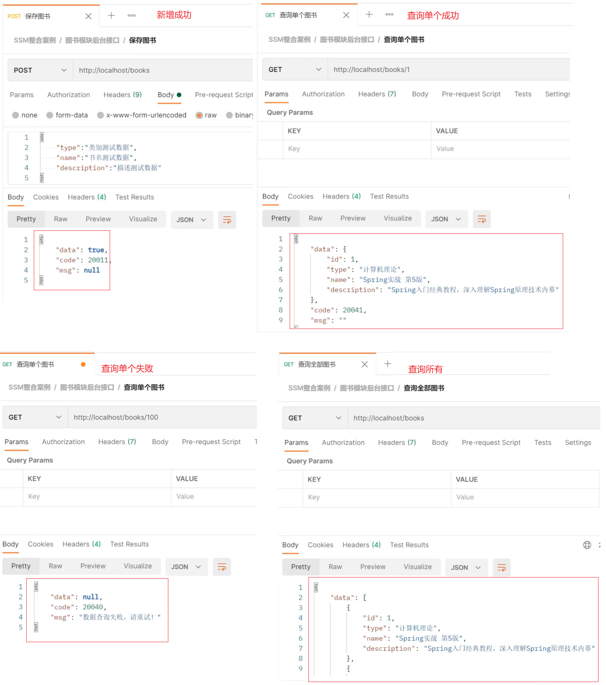

返回结果已经以一种统一的格式返回给前端。前端根据返回的结果，先从中获取`code`,根据code判断，如果成功则取`data`属性的值，如果失败，则取`msg`中的值做提示。


## 8、统一异常处理

### 8.1、问题描述

前端接收到某信息后和之前我们约定的格式不一致，该问题如何解决?

在解决问题之前，先来看下异常的种类及出现异常的原因:

- 框架内部抛出的异常：因使用不合规导致
- 数据层抛出的异常：因外部服务器故障导致（例如：服务器访问超时）
- 业务层抛出的异常：因业务逻辑书写错误导致（例如：遍历业务书写操作，导致索引异常等）
- 表现层抛出的异常：因数据收集、校验等规则导致（例如：不匹配的数据类型间导致异常）
- 工具类抛出的异常：因工具类书写不严谨不够健壮导致（例如：必要释放的连接长期未释放等）

**思考**

1. 各个层级均出现异常，异常处理代码书写在哪一层?

   所有的异常均抛出到表现层进行处理

2. 异常的种类很多，表现层如何将所有的异常都处理到呢?

   异常分类

3. 表现层处理异常，每个方法中单独书写，代码书写量巨大且意义不强，如何解决?

   AOP

对于上面这些问题及解决方案，SpringMVC已提供一套解决方案:

* 异常处理器:

  * 集中的、统一的处理项目中出现的异常。

    

### 8.2、异常处理器的使用

#### 8.2.1、环境准备

- 创建一个Web的Maven项目
- pom.xml添加SSM整合所需jar包
- 创建对应的配置类
- 编写Controller、Service接口、Service实现类、Dao接口和模型类
- resources下提供jdbc.properties配置文件

#### 8.2.2、使用步骤

##### 步骤1:创建异常处理器类

```java
//@RestControllerAdvice用于标识当前类为REST风格对应的异常处理器
@RestControllerAdvice
public class ProjectExceptionAdvice {
    //除了自定义的异常处理器，保留对Exception类型的异常处理，用于处理非预期的异常
    @ExceptionHandler(Exception.class)
    public void doException(Exception ex){
      	System.out.println("嘿嘿,异常你哪里跑！")
    }
}
```

确保SpringMvcConfig能够扫描到异常处理器类

##### 步骤2:让程序抛出异常

修改`BookController`的getById方法，添加`int i = 1/0`.

```java
@GetMapping("/{id}")
public Result getById(@PathVariable Integer id) {
  	int i = 1/0;
    Book book = bookService.getById(id);
    Integer code = book != null ? Code.GET_OK : Code.GET_ERR;
    String msg = book != null ? "" : "数据查询失败，请重试！";
    return new Result(code,book,msg);
}
```

##### 步骤3:运行程序，测试

说明异常已经被拦截并执行`doException`方法。


##### 异常处理器类返回结果给前端

```java
//@RestControllerAdvice用于标识当前类为REST风格对应的异常处理器
@RestControllerAdvice
public class ProjectExceptionAdvice {
    //除了自定义的异常处理器，保留对Exception类型的异常处理，用于处理非预期的异常
    @ExceptionHandler(Exception.class)
    public Result doException(Exception ex){
      	System.out.println("嘿嘿,异常你哪里跑！")
        return new Result(666,null,"嘿嘿,异常你哪里跑！");
    }
}
```

启动运行程序，测试

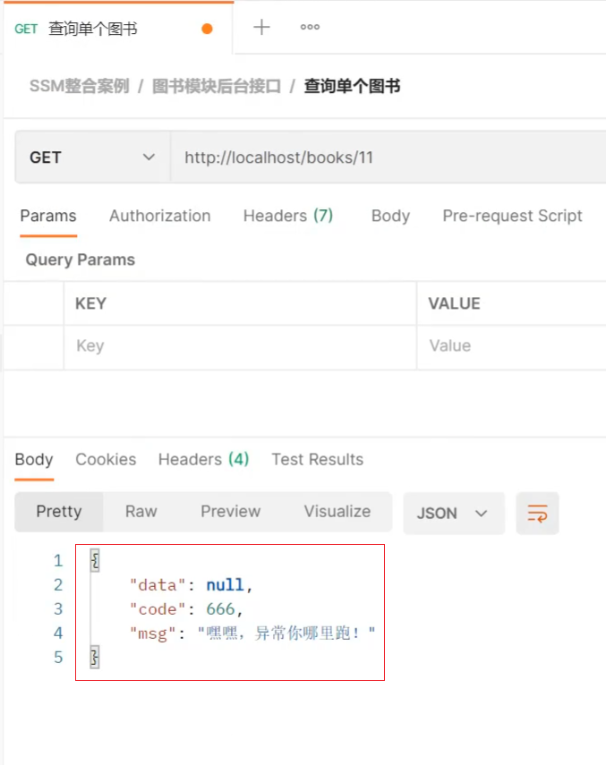


知识点1：@RestControllerAdvice

| 名称 | @RestControllerAdvice              |
| ---- | ---------------------------------- |
| 类型 | 类注解                             |
| 位置 | Rest风格开发的控制器增强类定义上方 |
| 作用 | 为Rest风格开发的控制器类做增强     |

**说明:**此注解自带@ResponseBody注解与@Component注解，具备对应的功能


知识点2：@ExceptionHandler

| 名称 | @ExceptionHandler                                            |
| ---- | ------------------------------------------------------------ |
| 类型 | ==方法注解==                                                 |
| 位置 | 专用于异常处理的控制器方法上方                               |
| 作用 | 设置指定异常的处理方案，功能等同于控制器方法，<br/>出现异常后终止原始控制器执行,并转入当前方法执行 |

**说明：**此类方法可以根据处理的异常不同，制作多个方法分别处理对应的异常


### 8.3、项目异常处理方案

#### 8.3.1、异常分类

在项目中该如何来处理异常呢?

由于异常的种类很多，如果每一个异常都对应一个@ExceptionHandler，那么需要写多少个方法来处理各自的异常？

因此在处理异常之前，需要对异常进行分类，将异常分类后针对不同类型的异常提供具体的解决方案：

- 业务异常（BusinessException）

  - 规范的用户行为产生的异常

    - 用户在页面输入内容的时候未按照指定格式进行数据填写，如在年龄框输入的是字符串

  - 不规范的用户行为操作产生的异常

    - 如用户故意传递错误数据

- 系统异常（SystemException）

  - 项目运行过程中可预计但无法避免的异常
    - 比如数据库或服务器宕机

- 其他异常（Exception）

  - 编程人员未预期到的异常，如:用到的文件不存在


#### 8.3.2、异常解决方案

- 业务异常（BusinessException）
  - 发送对应消息传递给用户，提醒规范操作
    - 大家常见的就是提示用户名已存在或密码格式不正确等
- 系统异常（SystemException）
  - 发送固定消息传递给用户，安抚用户
    - 系统繁忙，请稍后再试
    - 系统正在维护升级，请稍后再试
    - 系统出问题，请联系系统管理员等
  - 发送特定消息给运维人员，提醒维护
    - 可以发送短信、邮箱或者是公司内部通信软件
  - 记录日志
    - 发消息和记录日志对用户来说是不可见的，属于后台程序
- 其他异常（Exception）
  - 发送固定消息传递给用户，安抚用户
  - 发送特定消息给编程人员，提醒维护（纳入预期范围内）
    - 一般是程序没有考虑全，比如未做非空校验等
  - 记录日志

#### 8.3.3、异常解决方案的具体实现

> 思路:
>
> 1.先通过自定义异常，完成BusinessException和SystemException的定义
>
> 2.将其他异常包装成自定义异常类型
>
> 3.在异常处理器类中对不同的异常进行处理

##### 步骤1:自定义异常类

```java
//自定义异常处理器，用于封装异常信息，对异常进行分类
public class SystemException extends RuntimeException{
    private Integer code;

    public Integer getCode() {
        return code;
    }

    public void setCode(Integer code) {
        this.code = code;
    }

    public SystemException(Integer code, String message) {
        super(message);
        this.code = code;
    }

    public SystemException(Integer code, String message, Throwable cause) {
        super(message, cause);
        this.code = code;
    }

}

//自定义异常处理器，用于封装异常信息，对异常进行分类
public class BusinessException extends RuntimeException{
    private Integer code;

    public Integer getCode() {
        return code;
    }

    public void setCode(Integer code) {
        this.code = code;
    }

    public BusinessException(Integer code, String message) {
        super(message);
        this.code = code;
    }

    public BusinessException(Integer code, String message, Throwable cause) {
        super(message, cause);
        this.code = code;
    }

}
```

**说明:**

* 让自定义异常类继承`RuntimeException`的好处是，后期在抛出这两个异常的时候，就不用在try...catch...或throws
* 自定义异常类中添加`code`属性的原因是为了更好的区分异常是来自哪个业务的


##### 步骤2:将其他异常包成自定义异常

假如在BookServiceImpl的getById方法抛异常，该如何来包装呢?

```java
public Book getById(Integer id) {
    //模拟业务异常，包装成自定义异常
    if(id == 1){
        throw new BusinessException(Code.BUSINESS_ERR,"请不要使用你的技术挑战我的耐性!");
    }
    //模拟系统异常，将可能出现的异常进行包装，转换成自定义异常
    try{
        int i = 1/0;
    }catch (Exception e){
        throw new SystemException(Code.SYSTEM_TIMEOUT_ERR,"服务器访问超时，请重试!",e);
    }
    return bookDao.getById(id);
}
```

具体的包装方式有：

* 方式一:`try{}catch(){}`在catch中重新throw自定义异常即可。
* 方式二:直接throw自定义异常即可

为了使`code`看着更专业，可在Code类中再新增需要的属性

```java
//状态码
public class Code {
    public static final Integer SAVE_OK = 20011;
    public static final Integer DELETE_OK = 20021;
    public static final Integer UPDATE_OK = 20031;
    public static final Integer GET_OK = 20041;

    public static final Integer SAVE_ERR = 20010;
    public static final Integer DELETE_ERR = 20020;
    public static final Integer UPDATE_ERR = 20030;
    public static final Integer GET_ERR = 20040;
    public static final Integer SYSTEM_ERR = 50001;
    public static final Integer SYSTEM_TIMEOUT_ERR = 50002;
    public static final Integer SYSTEM_UNKNOW_ERR = 59999;

    public static final Integer BUSINESS_ERR = 60002;
}
```

##### 步骤3:处理器类中处理自定义异常

```java
//@RestControllerAdvice用于标识当前类为REST风格对应的异常处理器
@RestControllerAdvice
public class ProjectExceptionAdvice {
    //@ExceptionHandler用于设置当前处理器类对应的异常类型
    @ExceptionHandler(SystemException.class)
    public Result doSystemException(SystemException ex){
        //记录日志
        //发送消息给运维
        //发送邮件给开发人员,ex对象发送给开发人员
        return new Result(ex.getCode(),null,ex.getMessage());
    }

    @ExceptionHandler(BusinessException.class)
    public Result doBusinessException(BusinessException ex){
        return new Result(ex.getCode(),null,ex.getMessage());
    }

    //除了自定义的异常处理器，保留对Exception类型的异常处理，用于处理非预期的异常
    @ExceptionHandler(Exception.class)
    public Result doOtherException(Exception ex){
        //记录日志
        //发送消息给运维
        //发送邮件给开发人员,ex对象发送给开发人员
        return new Result(Code.SYSTEM_UNKNOW_ERR,null,"系统繁忙，请稍后再试！");
    }
}
```

##### 步骤4:运行程序

根据ID查询，

如果传入的参数为1，会报`BusinessException`


如果传入的是其他参数，会报`SystemException`


对于异常已经处理完成，不管后台哪一层抛出异常，都会以与前端约定好的方式进行返回，前端只需要把信息获取到，根据返回的正确与否来展示不同的内容即可。

**小结**

以后项目中的异常处理方式为:


## 9、拦截器

### 9.1 、截器概念


1. 浏览器发送一个请求会先到Tomcat的web服务器

2. Tomcat服务器接收到请求以后，会去判断请求的是静态资源还是动态资源

3. 如果是静态资源，会直接到Tomcat的项目部署目录下去直接访问

4. 如果是动态资源，就需要交给项目的后台代码进行处理

5. 在找到具体的方法之前，我们可以去配置过滤器(可以配置多个)，按照顺序进行执行

6. 然后进入到到中央处理器(SpringMVC中的内容)，SpringMVC会根据配置的规则进行拦截

7. 如果满足规则，则进行处理，找到其对应的controller类中的方法进行执行,完成后返回结果

8. 如果不满足规则，则不进行处理

9. 此时如果需要在每个Controller方法执行的前后添加业务，具体该如何来实现?


拦截器的作用：

* 拦截器（Interceptor）是一种动态拦截方法调用的机制，在SpringMVC中动态拦截控制器方法的执行
* 作用:
  * 在指定的方法调用前后执行预先设定的代码
  * 阻止原始方法的执行
  * 总结：拦截器就是用来做增强


拦截器和过滤器在作用和执行顺序上是否很相似？

思考:拦截器和过滤器之间的区别是什么?

- 归属不同：Filter属于Servlet技术，Interceptor属于SpringMVC技术
- 拦截内容不同：Filter对所有访问进行增强，Interceptor仅针对SpringMVC的访问进行增强


### 9.2、拦截器入门案例

#### 9.2.1、环境准备

- 创建一个Web的Maven项目

- pom.xml添加SSM整合所需jar包

  ```xml
  <?xml version="1.0" encoding="UTF-8"?>
  
  <project xmlns="http://maven.apache.org/POM/4.0.0" xmlns:xsi="http://www.w3.org/2001/XMLSchema-instance"
    xsi:schemaLocation="http://maven.apache.org/POM/4.0.0 http://maven.apache.org/xsd/maven-4.0.0.xsd">
    <modelVersion>4.0.0</modelVersion>
  
    <groupId>com.goes</groupId>
    <artifactId>springmvc_12_interceptor</artifactId>
    <version>1.0-SNAPSHOT</version>
    <packaging>war</packaging>
  
    <dependencies>
      <dependency>
        <groupId>javax.servlet</groupId>
        <artifactId>javax.servlet-api</artifactId>
        <version>3.1.0</version>
        <scope>provided</scope>
      </dependency>
      <dependency>
        <groupId>org.springframework</groupId>
        <artifactId>spring-webmvc</artifactId>
        <version>5.2.10.RELEASE</version>
      </dependency>
      <dependency>
        <groupId>com.fasterxml.jackson.core</groupId>
        <artifactId>jackson-databind</artifactId>
        <version>2.9.0</version>
      </dependency>
    </dependencies>
  
    <build>
      <plugins>
        <plugin>
          <groupId>org.apache.tomcat.maven</groupId>
          <artifactId>tomcat7-maven-plugin</artifactId>
          <version>2.1</version>
          <configuration>
            <port>80</port>
            <path>/</path>
          </configuration>
        </plugin>
          <plugin>
              <groupId>org.apache.maven.plugins</groupId>
              <artifactId>maven-compiler-plugin</artifactId>
              <configuration>
                  <source>8</source>
                  <target>8</target>
              </configuration>
          </plugin>
      </plugins>
    </build>
  </project>
  
  ```

- 创建对应的配置类

  ```java
  public class ServletContainersInitConfig extends AbstractAnnotationConfigDispatcherServletInitializer {
      protected Class<?>[] getRootConfigClasses() {
          return new Class[0];
      }
  
      protected Class<?>[] getServletConfigClasses() {
          return new Class[]{SpringMvcConfig.class};
      }
  
      protected String[] getServletMappings() {
          return new String[]{"/"};
      }
  
      //乱码处理
      @Override
      protected Filter[] getServletFilters() {
          CharacterEncodingFilter filter = new CharacterEncodingFilter();
          filter.setEncoding("UTF-8");
          return new Filter[]{filter};
      }
  }
  
  @Configuration
  @ComponentScan({"com.goes.controller"})
  @EnableWebMvc
  public class SpringMvcConfig{
     
  }
  ```

- 创建模型类Book

  ```java
  public class Book {
      private String name;
      private double price;
  
      public String getName() {
          return name;
      }
  
      public void setName(String name) {
          this.name = name;
      }
  
      public double getPrice() {
          return price;
      }
  
      public void setPrice(double price) {
          this.price = price;
      }
  
      @Override
      public String toString() {
          return "Book{" +
                  "书名='" + name + '\'' +
                  ", 价格=" + price +
                  '}';
      }
  }
  ```

- 编写Controller

  ```java
  @RestController
  @RequestMapping("/books")
  public class BookController {
  
      @PostMapping
      public String save(@RequestBody Book book){
          System.out.println("book save..." + book);
          return "{'module':'book save'}";
      }
  
      @DeleteMapping("/{id}")
      public String delete(@PathVariable Integer id){
          System.out.println("book delete..." + id);
          return "{'module':'book delete'}";
      }
  
      @PutMapping
      public String update(@RequestBody Book book){
          System.out.println("book update..."+book);
          return "{'module':'book update'}";
      }
  
      @GetMapping("/{id}")
      public String getById(@PathVariable Integer id){
          System.out.println("book getById..."+id);
          return "{'module':'book getById'}";
      }
  
      @GetMapping
      public String getAll(){
          System.out.println("book getAll...");
          return "{'module':'book getAll'}";
      }
  }
  ```


#### 9.2.2、拦截器开发

##### 步骤1:创建拦截器类

让类实现HandlerInterceptor接口，重写接口中的三个方法。

```java
@Component
//定义拦截器类，实现HandlerInterceptor接口
//注意当前类必须受Spring容器控制
public class ProjectInterceptor implements HandlerInterceptor {
    @Override
    //原始方法调用前执行的内容
    public boolean preHandle(HttpServletRequest request, HttpServletResponse response, Object handler) throws Exception {
        System.out.println("preHandle...");
        return true;
    }

    @Override
    //原始方法调用后执行的内容
    public void postHandle(HttpServletRequest request, HttpServletResponse response, Object handler, ModelAndView modelAndView) throws Exception {
        System.out.println("postHandle...");
    }

    @Override
    //原始方法调用完成后执行的内容
    public void afterCompletion(HttpServletRequest request, HttpServletResponse response, Object handler, Exception ex) throws Exception {
        System.out.println("afterCompletion...");
    }
}
```

**注意:**拦截器类要被SpringMVC容器扫描到。

##### 步骤2:配置拦截器类

```java
@Configuration
public class SpringMvcSupport extends WebMvcConfigurationSupport {
    @Autowired
    private ProjectInterceptor projectInterceptor;

    @Override
    protected void addResourceHandlers(ResourceHandlerRegistry registry) {
        registry.addResourceHandler("/pages/**").addResourceLocations("/pages/");
    }

    @Override
    protected void addInterceptors(InterceptorRegistry registry) {
        //配置拦截器
        registry.addInterceptor(projectInterceptor).addPathPatterns("/books" );
    }
}
```


##### 步骤3:SpringMVC添加SpringMvcSupport包扫描

```java
@Configuration
@ComponentScan({"com.goes.controller","com.goes.config"})
@EnableWebMvc
public class SpringMvcConfig{
   
}
```


##### 步骤4:运行程序测试

使用PostMan发送`http://localhost/books`

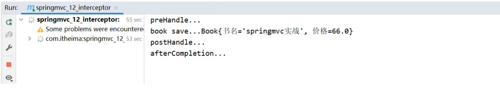

如果发送`http://localhost/books/100`会发现拦截器没有被执行，原因是拦截器的`addPathPatterns`方法配置的拦截路径是`/books`,而现在发送的是`/books/100`，没有匹配上，因此没有拦截，拦截器就不会执行。


##### 步骤5:修改拦截器拦截规则

```java
@Configuration
public class SpringMvcSupport extends WebMvcConfigurationSupport {
    @Autowired
    private ProjectInterceptor projectInterceptor;

    @Override
    protected void addResourceHandlers(ResourceHandlerRegistry registry) {
        registry.addResourceHandler("/pages/**").addResourceLocations("/pages/");
    }

    @Override
    protected void addInterceptors(InterceptorRegistry registry) {
        //配置拦截器
        registry.addInterceptor(projectInterceptor).addPathPatterns("/books","/books/*" );
    }
}
```

如果再次访问`http://localhost/books/100`，拦截器就会被执行。

⚠️注意：拦截器中的`preHandler`方法，如果返回true,则代表放行，会执行原始Controller类中要请求的方法，如果返回false，则代表拦截，后面的就不会再执行。


##### 步骤6:简化SpringMvcSupport的编写

```java
@Configuration
@ComponentScan({"com.goes.controller"})
@EnableWebMvc
//实现WebMvcConfigurer接口可以简化开发，但具有一定的侵入性
public class SpringMvcConfig implements WebMvcConfigurer {
    @Autowired
    private ProjectInterceptor projectInterceptor;

    @Override
    public void addInterceptors(InterceptorRegistry registry) {
        //配置多拦截器
        registry.addInterceptor(projectInterceptor).addPathPatterns("/books","/books/*");
    }
}
```


拦截器的执行流程:


当有拦截器后，请求会先进入preHandle方法，

​	如果方法返回true，则放行继续执行后面的handle[controller的方法]和后面的方法

​	如果返回false，则直接跳过后面方法的执行。


> ⚠️注意：由于添加静态资源，SpringMVC会拦截，因此需在SpringConfig的配置类中将静态资源进行放行。
>
> * 新建SpringMvcSupport
>
>   ```java
>   @Configuration
>   public class SpringMvcSupport extends WebMvcConfigurationSupport {
>       @Override
>       protected void addResourceHandlers(ResourceHandlerRegistry registry) {
>           registry.addResourceHandler("/pages/**").addResourceLocations("/pages/");
>           registry.addResourceHandler("/css/**").addResourceLocations("/css/");
>           registry.addResourceHandler("/js/**").addResourceLocations("/js/");
>           registry.addResourceHandler("/plugins/**").addResourceLocations("/plugins/");
>       }
>   }
>   ```
>
> * 在SpringMvcConfig中扫描SpringMvcSupport
>
>   ```java
>   @Configuration
>   @ComponentScan({"com.goes.controller","com.goes.config"})
>   @EnableWebMvc
>   public class SpringMvcConfig {
>   }
>   ```


### 10.3、拦截器参数

#### 10.3.1、前置处理方法

原始方法之前运行preHandle

```java
public boolean preHandle(HttpServletRequest request,
                         HttpServletResponse response,
                         Object handler) throws Exception {
    System.out.println("preHandle");
    return true;
}
```

* request:请求对象
* response:响应对象
* handler:被调用的处理器对象，本质上是一个方法对象，对反射中的Method对象进行了再包装

使用request对象可以获取请求数据中的内容，如获取请求头的`Content-Type`

```java
public boolean preHandle(HttpServletRequest request, HttpServletResponse response, Object handler) throws Exception {
    String contentType = request.getHeader("Content-Type");
    System.out.println("preHandle..."+contentType);
    return true;
}
```

使用handler参数，可以获取方法的相关信息

```java
public boolean preHandle(HttpServletRequest request, HttpServletResponse response, Object handler) throws Exception {
    HandlerMethod hm = (HandlerMethod)handler;
    String methodName = hm.getMethod().getName();//可以获取方法的名称
    System.out.println("preHandle..."+methodName);
    return true;
}
```


#### 10.3.2、后置处理方法

原始方法运行后运行，如果原始方法被拦截，则不执行  

```java
public void postHandle(HttpServletRequest request,
                       HttpServletResponse response,
                       Object handler,
                       ModelAndView modelAndView) throws Exception {
    System.out.println("postHandle");
}
```

modelAndView：如果处理器执行完成具有返回结果，可以读取到对应数据与页面信息，并进行调整

由于目前项目大多都是返回json数据，因此该参数的使用率不高。


#### 10.3.3、完成处理方法

拦截器最后执行的方法，无论原始方法是否执行

```java
public void afterCompletion(HttpServletRequest request,
                            HttpServletResponse response,
                            Object handler,
                            Exception ex) throws Exception {
    System.out.println("afterCompletion");
}
```

ex：如果处理器执行过程中出现异常对象，可以针对异常情况进行单独处理  

由于目前项目使用全局异常处理器类，因此该参数的使用率也不高。

上述三个方法中，最常用的是preHandle,在此方法中可通过返回值来决定是否要进行放行，因此业务逻辑应放在该方法中，如果满足业务则返回true放行，不满足则返回false拦截。


### 9.4、拦截器链配置

如果有多个拦截器，该如何配置？配置多个拦截器的执行顺序是什么?

#### 9.4.1、配置多个拦截器

##### 步骤1:创建拦截器类

实现接口，并重写接口中的方法

```java
@Component
public class ProjectInterceptor2 implements HandlerInterceptor {
    @Override
    public boolean preHandle(HttpServletRequest request, HttpServletResponse response, Object handler) throws Exception {
        System.out.println("preHandle...222");
        return false;
    }

    @Override
    public void postHandle(HttpServletRequest request, HttpServletResponse response, Object handler, ModelAndView modelAndView) throws Exception {
        System.out.println("postHandle...222");
    }

    @Override
    public void afterCompletion(HttpServletRequest request, HttpServletResponse response, Object handler, Exception ex) throws Exception {
        System.out.println("afterCompletion...222");
    }
}
```


##### 步骤2:配置拦截器类

```java
@Configuration
@ComponentScan({"com.goes.controller"})
@EnableWebMvc
//实现WebMvcConfigurer接口可以简化开发，但具有一定的侵入性
public class SpringMvcConfig implements WebMvcConfigurer {
    @Autowired
    private ProjectInterceptor projectInterceptor;
    @Autowired
    private ProjectInterceptor2 projectInterceptor2;

    @Override
    public void addInterceptors(InterceptorRegistry registry) {
        //配置多拦截器
        registry.addInterceptor(projectInterceptor).addPathPatterns("/books","/books/*");
        registry.addInterceptor(projectInterceptor2).addPathPatterns("/books","/books/*");
    }
}
```

步骤3:运行程序，观察顺序


拦截器执行的顺序是和配置顺序有关(先进后出)。

* 当配置多个拦截器时，形成拦截器链
* 拦截器链的运行顺序参照拦截器添加顺序为准
* 当拦截器中出现对原始处理器的拦截，后面的拦截器均终止运行
* 当拦截器运行中断，仅运行配置在前面的拦截器的afterCompletion操作


> - preHandle：与配置顺序相同，必定运行
>
> - postHandle:与配置顺序相反，可能不运行
>
> - afterCompletion:与配置顺序相反，可能不运行

顺序不太好记，只需把握住一个原则即可：**以最终的运行结果为准**

Spring MVC面试
===

执行流程
---

SpringMVC执行流程示意图：


流程分析：

1. 浏览器提交请求到中央调度器。

2. 中央调度器直接将请求转给**处理器映射器HandleMapping**。

   - handler等价于controller，封装了方法的定义信息，如方法名、参数类型、返回类型等信息

3. 处理器映射器通过`map.get(URI)`的方式得到处理该请求的处理器handler，并将其跟拦截器一起封装成**处理器执行链HandlerExecutionChain** 并返回给中央调度器。

   - 处理器执行链 中保存着`处理器对象`跟`针对该对象的拦截器`。

4. 中央调度器根据处理器执行链中的处理器，找到能够执行该处理器的**处理器适配器HandleAdaptor**。

   - 因为controller的实现有三种，所以要使用适配器来执行

5. 处理器适配器调用处理器，执行controller中的某个方法。

6. 处理器将处理结果及要跳转的视图封装到一个对象**ModelAndView**中，并将其返回给适配器

7. 适配器将结果返回给调度器。

8. 调度器调用**视图解析器**，将ModelAndView中的视图名封装成视图对象**View**。

   View是一个接口，在框架中，是用View跟其实现类来表示视图的。

   `mv.setViewName("show");` 等价于 `mv.setView(new InternalResourceView("/WEB-INF/view/show.jsp"));` 

9. 视图解析器将封装好的**视图对象View**返回给调度器。

10. 调度器调用视图对象，让其自己进行渲染，即进行数据填充，形成响应对象。

11. 调度器响应浏览器


求参数的方式
---

携带请求参数的方式有两种：一种是从url路径参数中获取，一种是从请求body中获取。

### 获取url路径参数

`@RequestParam`和`@PathVariable` 都可以获取路径参数，前者是**获取问号？后面的参数**，后者是**获取问号？前面的组成路径的参数**。

例如：`localhost:8080/springmvc/111?param1=10&param2=20` 

**@RequestParam**获取的是**param1**和**param2**。

**@PathVariable**获取的是**111** 

```java
@RequestMapping("/springmvc/{id}")
public String getDetails(
    @PathVariable(value="id") 	   String  id,
    @RequestParam(value="param1")  String  param1,
    @RequestParam(value="param2")  String  param2)
{
	....逻辑代码	
}
```

**tips**：value属性可以省略，默认为形参名。


拦截器
---

拦截器跟过滤器类似，可以拦截用户的请求，做请求判断处理，比如用户登录处理，权限检查，日志记录等。拦截器是全局的，可以对多个controller进行拦截。

在springMVC中，拦截器需要实现`HandlerInterceptor`接口。该接口有三个方法，这三个方法的执行时间分别是**请求处理之前（controller方法执行之前）**、**控制器方法执行之后**、**请求处理完成**。

在框架中实现拦截器的步骤：

1. 创建类实现`HandlerInterceptor`接口，并实现接口中三个方法的任意个方法
2. 配置文件中指定拦截器的URI地址.


`HandlerInterceptor`接口的源码：

```java
package org.springframework.web.servlet;

import javax.servlet.http.HttpServletRequest;
import javax.servlet.http.HttpServletResponse;
import org.springframework.lang.Nullable;

public interface HandlerInterceptor {
    default boolean preHandle(HttpServletRequest request, HttpServletResponse response, Object handler) throws Exception {
        return true;
    }

    default void postHandle(HttpServletRequest request, HttpServletResponse response, Object handler, @Nullable ModelAndView modelAndView) throws Exception {
    }

    default void afterCompletion(HttpServletRequest request, HttpServletResponse response, Object handler, @Nullable Exception ex) throws Exception {
    }
}
```

**preHandle** 为预处理方法，即在请求之前进行拦截。在此方法中可以进行登录及权限验证。

参数`Object handler` 为被拦截的控制器对象。

返回值`boolean` 为true时拦截器才会放行该请求，否则请求中断。


**postHandle** 为后处理方法，即在控制器方法执行之后拦截。该方法中可以修改控制器中的ModelAndView。

参数`Object handler` 为被拦截的控制器对象；`ModelAndView modelAndView`为控制器方法的返回值。


**afterCompletion** 是请求处理完成之后执行的方法，即渲染完成后，一般做资源回收工作的。

参数`Object handler` 为被拦截的控制器对象；`Exception ex` 为程序中的异常对象。

***

配置文件中声明拦截器方式：

```xml
<!--  声明拦截器  -->
<mvc:interceptors>
    <!--  声明第一个拦截器  -->
    <mvc:interceptor>
        <!--  指定第一个拦截器要拦截的uri地址
              **为通配符，表示任意的字符、文件或多级目录
        -->
        <mvc:mapping path="/user/**"/>
        <!--  拦截器对象  -->
        <bean class="Interceptor.MyInterceptor"/>
    </mvc:interceptor>
</mvc:interceptors>
```

假设给拦截器的三个方法跟控制器方法都加了输出语句，下面来看看他们四个的先后输出顺序：


假设有两个拦截器同时对一个uri进行拦截呢，会发生什么？（**preHandle都返回true**）


其流程如下图所示：

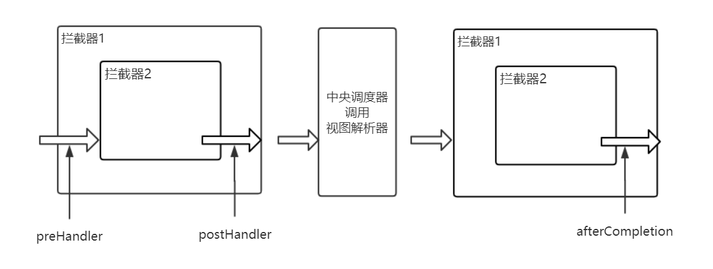

假设有两个拦截器同时对一个uri进行拦截呢，会发生什么？（**第一个拦截器的preHandle都返回true，第二个返回false**）

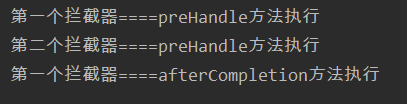

假设有两个拦截器同时对一个uri进行拦截呢，会发生什么？（**第一个拦截器的preHandle都返回false，第二个返回true**）

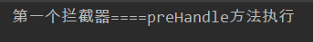


拦截器与过滤器的区别
---

> 这两个使用的设计模式都是 **责任链模式**。

1. 过滤器实现Filter接口，拦截器实现HandlerInterceptor接口。
2. 过滤器侧重于数据过滤。拦截器用来验证请求的。
3. 过滤器在拦截器之前执行。
4. 过滤器是tomcat创建的对象，拦截器是框架创建的对象。


controller的类型
---

controller的类型有两种：<u>Controller类型</u> 跟 <u>BeanName类型</u>。

- 使用**@Controller**注解的类是Controller类型；
- 实现**Controller接口**或**HttpRequestHandler接口**的类为BeanName类型


参数绑定过程
---

方法参数解析器实现了 HandlerMethodArgumentResolver接口，主要方法如下：

```java
public interface HandlerMethodArgumentResolver {

    // 该解析器是否支持parameter参数的解析
    boolean supportsParameter(MethodParameter parameter);

    // 将方法参数从给定请求(webRequest)解析为参数值并返回
    Object resolveArgument(MethodParameter parameter,
                          ModelAndViewContainer mavContainer,
                          NativeWebRequest webRequest,
                          WebDataBinderFactory binderFactory) throws Exception;
}
```


### 简单类型参数绑定

首先，参数绑定发生在方法执行之前，由方法参数解析器去解析请求中的参数。

```java
// 从request中解析出HandlerMethod方法所需要的参数，并返回Object[]
Object[] args = getMethodArgumentValues(request, mavContainer, providedArgs);
// 通过反射执行HandleMethod中的method，方法参数为args，并返回方法执行的返回值
Object returnValue = invoke(args);
```

解析请求参数之前，需要先获取方法参数，得到一个方法参数数组（MethodParameter[]），接着遍历这个数组，找到合适的**方法参数解析器**解析每个元素。

如果是简单类型参数，则会把 MethodParameter 的类型和名称封装到 NameValueInfo 对象中，然后将其放到缓存中下次可以直接获取。

接着根据NameValueInfo对象中指定的参数名，使用 `request.getParameterValues(name);` 方法获取对应同名的请求参数，并根据NameValueInfo对象中指定的类型进行类型转换。

最后，通过反射执行HandleMethod中的method，方法参数为args。


### 对象参数绑定

> 对象参数的解析由 ModelAttributeMethodProcessor 完成。

首先利用反射创建方法参数类型的对象，根据reqeust中的参数创建一个propertyValueList ，里面存放了一个或多个PropertyValue，每个PropertyValue 包含属性名跟属性值。


然后遍历propertyValueList，根据每个元素的name 使用setter方法给对象同名属性赋值。